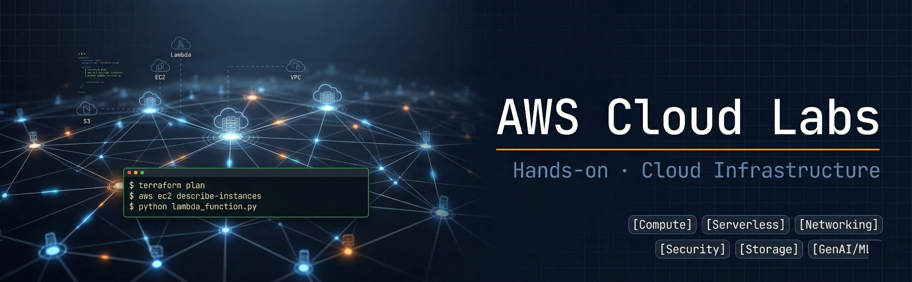

<div align="center">
  

  <br/>

  
  
  
  
  
  

  <p>
    <a href="./README-en.md">🇺🇸 English</a> &nbsp;|&nbsp;
    <a href="./README.md">🇧🇷 Português</a>
  </p>
</div>

---

## Sobre

Repositório com laboratórios práticos de AWS organizados por domínio de produto. Cada lab documenta o provisionamento, os scripts utilizados e evidências de validação. Em expansão contínua.

---

## Domínios cobertos

| Domínio                  | Labs | Tecnologias                                     |
| ------------------------ | ---- | ----------------------------------------------- |
| ⚡ Serverless             | 7    | Lambda, API Gateway, SNS, SQS, DLQ, EventBridge |
| 🔒 Segurança & Compliance | 8    | IAM, STS, KMS, CloudWatch, CloudTrail, SSM      |
| 🌐 Rede & Entrega         | 3    | VPC, CloudFront, API Gateway                    |
| 📦 Storage                | 4    | S3, EBS, Bucket Policy, Lifecycle, DLM          |
| 🗄️ Database               | 3    | DynamoDB, LSI, GSI, Boto3                       |
| 🖥️ Compute                | 4    | EC2, Elastic Beanstalk, Auto Scaling, ALB       |

---

## Labs

<details>
<summary>👉 <b>⚡ Serverless</b> (7 Labs)</summary>
<br>


- **01. [Introdução ao AWS Lambda](./labs/6-serverless/01-lambda-introduction/)** | `🔴 Avançado`
  > Redimensionamento automático de imagens com Triggers S3


- **02. [Lambda Aliases + API Gateway](./labs/6-serverless/02-lambda-api-gateway/)** | `🟡 Intermediário`
  > Isolamento de estágios dev/prod com aliases e `$LATEST`


- **03. [Lambda + EventBridge](./labs/6-serverless/03-lambda-eventbridge/)** | `🔴 Avançado`
  > Scheduler cron para desligamento automático de instâncias EC2


- **04. [Lambda + S3 + API Gateway](./labs/6-serverless/04-lambda-s3-game/)** | `🟡 Intermediário`
  > Web app full-stack serverless — jogo de adivinhação


- **05. [SNS + SQS + DLQ](./labs/6-serverless/05-sns-sqs-dlq/)** | `🟡 Intermediário`
  > Pub/Sub com isolamento de falhas via Dead-Letter Queue


- **06. [Fan-Out SNS → SQS](./labs/6-serverless/06-sns-sqs-fanout/)** | `🔴 Avançado`
  > Topologia fan-out com filtros de mensagem por atributo


- **07. [S3 Event Notifications](./labs/6-serverless/07-s3-sns-sqs-events/)** | `🔴 Avançado`
  > Auditoria disparada por eventos nativos de bucket

</details>
<details>
<summary>👉 <b>🔒 Segurança, Identidade e Compliance</b> (8 Labs)</summary>
<br>


- **01. [Introdução ao AWS IAM](./labs/5-security-identity-compliance/01-iam-introduction/)** | `🟢 Fundamental`
  > Gestão de usuários, grupos e políticas de acesso (least privilege)


- **02. [AWS STS: Credenciais Temporárias](./labs/5-security-identity-compliance/02-aws-sts/)** | `🟢 Fundamental`
  > `AssumeRole` programático para acesso sem credenciais permanentes


- **03. [IAM: S3 ReadOnly](./labs/5-security-identity-compliance/03-iam-s3-readonly/)** | `🟢 Fundamental`
  > Least privilege com Managed Groups para acesso restrito


- **04. [AWS Budgets](./labs/5-security-identity-compliance/04-aws-budgets/)** | `🟢 Fundamental`
  > Controle de gastos com alertas por threshold via e-mail


- **05. [CloudWatch + CloudTrail](./labs/5-security-identity-compliance/05-cloudwatch-cloudtrail/)** | `🟡 Intermediário`
  > Monitoramento de EC2 em carga + auditoria de API calls


- **06. [SSM Parameter Store + KMS](./labs/5-security-identity-compliance/06-ssm-parameter-store/)** | `🟡 Intermediário`
  > Gestão de segredos com criptografia AES-256 via KMS


- **07. [Auditoria Básica de Ambiente](./labs/5-security-identity-compliance/07-aws-basic-audit/)** | `🟡 Intermediário`
  > Análise de IAM, VPC Security e auditoria de logs no CloudTrail/S3


- **08. [AWS KMS: Gestão de Chaves](./labs/5-security-identity-compliance/08-aws-kms-introduction/)** | `🟡 Intermediário`
  > Ciclo de vida de chaves simétricas, SSE-KMS e auditoria com CloudTrail

</details>
<details>
<summary>👉 <b>🌐 Rede e Entrega de Conteúdo</b> (3 Labs)</summary>
<br>


- **01. [Amazon VPC](./labs/4-network-and-content-delivery/01-vpc-introduction/)** | `🟢 Fundamental`
  > Subnets públicas/privadas, NAT Gateway, IGW e AZs


- **02. [Amazon CloudFront](./labs/4-network-and-content-delivery/02-cloudfront-introduction/)** | `🟢 Fundamental`
  > CDN com distribuição via Edge Locations


- **03. [Amazon API Gateway](./labs/4-network-and-content-delivery/03-api-gateway-introduction/)** | `🟢 Fundamental`
  > Microsserviço serverless com integração Lambda

</details>
<details>
<summary>👉 <b>📦 Storage</b> (4 Labs)</summary>
<br>


- **01. [S3: Introdução e Políticas](./labs/2-storage/01-s3-introduction/)** | `🟡 Intermediário`
  > Bucket Policies (JSON), Controle de Acesso Público (BPA) e Recovery via Versionamento


- **02. [S3: Advanced Management](./labs/2-storage/02-s3-advanced-management/)** | `🟢 Fundamental`
  > Versionamento, Lifecycle, Pre-signed URLs e Server Access Logs


- **03. [S3: Basic & Advanced](./labs/2-storage/03-s3-basic-advanced/)** | `🟢 Fundamental`
  > Automação de storage class e URLs temporárias


- **04. [EBS: Volumes e Snapshots](./labs/2-storage/04-ebs-mount-snapshots/)** | `🟡 Intermediário`
  > Mount ext4 via CLI e políticas de retenção com DLM

</details>
<details>
<summary>👉 <b>🗄️ Database</b> (3 Labs)</summary>
<br>


- **01. [Introduction to Amazon DynamoDB](./labs/3-database/01-amazon-dynamodb-introduction/)** | `🟢 Fundamental`
  > Criação de tabelas, inserção de itens e operações de Query vs Scan


- **02. [DynamoDB Serverless CRUD](./labs/3-database/02-dynamodb-lambda-crud/)** | `🟡 Intermediário`
  > API REST com Lambda + Boto3 em tabela NoSQL


- **03. [DynamoDB LSI & GSI](./labs/3-database/03-dynamodb-lsi-gsi/)** | `🟡 Intermediário`
  > Otimização de queries — Scan vs Query e rotação de índices

</details>
<details>
<summary>👉 <b>🖥️ Compute</b> (4 Labs)</summary>
<br>


- **01. [Introduction to Amazon EC2](./labs/1-compute/01-ec2-introduction/)** | `🟢 Fundamental`
  > Ciclo de vida: Launch, Monitoring, Security e Vertical Resize


- **02. [EC2 + CloudShell](./labs/1-compute/02-ec2-console-cloudshell/)** | `🟢 Fundamental`
  > Instâncias web com User Data via Console e CLI


- **03. [Elastic Beanstalk](./labs/1-compute/03-elastic-beanstalk/)** | `🟢 Fundamental`
  > Deploy PaaS com IAM Instance Profile


- **04. [Auto Scaling + ALB](./labs/1-compute/04-auto-scaling-alb/)** | `🟡 Intermediário`
  > Alta disponibilidade com Launch Templates, ASG e Load Balancer

---
## Estrutura de cada lab
```text
<lab-name>/
├── README.md      # Contexto da arquitetura e decisões técnicas
├── README-en.md   # Versão em inglês
├── src/           # Scripts (Python / Bash / Boto3)
└── assets/        # Diagramas e evidências de validação
```
> **Nota:** Os códigos de provisionamento (Terraform/CDK) estão centralizados no diretório `/iac` na raiz do projeto, organizados por laboratório.
---
## Autor
**Caio Cesar**
Graduado em TI, AWS re/Start Graduate. Certificações: CLF-C02 · DVA-C02 · SAA-C03 · AIF-C01.
[](https://www.linkedin.com/in/caiocesardev/)
[](https://github.com/caiocesarti)
</details>
