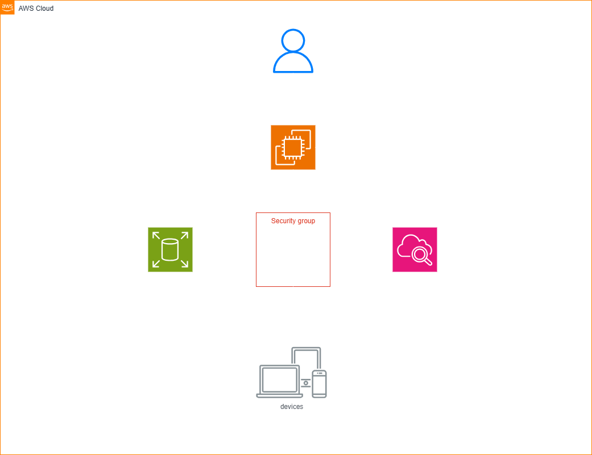
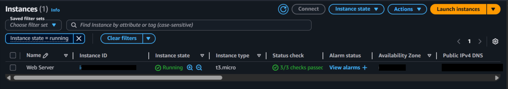
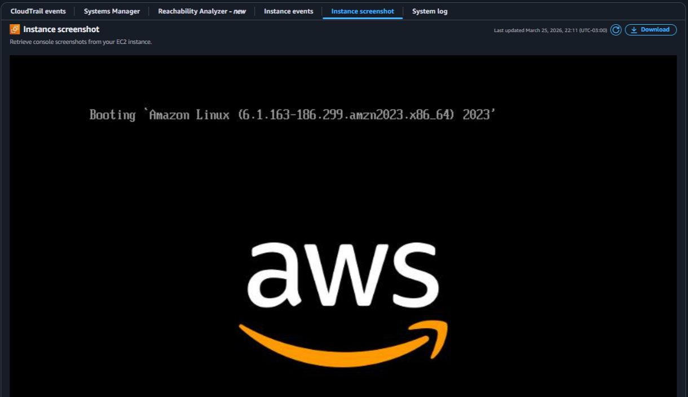
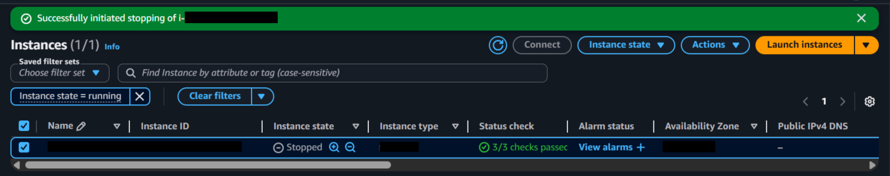
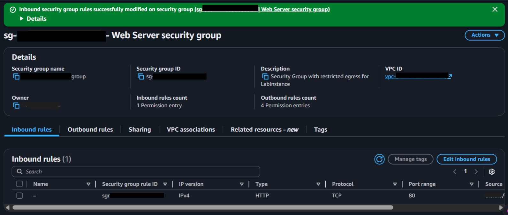
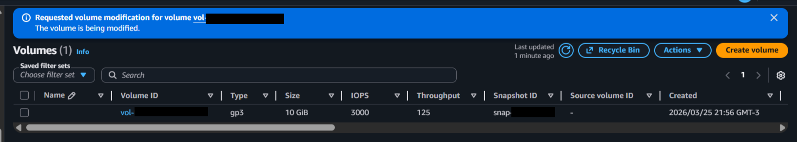
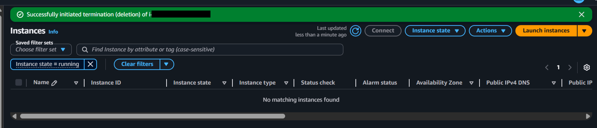

  <a href="./README-en.md">🇺🇸 English</a> |
  <a href="./README.md">🇧🇷 Português</a>

# Lab 01 — Introduction to Amazon EC2: Lifecycle and Monitoring

## 🚀 Executive Summary
Core provisioning of a cloud web server focused on resilience and elasticity. The virtual instance model allows for:
- **Loss protection:** Active lock against accidental termination due to human error.
- **Elastic scaling:** Real-time vertical resizing of CPU, RAM, and disk volume without server recreation.
- **Automated bootstrapping:** Script injection (User Data) at initialization for zero-touch post-deployment.

---

## 💼 Real-World Use Case
- **Industry:** E-commerce / Legacy Systems
- **Problem:** A traditional on-premise monolithic server reaches peak CPU and Disk usage during a sales campaign. Physical expansion requires hours of downtime, hardware purchasing, and risky data migration, potentially corrupting the system.
- **Solution:** Using Amazon EC2 with detached EBS volumes allows pausing the instance for short periods, doubling its vital resources via API/Console, and coming back online instantly, retaining all data intact.

---

## 🎯 Learning Objectives

*   Launch an instance with **User Data** support and **Termination Protection**.
*   Utilize remote diagnostic tools (**System Logs** and **Screenshots**).
*   Release HTTP traffic by configuring the network firewall (**Security Groups**).
*   Perform vertical **Upscaling** and dynamic disk (EBS) expansion.
*   Validate safety locks before forcing resource termination.

---

## 🛠️ AWS Services Used

| Service | Role in the Lab |
|---------|----------|
| **Amazon EC2** | Provider of elastic and resizable virtual servers. |
| **Amazon EBS** | Persistent block storage for the system's root volume. |
| **Amazon CloudWatch** | Collection of metrics and basic performance telemetry. |
| **AWS IAM** | Management of access permissions and service roles. |

---

## 🏗️ Solution Architecture

  

---

## 🖥️ Lab Steps

### 1. 🚀 Launch and Bootstrapping
- **Action:** I created a `Web Server` using the **Amazon Linux 2023 AMI**.
- **Configuration:** I explicitly activated the `disableApiTermination` lock in Advanced Details.
- **Automation:** I injected a bootstrap script to perform an unattended Apache (`httpd`) installation.
> 📄 **See script:** [src/user-data.sh](./src/user-data.sh).

### 2. 🛡️ Firewall Release (Port 80)
- **Challenge:** The new instance rejects all HTTP traffic by default (Timeout).
- **Action:** I modified the attached **Security Group**.
- **Result:** I inserted an *Inbound* rule of type `HTTP` on port `80` granting access to `0.0.0.0/0`.

### 3. 📈 Dynamic Resizing
- **Instance Action:** I executed a real-time transition from the `t3.micro` to `t3.small` instance type (Doubling compute capacity).
- **Storage Action:** I directly expanded the EBS volume via the Elastic Block Store panel from **8 GiB to 10 GiB** without data loss.

### 4. 🔍 Remote Monitoring
- **System Logs:** I deeply validated the *User Data* script success without opening an SSH connection.
- **OOB Diagnosis:** I captured a screenshot of the virtual console to analyze the boot cycle integrity of the hosted Linux OS.

### 5. 🛑 Safe Termination
- **Challenge:** A direct termination attempt receives an EC2 API error.
- **Solution:** I manually removed the Termination Protection, finally allowing the clean conclusion of the resource lifecycle.

---

## 📸 Execution Evidence

### 1. "Web Server" instance running with status checks passed

### 2. System log confirming the installation of the httpd package via User Data

### 3. Boot console screenshot validating Linux loading

### 4. HTTP inbound rule configuration in the Security Group

### 5. Browser displaying "Hello From Your Web Server!" via public IP

### 6. Instance details showing new t3.small type and 10GB volume

### 7. API error blocking termination due to active protection

> [!IMPORTANT]
> Some identifiers have been masked following security best practices.

---

## 💡 Key Learnings

*   **Avoid Fatal Errors:** Termination Protection is mandatory for critical (database) instances.
*   **Remote Diagnosis:** Logs and screenshots eliminate the need for active networking (SSH/RDP) to analyze boot failures.
*   **Vertical Elasticity:** Resizing purely illustrates the "resource on demand" model of the cloud.
*   **Safety Step-by-Step:** Security groups use `Deny by Default`, forcing explicit inbound traffic configurations.

---

## 🔗 Additional Resources

- [Launch Your Instance](https://docs.aws.amazon.com/AWSEC2/latest/UserGuide/EC2_GetStarted.html)
- [Amazon EC2 Instance Types](https://aws.amazon.com/ec2/instance-types/)
- [Amazon Machine Images (AMI)](https://docs.aws.amazon.com/AWSEC2/latest/UserGuide/AMIs.html)
- [Amazon EC2 - User Data and Shell Scripts](https://docs.aws.amazon.com/AWSEC2/latest/UserGuide/user-data.html)
- [Amazon EC2 Root Device Volume](https://docs.aws.amazon.com/AWSEC2/latest/UserGuide/RootDeviceStorage.html)
- [Tagging Your Amazon EC2 Resources](https://docs.aws.amazon.com/AWSEC2/latest/UserGuide/Using_Tags.html)
- [Security Groups](https://docs.aws.amazon.com/AWSEC2/latest/UserGuide/ec2-security-groups.html)
- [Amazon EC2 Key Pairs](https://docs.aws.amazon.com/AWSEC2/latest/UserGuide/ec2-key-pairs.html)
- [Status Checks for Your Instances](https://docs.aws.amazon.com/AWSEC2/latest/UserGuide/monitoring-system-instance-status-check.html)
- [Getting Console Output and Rebooting Instances](https://docs.aws.amazon.com/AWSEC2/latest/UserGuide/instance-console.html)
- [Amazon EC2 Metrics and Dimensions](https://docs.aws.amazon.com/AWSEC2/latest/UserGuide/viewing_metrics_with_cloudwatch.html)
- [Resizing Your Instance](https://docs.aws.amazon.com/AWSEC2/latest/UserGuide/ec2-instance-resize.html)
- [Stop and Start Your Instance](https://docs.aws.amazon.com/AWSEC2/latest/UserGuide/Stop_Start.html)
- [Amazon EC2 Service Quotas and Limits](https://docs.aws.amazon.com/AWSEC2/latest/UserGuide/ec2-resource-limits.html)
- [Terminate Your Instance](https://docs.aws.amazon.com/AWSEC2/latest/UserGuide/terminating-instances.html)
- [Termination Protection for an Instance](https://docs.aws.amazon.com/AWSEC2/latest/UserGuide/terminating-instances.html#Using_ChangingTerminationProtection)

---

## 💰 Cost Awareness

| Resource | Free Tier? | Estimated Cost |
|----------|-----------|----------------|
| EC2 (t3.micro) | ✅ 750h/mo (12 months) | $0.00 |
| EBS (gp3, 10GB) | ✅ 30GB/mo | $0.00 |
| CloudWatch (basic metrics) | ✅ Free | $0.00 |
| **Total** | | **$0.00** |

> ⚠️ Remember to clean up resources after the lab to avoid charges.

---

## 🏷️ Competencies Demonstrated

`EC2` `EBS` `Security Groups` `CloudWatch` `User Data` `Vertical Scaling` `Termination Protection` `🟢 Fundamental`

---

## 📜 Certification Alignment

This lab covers objectives from:
- **CLF-C02:** Domain 3 — Cloud Technology and Services
- **SAA-C03:** Domain 2 — Resilient Architecture
- **SAA-C03:** Domain 3 — High-Performance Architecture

---

[← Back to Index](../../../README-en.md)
