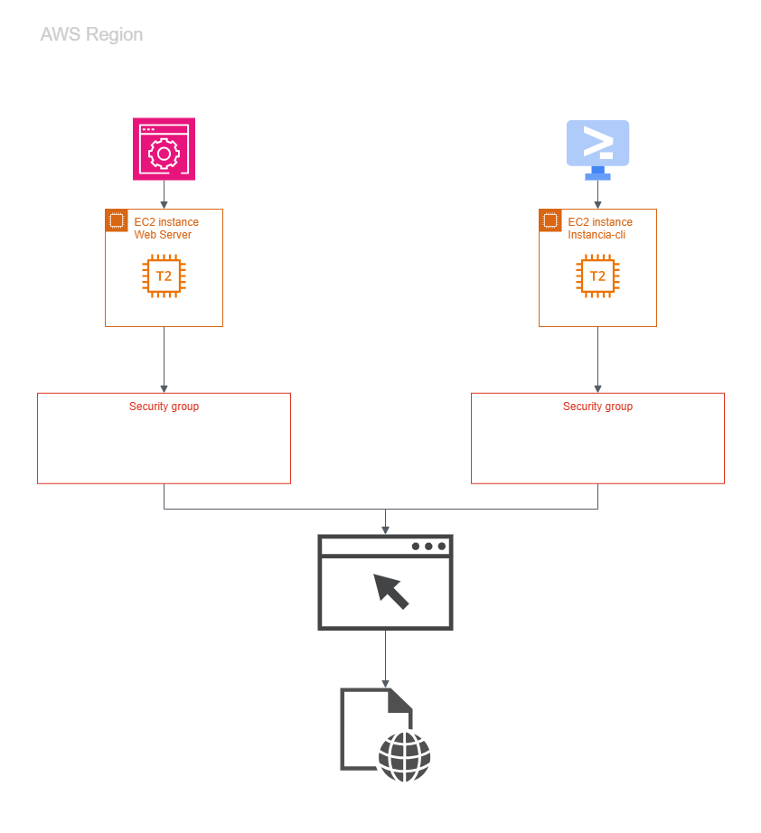
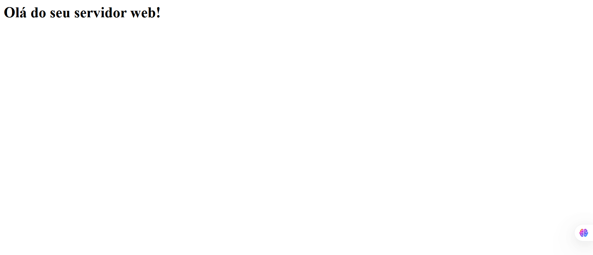
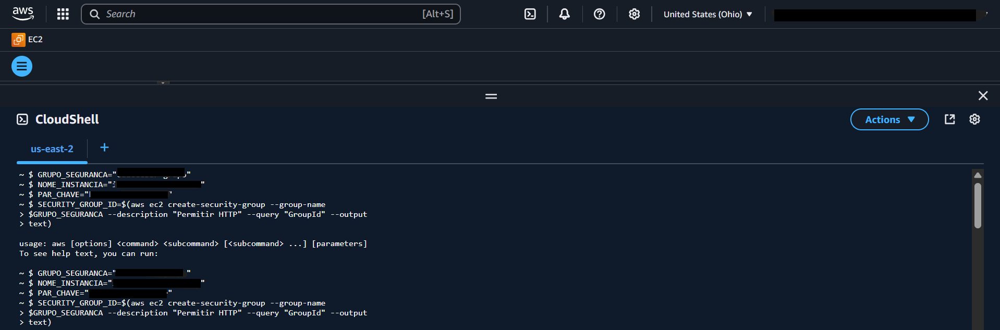
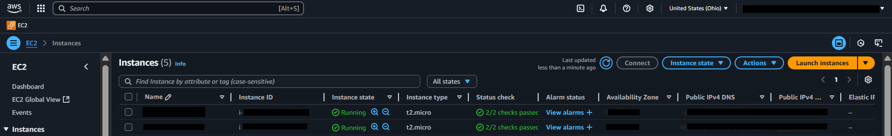
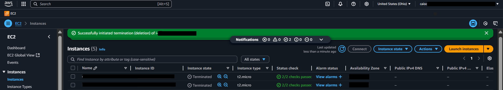
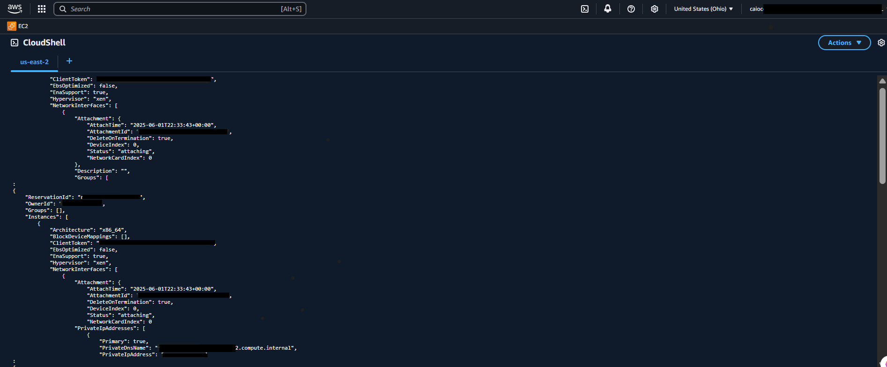
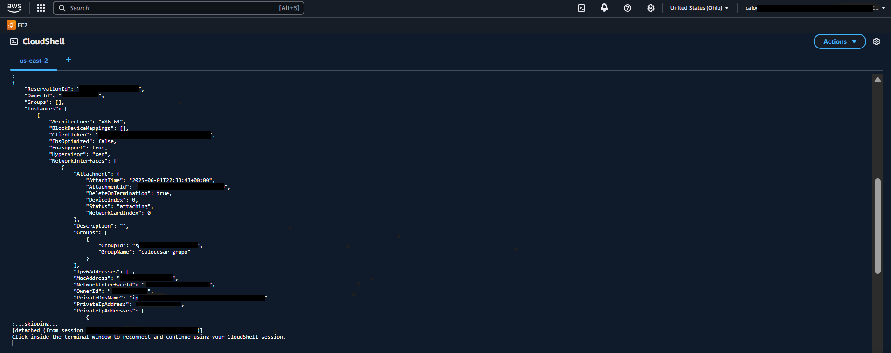
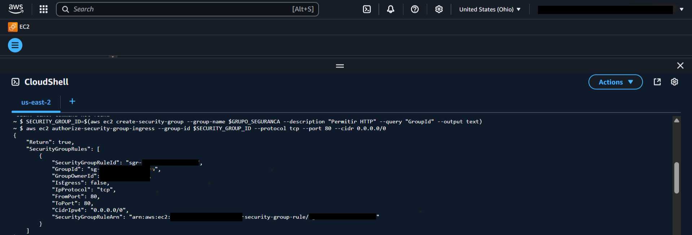

  <a href="./README-en.md">🇺🇸 English</a> |
  <a href="./README.md">🇧🇷 Português</a>

# Lab 02 — Explorando a AWS com o Amazon EC2

## 🚀 Resumo
Provisionamento automatizado de infraestrutura (`IaaS`) utilizando abordagens gráficas (Console) e programáticas (CloudShell/CLI). Este laboratório demonstra que um servidor web pode ser lançado com configurações idênticas, seja via cliques de interface ou codificado através de parâmetros em linha de comando bash (Base64).

---

## 💼 Caso de Uso Real
- **Indústria:** Engenharia de Sistemas / DevOps
- **Problema:** Desenvolvedores precisam subir dezenas de instâncias descartáveis por semana para testar novos pacotes. Fazer isso manualmente no console toma 15 minutos por tentativa, gerando erros manuais como esquecer de injetar script ou esquecer de abrir a porta 80.
- **Solução:** O uso do AWS CloudShell como bastião CLI elimina o uso repetitivo do console. Com um único comando `aws ec2 run-instances`, injetando o User Data pré-fabricado em Base64, é garantida a replicação exata do servidor em segundos, com infraestrutura codificável e auditável.

---

## 🎯 Objetivos de Aprendizado

- **Provisionar instâncias EC2** utilizando o console da AWS.
- Configurar acesso HTTP a servidores web através de **Security Groups**.
- Criar e gerenciar um **Par de Chaves (Key Pair)** para acesso seguro.
- Automatizar a inicialização do servidor com um script em bash (**User Data**).
- Utilizar o terminal do **AWS CloudShell** para provisionar instâncias via CLI puro.
- Entender o ciclo de vida da instância e as boas práticas de destruição de recursos.

---

## 🛠️ Serviços AWS Utilizados

| Serviço | Papel no Lab |
|---------|-------------|
| **Amazon EC2** | Provedor de capacidade computacional virtual (servidores web). |
| **AWS CloudShell** | Emulador de terminal baseado em navegador, pré-autenticado para uso ágil da AWS CLI. |
| **Amazon VPC** | Hospedagem central de rede isolada onde operam os Security Groups. |

---

  

---

## 🖥️ Etapas do Laboratório

### 1. 🖱️ EC2 pelo Console (Interface Gráfica)
- **Ação:** Provisionei manualmente um servidor `t2.micro` rodando Amazon Linux 2 AMI.
- **Configuração:** Gerei um *Key Pair* em `.pem` e apliquei uma abertura na interface do Security Group (`HTTP` porta 80).
- **Automação:** Injetei um `User Data` em formato Shell Script para habilitar e iniciar o `httpd` de maneira imperceptível.
> 💡 *Validação:* Após os testes de status finalizarem 2/2, o IP público acessado renderiza com sucesso a página "Olá do seu servidor web!".

### 2. 💻 EC2 pelo AWS CloudShell (Linha de Comando)
- **Ação:** Em vez da interface gráfica, acessei o CloudShell hospedando explicitamente credenciais ativas na mesma conta AWS.
- **Configuração:** Criei o Security Group correspondente, apliquei regras na porta 80 e lancei a instância consumindo diretamente a API da AWS CLI.
- **Automação CLI:** Pelo fato do Bash legível ser complexo como parâmetro direto de injeção em APIs JSON, formatei meu script como uma payload `Base64` utilizando ferramentas nativas embutidas provendo resultados no formato parameter `run-instances`.
> 📄 **Script CLI completo com base64:** [src/cloudshell-commands.sh](./src/cloudshell-commands.sh).

### 3. 🧹 Limpeza Sistemática de Recursos (Cleanup)
- **Ação Primária:** Encerrei (ação `Terminate`) as instâncias EC2 designadas como `webserver` e `instancia-cli`.
- **Ação Secundária:** Excluí permanentemente os dois Security Groups gerados *(só liberados quando as máquinas virtuais atreladas evaporaram totalmente)*.

---

## 📸 Evidências de Execução

### 1. Validação: Página web exibindo "Olá do seu servidor web!" carregando no IPv4

### 2. Ambas instâncias alvo (providas via Console e CloudShell) ativas

### 3. Detalhamento das instâncias em status "Running"

### 4. Processo de encerramento das instâncias exibindo o ciclo final

### 5. Ambiente CloudShell emulando os comandos AWS CLI para subida de rede

### 6. Retorno em formato JSON confirmando a criação pela API

### 7. Painel confirmando que ambos sistemas coexistem na mesma infraestrutura

> [!IMPORTANT]
> Alguns identificadores foram mascarados por boas práticas de segurança.

---

## 💡 Principais Aprendizados

- **Flexibilidade do Provisionamento:** Demonstrei que a AWS suporta tanto cliques humanos guiados, quanto infraestrutura invocável por terminal na prática (`Infrastructure as Scripts`).
- **Poder do User Data:** Reduz a engenharia manual pós-deploy. Posso simplesmente instanciar sistemas isolados nativamente operacionais evadindo completamente de conexões custosas como SSH apenas para lidar com pacotes base.
- **Segregação de Rede Eficiente:** Ter um IPv4 liberado não expõe os dados ao público nativamente. Sem inserir as aberturas correspondentes como a porta HTTP explícita nos arquivos de grupo na barreira, a conexão imediatamente quebra originando `Timeouts`.
- **Tratamento de Strings em Automações:** A API da AWS CLI demanda *User Data* formatado em `Base64`, evitando conflitos letais decorrentes de caracteres de escape complexos ou quebras de sintaxe nos JSON originais da CLI.

---

## 💰 Consciência de Custos

| Recurso | Free Tier? | Custo Estimado |
|---------|-----------|----------------|
| EC2 (t2.micro) × 2 | ✅ 750h/mês (12 meses) | $0,00 |
| CloudShell | ✅ Gratuito | $0,00 |
| **Total** | | **$0,00** |

> ⚠️ Lembre-se de limpar os recursos após o lab para evitar cobranças.

---

## 🏷️ Competências Demonstradas

`EC2` `CloudShell` `AWS CLI` `Security Groups` `User Data` `Key Pairs` `Base64 Encoding` `Bash Scripting` `🟢 Fundamental`

---

## 📜 Alinhamento com Certificações

Este lab cobre objetivos de:
- **CLF-C02:** Domínio 3 — Tecnologia e Serviços de Cloud
- **DVA-C02:** Domínio 1 — Desenvolvimento com Serviços AWS

---

[← Voltar ao índice](../../../README.md)
