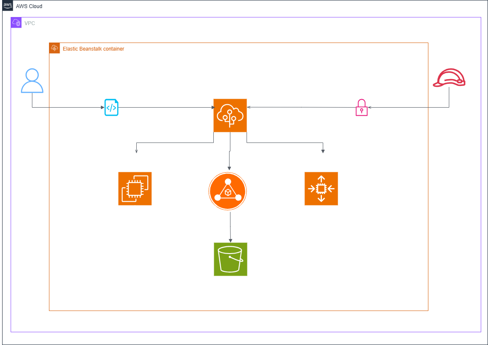
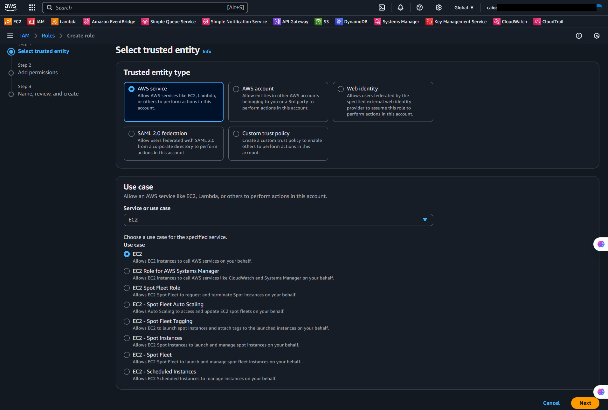
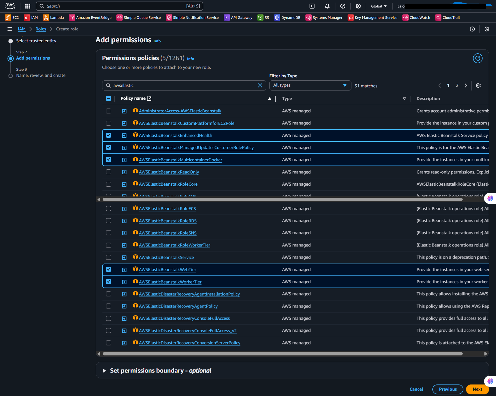
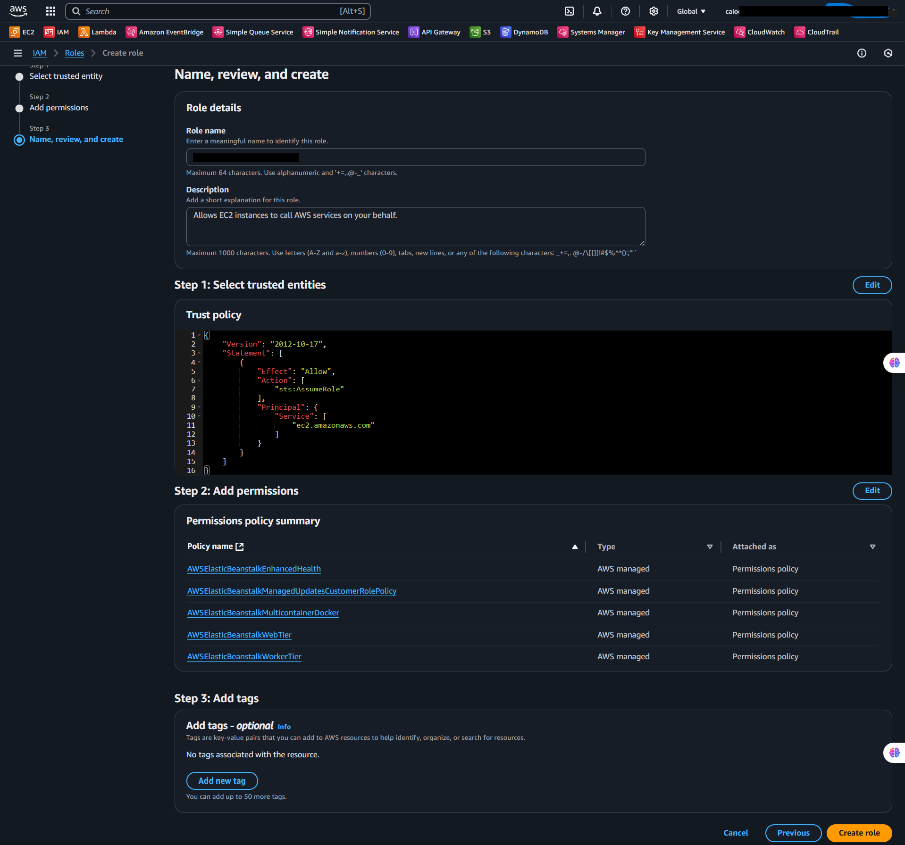
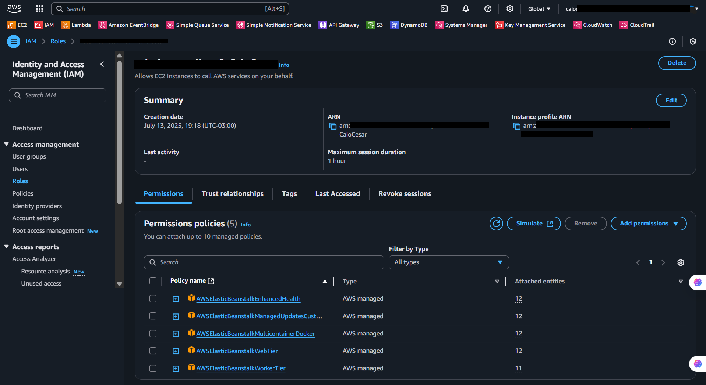
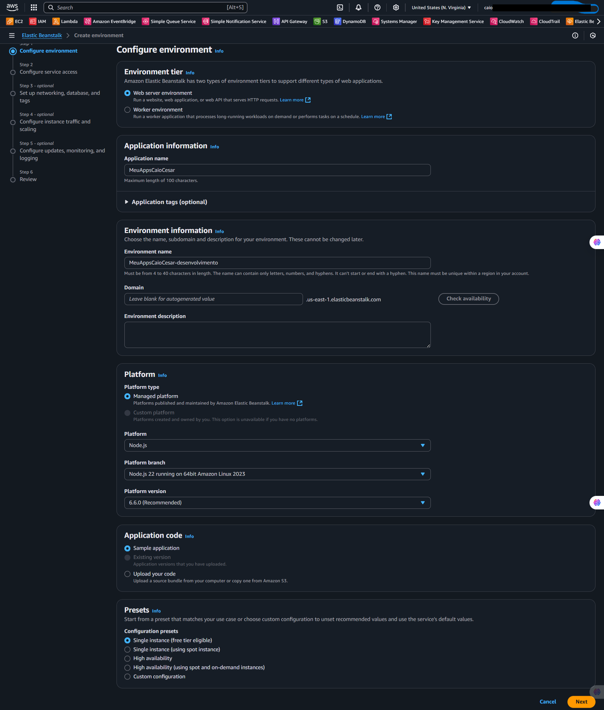
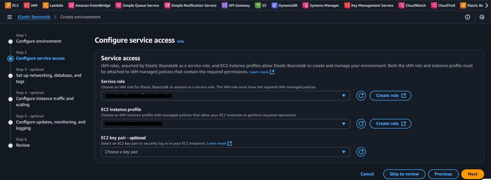
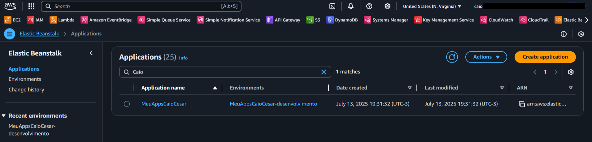

  <a href="./README-en.md">🇺🇸 English</a> |
  <a href="./README.md">🇧🇷 Português</a>

# Lab 03 — AWS Elastic Beanstalk: PaaS Application Deployment

## 🚀 Summary
Deployment of a web application utilizing the AWS managed PaaS (Platform as a Service) model. This laboratory eliminates OS and infrastructure configuration overhead, delegating complex orchestrations like Auto Scaling, EC2, CloudWatch, and Load Balancing purely to Elastic Beanstalk.

---

## 💼 Real-World Use Case
- **Industry:** Software Agencies / Seed Startups
- **Problem:** A startup validating its MVP lacks specialized Cloud/DevOps resources to maintain operations. Manually deploying an EC2, installing Python/Node, configuring Nginx, and mounting secure SSL certificates consumes brutal development cycles and introduces high-risk misconfiguration patterns.
- **Solution:** Effectively zipping the application code bundle and targeting Elastic Beanstalk for uploads. The platform intrinsically reads the language footprint, orchestrates an Auto Scaling group, configures Load Balancer routing policies, and surfaces the production URL in 5 minutes, shifting 100% of the team's focus straight back toward source logic.

---

## 🎯 Learning Objectives

- Deploy robust Web Environments structurally bypassing exhausting manual EC2 setups.
- Assign correct operational parameters (`Instance profiles` & `Service Roles`) fulfilling strict underlying IAM compliance mandates.
- Maneuver seamless application artifact upgrades abstractly.
- Monitor underlying health statuses strictly observing operational parameters handled natively by the consolidated Beanstalk dashboard.

---

## 🛠️ AWS Services Used

| Service | Role in Lab |
|---------|-------------|
| **Elastic Beanstalk** | The primary orchestration platform dictating the environment, generating EC2 nodes continuously while abstracting network details. |
| **AWS IAM** | Governs the underlying `Service Roles` that the Beanstalk engine assumes to communicate through background API calls toward EC2/S3 mechanisms. |
| **Amazon S3** | Natively and invisibly houses the encrypted web application `.zip` artifacts pushed toward the PaaS. |

---

## 🏗️ Solution Architecture

  

---

## 🖥️ Lab Steps

### 1. 🌐 Environment Initialization
- **Action:** I created an overarching structured `Web server environment` inside the Beanstalk console.
- **Configuration:** I mapped the target platform declaratively matching the specific baseline application code framework (e.g., Python, Node.js, PHP), extinguishing dependency crosses over clean generic AMIs.

### 2. 📦 Code Payload Injection
- **Action:** I extracted the local main branch package into a ZIP file.
- **Configuration:** Instead of raw SSH spins, I uploaded the application `.zip` bundle directly across the Beanstalk GUI wizard, which mirrors its contents redundantly into a highly durable S3 bucket seamlessly.

### 3. 🔐 IAM Roles Binding
- **Challenge:** To circumvent `AccessDenied` errors tied to Least Privilege principles, Beanstalk demands authoritative structural permission handling.
- **Action:** I generated and mapped prerequisite default `Service Roles` (`AWSElasticBeanstalkWebTier`). Beanstalk legally possesses authorization orchestrating automated EC2 spawning concurrently mapping CloudWatch metric profiles.

### 4. ⚙️ Application Orchestration
- **Action:** I triggered the comprehensive wizard commit.
- **Conclusion:** The central engine unrolls the exact deployment diagram launching nested nodes, balancing gateways, and structural groups. The `*.elasticbeanstalk.com` live endpoint validates rendering a *Healthy* status code output.

### 5. 🧹 Cascading Eradication (Cleanup)
- **Action:** I executed a forceful `Terminate Environment` request at the parent interface.
- **Result:** Ruthless mechanical nested-destruction locates and inherently terminates all dependent child EC2 configurations alongside trailing networking layers shielding the account from abandoned resource billing.

---

## 📸 Execution Evidence

### 1. Identifying and rendering the correct Service Role inside the IAM console

### 2. Linking AWSElasticBeanstalkWebTier and reliant policy dependencies

### 3. Final structural check verifying Web Environment settings before launching

### 4. Validating the formally generated Service Role for unassisted PaaS automation

### 5. Platform-specific logic mapping via the Web Tier declaration pane

### 6. Merging strict underlying Instance Profiles shielding EC2 background APIs

### 7. Finalized dashboard showcasing a stable "Healthy" state feeding the active internet link

> [!IMPORTANT]
> Some identifiers have been masked following security best practices.

---

## 💡 Key Learnings

- **Unmatched PaaS Overhead Reduction:** Elastic Beanstalk radically shields developers by dodging infrastructure bottlenecks. It stands tall proving to be arguably the most optimized corridor translating raw standard web repository commits directly straight to production.
- **Deterministic Eradication:** PaaS acts as the grand parent controller handling instance nests. Killing the encompassing master layer sweeps away subordinate computational footprints organically, closing dangerous lingering billing gaps flawlessly.

---

## 💰 Cost Awareness

| Resource | Free Tier? | Estimated Cost |
|----------|-----------|----------------|
| Elastic Beanstalk | ✅ Free (underlying infra charged) | $0.00 |
| EC2 (t2.micro) | ✅ 750h/mo (12 months) | $0.00 |
| S3 (artifacts) | ✅ 5GB | $0.00 |
| **Total** | | **$0.00** |

> ⚠️ Remember to clean up resources after the lab to avoid charges.

---

## 🏷️ Competencies Demonstrated

`Elastic Beanstalk` `PaaS` `IAM Roles` `Instance Profile` `Managed Platform` `Automated Deploy` `🟢 Fundamental`

---

## 📜 Certification Alignment

This lab covers objectives from:
- **CLF-C02:** Domain 3 — Cloud Technology and Services
- **DVA-C02:** Domain 3 — Deployment
- **SAA-C03:** Domain 3 — High-Performance Architecture

---

[← Return to Index](../../../README-en.md)
