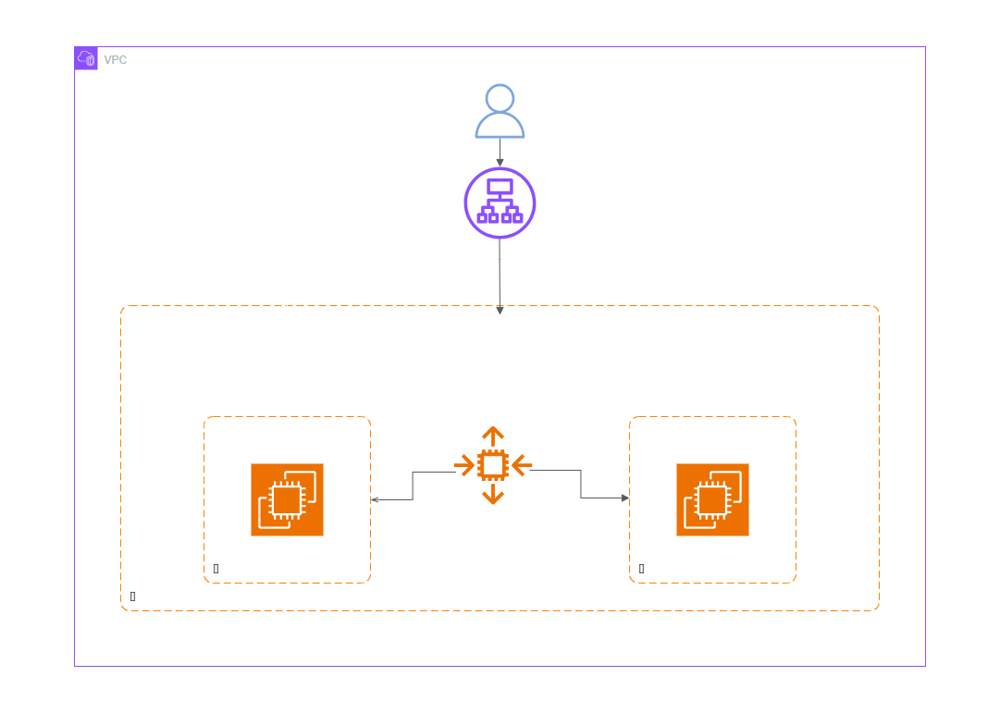
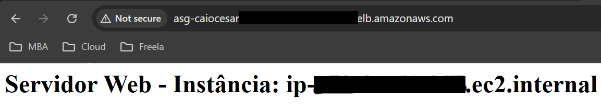
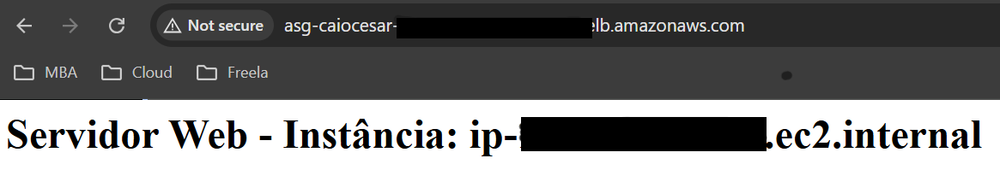

  <a href="./README-en.md">🇺🇸 English</a> |
  <a href="./README.md">🇧🇷 Português</a>

# Lab 04 — Amazon EC2 Auto Scaling e Application Load Balancer (ALB)

## 🚀 Resumo
Implementação de arquitetura base distribuída projetada para tolerância a falhas (Multi-AZ) e escala horizontal automática. Este laboratório substitui servidores estáticos por um modelo dinâmico, onde o tráfego HTTP é balanceado ativamente e instâncias são provisionadas/destruídas de forma autônoma baseadas puramente na demanda de métricas de rede.

---

## 💼 Caso de Uso Real
- **Indústria:** E-commerce / Plataformas de Streaming
- **Problema:** Um grande portal de notícias pode ter de 100 usuários na madrugada para 100.000 em questão de minutos devido à quebra de uma notícia urgente. Servidores rígidos causam gargalo imediato, indisponibilidade agressiva e forte dano à marca (*Downtime*).
- **Solução:** Aplicar a dobradinha ALB + ASG. O **Auto Scaling Group** detecta o gatilho, clona servidores idênticos (via Launch Template) e preenche diferentes Zonas de Disponibilidade. Simultaneamente, o **Application Load Balancer** repassa o tráfego apenas para instâncias saudáveis, curando falhas e absorvendo a carga sem intervenção manual contínua.

---

## 🎯 Objetivos de Aprendizado

- Criar um **Launch Template (Modelo de Execução)** para padronizar e clonar instâncias EC2 com script embutido em *User Data*.
- Configurar e implantar um **Application Load Balancer (ALB)** definindo Listeners de borda e Target Groups lógicos.
- Implementar um **Auto Scaling Group (ASG)** para escalabilidade controlada (Máx/Mín/Desejado na AWS).
- Validar a robustez arquitetônica (**Alta Disponibilidade**) realizando testes de recarregamento forçados acompanhando a distribuição DNS na prática.

---

## 🛠️ Serviços AWS Utilizados

| Serviço | Papel no Lab |
|---------|-------------|
| **Amazon EC2** | Provedor elástico base de instâncias de computação. |
| **Launch Template** | Modelo base que dita a AMI, CPU, Rede e Automacão (Shell) dos novos clones operacionais. |
| **Auto Scaling Group** | Orquestrador autônomo da frota de EC2, expandindo ou contraindo hardware ativamente. |
| **Application Load Balancer** | Balanceador de camada 7 focado fundamentalmente em roteamento inteligente HTTP. |

---

## 🏗️ Arquitetura da Solução

  

---

## 🖥️ Etapas do Laboratório

### 1. 📋 Criação do Blueprint (Launch Template)
- **Ação:** Criei um Modelo de Lançamento central validado dinamicamente para herança.
- **Configuração:** Acoplei o padrão de imagem *Amazon Linux 2*, rodando instância limitadora `t2.micro` nativametne com a injeção do pacote automatizado em *User Data*.
- **Benefício:** Todas as instâncias criadas no futuro através desse template herdarão organicamente esta mesmíssima receita operacional mitigando configurações manuais inconsistentes.

### 2. ⚖️ Configuração do Load Balancer (ALB)
- **Ação:** Provisionei estruturalmente o balanceador focado nativamente na internet (*Internet-facing*).
- **Configuração:** Distribuí as alocações de rede forçando a atuação nativa em pelo menos duas sub-redes ativas abrangendo aberturas multi-zona para Alta Disponibilidade comprovada ativamente. Gere um `Target Group` nativo isolado focado na porta HTTP 80 definindo caminhos lógicos rigorosos apontando o rastreio base Health Check diretamente para caminhos válidos (`/index.html`).

### 3. 📈 Orquestração do Auto Scaling (ASG)
- **Ação:** Realizei a integração atreladora final. Utilizando o ASG, liguei diretamente meu Launch Template construído originariamente mesclando os servidores diretamente nos nós conectores rastreados providos base originária geridos no ALB da etapa anterior nativamente.
- **Limites de Capacidade (Capacity Limits):**
  - Desired: **2** Instâncias provisionadas no ar instantaneamente.
  - Minimum: **2** Tolerância de quedas mantendo barreira base na contagem global.
  - Maximum: **4** Trava de segurança no budget barrando instâncias excessivas infinitas.

### 4. 🧪 Validação Prática do Tráfego
- **Ação:** Inseri manualmente o endpoint em formato DNS (DNS Name) gerado nativamente originado via ALB direto no navegador do meu cliente.
- **Resultado:** Atualizações forçadas batendo rotineiramente no meu front-end rotearam o processamento alternando magicamente provando balanceamento operando no back-end.

---

## 📸 Evidências de Execução

### 1. Navegador exibindo hit com sucesso processado na infraestrutura do Servidor 01 via DNS

### 2. Navegador exibindo failover direcional repassando a nova carga ao Servidor 02 em AZ distinta

> [!IMPORTANT]
> Alguns identificadores foram mascarados por boas práticas de segurança corporativa.

---

## 💡 Principais Aprendizados

- **Escala Controlada Estrita:** Configurei a capacidade dinâmica absorver altas demandas, aliviando o estresse dos nós base e garantindo a resiliência efetiva perante picos inesperados.
- **Substituição sem Interrupção:** Notei que caso surja integridade comprometida atrelada ao ecossistema base ASG, os bloqueios restritivos associados nos *Health Checks* bloqueiam caminhos viciados retirando infraestruturas defeituosas impedindo falhas em cascata perante conectividade final ativa perfeitamente fluída robusta.
- **Agilidade e Versionamento:** Modelos centralizam o estado, provando serem um benefício absoluto migrando antigamente engessadas "Launch Configurations" obsoletas nativas AWS ativamente para templates limpos flexíveis robustos versionáveis e confiáveis ativamente operacionais estáveis nativamente orgânicos puramente testados funcionalmente limpos.

---

## 💰 Consciência de Custos

| Recurso | Free Tier? | Custo Estimado |
|---------|-----------|----------------|
| EC2 (t2.micro) × 2-4 | ✅ 750h/mês (12 meses) | $0,00 |
| ALB | ✅ 750h/mês + 15 LCUs (12 meses) | $0,00 |
| **Total** | | **$0,00** |

> ⚠️ Elimine rigorosamente o Auto Scaling Group antes do ALB e Launch Templates durante o cleanup para que a AWS consiga encerrar o aninhamento computacional de forma bem-sucedida.

---

## 🏷️ Competências Demonstradas

`Auto Scaling Group` `ALB` `Launch Template` `Multi-AZ` `Alta Disponibilidade` `Health Check` `Horizontal Scaling` `🟡 Intermediário`

---

[← Voltar ao índice](../../../README.md)
