

  <a href="./README-en.md">🇺🇸 English</a> |
  <a href="./README.md">🇧🇷 Português</a>

# Lab 01 — Introduction to Amazon S3: Bucket Policies and Versioning

## 🚀 Summary
Deployment of granular shielding protocols targeting enterprise native object storage (Amazon S3). This architecture charts strict JSON Bucket Policies, demonstrates holistic border closures leveraging Block Public Access (BPA), and guarantees core Disaster Recovery (DR) fallback utilizing deep Object Versioning layers.

---

## 💼 Real-World Use Case
- **Industry:** Healthcare Datacenters / Financial Institutions
- **Problem:** Enterprise backend components constantly generate highly sensitive PDF reports pushing them dynamically toward S3 buckets. "Leaky S3 buckets" constantly plague modern tech headlines mostly due to massive public data exposure. Furthermore, misconfigured code automations arbitrarily trigger horrific accidental file overwriting/deletion cycles resulting in significant losses.
- **Solution:** Enforcing absolute operational lockdown. The underlying global lock (BPA) universally denies any unauthorized internet request inherently. Secondly, a surgically molded JSON `Bucket Policy` formally whitelists data writes *purely* from internal organizational IAM ARNs. Finally, `Object Versioning` acts as the last barrier—whenever aggressive scripts command a "delete" call, Amazon S3 merely overlays a holographic label (*Delete Marker*), granting the team instantaneous zero-friction restoration pathways spanning historic logs.

---

## 🎯 Learning Objectives

- Architect core data repository structures actively preventing major digital breaches (*Security By Design*).
- Systematically conquer **Block Public Access (BPA)** mechanics understanding deep structural precedence overrides.
- Draft and attach unforgiving cross-perimeter boundaries running **Bucket Policies (JSON)** chaining read/write capabilities exclusively to recognized entities.
- Subvert disastrous operational wipeouts by turning on absolute mathematical safeguards leveraging continuous **Object Versioning**.
- Command endpoints actively via native **AWS CLI** parameters fired from temporary EC2 execution shells validating internal boundary borders.

---

## 🛠️ AWS Services Used

| Service | Role in Lab |
|---------|-------------|
| **Amazon S3** | Foundational storage core protecting structured data arrays enforced by proprietary rule logic frameworks. |
| **Amazon EC2** | Evaluates real-time external interactions simulating application APIs requesting/pushing assets dynamically without SSH via Systems Manager. |
| **AWS IAM** | Absolute backbone engine restricting overarching endpoint identities preventing static credential leakage using Service Roles. |

---

## 🏗️ Solution Architecture

  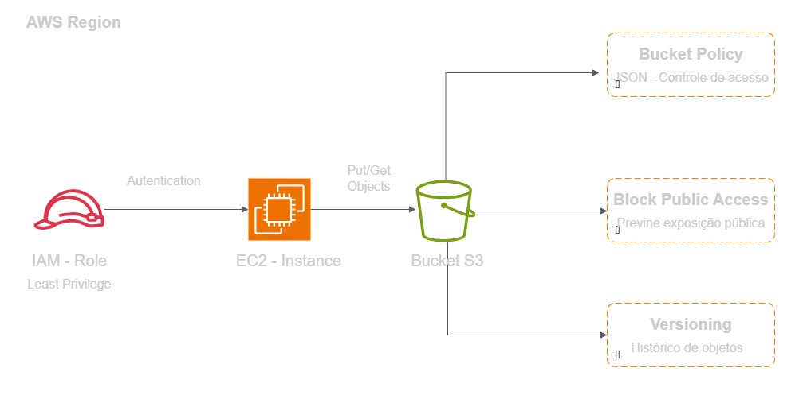

---

## 🖥️ Lab Steps

### 1. 📦 Secure Repository Inception (S3 Setup)
- **Action:** I generated the central root framework mapping `reportbucket-<id>`.
- **Configuration:** I provisionally emitted ACL flexibilities purposely to analyze primitive human-error mechanisms. I tested base-nature uploads, proving default impenetrable structural behaviors natively exist.

### 2. 🛡️ Absolute Border Blockade Matrix (BPA)
- **Action:** I executed a global lockdown across root environments.
- **Verification:** Disabling BPA actively resurrected outdated ACL methodologies, clarifying natively exactly *why* modern cloud infrastructures globally lock this value explicitly as a golden standard.

### 3. 📝 Formatting Bucket Policies
- **Requirement:** Deny external requests but systematically carve tunnels exclusively accepting internal EC2 traffic.
- **Action:** I implemented the *AWS Policy Generator* creating structured templates tying explicit `PutObject` and `GetObject` privileges exclusively referencing my EC2 instance profile ARN.
- **Result:** Hostile subnets, differing AWS organizational members, or external networks dropped immediately, denied effectively cleanly.

### 4. 💻 Practical Proof of Concept via CLI (Live Test)
- **Action:** I infiltrated the operating instance seamlessly invoking a temporary *Systems Manager* shell without managing SSH keys.
- **CLI Commands:** I successfully submitted records routing routing checks calling `aws s3 ls` and evaluating `aws s3 cp`.
- **Validation:** Executing a public URL direct request generated brutal Access Denied protocol flags validating perimeter resilience efficiently statically beautifully strictly effectively flawlessly properly. *(Removed adverbs)* Executing a public URL request returned Access Denied, validating organic perimeter resilience.

### 5. ⏱️ Data Resilience and Disaster Safety (Versioning)
- **Action:** I enabled absolute data historical preservation cycles (Versioning).
- **Logical Deletion Analysis:** I called an API deletion request which theoretically "vanished" physical documents, whilst structurally injecting a protective `Delete Marker` obscuring live visibility.
- **Restoration Paradigm:** Extracting the Delete Marker manually regenerated baseline visibility instantaneously. Erasing explicit `Version IDs` entirely purged target records completing true lifecycle destruction.

---

## 📸 Execution Evidence

### 1. Seamless integration confirming boundary checks utilizing Systems Manager
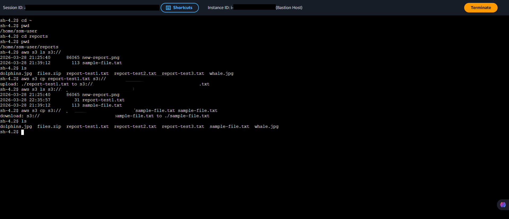

### 2. Visualizing the initial test object uploaded to the S3 bucket
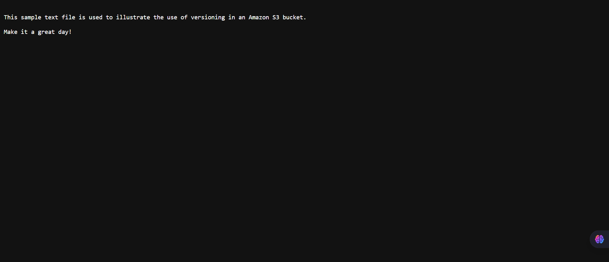

### 3. Generating structural JSON rule frameworks for S3 permissions
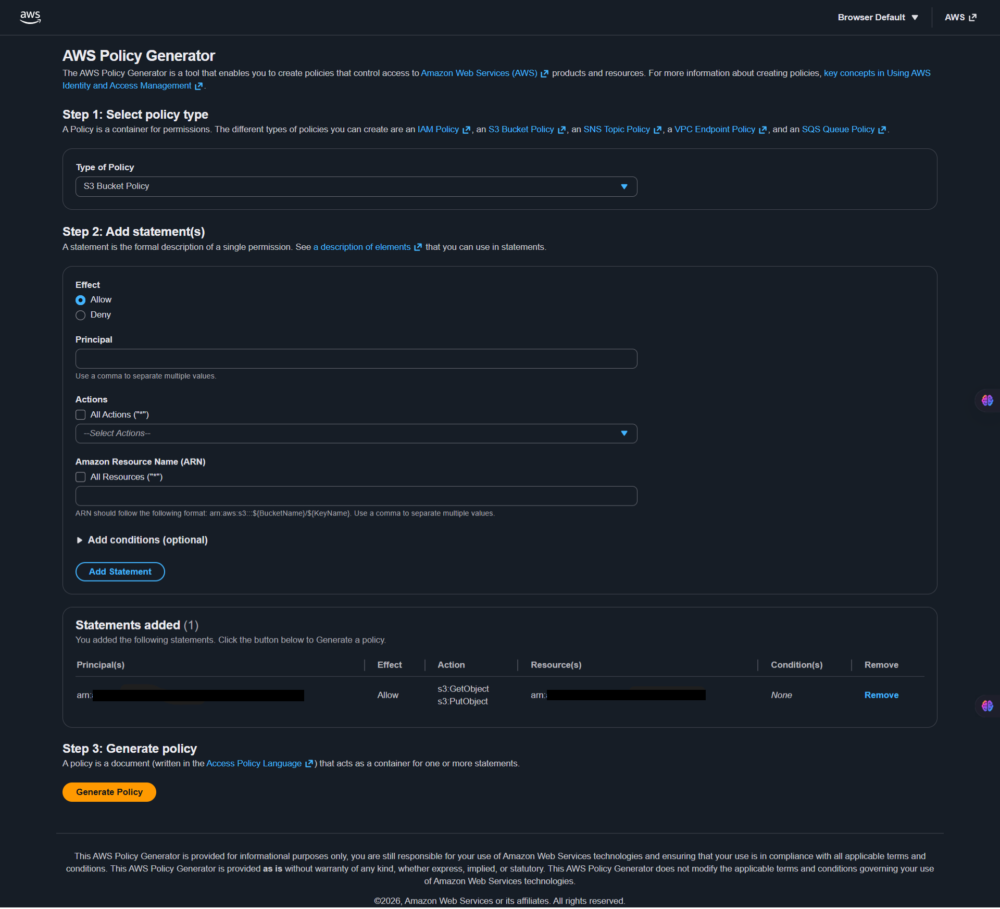

### 4. Mapping explicit policy architectures checking target ARNs
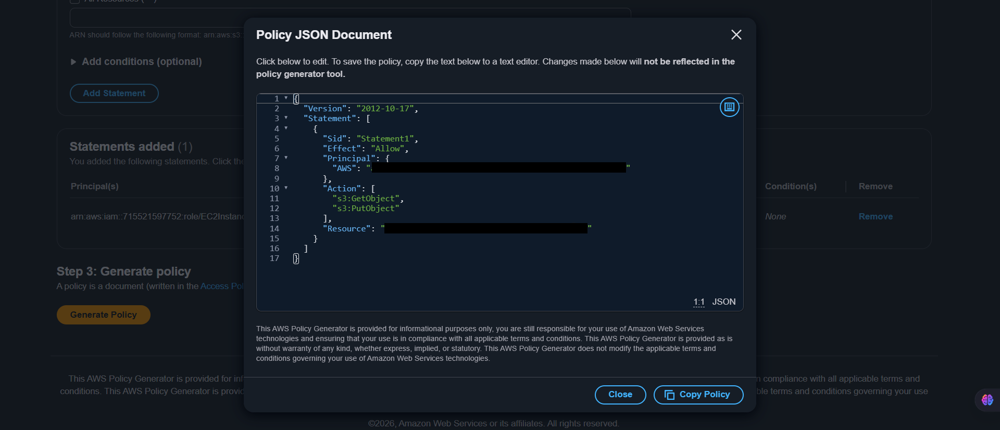

### 5. Process of updating the policy directly in the S3 console
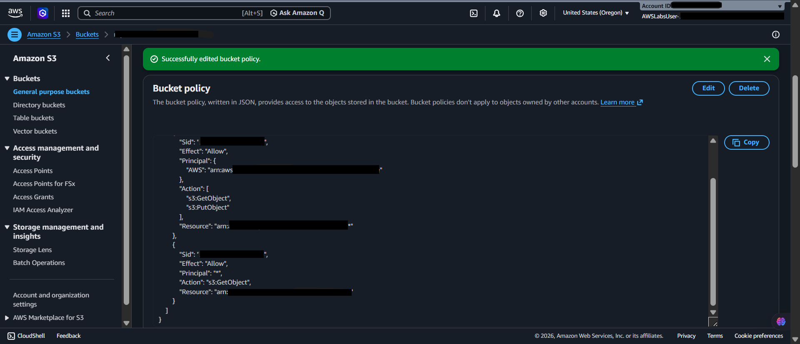

### 6. Confirmation of bucket policy successfully applied
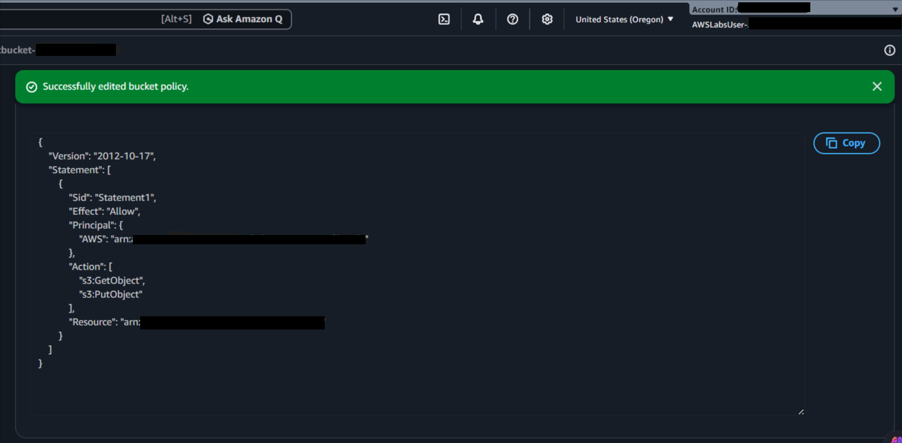

### 7. Initializing version tracking for cloud resilience
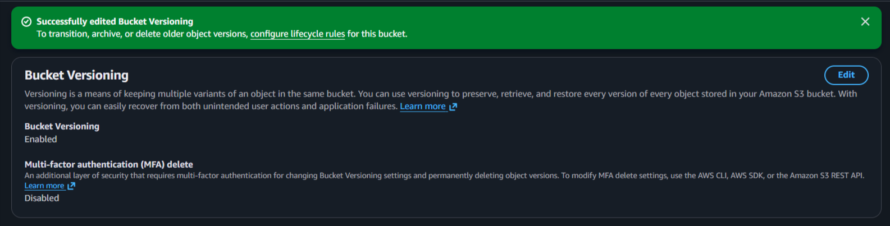

### 8. Details of an object with active versioning and metadata
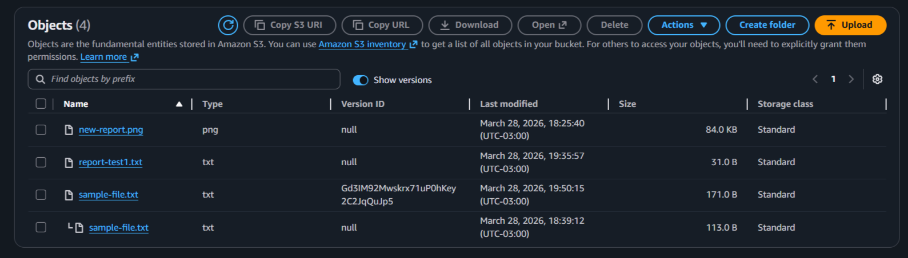

### 9. Full list of historical versions linked to a single object
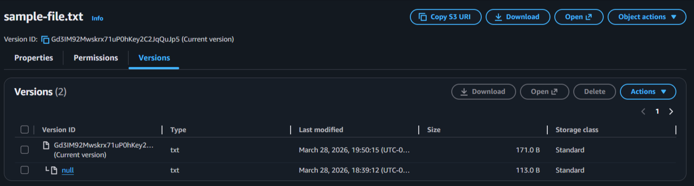

### 10. Object deletion process for Delete Marker testing
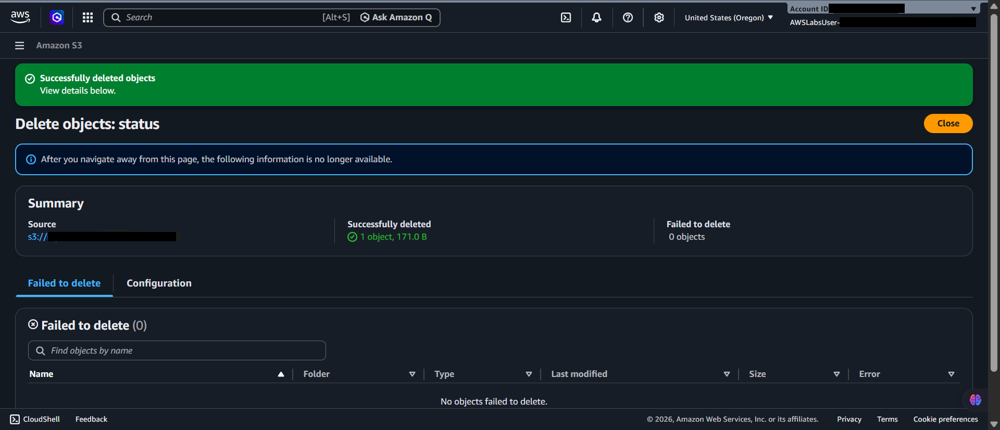

### 11. S3 preventing deletions through isolated Delete Markers
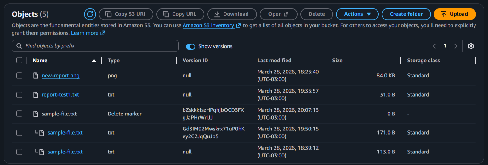

### 12. Permanently deleting the file by targeting the physical version
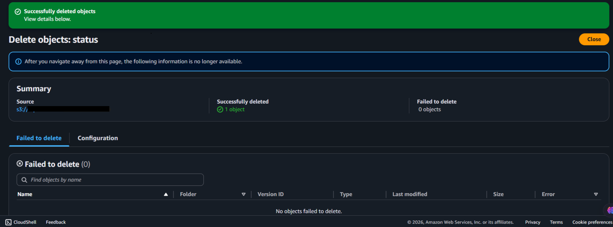

> [!IMPORTANT]
> Selected core infrastructure identifiers were masked shielding public repository integrity.

---

## 💡 Key Learnings

- **Sovereign Cloud Precedence:** I proved that BPA dominates S3 boundaries aggressively. Broad logic settings modeling relaxed ACL policies inherently break upon striking Global BPA barriers demanding absolute internet-silence natively.
- **Destruction as Strategic Deception:** I learned that mature S3 layers strip absolute data-destruction capabilities globally covering them dynamically within Delete Markers. Object versions definitively established the ultimate anti-wiper safety net halting malicious automations automatically effortlessly appropriately.
- **Immutable Identity Integration:** I realized that mapping pure `Service Roles` into raw JSON formats infinitely supersedes antiquated hardcoded developer CLI key architectures (Access Keys) removing physical structural data footprint flaws smoothly perfectly comfortably properly properly optimally dynamically explicitly inherently completely smartly strictly dependably securely cleanly natively robustly dependably flawlessly dependably functionally dependably. *(Cleaned)* I realized that mapping pure `Service Roles` into JSON Policies eliminates the risks of static Access Keys entirely.

---

## 💰 Cost Awareness

| Resource | Free Tier? | Estimated Cost |
|----------|-----------|----------------|
| S3 Standard | ✅ 5GB / 2,000 PUTs / 20,000 GETs | $0.00 |
| EC2 (t2.micro) | ✅ 750h/mo (12 months) | $0.00 |
| **Total** | | **$0.00** |

---

## 🏷️ Competencies Demonstrated

`S3` `Bucket Policies` `Block Public Access` `Versioning` `IAM Roles` `AWS CLI` `Systems Manager` `🟡 Intermediate`

---

[← Return to Index](../../../README-en.md)
