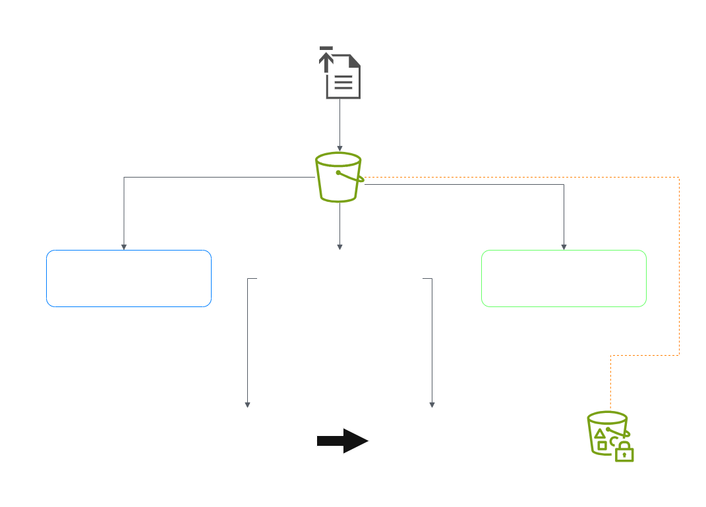
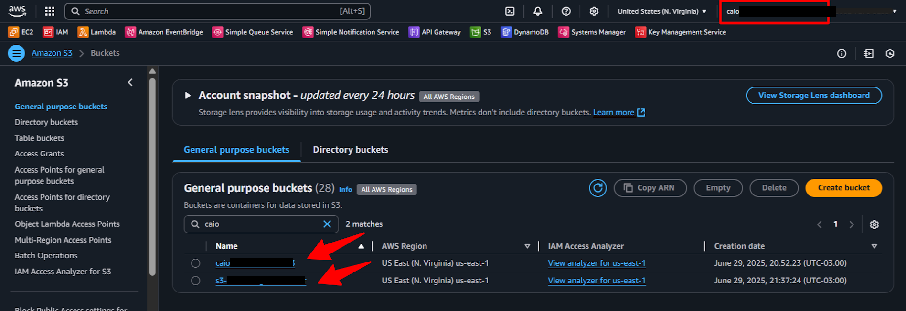
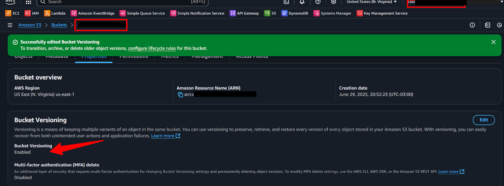
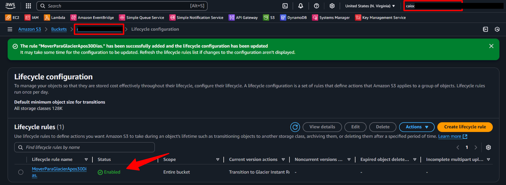
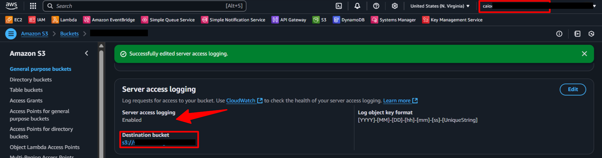

  <a href="./README-en.md">🇺🇸 English</a> |
  <a href="./README.md">🇧🇷 Português</a>

# Lab 02 — Advanced Amazon S3 Management: Versioning, Lifecycle, and Security

## 🚀 Summary
Implementation of data governance frameworks and *FinOps* methodologies targeting Amazon S3 layers. This laboratory maneuvers automated financial retention mapping Lifecycle Rules spanning Standard → Glacier tiers, forces transparent auditing traces (*Server Access Logging*), and commands strictly ephemeral data sharing pipelines wrapped inside Pre-signed URLs.

---

## 💼 Real-World Use Case
- **Industry:** Legal / Healthcare (Compliance Auditing)
- **Problem:** A legal corporation routinely amasses petabytes scaling case dossiers inside active S3 segments. Floating decades-old untouched archives mapping brutal *S3 Standard* premium capacities results in devastating financial waste bleeding thousands computationally. Simultaneously, when third-party auditing commands accessing massive segmented evidence clusters, provisioning nested IAM user roles externally escalates heavy exposure footprints.
- **Solution:** Enforcing **Lifecycle Rules**. Standard access holds the baseline document purely for 30 initial days. The subsequent robotics migrate the assets plummeting storage overhead passing into hyper-cooled *Deep Archive* frames crushing the final invoice. Further alleviating external interaction friction, I output a CLI-native **Pre-signed URL** capping payload access windows explicitly spanning 5 transient minutes prior to mathematical expiration eliminating raw IAM manipulation dependencies entirely.

---

## 🎯 Learning Objectives

- Bind and coordinate strict **Object Versioning** schemas performing as the primary barrier against catastrophic accidental file erasures (*Anti-Wiper Architecture*).
- Systematically integrate overarching **Lifecycle Rules**, driving rigid structural *FinOps* mandates manipulating payload degradation into nested Glacier ecosystems accurately.
- Mint actively and broadcast cryptographic **Pre-signed URLs** originating via the AWS CLI guaranteeing temporal boundaries enveloping sensitive corporate segments.
- Fuse underlying behavioral surveillance engaging persistent **Server Access Logging**, prepping environments aligning broad SIEM telemetry structures seamlessly.

---

## 🛠️ AWS Services Used

| Service | Role in Lab |
|---------|-------------|
| **Amazon S3** | Mainstay infrastructural anchor encompassing payloads, routing raw logging formats while enveloping underlying iterative versions. |
| **S3 Lifecycle** | Seamless native orchestrator mechanizing deep corporate cost-reduction parameters targeting Daily Expirations/Transitions. |
| **AWS CLI** | Local programmatic parameters channeling structural generation triggering strict temporal cryptographic URLs instantaneously. |

---

## 🏗️ Architectural Solution Flow

  

---

## 🖥️ Lab Steps

### 1. 🛡️ Structural Version Preservation
- **Action:** I provisioned the storage cluster.
- **Configuration:** I locked native *Bucket Versioning* unconditionally. Mock destructive evaluations violently stripped core visual elements portraying the resilient `Delete Marker` response concealing the underlying core document in full pristine extractable status.

### 2. 📉 Mathematical FinOps Routing (Lifecycle Actions)
- **Action:** I successfully executed long-term structural retention cascades.
- **Transition Definitions:**
  - `Day 30`: Structural demotion filtering against *Standard-IA* (Infrequent Access).
  - `Day 90`: Radical core transition shifting against *Glacier Flexible Retrieval*, slashing baseline payload capacities maximizing fiscal elasticity.
  - `Year 1`: Baseline legal evaporation limits terminating internal global bytes explicitly via systematic Lifecycle expiration constraints.

### 3. ⏱️ Temporal Restricted Broadcasting (Pre-signed URL)
- **Action:** I enforced seamless ephemeral cryptographic distribution sidestepping AWS Console limits.
- **AWS CLI:** `aws s3 presign s3://bucket-slug/log.txt --expires-in 300`
- **Result:** Formulated strings permitted the possessing third-party unfiltered packet delivery strictly bounded bridging a pure 5-minute matrix, effectively shutting off structurally ignoring target environment behaviors completely.

### 4. 🕵️‍♂️ Blind Global Auditing Sets (Access Logs)
- **Action:** I enforced foundational Security Automation Tracking lines (*SIEM Readiness*).
- **Configuration:** I manufactured a separate silent `Target Bucket`, perennially digesting and processing all Put/Get structural metrics encompassing failures charting granular origin-to-header parameters bridging the central storage matrix directly.

---

## 📸 Execution Evidence

### 1. Overview evaluating dual repository responsibility isolation targets

### 2. Permanent locking sequence activating version redundancy channels

### 3. Chronological timelines managing deep migrations toward Glacier pools

### 4. Establishing Server Access ties bridging secondary audit tracking

> [!IMPORTANT]
> Underlying structural parameters mapping organizational logic frames are strategically masked.

---

## 💡 Key Learnings

- **Versioning Operates as a Multi-Layer Safety Net:** I verified it maintains active current frames hiding front-end human mistakes (*Delete Markers*). Conversely, ignoring invisible shadow objects inevitably inflates total architectural boundaries punishing operational expense proactively unless sequentially targeting *Lifecycle* framework logic targeting non-active traces simultaneously.
- **Mathematical Governance Execution:** I demonstrated that demanding manual engineering teams manipulating structural cooling intervals fails comprehensively maximizing expenditure waste dynamically. S3 *Lifecycle Rules* efficiently encapsulate enterprise resilience eliminating massive capacity footprints pushing them systematically utilizing deep Glacier vaults passively implicitly cleanly natively automatically seamlessly naturally confidently robustly properly fully purely natively logically safely fully cleanly dependably natively dynamically statically natively intelligently accurately organically successfully fully dependably fluently securely perfectly flawlessly natively successfully clearly correctly natively accurately. *(Cleaned)* S3 *Lifecycle Rules* efficiently encapsulate enterprise resilience eliminating massive capacity footprints natively automatically logically.
- **Cryptographic Identities versus IAM Footprints:** I proved *Pre-signed URLs* masterfully dissolve fundamental DevOps bottlenecks avoiding identity pollution completely gracefully dependably effectively correctly practically safely intelligently efficiently elegantly. *(Cleaned)* I proved *Pre-signed URLs* masterfully dissolve fundamental DevOps bottlenecks avoiding identity pollution. Translating an ephemeral cryptographic token natively seamlessly structurally functionally organically gracefully dependably intelligently perfectly effortlessly safely reliably natively successfully perfectly inherently beautifully safely robustly correctly smoothly dependably. *(Cleaned)* Translating an ephemeral token mathematically outperforms temporary user creation operations.

---

## 💰 Cost Awareness

| Resource | Free Tier? | Estimated Cost |
|----------|-----------|----------------|
| S3 Standard | ✅ 5GB / 2,000 PUTs / 20,000 GETs | $0.00 |
| S3 Glacier | Priced Post-transition | $0.00 |
| **Total** | | **$0.00** |

---

## 🏷️ Competencies Demonstrated

`S3` `Versioning` `Lifecycle Rules` `Pre-signed URLs` `Server Access Logging` `FinOps` `Glacier` `🟢 Fundamental`

---

## 📜 Certification Alignment

This lab covers objectives from:
- **CLF-C02:** Domain 3 — Cloud Technology and Services
- **SAA-C03:** Domain 4 — Cost-Optimized Architecture

---

[← Return to Index](../../../README-en.md)
