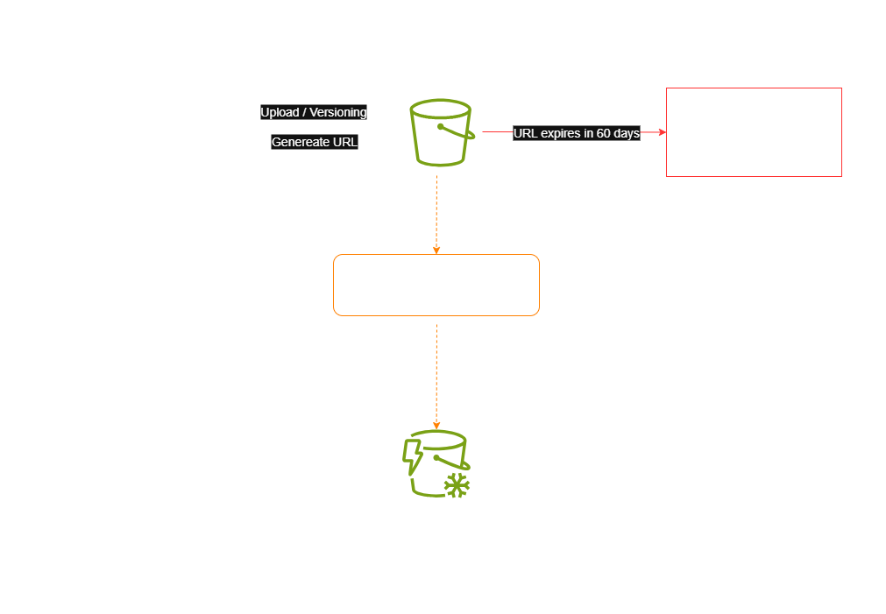
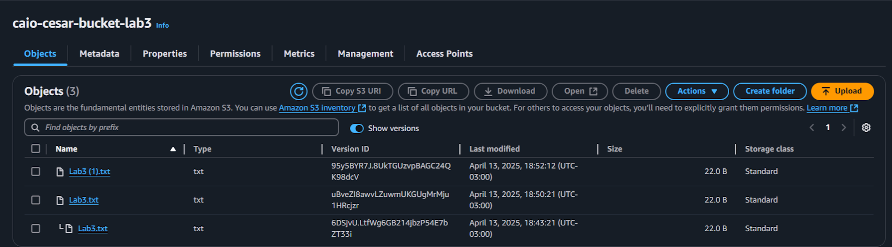
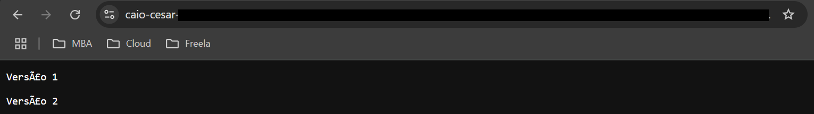
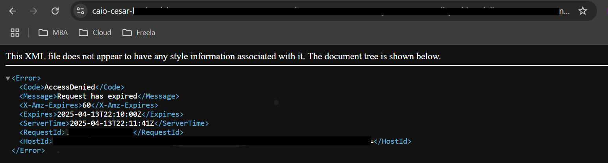

  <a href="./README-en.md">🇺🇸 English</a> |
  <a href="./README.md">🇧🇷 Português</a>

# Lab 03 — Basic and Advanced Amazon S3: Versioning and Pre-signed URLs

## 🚀 Summary
Establishment of robust enterprise Storage infrastructure zeroing in on data resilience and secured external payload delegation. This architectural overview pairs native *BPA* enforcement alongside continuous *Object Versioning* layers, culminating in the secure dissemination of restricted physical assets utilizing strict short-lived Pre-signed API URLs.

---

## 💼 Real-World Use Case
- **Industry:** Tax Consultancy / External Auditing
- **Problem:** Enterprise finance divisions accumulate crucial PDF tax receipts strictly locked inside AWS. They frequently face mandates to transmit files towards third-party external contractors. Weakening Bucket ACLs compromises perimeter integrity, whereas dropping massive assets into classical email pipelines breaks DLP policies.
- **Solution:** Hybrid Security Routing. I implemented an impenetrable internet seal enforcing Block Public Access. Crucially, I turned on **Object Versioning**, ensuring destructive "delete" actions issued from bugged scripts morph securely into hidden flags (*Delete Markers*). To deliver external payloads, I struck a **Pre-signed URL** leveraging an active IAM identity. This outputs a temporal cryptographic string funneling the asset seamlessly over the AWS backbone directly into the auditor's browser — instantly decaying to ash after a strict 60 seconds.

---

## 🎯 Learning Objectives

- Forge foundational Amazon S3 arrays bound comprehensively by rigid **Block Public Access (BPA)** global locks.
- Interlock absolute retention parameters leveraging **Object Versioning**, intentionally inducing file overwrites to extract uncorrupted primary structures validating mathematical defense paths.
- Master infrastructure cost trajectories bridging automated **Lifecycle Rules**, driving idle payloads dynamically into structured Glacier matrix vaults seamlessly.
- Extract hyper-temporal file gateways employing **Pre-signed URLs** commanded with logical self-destruct timers halting sustained unauthorized downstream access completely.

---

## 🛠️ AWS Services Used

| Service | Role in Lab |
|---------|-------------|
| **Amazon S3** | Base structural repository manipulating payload storage, enacting background FinOps migrations natively alongside retention loops. |
| **S3 Presigned URLs** | Ephemeral identity bridge converting authorized internal footprints granting external payload pathways bypassing permanent user provisioning operations structurally. |

---

## 🏗️ Architectural Solution Flow

  

---

## 🖥️ Lab Steps

### 1. 🛡️ Absolute Perimeter Establishment
- **Action:** I generated the root bucket `your-name-bucket-lab3` nestled globally inside `us-east-1`.
- **Configuration:** I mandatorily coupled it with AWS's explicit Block Public Access directive framework. The bucket immediately boots inherently deaf to unauthenticated wildcard external queries, blocking modern leakage vectors entirely.

### 2. 🗄️ Core Anti-Wipe Retentions (Versioning)
- **Action:** I executed perpetual background shadow-tracking modules enabling Versioning.
- **Destructive Testing:** I intentionally pushed intersecting internal byte modifications across duplicated identical file strings (`Lab3.txt`).
- **Resolution:** I verified the engine bypassed destructive overwrites branching unique immutable IDs parallelly, structurally ensuring instant clean rollback paths avoiding data destruction entirely.

### 3. 📉 Automated FinOps Robotics (Lifecycle Rules)
- **Action:** I forged the enterprise boundary rule `MoveToGlacierAfter30Days`.
- **Systematic Behavior:** Detected raw objects hovering inert passing the static 30-day chronological marker physically downgrade tier locations dropping into standard *Glacier Instant Retrieval*.

### 4. 🔗 Self-Destructing External Shares (Pre-signed URL)
- **Action:** Cryptographic short-chain token forging focused on third-party distribution.
- **Generation:** I bridged my overarching permissions extracting a distinct HTTP parameter encapsulating `ExpiresIn: 60` using the AWS CLI.
- **End-Boundary Halt:** Transiting toward incognito environments rendered an instant HTTP 200 Download. Waiting exactly 60 logical seconds triggered an immutable state switch—reloading the exact payload rendered raw HTTP 403 `AccessDenied` error strings natively, evidencing the perfect execution of cryptographic token death.

---

## 📸 Execution Evidences

### 1. Console panel tracing active uncorrupted historical object branching

### 2. Active seamless external validation fetching ephemeral payloads successfully

### 3. Core operational expiration trigger terminating access natively

> [!IMPORTANT]
> Foundational environment arrays were deliberately masked complying profoundly against global operational security mandates.
> Sample testing logic packages (`Lab3.txt`) remain fully persisted internally targeting [/src](./src/).

---

## 💡 Key Learnings

- **Active Anti-Wiper Insulation:** I successfully demonstrated that even privileged users cannot physically erase protected historical structures mapped under Versioning layers directly, unless iterating Version IDs. This architectural cornerstone unilaterally absorbs brutal attacks.
- **Extinguishing Exposure Attack Surfaces:** Pre-signed URLs annihilate massive architectural gaps previously handled by creating "Guest IAM Arrays" that pass static keys for basic download permissions, mitigating colossal credential exhaust leaks immediately.

---

## 💰 Cost Awareness

| Resource | Free Tier? | Estimated Cost |
|----------|-----------|----------------|
| S3 Standard | ✅ 5GB | $0.00 |
| **Total** | | **$0.00** |

> ⚠️ I effectively deleted structural versions matching independent distinct ID structures explicitly rendering bucket volumes completely void, allowing full native cleanup execution cleanly.

---

## 🏷️ Competencies Demonstrated

`S3` `Versioning` `Lifecycle Rules` `Pre-signed URLs` `Block Public Access` `Glacier` `🟢 Fundamental`

---

[← Return to Index](../../../README-en.md)
