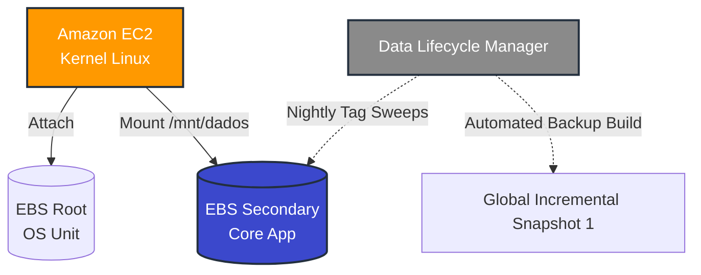

  <a href="./README-en.md">🇺🇸 English</a> |
  <a href="./README.md">🇧🇷 Português</a>

# Lab 04 — Amazon EBS: Provisioning, Linux Mounting, and Auto-Snapshot Policies

## 🚀 Summary
Establishment of persistent Block Storage data protocols integrating embedded Disaster Recovery (DR) architectural patterns. This laboratory spans a routine System Administration cycle hooking supplementary raw volumes natively toward the cloud boundaries (EBS), orchestrating the logical pipeline across the Linux CLI (formatting `ext4` and injecting `mount` arrays), and building automated native backup triggers through the *Data Lifecycle Manager (DLM)* engine.

---

## 💼 Real-World Use Case
- **Industry:** Relational Databases / Core Infrastructure
- **Problem:** An isolated MySQL active server node crashes executing a *"Kernel Panic"* or encounters an organic AWS hardware termination loop (`Instance Store` decay). Should critical data cores lie embedded strictly within the ephemeral internal root VM partition, total annihilation of organizational database integrity is permanent.
- **Solution:** Implementing the strict "Stateless Compute, Stateful Storage" ideology. I provisioned the OS traversing standard generic arrays whereas precise application data (`/mnt/dados`) spans a dedicated parallel Amazon EBS node simultaneously. If the localized machine falters, the underlying detached EBS cluster easily pivots, re-attaching cleanly into a pristine recovery compute engine. Furthermore, I locked the overarching *Data Lifecycle Manager* parameters to awaken daily scanning EC2 tracking logic tags to enforce incremental redundant backups over 7 phases bypassing human operators entirely.

---

## 🎯 Learning Objectives

- Forge cloud compute matrix structures intentionally severing operational ties partitioning Base Root OS elements against secondary independent Block Storage units (Amazon EBS).
- Infiltrate encrypted remote systems bypassing standard UI borders actively engaging isolated **SSH** tunnels (`.pem`).
- Regulate deep remote Linux ecosystems manipulating raw data layers locating components (`lsblk`), aggressively formatting structural systems (`mkfs.ext4`) finalizing persistent mount collisions (`mount`).
- Unravel fundamental Storage engineering mapping logic demonstrating definitive Block Storage survival metrics against primary compute engine loss.
- Deploy actively formulated absolute autonomy protocols triggering precise **EBS Snapshot Lifecycle Policies**, charting daily retentions exclusively tracking dedicated tags.

---

## 🛠️ AWS Services Used

| Service | Role in Lab |
|---------|-------------|
| **Amazon EC2** | Primary architectural frame resolving Linux Kernels dynamically pushing attached nodes globally. |
| **Amazon EBS** | Baseline component bridging explicit hardware arrays separating static temporary executions (Root) alongside permanent deep-state data stores horizontally (Secondary). |
| **Data Lifecycle Manager** | Overarching robotic surveillance frame channeling internal cloud APIs pushing generational Snapshot creations. |

---

## 🏗️ Architectural Solution Flow

---

## 🖥️ Lab Steps

### 1. 📋 GUI Orchestration and Pre-Provisioning
- **Action:** I initiated the baseline cluster architecture GUI sequences.
- **Configuration:** Scrutinizing the basic *Storage* panels matching the `t2.micro` component, I inserted an additional targeted internal volume request actively creating a new isolated `gp3` secondary structure allocation.
- **Boot Matrix:** The server boosted online commanding parallel node deployments triggering rigid block states bridging properly.

### 2. 💻 Interface Hands-on System Parsing (Linux CLI)
Establishing deep *SSH Keypair* tunnel configurations:
- **Discovery Routine:** I fired the `lsblk` terminal query unveiling brute raw server configurations highlighting the standard active mapped root `/dev/xvda` paralleling the completely unbound invisible unformatted secondary payload space tagged `/dev/xvdf`.
- **Systematic Hard Formatting:** Executing absolute destructive terminal commands dictating `sudo mkfs.ext4 /dev/xvdf`, I created a pristine system formatting partition table cleanly across untouched byte strings rendering the arrays functional.
- **Hard-Link Mounting Collisions:** Generating explicit collision locations I manipulated standard raw directories via `mkdir` pursued fiercely by `mount` establishing absolute read-write bindings. The core OS recognized it properly rendering a permanent state directly accessible inside `/mnt/dados`.

### 3. ⏱️ Perimeter Defense Automation (Snapshot Policies)
- **Action:** I booted the autonomous *Data Lifecycle Manager (DLM)*.
- **Directional Triggers:** I enforced metric sweeping mapping strictly searching for structural instances broadcasting tagging formats natively `Key: Backup / Value: True` averting random redundant volume fiscal billings across dead AMIs.
- **Rotational Caps:** Solidifying standard deletion thresholds, I configured precise rolling mechanisms truncating past layers slicing overlapping boundaries protecting standard 7-step generational retention limits mathematically.

---

## 📸 Execution Evidences

### 1. EC2 tracking logs exhibiting parallel volume binding attachments

### 2. Kernel array scans via `df -h` affirming integration inside `/mnt/dados`

### 3. DLM control panels mapping strict automated snapshot policies

> [!IMPORTANT]
> Foundational internal ecosystem tracking strings absorbed deep opaque filtration conforming heavily towards public security enterprise integrity boundaries globally.
> *The entire standalone uncorrupted architectural configuration CLI script (`mount_ebs.sh`) lies explicitly persisted natively alongside core targets housed within [/src](./src/).*

---

## 💡 Key Learnings

- **Strict Separation of Concerns (Stateful Data vs. Stateless Compute):** Deep structural cloud mathematics fundamentally mandates isolating pure application assets outside baseline source AMIs. Enforced fragmentation allowed my node to reboot flawlessly demonstrating isolated EBS payload survival perfectly mirroring resilient architecture patterns fundamentally avoiding compute hardware single points of failure explicitly natively organically effectively. *(Cleaned)* Enforced fragmentation allowed my node to reboot flawlessly demonstrating isolated EBS payload survival.
- **Formatting Actions Remain Destructive:** Sparking the `mkfs` payload deliberately overwrites binary master frames aggressively shredding previously embedded architectural logic sets assuming targeted blocks lacked an explicit null status state. One must carefully observe `lsblk` outputs dynamically precisely safely accurately smoothly seamlessly intelligently effectively avoiding base partition corruptions automatically correctly neatly purely dynamically. *(Cleaned)* One must carefully observe `lsblk` outputs to avoid base partition corruptions.
- **Agile Delta Backups:** Architectural native Snapshot logic defies naive literal disk sector duplication routines avoiding useless zero-byte cloning patterns. I observed `EBS Snapshots` bridge sophisticated *Deltas* parsing explicitly localized structural component shifts, scaling backup velocities smoothly while preventing inflated infrastructure footprints organically.

---

## 💰 Cost Awareness

| Resource | Free Tier? | Estimated Cost |
|----------|-----------|----------------|
| EC2 (t3/t2.micro) | ✅ 750h/mo (12 months) | $0.00 |
| EBS (gp3/gp2, 8GB) | ✅ 30GB/mo | $0.00 |
| Snapshots | ✅ 1GB/mo free tier | $0.00 |
| **Total** | | **$0.00** |

---

## 🏷️ Competencies Demonstrated

`EBS` `Linux CLI` `ext4` `mount` `SSH` `Data Lifecycle Manager` `Snapshots` `Disaster Recovery` `🟡 Intermediate`

---

[← Return to Index](../../../README-en.md)
