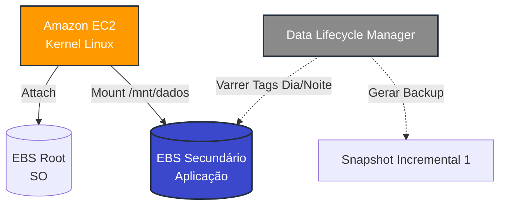
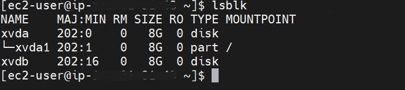
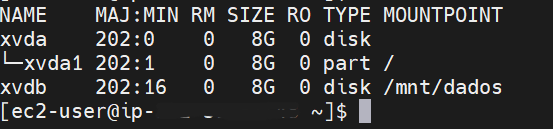
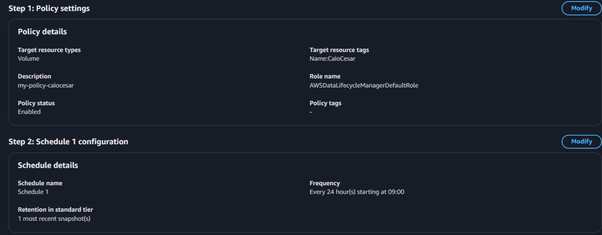

  <a href="./README-en.md">🇺🇸 English</a> |
  <a href="./README.md">🇧🇷 Português</a>

# Lab 04 — Amazon EBS: Provisionamento, Montagem Linux e Políticas de Auto-Snapshot

## 🚀 Resumo
Estabelecimento de persistência de dados em bloco (Block Storage) com arquitetura de recuperação de desastres (DR) integrada. O laboratório aborda a rotina de System Administration acoplando volumes secundários à nuvem (EBS), estruturando o mapeamento lógico via CLI Linux (formatação `ext4` + `mount`), e fechando o ciclo de governança construindo políticas robóticas de backup nativas através do *Data Lifecycle Manager (DLM)*.

---

## 💼 Caso de Uso Real
- **Indústria:** Bancos de Dados / Infraestrutura Core
- **Problema:** Um servidor Linux rodando um banco MySQL sofre um *"Kernel Panic"* irrecuperável ou a própria AWS finaliza a VM física da frota (`Instance Store`). Se os dados do banco estiverem armazenados na partição raiz efêmera, a empresa perdeu o banco inteiro permanentemente. 
- **Solução:** Padrão "Stateless Compute, Stateful Storage". Provisionei o S.O. em um disco volátil/padrão, enquanto a base de dados (`/mnt/dados`) recebe um disco Amazon EBS dedicado em paralelo. Se a máquina pifar, o EBS é desanexado e espetado em uma máquina nova sadia instantaneamente. O Motor *Data Lifecycle Manager* sela o risco cronometrado: ele acorda de madrugada, varre a nuvem em busca de Tags específicas e "fotografa" (Snapshot) o estado garantindo cópias incrementais contínuas por 7 dias sem minha intervenção.

---

## 🎯 Objetivos de Aprendizado

- Instanciar infraestrutura de computação separando ativamente os laços de Arquivos de SO vs. Block Storage Secundário (Amazon EBS).
- Acessar servidores fechados via canais **SSH**, operando com criptografia assimétrica de chaves (`.pem`).
- Administrar ambientes Linux remotamente: Identificação (`lsblk`), Formatação de sistemas de arquivo (`mkfs.ext4`) e Criação de pontos de montagem (`mount`).
- Compreender fundações de Storage Nuvem demonstrando a sobrevivência do Block Storage frente à aniquilação total da instância primária.
- Fabricar de forma assertiva uma política autônoma **EBS Snapshot Lifecycle Policy**, gerindo janelas de backup diárias.

---

## 🛠️ Serviços AWS Utilizados

| Serviço | Papel no Lab |
|---------|-------------|
| **Amazon EC2** | Recipiente computacional rodando Kernel Linux demandando armazenamento em bloco anexado por rede paralela. |
| **Amazon EBS** | Provisionamento do virtualizador magnético particionando persistência temporal (Raiz) e infinita (Unidade Secundária). |
| **Data Lifecycle Manager** | Orquestrador silencioso manipulando APIs de backup forçando gatilhos geracionais de Snapshots. |

---

## 🏗️ Arquitetura da Solução

---

## 🖥️ Etapas do Laboratório

### 1. 📋 Provisão Frontal (GUI EC2)
- **Ação:** Arquitetei o Cluster central no painel console.
- **Configuração:** Descendo na seção *Storage* no momento da emissão da instância `t2/t3.micro`, inseri um comando ativando um *New Volume* explícito requerendo malha `gp3`.
- **Booting:** O servidor ativou, tracionando o disco automaticamente anexado na rede entrando no estado `In-use`.

### 2. 💻 Interface Homem-Máquina (CLI Linux)
Acessei via *SSH Keypair*:
- **A descoberta:** Lancei a query isolada `lsblk`, o kernel revelou o volume virgem acoplado que respondia de forma nativa por `/dev/xvdf`.
- **A Formatação:** Escrevi no bloco utilizando o comando terminal `sudo mkfs.ext4 /dev/xvdf`. Uma tabela sólida de partição `ext4` foi lapidada habilitando infraestrutura computacional subjacente leitura e escrita.
- **O Acoplamento:** Emiti um ponto de colisão seguro criando a pasta raiz via `mkdir` seguido ativamente pelo comando `mount`. O cluster lógico converteu-se no diretório permanente blindado em `/mnt/dados`.

### 3. ⏱️ Automação Perimetral (Snapshot Policies)
Engessando o sistema para resistir a ataques lógicos nativos.
- **Ação:** Acessei o *Data Lifecycle Manager (DLM)*.
- **Condições Direcionais:** Defini métrica integral de backup ativada mirando exclusivamente volumes injetados utilizando a lógica Tag corporativa `Key: Backup / Value: True`.
- **Retenção Cruzada:** Fixei a métrica de rotatividade expurgando cópias fantasmas apagando volumes antigos ao excederem 7 cópias totais.

---

## 📸 Evidências de Execução

### 1. Traçado dos blocos EC2 revelando acoplamentos do Volume paralelo atrelado

### 2. Varredura do Kernel via `df -h` atestando montagem em `/mnt/dados`

### 3. Interface DLM traçando políticas diárias de backup automático

> [!IMPORTANT]
> IDs fundamentais operantes sofreram tratamento opaco focado exclusivamente em manobrabilidades de segurança corporativa do repositório público.
> *O código de automação CLI integral (`mount_ebs.sh`) persiste para avaliação em [/src](./src/).*

---

## 💡 Principais Aprendizados

- **Stateful Data vs. Stateless Compute:** A matemática da Nuvem proíbe dados estocados irresponsavelmente no mesmo chassi da AMI raiz originadora do SO. Eu comprovei que separar os discos garante que a configuração levante instantaneamente mantendo os dados intactos perante a morte orgânica do chassi instanciador principal.
- **Formatação Nível TTY:** Disparar `mkfs` reescreve chaves binárias primárias destrutivamente. Deve-se ter cuidado integral via comando `lsblk` para não destruir partições erradas sobrepondo infraestruturas do boot (C:).
- **Snapshots Incrementais:** A Nuvem não copia HDs cegamente repetindo zero a zero de espaço vazio. Validei que *EBS Snapshots* copiam ativamente *Deltas* (matemática modificadora das mudanças incrementais do disco), economizando faturas vertiginosamente.

---

## 💰 Consciência de Custos

| Recurso | Free Tier? | Custo Estimado |
|---------|-----------|----------------|
| EC2 (t3/t2.micro) | ✅ 750h/mês (12 meses) | $0,00 |
| EBS (gp3/gp2, 8GB) | ✅ 30GB/mês | $0,00 |
| Snapshots | ✅ 1GB/mês gratuito | $0,00 |
| **Total** | | **$0,00** |

---

## 🏷️ Competências Demonstradas

`EBS` `Linux CLI` `ext4` `mount` `SSH` `Data Lifecycle Manager` `Snapshots` `Disaster Recovery` `🟡 Intermediário`

---

[← Voltar ao índice](../../../README.md)
