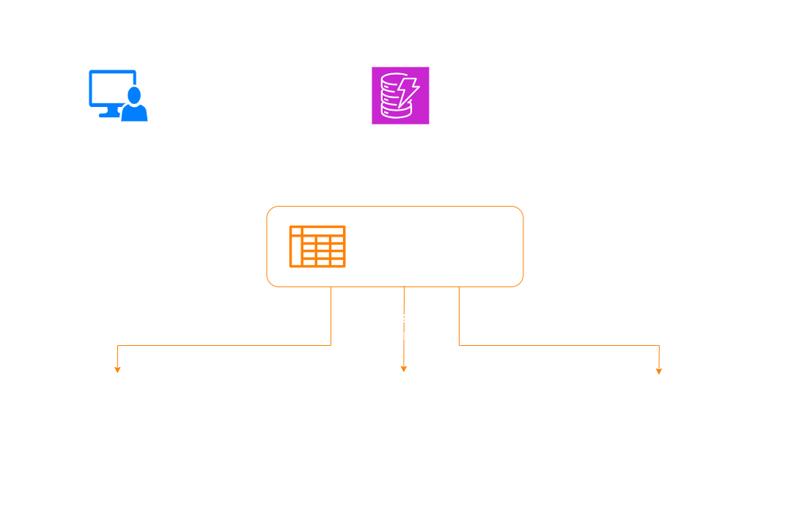
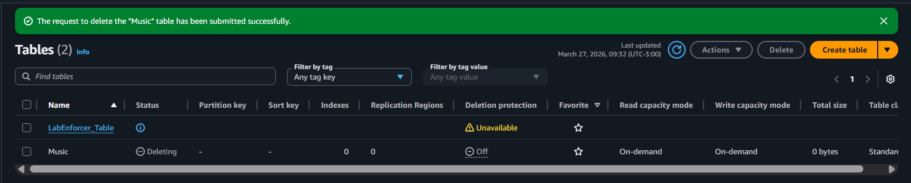
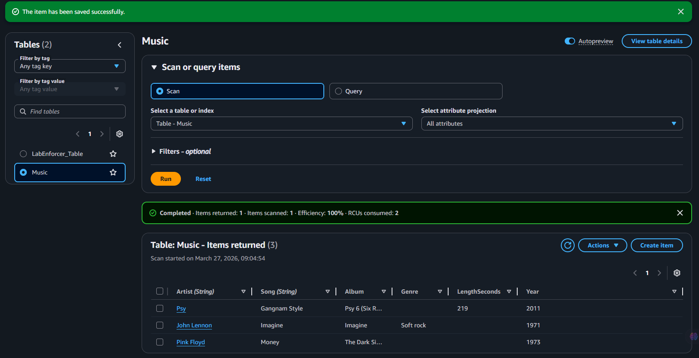
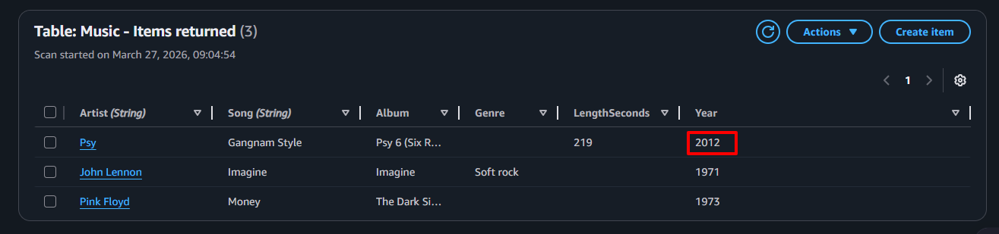
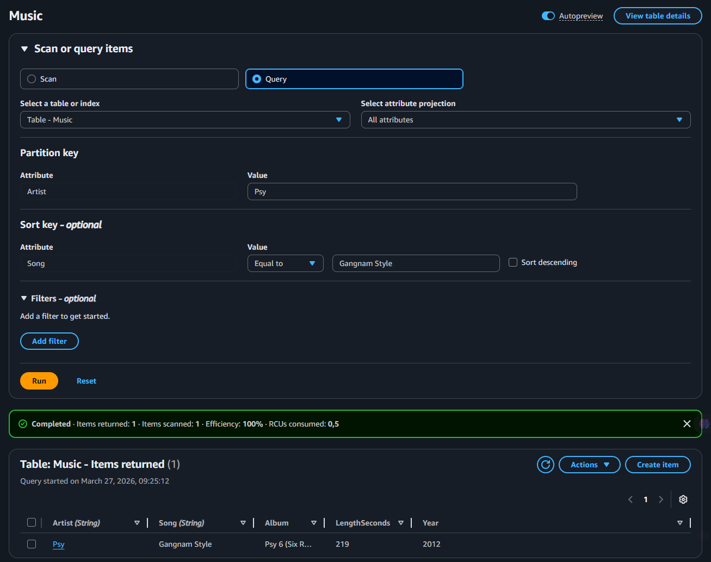
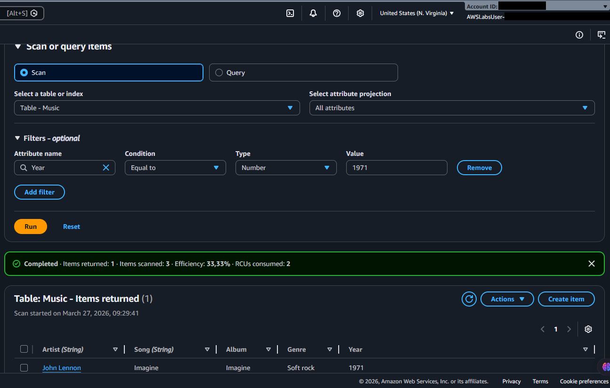

  <a href="./README-en.md">🇺🇸 English</a> |
  <a href="./README.md">🇧🇷 Português</a>

# Lab 01 — Introduction to Amazon DynamoDB: NoSQL Modeling and Key Structure

## 🚀 Summary
Deployment of high-performance non-relational database ecosystems (NoSQL). This laboratory covers architectural modeling driven by *Composite Primary Keys* (Partition + Sort Keys), unifies schema-less attribute insertion paradigms, and directly scrutinizes computational efficiency by contrasting extraction methodologies between native `Query` versus overarching `Scan` patterns.

---

## 💼 Real-World Use Case
- **Industry:** Music Streaming / SaaS Tech
- **Problem:** An emerging streaming application uses classical relational models (SQL) indexing tens of millions of distinct songs heard daily. Amidst peak traffic, millions of inserts throttle database endpoints demanding rigid structural table columns (fixed schema), culminating in package loss and client timeouts globally.
- **Solution:** Enacting a massive switch targeting **Amazon DynamoDB**. By properly orchestrating mathematical Hash limits formatting exact Primary Keys (`Artist` + `Song`), I partitioned the physical servers to achieve parallel low-millisecond latencies. Because it is *schema-less*, I appended novel music attributes (`Features`, `Genre`, `BPM`) completely organically. Through strict hardware logic (`Query`), I eradicated chaotic, expensive full-table I/O loops (`Scan`).

---

## 🎯 Learning Objectives

- Forge pure *Serverless* parameters manifesting NoSQL table configurations without underlying operational hardware burdens.
- Comprehend fragmentation architectures steering *Partition Key* arrays harmoniously functioning merged into auxiliary *Sort Key* metrics.
- Command active API bridges driving bare JSON payload formats, navigating and embracing heterogeneous independent fields seamlessly.
- Discern severe FinOps disaster pathways by measuring structural **Scan** sweeps against the explicitly indexed paths traversing **Query** operations.

---

## 🛠️ AWS Services Used

| Service | Task Role |
|---------|-----------|
| **Amazon DynamoDB** | Seamless Serverless NoSQL Database commanding single-digit millisecond latencies. |

---

## 🏗️ Solution Architecture

  

---

## 🖥️ Lab Steps

### 1. 📋 Foundational Provisioning (NoSQL Table Initialization)
- **Action:** I generated the baseline primary table.
- **Parametric Setup:** Output identity strictly defined as `Music`. I bound the absolute Core Node path (*Hash Key*) into the `Artist` string. I embedded the secondary tier classification string (*Range Key*) targeting `Song`.
- **Architectural Anchor:** Fused jointly, these mathematical parameters shaped a distinct unique identification fingerprint inherently rejecting duplicate overrides.

### 2. 🗄️ Asynchronous Micro-Document Injections (Put Items)
Affirming innate elastic nature structures, I injected varied parameters freely:
- **Pink Floyd / Money:** Introducing standard base logic elements pushing `Album` and generic `Year`.
- **John Lennon / Imagine:** Incorporating purely organic disparate fields (`Genre`) entirely bypassing the original document architecture.
- **Psy / Gangnam Style:** Launching advanced distinct quantitative matrices embedding numeric logic (`Duration in seconds`).
- **Outcome Analysis:** The structural flow functions absent native "ALTER TABLE" locks. Individual records function effectively portraying identical isolated JSON payload packets.

### 3. 🔍 Compute Load Auditing (Query vs Scan)
Physical validation outlining explicit FinOps boundaries dynamically:
- **Query (Direct Surgical Isolation):** I issued commands leveraging explicit Partitioning and auxiliary Sort Keys. I proved that sub-routing systems dive exclusively toward specific isolated rack metrics instantaneously.
- **Scan (Brute Global Traversal):** I enacted raw full table sweep searches demanding metric matches mapping merely (`Year: 1973`). Lacking explicit indexed target coordinates, I proved the systems forcibly churn across the massive active payload arrays processing all lines expensively.

---

## 📸 Execution Evidences

### 1. Precise mapping panel allocating composite architectures mapping Hash boundaries

### 2. Tabular inspection uncovering active Schema-less parameter fields

### 3. Seamless hot-state structural node editing evading encompassing row locking barriers

### 4. Clinical mathematical extraction sequence (Query)

### 5. Analytical parameter mapping highlighting hyper-inefficient table arrays actively processing Scan

> [!IMPORTANT]
> Within mature architectures, careless `Scan` behaviors functionally drain massive RCU thresholds resulting in crippling rate limits.

---

## 💡 Key Learnings

- **NoSQL Enforces Access Pattern Designing:** Standard application engineering rejects heavy querying mechanisms mimicking standard relational SQL (`JOINs`). I learned that I must pre-map the structure assigning `Partition+Sort Key` clusters aligned exactly against pure operational data future calls exclusively.
- **Serverless Paradigm Reality:** Spinning tables renders instantaneous network endpoints ready spanning milliseconds, avoiding classical manual RDS Engine booting loops or native patching oversight entirely.
- **Organic Unstructured Flexibility:** Modern logic fields (e.g., embedding explicit *Thumbnail URL* data keys traversing random payload records) fundamentally avoid restructuring dead data blocks, preserving array integrity organically.

---

## 💰 Cost Awareness

| Resource | Free Tier? | Estimated Cost |
|----------|-----------|----------------|
| DynamoDB (On-Demand) | ✅ 25 WCUs + 25 RCUs completely mitigated consistently | $0.00 |
| **Total** | | **$0.00** |

---

## 🏷️ Competencies Demonstrated

`DynamoDB` `NoSQL` `Partition Key` `Sort Key` `Query` `Scan` `Schema-less` `Serverless Storage` `🟢 Fundamental`

---

## 📜 Certification Alignment

This setup spans vital architectural domains covering:
- **CLF-C02:** Domain 3 — Cloud Technology and Services
- **SAA-C03:** Domain 1 — Secure Design Architectures
- **DVA-C02:** Domain 1 — Development with AWS Services

---

[← Return to Index](../../../README-en.md)
