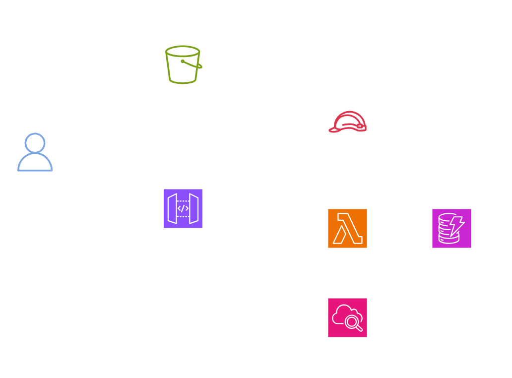
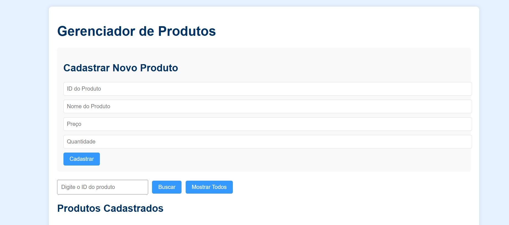

  <a href="./README-en.md">🇺🇸 English</a> |
  <a href="./README.md">🇧🇷 Português</a>

# Lab 02 — CRUD Serverless com DynamoDB: API Gateway e Lambda (Boto3)

## 🚀 Resumo
Implementação de plataforma Serverless (Full-Stack) voltada a transações de banco de dados nativas. Este laboratório descreve a construção de um motor de operações CRUD (Create, Read, Update, Delete) utilizando microserviços em **AWS Lambda (Python/Boto3)** atuando contra o **Amazon DynamoDB**, exposto ao cliente final através do roteamento RESTful do **API Gateway** sob interface web estática distribuída no **Amazon S3**.

---

## 💼 Caso de Uso Real
- **Indústria:** E-commerce / Sistemas Internos Corporativos (HR Tech)
- **Problema:** O departamento de RH de uma corporação utiliza uma aplicação monolítica para gerenciar o diretório global de funcionários. O banco de dados MySQL instalado numa máquina (EC2) dedicada trava sob alta inserção simultânea e demanda patches constantes, resultando em quedas (*Downtime*). Além disso, a aplicação gera alto custo fixo mesmo aos finais de semana quando ninguém a usa.
- **Solução:** Refatoração para uma Arquitetura Orientada a Eventos (Serverless). Hospedei a interface gráfica como um pacote estático (`.html/.js`) dentro do Amazon S3, mitigando riscos de invasão do servidor. O tráfego do front-end bate unicamente via requisições HTTP na fronteira do API Gateway. O Gateway dispara funções Lambda escritas em Python que aplicam as regras de negócio lendo e escrevendo dados no banco Amazon DynamoDB. Consegui infraestrutura flutuando conforme a demanda e zero custo fixo.

---

## 🎯 Objetivos de Aprendizado

- Consolidar partições em tabelas **Amazon DynamoDB** limitando gargalos transacionais configurando matrizes atreladas a uma `Partition Key`.
- Desenvolver código serverless autônomo em **AWS Lambda** encapsulando funções da biblioteca `Boto3` (Python) para traduzir métodos REST nos protocolos de API do banco (`put_item`, `scan`, `delete_item`).
- Modelar roteadores HTTP de fronteira através da **API Gateway**, gerenciando permissões de entrada e atrelando métodos genéricos `ANY` diretamente para a execução da Lambda.
- Habilitar governança estruturada aplicando liberações de domínios restritos por meio de regras de **CORS** para ambientes em **Amazon S3 Static Website**.

---

## 🛠️ Serviços AWS Utilizados

| Serviço | Papel no Lab |
|---------|-------------|
| **Amazon DynamoDB** | Banco de dados NoSQL matriz tolerante a falhas. |
| **AWS Lambda** | Executor temporal lógico que converte os verbos HTTP em códigos nativos de manipulação do BD. |
| **Amazon API Gateway** | Fachada digital pública responsável por organizar as rotas e injetar credenciais na Lambda. |
| **Amazon S3** | Provisionador barato e infinito de artefatos visuais HTML/CSS/JS mantendo a interface estável. |

---

## 🏗️ Arquitetura da Solução

  

---

## 🖥️ Etapas do Laboratório

### 1. 📋 Provisão do Banco (DynamoDB Foundation)
- **Ação:** Formação arquitetônica da coleção de dados (*Table*).
- **Estruturação:** Estabeleci a tabela para faturamento sob-demanda (`On-Demand`) e defini a Chave de Partição (*Partition Key*) utilizando apenas a string `id`.

### 2. 🧠 Lógica de Computação (Lambda & IAM)
- **Ação:** Redação lógica da ponte do Back-end em Python 3.
- **Bloqueios e Acessos:** O ambiente de computação nasce isolado. Gerei uma Política (IAM Policy) atrelada diretamente na Função, desenhando a permissão de `dynamodb:*` restrita puramente ao ARN da minha tabela final, evitando vazamentos e excesso de privilégios.
- **O Código:** Criei o Handler param parametrizar a variável `event['httpMethod']`. Caso o cliente mande `POST`, o Boto3 aciona a requisição interna `put_item()`; caso seja `GET`, o Boto3 atua rodando `scan()`.
*(O script consolidado de roteamento está disponível na pasta `/src/` do laboratório)*.

### 3. 🌐 Exposição Sistêmica (API Gateway)
- **Ação:** Convergência estrutural das invocações abertas em limites gerenciados REST.
- **Configuração:** Montei o endpoint mapeando um proxy integrado que ouve e submete as cargas HTTP puras (*Payload*) aos processadores Lambda (`ANY`).
- **Segurança Lateral (CORS):** Ativei explicitamente regras limitando falhas de Cross-Origin Resource Sharing (`Access-Control-Allow-Origin`), permitindo chamadas do navegador (`GET/POST/OPTIONS`).

### 4. 💻 Distribuição Autônoma (S3 Frontend)
- **Ação:** Transação visual isolada atestando o funcionamento do Full-stack.
- **Configuração:** Submeti o pacote de código Front-end incluindo o `index.html`. Copiei do Gateway a recém criada *URL Invoke* e instanciei a mesma no código JavaScript local. Testei o processo em que simples cliques no botão UI geram chamadas `fetch()` conectadas à AWS.

---

## 📸 Evidências de Execução

### 1. GUI operacional demonstrando inserção e deleção de dados via API

> [!IMPORTANT]
> URLs e IDs mapeadores cruciais das APIs desta documentação foram ocultados por segurança.

---

## 💡 Principais Aprendizados

- **Corte Abrupto de Custos (Serverless Paradigm):** Entendi a força de uma arquitetura estritamente *Stateless*. Como o S3 cuida do Front, o Gateway cuida da Porta, a Lambda cuida do Processamento e o Dynamo do Armazenamento, minhas despesas de laboratório foram amarradas a chamadas ativas de código. 
- **Segurança IAM Estrita:** Descobri que sem criar e anexar cirurgicamente a Role IAM na Lambda apontando expressamente para a tabela final do DynamoDB, todas as leituras quebram no gateway (a AWS restringe pelo preceito nativo *Deny by Default*).
- **Esquemas NoSQL Fluídos:** Para expandir atributos como incluir a chave `[Departamento]` pela interface Web, verifiquei que simplesmente altero o modelo JSON no próprio payload disparado via *Browser*. O DynamoDB absorveu meus novos dados perfeitamente, sem requisitar ferramentas complexas comuns a bancos relacionais.

---

## 💰 Consciência de Custos

| Recurso | Free Tier? | Custo Estimado |
|---------|-----------|----------------|
| Lambda | ✅ 1 Milhão reqs/mês permanentes | $0,00 |
| API Gateway | ✅ 1 Milhão calls/mês (Primeiro Ano) | $0,00 |
| DynamoDB | ✅ 25 GB atrelados permanentes | $0,00 |
| S3 | ✅ 5GB transferências padrão | $0,00 |
| **Total** | | **$0,00** |

---

## 🏷️ Competências Demonstradas

`DynamoDB` `Lambda` `API Gateway` `Boto3` `Python` `S3 Static Website` `CORS` `REST API` `Serverless` `🟡 Intermediário`

---

[← Voltar ao índice](../../../README.md)
