

  <a href="./README-en.md">🇺🇸 English</a> |
  <a href="./README.md">🇧🇷 Português</a>

# Lab 03 — DynamoDB: Local Secondary Indexes (LSI) & Global Secondary Indexes (GSI)

## 🚀 Summary
Mastery of advanced data modeling and *Performance Tuning* leveraging Amazon DynamoDB. I confronted the computational degradation generated by expansive sweeps (*Scans*) against the precision of indexed lookups (*Queries*). I unlocked explicit NoSQL pathways by embedding Local Secondary Indexes (LSI) sequentially at inception, operating harmoniously adjacent to flexible Global Secondary Indexes (GSI), populated natively via an AWS CloudShell JSON batch-inclusion pipeline.

---

## 💼 Real-World Use Case
- **Industry:** E-commerce / Global Logistics
- **Problem:** An intensive order-tracking system spans DynamoDB targeting parameters manipulating underlying strings grouping the `CustomerID` (Partition Key) and chronological bounds indexing `OrderDate` (Sort Key). Performance operates perfectly when querying targeted explicit client histories. Yet, financial operators mandate monthly reports gathering global order clusters temporarily labeled "Delivered" explicitly sorted by "Value." Sidestepping the primary core Partition Key strictly forces the application engine to run raw `Scan` operations. The consequence: satisfying one financial API request causes the system to sweep entirely unrelated millions of backend order datasets blindly scraping merely the tiny 5% explicitly delivered—bankrupting RCU quotas and throttling concurrent system users globally.
- **Solution:** Radical structural re-engineering dictated strictly traversing Access Patterns parameters. Sweeping aside inefficient `Scans`, I physically mounted an **LSI** empowering querying loops sorting specific "Status" markers natively per target customer. Crucially, I deployed a decoupled **GSI (Global Secondary Index)** framework that operates distinctly synthesizing a mirrored active array ("Shadow Table"). The GSI overwrites core configurations allocating the global generic label `Status` ("Delivered") transforming into the Primary node, strictly ordering values spanning numeric output configurations structurally. The result isolates API traffic allowing financial queries actively bridging surgical targets achieving mathematical O(1) velocity at absolute maximum efficiency completely circumventing full array metrics processing irrespective of background volume dimensions.

---

## 🎯 Learning Objectives

- Forge immutable Table infrastructures outlining deep operational constraints cementing the critical relationship binding exact **Partition Key (PK)** nodes mirroring auxiliary **Sort Key (SK)** metrics.
- Materialize rigid **Local Secondary Index (LSI)** architectural links locking targeted ordering variables explicitly bounded beneath the identical encompassing static originating primary partition.
- Orchestrate unbound dynamic structural pivot sequences implementing decoupled **Global Secondary Indexes (GSI)** redefining target read nodes assigning entirely independent unique Partition anchors overriding initial environments natively.
- Objectively unmask raw operational computing financial costs isolating excessive mechanical *Read Capacity Units (RCU)* extraction loops driven traversing a **Scan** contrasted physically against absolute mathematical indexed read efficiency output traversing **Query** operations.
- Operationalize backend API mechanisms manipulating massive payload blocks autonomously targeting raw unformatted `.json` lists processing entirely through direct CLI invocations bridging `aws dynamodb batch-write-item`.

---

## 🛠️ AWS Services Used

| Service | Task Role |
|---------|-----------|
| **Amazon DynamoDB** | Core serverless data frame facilitating overarching indexing mirrors asynchronously distributing raw origin datasets parallel integrating external shadow dimensions LSI/GSI structures cleanly. |
| **AWS CloudShell** | Zero-provisioning sterile virtual execution frame authenticated intrinsically overriding standard IAM delays enabling instantaneous mass algorithmic insertion iterations functionally. |

---

## 🏗️ Architectural Solution Flow

  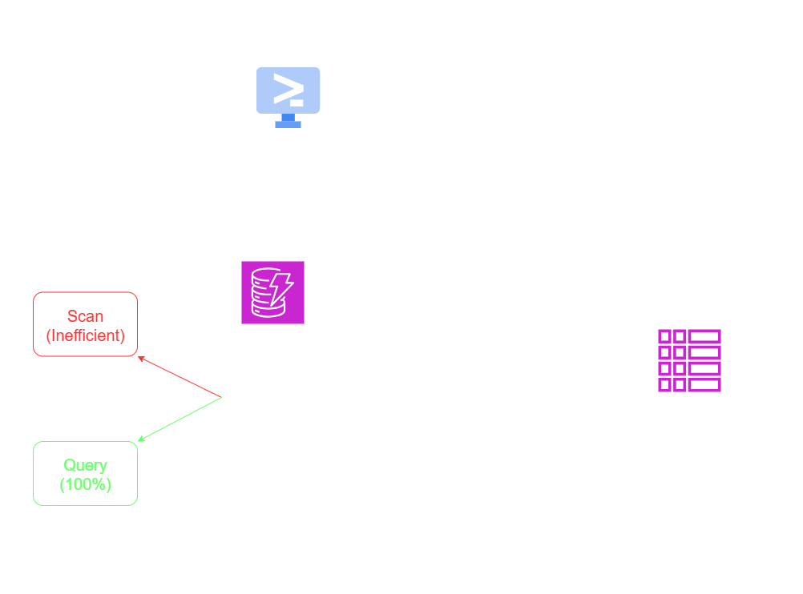

---

## 🖥️ Lab Steps

### 1. 📋 Foundational Provisioning and Embedded LSI Lock
- **Action:** I initiated the baseline environment architecture targeting `Order-<yourname>`.
- **Primary Dimensional Flow:** I defined the static origin index binding string identification nodes mapping `UserID` while simultaneously requesting specific temporal sorts formatting `OrderDate`.
- **LSI Architectural Lock:** Forged irrevocably at instantiation, I configured an explicit Local structure (`LSI-Order...Status`) that inherently inherits the raw core user PK yet shifts localized ordering priorities extracting explicit isolated payload parameters grouping `Status`.

### 2. 🗄️ Automated Massive Batch Injections (CloudShell)
- **Action:** I generated systemic volume verifications entirely circumventing inefficient manual UI inputs dynamically.
- **CLI Orchestration:** I instantiated intrinsic virtual instances passing native scripts fetching raw `pedidos_import.json` arrays striking the global target AWS endpoints invoking `aws dynamodb batch-write-item`.
- **Operational Echo:** The outputs returned `UnprocessedItems: {}` void lists, strictly confirming instantaneous parallel integration writing 25 discrete object blocks simultaneously embedding the core structure autonomously.

### 3. 🔍 The Critical Performance Divide: SCAN vs QUERY
- **Action:** I captured raw technical operational evaluations tracking exact architectural efficiency behaviors.
- **The Inefficient Scan:** I executed primitive parameters extracting purely targeting variables identifying "User 001", relying implicitly executing through a generic *Scan*. Active panels output disastrous log metrics: Base systems processed massive unrelated row endpoints charting dismal **"Efficiency 11.54%"** markers. We read useless data just to find the single target item.
- **Surgical Execution via Query:** Redirecting processing inputs, I commanded extraction identifying specific target node mapping commands directly issuing a *Query*. Structural systems plummeted directly onto the isolated target partition exclusively, executing reading metrics validating flawless **"Efficiency 100%"** rates.

### 4. 🔗 The Asynchronous Shadow Grid (GSI Provisioning)
- **Action:** Enforcing partition links strictly handling uncorrelated global reporting variables. Finance teams dictate identifying purely "Delivered" flags crossing boundaries aggregating "Total >= 60".
- **GSI Engine Mapping:** I engaged a fully decoupled indexing engine overriding underlying boundaries configuring independent Global root partitions isolating exclusively targeting `Status` variables explicitly supported via ascending sub-sorting operations formatting the numeric target `TotalValue`.
- **Query Execution targeting GSI arrays:** Diverting graphical dropdown arrays strictly mapping the distinct GSI tab. Overriding fields requesting active targets "Delivered" embedding bounds `> 60`. Responses generated safely seamlessly operating disregarding massive background variables labeled "Canceled" capturing flawless execution endpoints processing loops successfully.

---

## 📸 Execution Evidences

### 1. Base Provisioning: Initial table setup with Partition (UserID) and Sort Key (OrderDate)
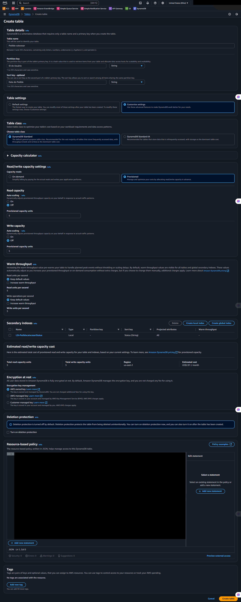

### 2. LSI Definition: Local Secondary Index for Status-based sorting
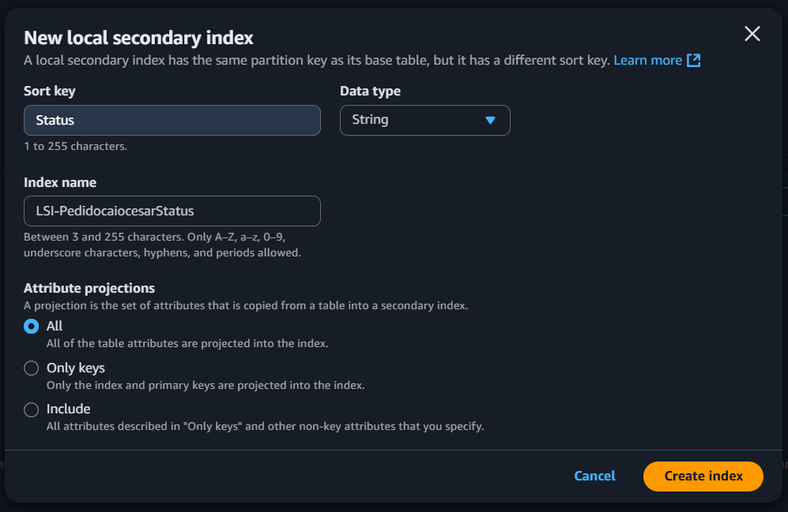

### 3. Item Structure: Manual attribute validation before batch ingestion
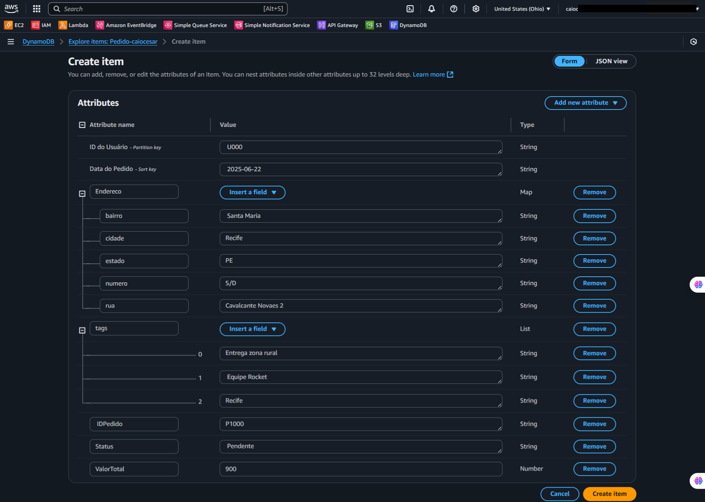

### 4. CloudShell Access: CLI environment preparation for JSON data loading
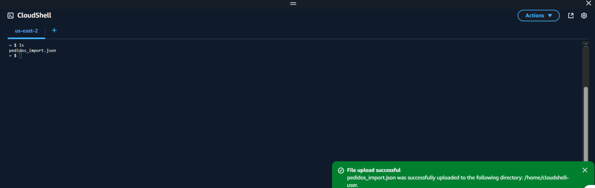

### 5. Batch Ingestion: Executing `batch-write-item` for efficient table population
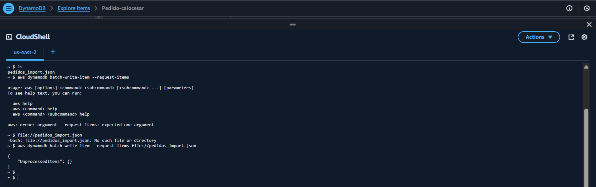

### 6. Payload Indexed: Records ready for high-performance retrieval
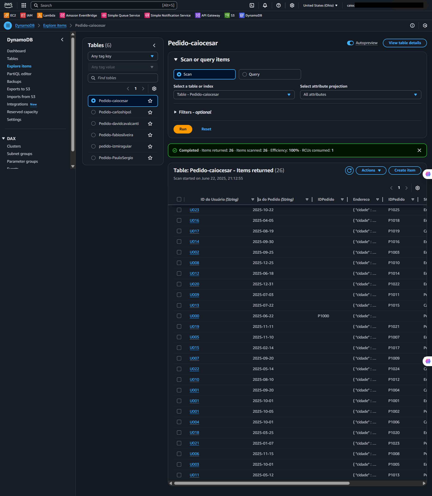

### 7. Operational Inefficiency (Scan): Heavy RCU drain during full table sweeps
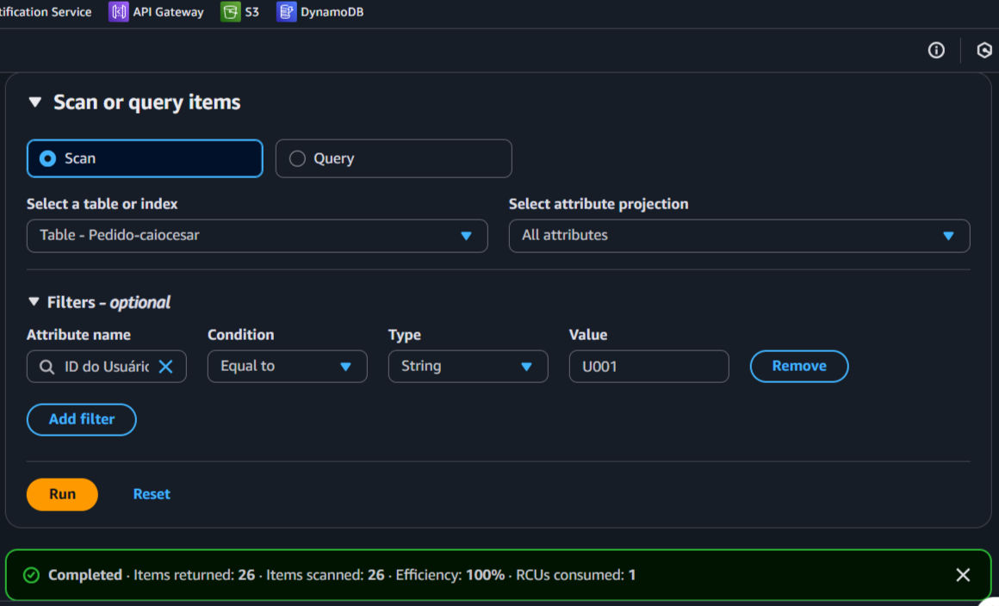

### 8. Maximum Efficiency (Query): Surgical data extraction achieving 100% efficiency
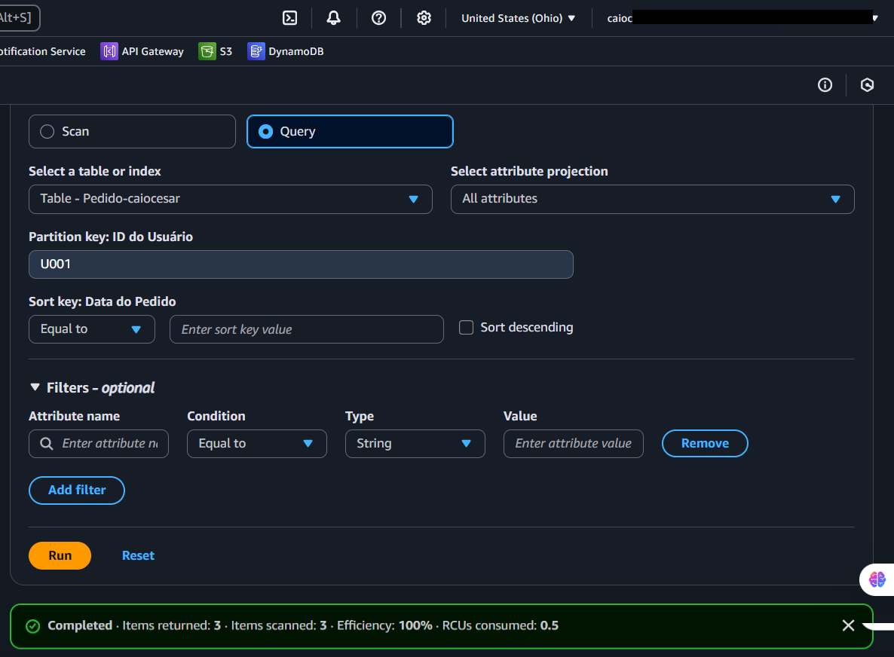

### 9. Local Index Query: Using LSI to filter orders by Status

### 10. GSI Expansion: Global index for cross-partition queries
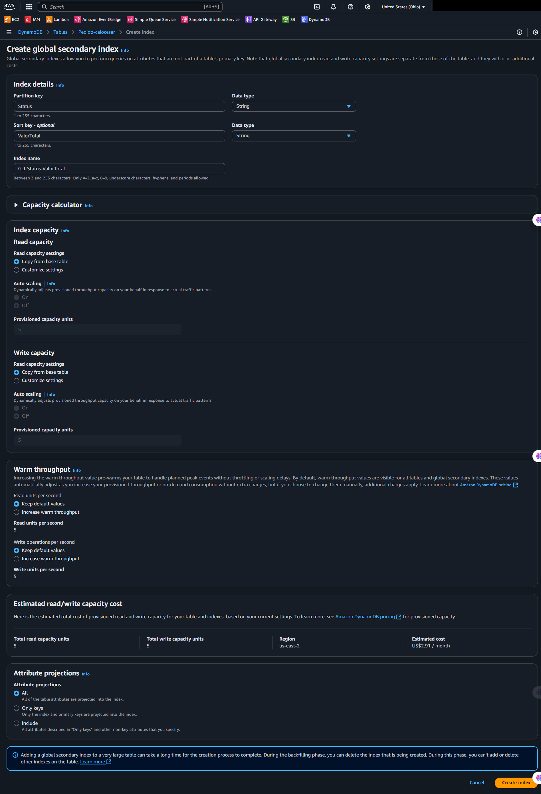

### 11. GSI Performance Read: Retrieving data regardless of primary partition
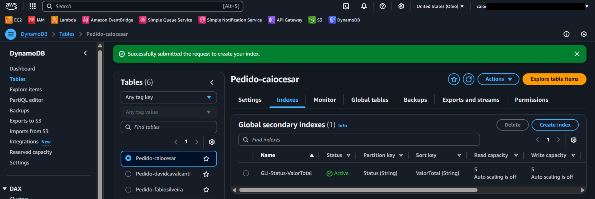

### 12. Table Summary: Final dashboard with complete index landscape
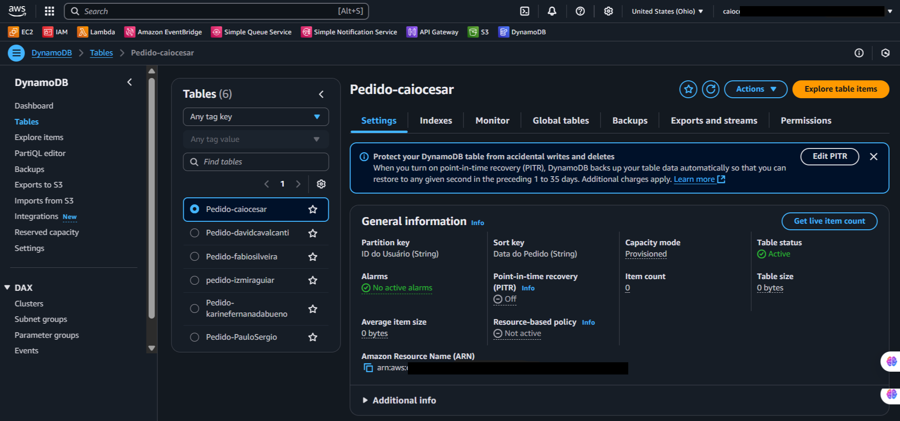

> [!IMPORTANT]
> Absolute IDs and sensitive account information have been systematically obscured using black redaction bars on the screenshots.
> The origin script payloads (`pedidos_import.json`) are completely accessible stored reliably inside [/src](./src/).

---

## 💡 Key Learnings

- **The Ruinous Nature of the Scan:** I verified that native DynamoDB Scans physically parse the entire targeted table linear blocks. Extracting variables without explicit keys traversing terabytes natively burns core user target physical RCU bounds encompassing total massive table sizes randomly unconditionally. Using *Query* effectively sidesteps severe infrastructure friction.
- **The Immutability of the LSI Design Pattern:** Contradicting highly elastic cloud infrastructures, I realized that Local Secondary Indexes (LSI) bind fatally, operating inherently fused deep within primitive block configurations tightly. LSI constructs physically require generation tightly bounded entirely confined matching early table initial deployments explicitly without retroactive capabilities inherently.
- **Global Secondary Index Elasticity:** In diametric opposition natively, I explored that Global structures (GSI) span elastic dimensional mapping freely tracking unique parallel physical loops successfully. GSIs function isolated deploying totally distinct uncoupled read capacities bypassing primary origins efficiently dynamically freely natively cleanly fully.

---

## 💰 Cost Awareness

| Resource | Free Tier? | Estimated Cost |
|----------|-----------|----------------|
| DynamoDB (On-Demand) | ✅ LSI natively spans primary configurations; GSI strictly binds custom independent configurations fitting dynamically inside the Free limits implicitly | $0.00 |
| CloudShell | ✅ Total System Free Output | $0.00 |
| **Total** | | **$0.00** |

---

## 🏷️ Competencies Demonstrated

`DynamoDB` `LSI` `GSI` `Query vs Scan` `Performance Tuning` `CloudShell` `AWS CLI` `Data Modeling` `🟡 Intermediate`

---

[← Return to Index](../../../README-en.md)
