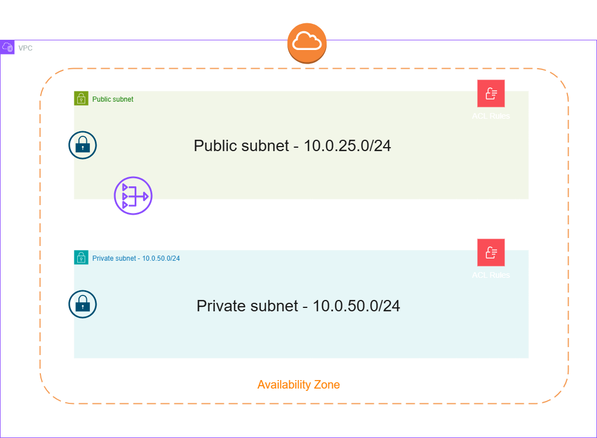
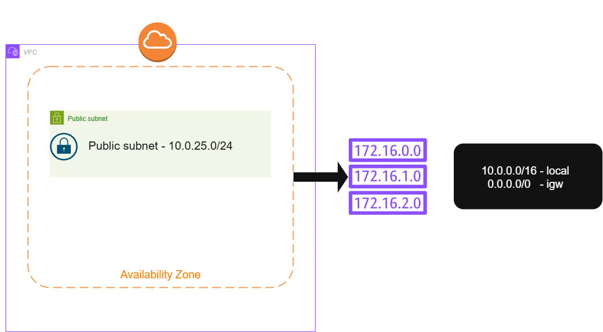
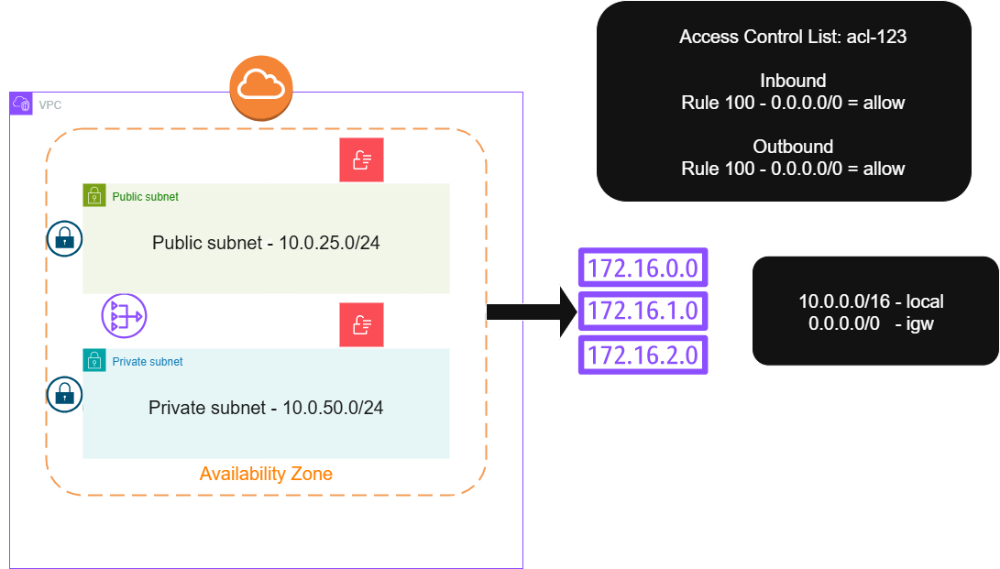
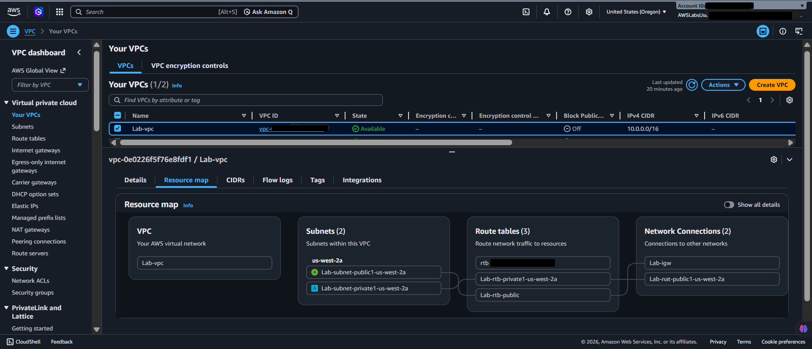
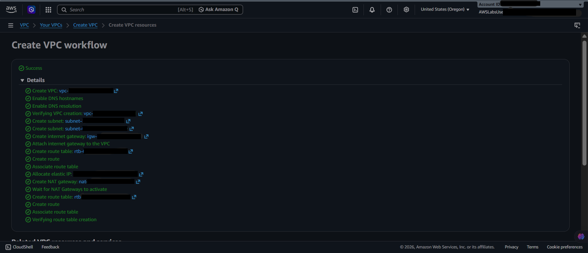
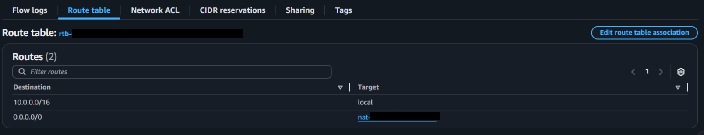
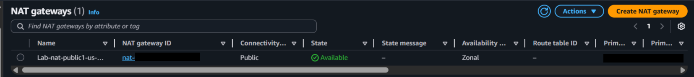
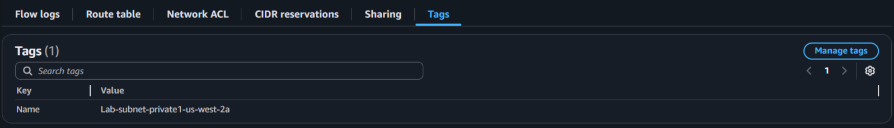

  <a href="./README-en.md">🇺🇸 English</a> |
  <a href="./README.md">🇧🇷 Português</a>

# Lab 01 — Introdução ao Amazon Virtual Private Cloud (VPC)

## 🚀 Resumo
Mensageria Assíncrona e Resiliência Distribuída: Neste laboratório, implementei os fundamentos da infraestrutura de nuvem: Redes Virtuais Privadas. Provisonei uma **Amazon VPC** isolada logicamente, segmentando o ambiente em Sub-redes Públicas (Web/Proxy) e Privadas (Bancos de Dados). Configurei camadas granulares de conectividade através de um **Internet Gateway (IGW)**, tabelas de roteamento (*Route Tables*) e um **NAT Gateway** dedicado para garantir acesso seguro e unidirecional à internet sem expor o backend interno.

---

## 💼 Caso de Uso Real
- **Indústria:** Setor Bancário / Saúde Digital (HealthTech)
- **Problema:** Um hospital implanta seu sistema de prontuários eletrônicos na AWS. Contudo, ao subirem os servidores web e de banco de dados na mesma rede pública padrão, cibercriminosos interceptam portas expostas e iniciam ataques de *Brute Force*, comprometendo instâncias vulneráveis.
- **Solução:** Reengenharia orientada por fragmentação de rede (*Network Segmentation*). Roteei o tráfego via uma Amazon VPC customizada. Empurrei os componentes críticos para dentro de *Sub-redes Privadas*, tornando a alocação de IPs públicos impossível. Como instâncias privadas precisam baixar pacotes da internet sem serem acessadas de fora, estruturei um *NAT Gateway* ancorado numa *Sub-rede Pública*. Essa infraestrutura consolida camadas de defesa protegendo os dados.

---

## 🎯 Objetivos de Aprendizado

- Instanciar a infraestrutura de redes configurando uma Amazon VPC isolada via modelo CIDR Base (Ex: `10.0.0.0/16`).
- Isolar a aplicação distribuindo componentes em sub-redes **Públicas** e **Privadas** estrategicamente.
- Decodificar e operar a entrada e saída atrelando o **Internet Gateway (IGW)**.
- Mapear caminhos direcionando solicitações através da bifurcação em **Tabelas de Roteamento (Route Tables)**.
- Habilitar conectividade reversa mascarando identidades privadas usando o tráfego de um **NAT Gateway**.
- Contrastar restrições transacionais pontuais cruzando perímetros por **Network ACLs** e **Security Groups**.

---

## 🛠️ Serviços AWS Utilizados

| Serviço              | Papel no Lab                                                                                    |
| -------------------- | ----------------------------------------------------------------------------------------------- |
| **Amazon VPC**       | A rede inteiramente customizável que emula um *Data Center* privativo.                          |
| **VPC Subnets**      | Matrizes segmentando blocos estruturados de IP por nível de acesso (Público/Privado).           |
| **Internet Gateway** | Ponte garantindo comunicações essenciais conectando a nuvem à grande rede pública.              |
| **NAT Gateway**      | Dispositivo que providencia exclusivamente saída de requisições originadas nas redes fechadas.  |
| **Route Tables**     | Roteadores virtuais que ditam o escoamento direcionando qual tráfego escapará por quais pontes. |

---

## 🏗️ Arquitetura da Solução

  

  

  

  

---

## 🖥️ Etapas do Laboratório

### 1. 📋 Lançamento Controlado via VPC Wizard
- **Ação:** Criação assistida da topologia base.
- **Configurações Vitais:**
  - Identificação (Tag): `Lab-vpc`
  - Bloco CIDR Mestre IPv4: `10.0.0.0/16`
  - Número de Zonas de Disponibilidade (AZs): `1`
  - Quantidade de *Subnets Públicas*: `1` (CIDR: `10.0.25.0/24`)
  - Quantidade de *Subnets Privadas*: `1` (CIDR: `10.0.50.0/24`)
- **Ação:** Provisionei a arquitetura de forma assistida para garantir a correta topologia. A AWS alocou o `Internet Gateway (IGW)` e injetou as instâncias de `NAT Gateway` em uma única operação, otimizando a configuração manual.

### 2. 🔍 Inspeção Arquitetural (Componentes Isolados)
- **Tabelas Críticas de Rotas (Route Tables):**
  - Chequei o ambiente logado e validei que a *Tabela Route Pública* aponta rigorosamente as saídas (`0.0.0.0/0`) batendo no destino `igw-*`.
  - Inspecionei a *Tabela Route Privada*, confirmando que os registros genéricos alteram a saída redirecionando pacotes cegamente para atravessar o dispositivo físico `nat-*`.
- **Muros de Fogo (Network ACLs):** Confirmei os bloqueios padronizados aplicados rigidamente nas subdivisões.

---

## 📸 Evidências de Execução

### 1. Topologia Lab-VPC: Trajeto consolidado alocando e estabilizando a topologia estruturada

### 2. CIDR Mestre: Espelhamento dinâmico visualizando as configurações do CIDR operante

### 3. Segmentação de Subnets: Listagem evidenciando a criação das Sub-redes Públicas e Privadas garantindo os perímetros

### 4. Tabelas de Roteamento: O mapeamento matemático isolando tráfegos com sucesso

### 5. NAT Gateway: Dispositivo criado com sucesso sob o domínio da Sub-rede Pública

### 6. Regional Matrix: Topologia em mapa comprovando a existência fluida das tabelas e blocos

> [!IMPORTANT]
> IDs das sub-redes e IPs sofreram omissão visual por diretrizes de segurança AWS.

---

## 💡 Principais Aprendizados

- **Estruturação de Roteamento:** Entendi que uma "Rede Pública" não é "Pública" só pelo nome; na AWS, a natureza de uma Sub-rede depende puramente da *Associação de Rota* (Route Table) enviando o tráfego `0.0.0.0/0` para um Internet Gateway (IGW).
- **Escudo NAT:** Confirmei na prática o design de redes fechadas: Meus *Bancos de Dados* privados conseguem atualizar softwares conectando-se à internet passando dentro do NAT Gateway, entretanto jamais podem ser encontrados ou atacados diretamente da internet por IPs externos.

---

## 💰 Consciência de Custos

| Recurso                   | Free Tier?                                                                                             | Custo Estimado |
| ------------------------- | ------------------------------------------------------------------------------------------------------ | -------------- |
| Amazon VPC Master         | ✅ VPCs em si e Route Tables padrão são isentas de custos                                               | $0,00/mês      |
| Internet Gateway          | ✅ Rotas passivas estáticas IGW são gratuitas pela AWS                                                  | $0,00/mês      |
| **NAT Gateway**           | ❌ Processadores físicos englobados faturam taxa global horária ($0,045/h fixos + $0,045/GB processado) | **~$1,08/Dia** |
| **Total Estimativo Fixo** |                                                                                                        | **$32,40/Mês** |

> [!CAUTION]  
> O **NAT Gateway** queima bilhetagem AWS incessantemente por hora, mesmo que você não esteja operando nada. Criei o hábito mecânico de excluí-los após cada laboratório de rede, junto aos Elastic IPs "órfãos" deixados pelo aparelho, pois não são cobertos pela camada gratuita estendida.

---

## 🏷️ Competências Demonstradas

`VPC` `Subnets` `NAT Gateway` `Internet Gateway` `Route Tables` `Multi-AZ` `Network ACLs` `Security Groups` `Network Segmentation` `🟢 Fundamental`

---

[← Voltar ao índice](../../../README.md)
