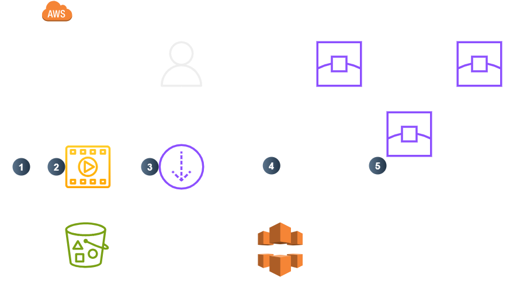
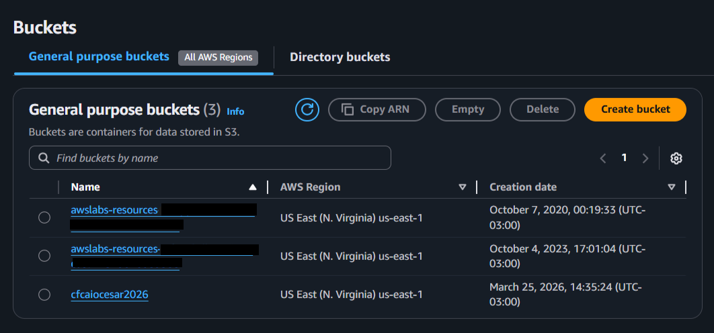
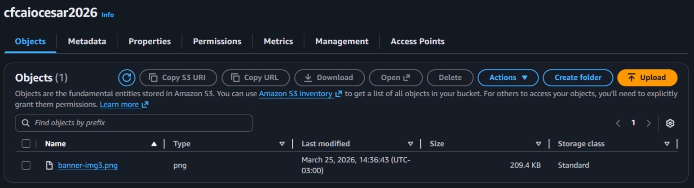
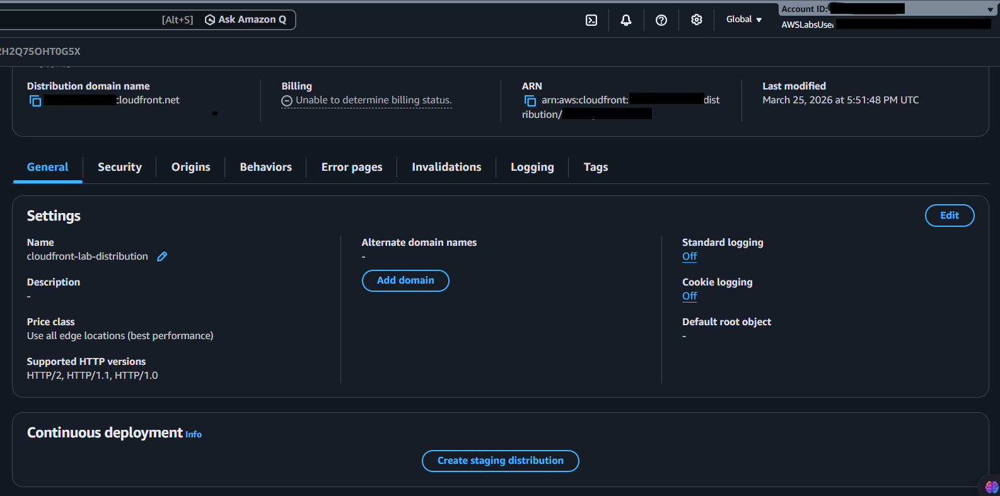

  <a href="./README-en.md">🇺🇸 English</a> |
  <a href="./README.md">🇧🇷 Português</a>

# Lab 02 — Introdução ao Amazon CloudFront

## 🚀 Resumo
Implementação de Redes de Distribuição de Conteúdo (CDN) utilizando o **Amazon CloudFront**. Este laboratório detalha a orquestração de *Edge Locations* (Locais de Borda) globais para fragmentar a latência de entrega, conectando instâncias baseadas em **Amazon S3**. Explorei a hospedagem estática otimizada de mídias globais construindo uma proteção unificada que bloqueia o acesso direto ao *Bucket S3* via controles nativos restritos (OAC).

---

## 💼 Caso de Uso Real
- **Indústria:** Portal de Notícias / E-commerce de Mídia
- **Problema:** Um e-commerce lança um evento contendo imagens promocionais pesadas (4K). Todo o conteúdo repousa em um único bucket S3 alocado em *Norte da Virgínia (us-east-1)*. Quando os clientes no Brasil, Japão ou Austrália acessam o site, o tráfego transoceânico atrasa o carregamento em até 6 segundos, gerando perda de vendas e uma fatura de transferência (*Data Transfer Out*) massiva ligada à longa distância física do pacote.
- **Solução:** Integrei o **Amazon CloudFront** como a ponte interceptadora primária das *URLs*. A mídia do S3 passou a ser armazenada em cache proativamente em centenas de *Edge Locations* próximos dos clientes. Quando um usuário no Japão solicita a mídia, o CloudFront a entrega localmente em incríveis 10ms de latência. Apenas a primeira requisição vai ao S3 em us-east-1; o restante flui pelas bordas descentralizadas. Além disso, bloqueei o *Bucket* exigindo que o acesso à URL aconteça unicamente pelo CloudFront, barrando leituras diretas abertas.

---

## 🎯 Objetivos de Aprendizado

- Consolidar recipientes providenciando o **Amazon S3** como âncoras inativas de conteúdo nativo (Origin).
- Provisionar interfaces associando **Distribuições CloudFront (Global CDN)** isoladas e dinâmicas.
- Orquestrar a proteção do *Origin* definindo rotas rigorosas que garantem a indisponibilidade total dos links S3 abertos nativamente.
- Despachar sites DNS automáticos focando em domínios de acesso rápidos (`.cloudfront.net`).
- Integrar painéis HTML estáticos simulando a leitura do CDN em baixa latência global.

---

## 🛠️ Serviços AWS Utilizados

| Serviço | Papel no Lab |
|---------|-------------|
| **Amazon CloudFront** | Operador principal CDN que serve cópias ativas cacheadas nos domínios periféricos solicitantes. |
| **Amazon S3** | Provedor host passivo raiz (Origem) encarregado da hospedagem dos arquivos sem exposição direta. |
| **AWS Edge Locations** | Mini-datacenters da AWS espalhados globalmente servindo tráfegos operacionais em baixa latência. |

---

## 🏗️ Arquitetura da Solução

  

*(O design destaca que somente 1 requisição acessa o S3; depois toda a malha é atendida nas bordas).*

---

## 🖥️ Etapas do Laboratório

### 1. 📋 Configuração da Base Original Primária (S3 Origin)
- **Ação:** Formatar o bucket host para armazenar o arquivo raiz.
- **Configuração de Proteção:** Estabeleci as restrições bloqueando a visualização externa. Sublinhei restrições nativas mantendo as *ACLs* desativadas e o parâmetro de *Bloqueio Global Público* totalmente ativo.
- **Verificação Negativa:** Validei a proteção rodando um upload (`.jpg`) e tentando abrir no navegador. O erro visual `AccessDenied` provou que o sistema de bloqueios funciona blindando a arquitetura isolada.

### 2. 🗄️ Ativação Transcontinental de Entrega (CloudFront)
- **Ação:** Provisionar a Distribuição espelhando ativamente o AWS Edge.
- **Integração:** Injetei no campo Origin Domain o bucket restritivo matriz gerado no S3.
- **Parametrização OAI/OAC:** Adicionei controles de "Origin Access Control". Determinei cirurgicamente que a política permitisse puro e simples fluxo que vem exclusivamente da nuvem do CloudFront para acessar minhas pastas raiz do S3 ("Update policy").

### 3. 🔍 Validação End-to-End via Endpoint Edge
- **Ação:** Bater na infraestrutura empírica injetando componentes simples Web em HTML.
- **Requisição HTML Cruzada:** Forjei um laboratório prático editando um index local (`myimage.html`) inserindo no código `` o prefixo DNS AWS: `dXXX.cloudfront.net`.
- **Efeito Visual Prático:** Acessei o teste no browser. O tráfego realizou eficientemente a primeira carga (*Miss* de cache) indo no S3. Refreshes subsequentes (*Hits*) trouxeram a imagem velozmente da borda local.

---

## 📸 Evidências de Execução

### 1. S3 Origin Setup: Criação da base nativa operante no bucket S3 raiz para reter o objeto

### 2. Bucket Isolation: Foco no artefato estanque interno alocado sem trâmites livres e bloqueado em sigilo

### 3. CDN Global Distribution: CloudFront globalizado despachando URLs formatados para entrega das mídias ativas isoladamente

### 4. Low Latency Verification: Teste front-end batendo nas rotas DNS sem violar as rotas diretas do S3 original

> [!IMPORTANT]
> Mascarei visualmente os links de distribuição autêntica por sigilo.
> O script em HTML pode ser consultado fisicamente inspecionando o repositório em `/src/myimage.html`.

---

## 💡 Principais Aprendizados

- **Proteção Origem Blindada (OAC):** Ao amarrar o Origin Access Control, converti a CDN num formidável escudo frente ao bucket: qualquer cliente ou ataque mirando no formato padrão S3 é instantaneamente barrado. Apenas conexões validadas pela Distribuição global encontram o alvo.
- **Estabilidade Escalonada:** Entendi o poder perimetral da nuvem mitigando impactos e picos (*Data Transfer Extortions Costs*). A infraestrutura processa o tráfego nas redes físicas dos nós em Tóquio sem exigir sequer um byte adicional da máquina nos Estados Unidos durante o resto da temporada sazonal comercial.
- **Conectividade Edge Integrada:** Vi como uma região `us-east-1` restrita pode alcançar clientes Europeus operando e sentindo velocidades operacionais tal qual provedores e data centers locais estivessem presentes instalados dentro do mesmo prédio físico.

---

## 💰 Consciência de Custos

| Recurso | Free Tier? | Custo Estimado |
|---------|-----------|----------------|
| CloudFront Data CDN | ✅ 1TB fixo + 10 Milhões HTTPS requisições | $0,00 |
| S3 Storage | ✅ Base estática operando na cobertura até 5GB | $0,00 |
| **Total Estimado** | | **$0,00** |

> ⚠️ Interrompa explícitamente a distribuição em dois passos preventivos. Alterne primeiramente o *Status* aplicando `Disable` confirmando a desativação da malha regional inteira. Sequencialmente execute o `Delete`. Por fim, elimine os arquivos raízes esquecidos da matriz *S3 Origin*.

---

## 🏷️ Competências Demonstradas

`CloudFront` `Amazon CDN` `Edge Locations` `S3 Origin Validation (OAC)` `Data Transfer Scaling` `Global Architecture` `Website Security Perimeter` `🟢 Fundamental`

---

[← Voltar ao índice](../../../README.md)
