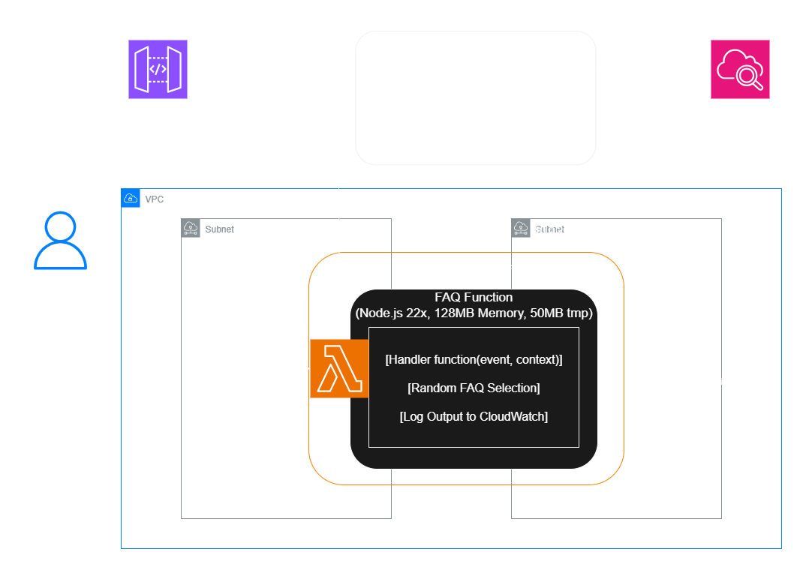
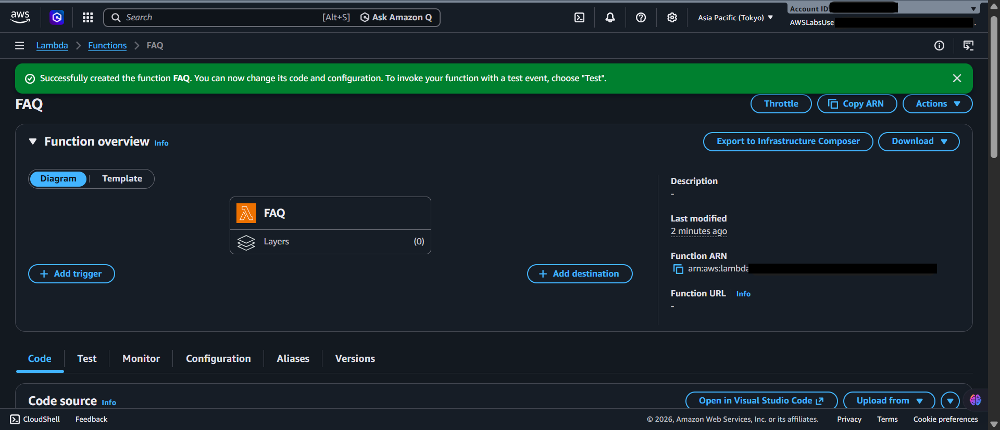
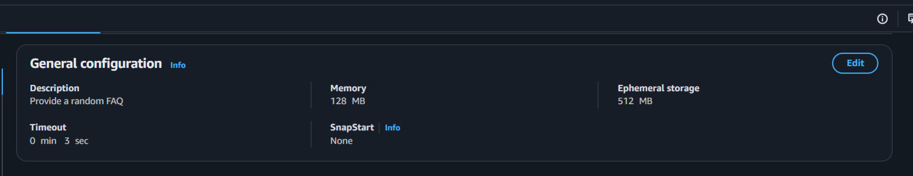
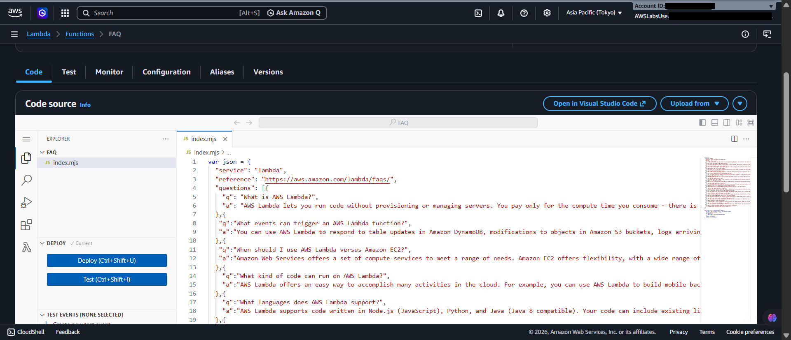
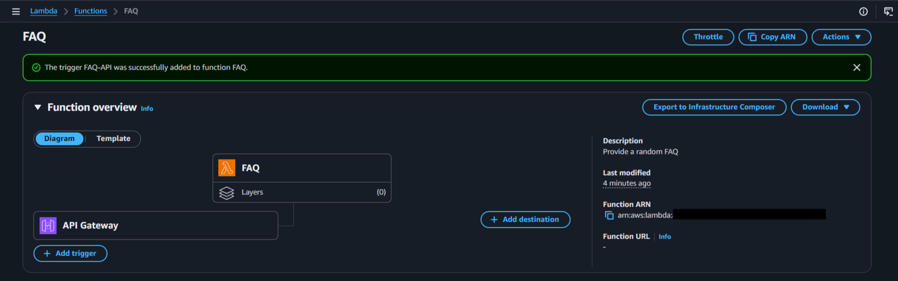
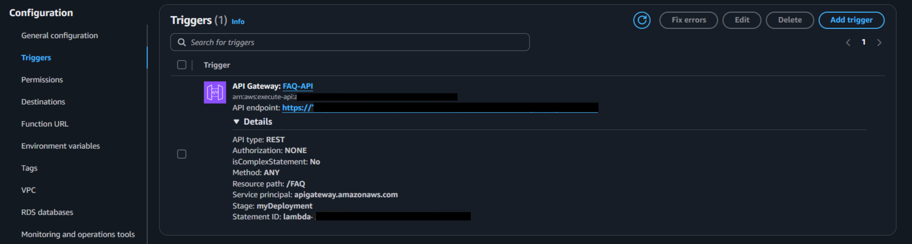
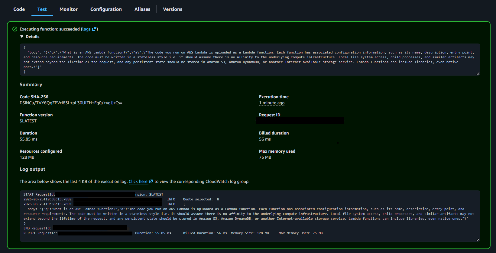
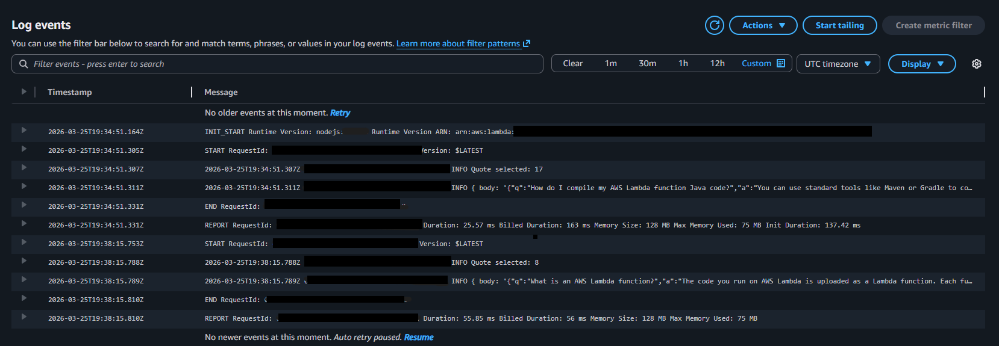
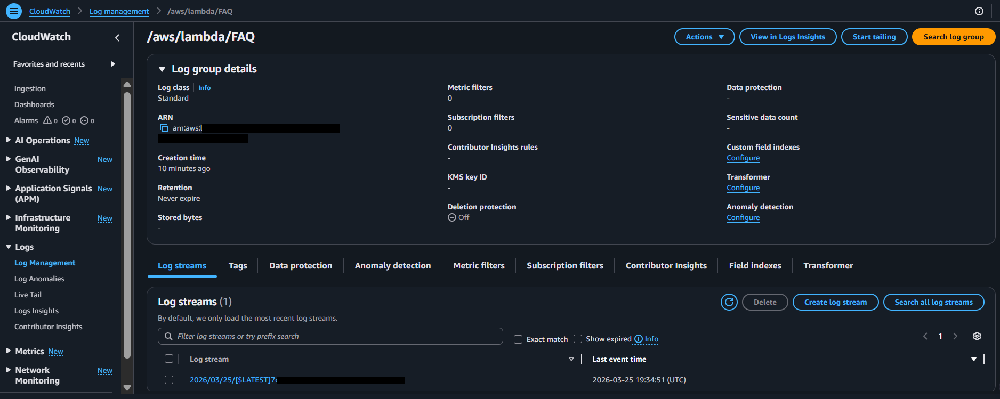

  <a href="./README-en.md">🇺🇸 English</a> |
  <a href="./README.md">🇧🇷 Português</a>

# Lab 03 — Introdução ao Amazon API Gateway

## 🚀 Resumo
Implementação de arquitetura Serverless orientada a eventos. Este laboratório guia a estruturação de um backend funcional puro (*Backend-as-a-Service*) conectando a orquestração pública do **Amazon API Gateway** ao processamento sob demanda do **AWS Lambda** (Node.js). Construí um microsserviço de "FAQ" escalável resolvendo rotas HTTP e entregando *payloads* em JSON, isolando o código interno e rastreando métricas vitais pelo **Amazon CloudWatch**.

---

## 💼 Caso de Uso Real
- **Indústria:** Software Corporativo / Aplicativos de Atendimento
- **Problema:** Um aplicativo web mantém um serviço de "Perguntas Frequentes (FAQ)". Inicialmente, eles alocaram esse serviço em servidores EC2 rodando ininterruptamente apenas para atender 200 usuários diários. Além do custo de servidores ociosos, a arquitetura demorava dias para implantar atualizações no texto e travava se ocorresse um tráfego simultâneo acima do esperado na Black Friday.
- **Solução:** Migrei a lógica do FAQ estritamente para Arquitetura Serverless (*AWS Lambda*). Agora, o código dorme na nuvem sem gerar custo. Configurei o **Amazon API Gateway** para atuar como o "porteiro público". Quando ocorre uma chamada HTTP (`GET /faq`), o Gateway acorda a função Lambda instantaneamente, processando o JSON em ~50ms e devolvendo o objeto antes de dormir novamente. Consegui reduzir a fatura de servidores a zero reais mensais com a vantagem do escalonamento orgânico ilimitado.

---

## 🎯 Objetivos de Aprendizado

- Instanciar receptores frontais provisionando um **Amazon API Gateway** e gerando rotas padrão *REST*.
- Escrever código computacional ativando uma função serverless transiente **AWS Lambda** rodando rotinas **Node.js**.
- Interligar o Gateway mapeando gatilhos (*Triggers*) que traduzem comandos HTTP `GET` para invocação de servidor interna.
- Configurar *Endpoints Públicos* formatando os pacotes de requisição e resposta em modelos JSON.
- Avaliar métricas operacionais rastreando logs de execução pontuais pelo depurador profundo do **Amazon CloudWatch Logs**.

---

## 🛠️ Serviços AWS Utilizados

| Serviço                | Papel no Lab                                                                                                |
| ---------------------- | ----------------------------------------------------------------------------------------------------------- |
| **Amazon API Gateway** | Gateway web encarregado de ingerir conexões públicas, gerir autorizações e trafegar dados de forma roteada. |
| **AWS Lambda**         | Camada Serverless de computação escalável. Executa processos paralelos com base no trigger de acionamento.  |
| **Amazon CloudWatch**  | Ferramenta holística de monitoramento extraindo em texto real os consoles logados (`console.log()`).        |

---

## 🏗️ Arquitetura da Solução

  

*(O fluxo demonstra como o API Gateway abstrai o acesso de usuários, blindando o processamento do banco local hospedado na Lambda).*

---

## 🖥️ Etapas do Laboratório

### 1. ⚙️ Desenvolvimento do Núcleo Backend (AWS Lambda)
- **Ação:** Programei o array dinâmico em plataforma gerenciada isolando o hardware logístico.
- **Configuração de Execução:**
  - Ambiente de Software (Runtime): Utilizei a versão padrão isolada *Node.js 22.x*.
  - No código `index.js`, criei um Array mapeado aleatoriamente (`Math.random()`) capaz de cuspir respostas diferentes de uma espécie de "FAQ" simulada, montando um header HTTP correto de reposta contendo blocos JSON lógicos formatados.
  - O código operacional repousa explícito neste laboratório dentro da pasta: [/src/index.js](./src/index.js).

### 2. 🌐 Provisionamento da Recepção Pública (API Gateway)
- **Ação:** Arquitetei a malha de conexão recebendo túneis abertos de tráfego convertidos para a rede fechada Lambda.
- **Acoplamento Integrativo:** Construí a associação declarando nativamente dentro dos atributos de "Trigger" da Lambda o anexo do *Amazon API Gateway* com permissões totais via porta aberta `REST`.
- **Exposição Frontend:** Implantei as instâncias no espaço de palco `myDeployment`, habilitando imediatamente a URL Invoker.

### 3. 🔍 Validação Endpoint E2E (Execution via CloudWatch)
- **Ação:** Rastreei e testei empiricamente as variabilidades das rotas formatadas geradas no processo final.
- **Integração Web Browser:** Abri no navegador a HTTPS URL criada pelo Gateway para avaliar o carregamento cruzado confirmando os retornos com o padrão de status de transação estrita na rede recebendo um código `HTTP 200`.
- **Execuções Mock Locais (Test Events):** Verifiquei em parelelo se instâncias da Lambda quebram enviando pacotes json vazios isoladamente `{}`. O resultado ocorreu bem sucedido pelo console subjacente interno.
- **Auditoria Analítica (CloudWatch):** Cruzei a auditoria inspecionando nativamente cada timestamp logado validando exatos milissegundos utilizados visualizando o ambiente via *CloudWatch Streams Logs*.

---

## 📸 Evidências de Execução

### 1. Lambda Dashboard: Monitoria listando recursos e atestando as funções criadas operacionais

### 2. Function Settings: Configuração das lógicas restritivas bloqueando processos perimetrais na plataforma

### 3. Code Snippet: Espelho do editor integrado do Node.js detalhando os Arrays mapeados geradores de dados

### 4. Trigger Logic: Configuração injetando parâmetros operantes da borda conectivo publicamente

### 5. Deployment URL: Visão das URLs de destino da API validando protocolos HTTPS estáticos

### 6. Execution verification: Bloco verde nativo ilustrando o Test Event de retorno sem timeouts

### 7. Log Groups: Tabela agrupada capturando Grupos de Logs cronológicos no CloudWatch

### 8. Trace Detail: Extração minuciosa validando métricas milissegundos e eficiência

> [!IMPORTANT]
> IDs das contas restritivas atreladas nativamente foram ofuscados mitigando vetores superficiais em cumprimento às diretivas de sigilo de identidade originais.

---

## 💡 Principais Aprendizados

- **Custo Operacional Linear:** Avaliei que em uma lambda eu rastreio puramente frações logadas (via CloudWatch). Um código durando singelos 7ms resulta em custos fixos efetivos virtualmente nulos em tráfegos medianos descartando EC2 ligadas permanentemente.
- **Abstração Direta (Proxy Integration):** A associação de API Gateway provou uma flexibilização absurda na abstração da lógica nativa HTTP mascarando a Lambda internamente transformando dados em simples formatação padronizada em evento.
- **Rastreabilidade Fina (CloudWatch):** Considerando que as máquinas são invisíveis, deduzi imediatamente que não existem acessos `SSH`. Qualquer debug depende completamente da maestria de atrelar impressões logadas explícitas fluindo no painel dinâmico log central original.

---

## 💰 Consciência de Custos

| Recurso            | Free Tier?                                                                          | Custo Estimado |
| ------------------ | ----------------------------------------------------------------------------------- | -------------- |
| AWS Lambda         | ✅ 1 Milhão requisições mensais + limite generoso logado free permanente             | $0,00          |
| Amazon API Gateway | ✅ Chamadas em camada free de retornos escalonáveis operacionais (12 Meses Iniciais) | $0,00          |
| Amazon CloudWatch  | ✅ 5GB integrados por log formatados e capturados originais                          | $0,00          |
| **Total Mensal**   |                                                                                     | **$0,00**      |

> ⚠️ As cotas gratuitas perdoam execuções marginais geradas durante os testes da API. Desmanche a *Trigger* após finalizados os aprendizados apagando explicitamente os Endpoints REST e limpando a lixeira AWS para reprimir bots varredores randômicos globais de gerar logs não autorizados.

---

## 🏷️ Competências Demonstradas

`Amazon API Gateway` `AWS Lambda Core` `Serverless Execution` `REST Integrations` `Node.js Web Arrays` `CloudWatch Profiling` `Cloud Tracing` `🟢 Fundamental`

---

[← Voltar ao índice](../../../README.md)
