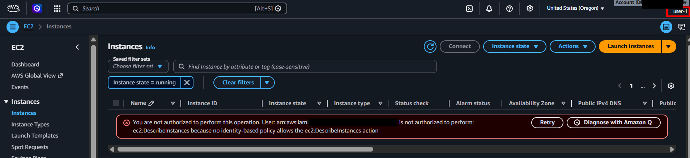
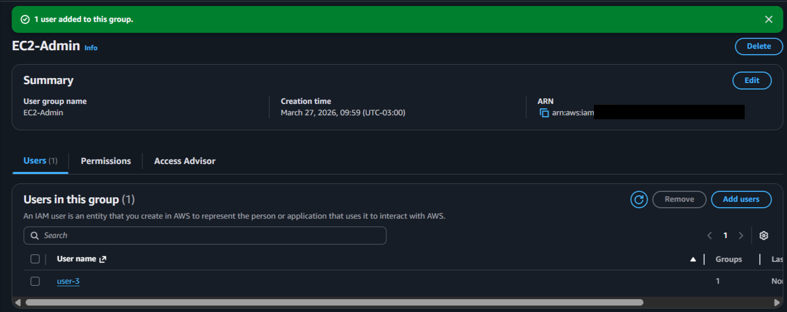
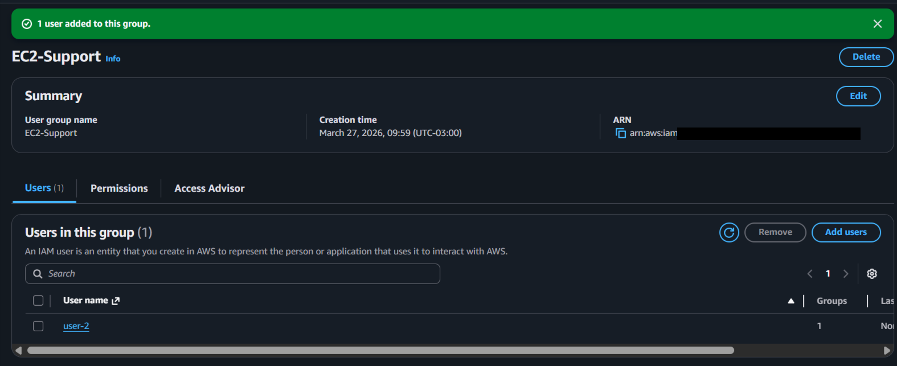
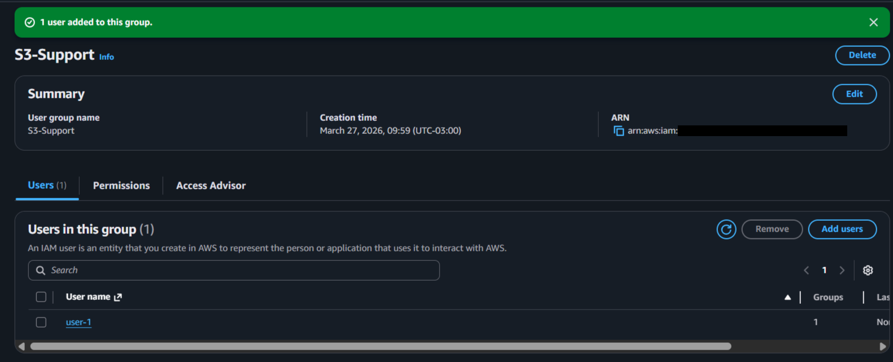
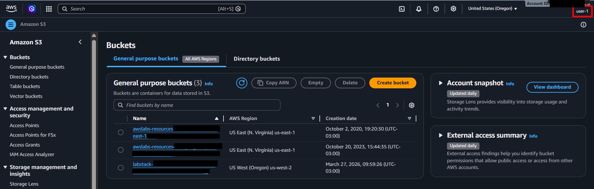
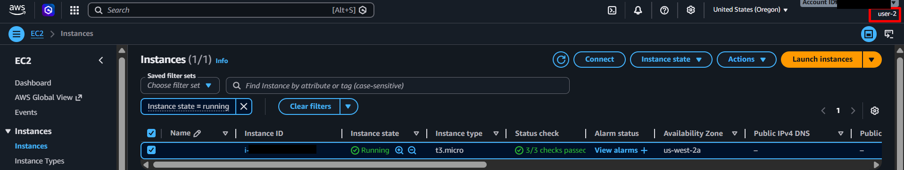
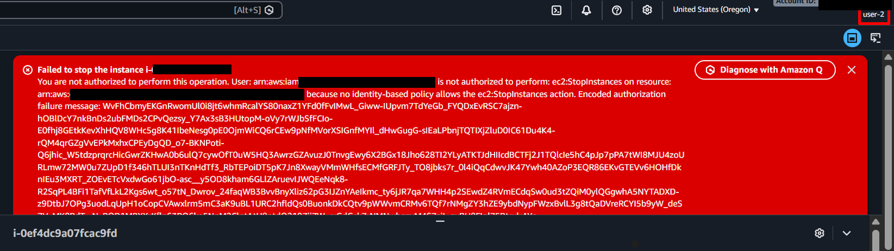
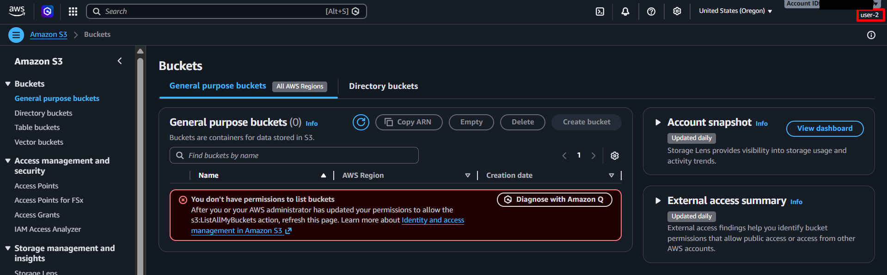
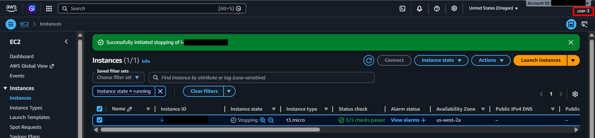

  <a href="./README-en.md">🇺🇸 English</a> |
  <a href="./README.md">🇧🇷 Português</a>

# Lab 01 — Introdução ao AWS Identity and Access Management (IAM)

## 🚀 Resumo
Implementação de Governança de Acessos focada no princípio de **Privilégio Mínimo**. Neste laboratório, orquestrei o controle de identidades através do **AWS IAM**, estabelecendo usuários, isolando permissões através de grupos e definindo políticas exatas de restrição. Configurei o ambiente para separar a administração de infraestrutura (EC2) do acesso aos dados (S3), prevenindo erros humanos e acessos indevidos.

---

## 💼 Caso de Uso Real
- **Indústria:** Tecnologia / Cloud Operations
- **Problema:** Uma empresa concedia acesso de Administrador para todos os funcionários para facilitar o trabalho. Um erro em um script de um novo colaborador acidentalmente encerrou dois servidores de banco de dados em produção. O acesso ilimitado permitiu que um erro humano causasse uma indisponibilidade crítica.
- **Solução:** Implementei o controle de acesso baseado em funções (RBAC) com o **AWS IAM**. Movi analistas e estagiários para o grupo `S3-Support`, que proíbe qualquer acesso ao console do EC2. Coloquei engenheiros responsáveis no grupo `EC2-Admin`. Cada usuário agora possui chaves individuais rastreáveis, tornando impossível a repetição do incidente, pois a AWS bloqueia qualquer ação fora da política definida.

---

## 🎯 Objetivos de Aprendizado

- Criar e auditar **Usuários IAM** individuais para garantir a rastreabilidade das ações.
- Organizar permissões de forma escalonável utilizando **Grupos de Usuários**.
- Analisar e validar políticas em formato JSON (**IAM Policies**) para controle granular.
- Simular logins via *URL Alias* para validar a experiência de diferentes perfis de acesso.
- Testar na prática o princípio do privilégio mínimo através de tentativas de acesso bloqueadas (`Access Denied`).

---

## 🛠️ Serviços AWS Utilizados

| Serviço | Papel no Lab |
|---------|-------------|
| **AWS IAM** | Gerenciamento central de identidades, grupos e permissões. |
| **Amazon EC2** | Servidores virtuais onde testei as restrições de visualização e administração. |
| **Amazon S3** | Armazenamento de objetos usado para validar o isolamento de acesso a dados. |

---

## 🏗️ Arquitetura da Solução

  

---

## 🖥️ Etapas do Laboratório

### 1. 🔍 Criação de Identidades (Users & Groups)
- **Ação:** Criei os usuários `user-1`, `user-2` e `user-3` e os grupos organizacionais correspondentes.
- **Observação:** Validei que, sem associação a grupos ou políticas, os usuários operam sob "Zero Trust" (bloqueio total por padrão).

### 2. 🛡️ Análise de Políticas (JSON Policies)
- **Ação:** Inspecionei as políticas gerenciadas pela AWS, como a `AmazonEC2ReadOnlyAccess`.
- **Análise Técnica:** Analisei os blocos JSON ("Action", "Effect", "Resource") e criei uma política *Inline* customizada para o `EC2-Admin`, permitindo especificamente as ações `ec2:StartInstances` e `ec2:StopInstances`.

### 3. ⚙️ Associação e Hierarquia
- **Ação:** Associei cada usuário ao seu grupo específico. O `user-1` recebeu permissões de S3, enquanto o `user-2` e `user-3` foram focados no ecossistema EC2 com diferentes níveis de autoridade.

### 4. 🔗 Testes de Acesso Cruzado
- **Ação:** Realizei logins alternados para validar as permissões.
- **Resultados:**
  - **User-1 (S3):** Conseguiu ler arquivos no S3, mas recebeu `Access Denied` ao tentar acessar o console do EC2.
  - **User-2 (EC2 RO):** Visualizou as instâncias EC2, mas foi impedido de pará-las e não teve acesso ao S3.
  - **User-3 (EC2 Admin):** Executou o comando de `Stop` na instância com sucesso.

---

## 📸 Evidências de Execução

### 1. Identidade e Acesso Programático: Criação do usuário 'user-1'

### 2. Governança por Grupos: Configuração de permissões administrativas (EC2 Admin)

### 3. Governança por Grupos: Perfil de suporte (EC2 Support)

### 4. Governança por Grupos: Perfil de suporte focado em dados (S3 Support)

### 5. Validação de Acesso: Sucesso na listagem de recursos no S3 pelo User-1

### 6. Validação de Acesso: Leitura de painéis no EC2 pelo User-2

### 7. Isolamento e Privilégio Mínimo: Bloqueio (Access Denied) de ações administrativas do EC2

### 8. Isolamento e Privilégio Mínimo: Bloqueio (Access Denied) na leitura de dados S3

### 9. Execução Administrativa: Confirmação de comando crítico (Stop Instance) executado com sucesso pelo User-3

---

## 💡 Principais Aprendizados

- **Padrão Zero-Trust:** Na AWS, o acesso não é concedido por padrão. Usuários sem políticas associadas não conseguem visualizar nada no console.
- **Segurança Preventiva:** A ausência de mensagens de erro pode indicar excesso de privilégio. Um ambiente seguro deve mostrar erros de permissão ao tentar acessar recursos fora do escopo de trabalho do usuário.

---

## 💰 Consciência de Custos

| Recurso | Free Tier? | Custo Estimado |
|---------|-----------|----------------|
| AWS IAM | ✅ Gratuito e ilimitado para gestão de identidades | $0,00 |

> ⚠️ Embora o IAM seja gratuito, as ações permitidas por ele (como ligar instâncias EC2) podem gerar custos. Sempre encerro as instâncias de teste após a validação.

---

## 🏷️ Competências Demonstradas

`AWS IAM` `Princípio do Privilégio Mínimo` `Gestão de Grupos` `JSON Policies` `RBAC` `Zero Trust` `🟢 Fundamental`

---

## 📜 Alinhamento com Certificações

- **CLF-C02:** Domínio 2 — Segurança e Conformidade
- **SAA-C03:** Domínio 1 — Design de Arquiteturas Seguras

---

[← Voltar ao índice](../../../README.md)
