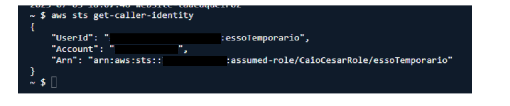

  <a href="./README-en.md">🇺🇸 English</a> |
  <a href="./README.md">🇧🇷 Português</a>

# Lab 02 — AWS Security Token Service (STS)

## 🚀 Summary
Dynamic Identity Management. In this lab, I demonstrated the implementation of temporary credentials using **AWS STS (Security Token Service)** and **Boto3 (Python)**. I replaced the use of permanent keys with a process where the code assumes a restricted **IAM Role** (`AssumeRole`), receiving valid keys for only 1 hour for secure operations in Amazon S3.

---

## 💼 Real-World Use Case
- **Industry:** Cloud Automation and Systems Integration
- **Problem:** An automation script needed to read data from an S3 bucket daily. The administrator generated a pair of fixed keys (Access Key / Secret Key), but the developer accidentally exposed them in a public GitHub repository. Hours later, the keys were used to leak the entire company database.
- **Solution:** I redesigned the architecture to force the use of Temporary Credentials. I created a Python script that utilizes AWS STS `AssumeRole`. The user running the script has no direct permission to read S3, only permission to assume a specific Role. The code contacts STS, receives temporary keys authorized for S3 reading for a limited time, and performs the task. Even if these keys leak, they expire automatically in minutes, neutralizing attacks without human intervention.

---

## 🎯 Learning Objectives

- Differentiate in practice between **IAM Policies** (what can be done) and **Trust Policies** (who can do it).
- Provision parameterized **IAM Roles** to delegate permissions to scripts and applications.
- Utilize the `AssumeRole` API via Python SDK (Boto3) to request ephemeral credentials.
- Capture and manage security variables (Access Key, Secret Key, and Session Token) in the code.
- Validate temporary access to **Amazon S3** and confirm automatic blocking after expiration.

---

## 🛠️ AWS Services Used

| Service | Task Role |
|---------|-----------|
| **AWS STS** | Token provider for short-lived keys. |
| **AWS IAM** | Creation of Roles, users, and trust policies. |
| **Amazon S3** | Target resource to validate temporary permissions. |

---

## 🖥️ Etapas do Laboratório

### 1. ⚙️ User and Role Configuration (IAM)
- **Action:** I created the "Operator" user with no direct permissions.
- **Role Configuration:** I created `S3-Access-Role` with S3 read permission. I configured the **Trust Policy** to allow only the "Operator" ARN to assume this Role.

### 2. 💻 Script Development (AssumeRole)
- **Action:** I developed a Python application to manage token requests.
- **Implementation:** The script uses `boto3.client('sts')` to execute the `assume_role` function. I extracted the `AccessKeyId`, `SecretAccessKey`, and `SessionToken` strings from the returned payload.
- **Source Code:** The complete script is available at [src/assume_role.py](./src/assume_role.py).

### 3. 🔍 Validation and Expiration Test
- **Action:** I injected the temporary credentials into a new S3 client in Boto3.
- **Results:** The script successfully listed the bucket files (HTTP 200). I validated that the original user permissions remained blocked, proving access was only possible through STS.

---

## 📸 Execution Evidences

### 1. Programmatic Access Setup: Criando credenciais para o usuário 'Operador' iniciar o processo de STS

## 💡 Key Learnings

- **Transient Security:** Dynamic tokens mitigate damage if source code or the local machine is compromised. This is the foundation for Instance Profiles and Lambda Execution Roles.
- **Trust Policies:** I learned that a Permission Policy says "Hit S3," but the Trust Policy decides "Who can hit S3." Without a correctly configured Trust Policy, STS immediately revokes any attempt to assume the function.

---

## 💰 Cost Awareness

| Resource | Free Tier? | Estimated Cost |
|----------|-----------|----------------|
| AWS STS | ✅ Token generation operations are free | $0.00 |
| AWS IAM | ✅ Free | $0.00 |

---

## 🏷️ Competencies Demonstrated

`AWS STS` `AssumeRole` `Temporary Credentials` `Python Boto3` `Trust Policies` `Security Automation` `🟢 Fundamental`

---

[← Return to Index](../../../README-en.md)
