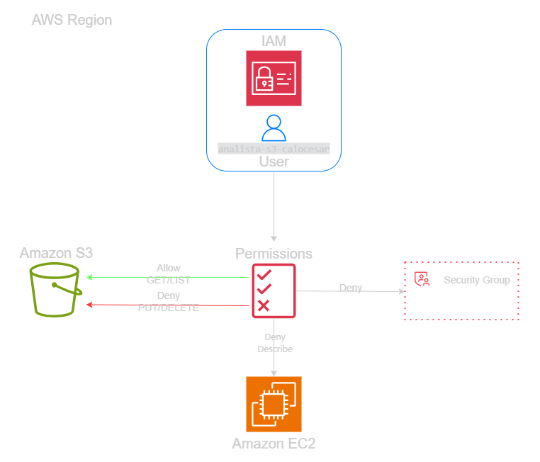
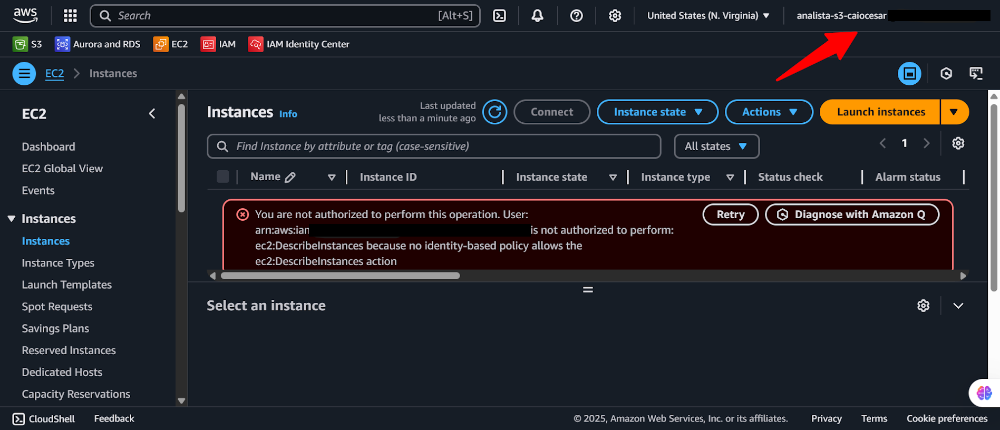
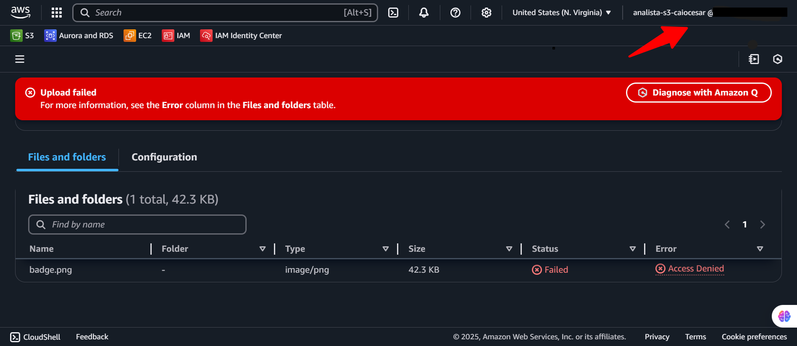

  <a href="./README-en.md">🇺🇸 English</a> |
  <a href="./README.md">🇧🇷 Português</a>

# Lab 03 — AWS IAM: Segurança e Acesso Restrito ao S3 (ReadOnly)

## 🚀 Resumo
Aplicação prática do princípio de **Privilégio Mínimo** limitando um usuário IAM ao perfil S3 ReadOnly. Neste laboratório, validei o bloqueio de ações de escrita e o isolamento total de outros serviços (como EC2) através de testes de acesso cruzado. Comprovei que políticas de leitura impedem o usuário de modificar dados ou interagir com APIs não autorizadas na conta AWS.

---

## 💼 Caso de Uso Real
- **Indústria:** Auditoria e Conformidade
- **Problema:** Uma empresa financeira contratou uma auditoria externa para verificar contratos no S3. O time de TI criou uma conta genérica com permissões amplas ("PowerUser"). Um auditor acidentalmente apagou arquivos críticos e começou a vasculhar servidores EC2, gerando um risco de segurança.
- **Solução:** Implementei uma conta de auditoria operando estritamente com o Menor Privilégio. Criei o usuário `analista-s3` associado apenas à política `AmazonS3ReadOnlyAccess`. Agora, qualquer tentativa de deletar arquivos ou acessar o painel do EC2 resulta em um bloqueio imediato do tipo "Access Denied" diretamente pela infraestrutura da AWS, protegendo a integridade do ambiente de produção.

---

## 🎯 Objetivos de Aprendizado

- Consolidar mecânicas do **AWS IAM** segmentando acessos por Usuários, Grupos e Políticas.
- Provisionar usuários com acesso ao **AWS Management Console** sob processos de credenciais seguras.
- Aplicar políticas gerenciadas da AWS (**Managed Policies**) focadas em leitura.
- Validar a eficácia dos bloqueios de escrita (upload/delete) através de sessões em abas anônimas.
- Testar o isolamento entre serviços (S3 vs EC2) para garantir que o usuário não "vaze" para outras áreas.

---

## 🛠️ Serviços AWS Utilizados

| Serviço | Papel no Lab |
|---------|-------------|
| **AWS IAM** | Provedor de identidade e executor da lógica de permissões. |
| **Amazon S3** | Recurso alvo onde testei as restrições de leitura e os bloqueios de escrita. |

---

## 🏗️ Arquitetura da Solução

  

---

## 🖥️ Etapas do Laboratório

### 1. ⚙️ Preparação do Bucket Target
- **Ação:** Provisionei um bucket S3 de teste e realizei o upload de um arquivo de simulação (`TesteLab1.txt`) para servir como alvo da auditoria.

### 2. 🛡️ Estruturação de Grupos e Políticas
- **Ação:** Criei o grupo `Analistas-S3` e anexei a política `AmazonS3ReadOnlyAccess`.
- **Implementação:** Configurei o usuário `analista-s3-caiocesar` com acesso ao console e o adicionei ao grupo criado, garantindo que ele herdasse as permissões de leitura sem configurar políticas individuais.

### 3. 🔍 Teste de Stress e Validação
- **Ação:** Realizei o login em janela anônima para testar as permissões como o novo usuário.
- **Resultados:**
  - **Sucesso:** Consegui listar e ler o arquivo de teste no S3 perfeitamente.
  - **Bloqueio:** O console barrou imediatamente tentativas de carregar novos arquivos (Upload) e retornou erros de permissão ao tentar visualizar o painel do Amazon EC2.

---

## 📸 Evidências de Execução

### 1. Resource Isolation: Tela de erro ao tentar acessar o painel do EC2 com permissão limitada

### 2. Write Protection: Bloqueio de tentativa de upload no S3 justificando a política ReadOnly

---

## 💡 Principais Aprendizados

- **Atribuição via Grupos:** Aprendi que nunca deve-se anexar políticas diretamente ao usuário. Usar grupos facilita a gestão de acessos e evita "esquecimentos" de permissões ativas.
- **Negação Implícita:** Na AWS, o que não é explicitamente permitido é negado. O fato de o usuário não conseguir ver os nomes das instâncias EC2 comprova que a blindagem da rede AWS funciona mesmo sem uma política de "Deny" explícita.

---

## 💰 Consciência de Custos

| Recurso | Free Tier? | Custo Estimado |
|---------|-----------|----------------|
| IAM | ✅ Gratuito | $0,00 |
| S3 | ✅ Coberto pelo Free Tier (arquivos pequenos) | $0,00 |

---

## 🏷️ Competências Demonstradas

`AWS IAM` `S3 ReadOnly` `Managed Policies` `Least Privilege` `Validação de Segurança` `🟢 Fundamental`

---

## 📜 Alinhamento com Certificações

- **CLF-C02:** Domínio 2 — Segurança e Conformidade
- **SAA-C03:** Domínio 1 — Arquitetura de Design Seguro

---

[← Voltar ao índice](../../../README.md)
