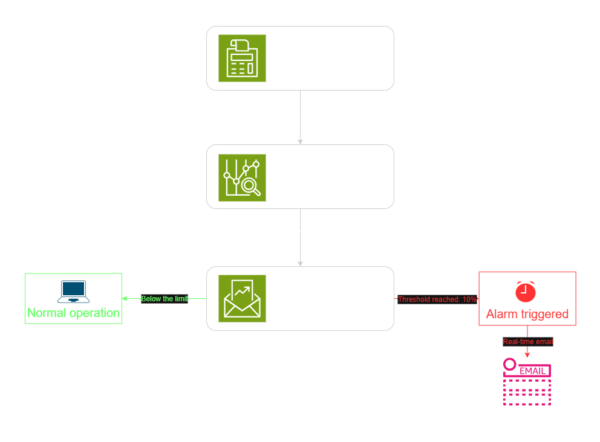
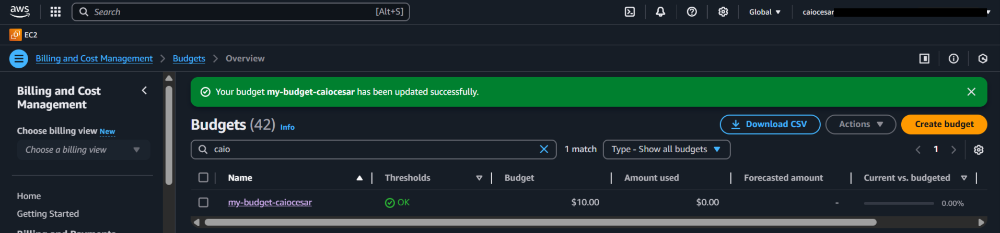
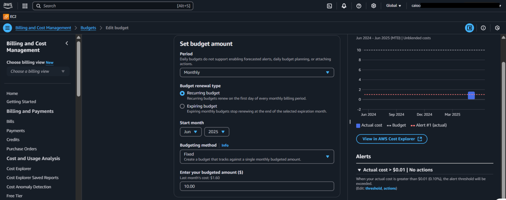
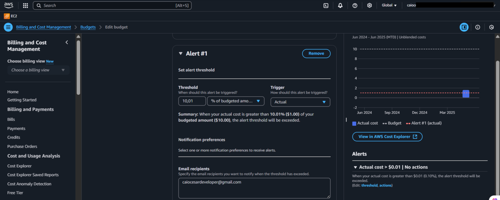
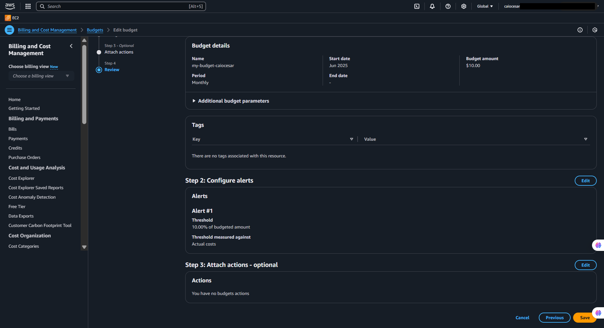

  <a href="./README-en.md">🇺🇸 English</a> |
  <a href="./README.md">🇧🇷 Português</a>

# Lab 04 — FinOps: Cost Governance with AWS Budgets

## 🚀 Summary
Cloud Financial Operations (FinOps) monitoring setup. In this lab, I configured a proactive monthly budget within the AWS infrastructure utilizing **AWS Budgets**. I defined customized thresholds to monitor billing variables and emit automated email alerts to protect the environment against unexpected expenses caused by idle resources or accidental overprovisioning.

---

## 💼 Real-World Use Case
- **Industry:** FinOps (Cloud Financial Operations)
- **Problem:** Data engineers at a startup provisioned high-performance EC2 and RDS instances for a weekend test and forgot to terminate them. By the end of the month, the company received an unexpected $2,400 invoice for idle hardware that generated no business value.
- **Solution:** I implemented a cost governance rule using AWS Budgets and set a spending cap for my testing environment. If the system detects that actual spending has exceeded 10% of the limit—or if the Forecast mathematical prediction shows the budget will be exceeded by month-end—it immediately sends me email alerts. This allows me to stop resources the moment spending goes off-track, potentially saving thousands in waste.

---

## 🎯 Learning Objectives

- Understand the AWS Pay-as-you-go economic model and the importance of continuous monitoring.
- Navigate the **Billing and Cost Management** dashboard to configure budget parameters.
- Create a **Cost Budget** with absolute values.
- Differentiate between "Actual" (real-time) and "Forecasted" (predictive) cost alerts.
- Configure automated email notification workflows integrated within the billing engine.

---

## 🛠️ AWS Services Used

| Service | Task Role |
|---------|-----------|
| **AWS Budgets** | Primary dashboard for creating and monitoring cost thresholds. |
| **Amazon SNS** | (Back-end) Native service responsible for processing and sending email alerts. |

---

## 🏗️ Architectural Solution Flow

  

---

## 🖥️ Lab Steps

### 1. ⚙️ Budget Configuration
- **Action:** I accessed the Budgets dashboard and created a new "Cost Budget."
- **Implementation:** I defined a monthly recurring period and set a safety limit of **$10.00** to protect my account from credit card surprises.

### 2. 🛡️ Notification Threshold Setup
- **Action:** I configured alert rules so the budget is not just a passive chart.
- **Rule:** I set a threshold of 10%. As soon as the actual billing hits $1.00, an email is automatically sent to my administrative inbox.

### 🔍 3. Implementation Validation
- **Action:** I reviewed the budget summary. The console confirmed the tracking activation, displaying the current consumption at 0%. Now, any resource I forget to shut down will be flagged by the system before the cost becomes a problem.

---

## 📸 Execution Evidences

### 1. Governance Summary: Summary governance view with my budget active and tracking

### 2. Guardrail Logic: Setting the 10% limit for the actual spending alert

### 3. Actionable Alerts: Configuration for optional automatic actions

### 4. Consolidated Protection: Final review of consolidated financial protection parameters

## 💡 Key Learnings

- **Cloud vs. On-Premise:** In a physical datacenter, an idle server "doesn't cost more" at month-end. In AWS, every minute counts. Budgets teach the architect to maintain a FinOps mindset.
- **Security for Learning Environments:** Every educational setup needs a financial cap. This prevents a technical error from resulting in debt.
- **Advanced Automation:** I discovered it's possible to configure Budgets to not only send e-mails but also trigger Lambda functions that automatically shut down instances (Preventative Shutdown) once a threshold is reached.

---

## 💰 Cost Awareness

| Resource | Free Tier? | Estimated Cost |
|----------|-----------|----------------|
| AWS Budgets | ✅ The first 2 budgets are free indefinitely | $0.00 |

---

## 🏷️ Competencies Demonstrated

`AWS Budgets` `Cost Management` `Alerts` `FinOps` `Billing & Cost Explorer` `🟢 Fundamental`

---

## 📜 Certification Alignment

- **CLF-C02:** Domain 4 — Billing and Pricing
- **SAA-C03:** Domain 4 — Design Cost-Optimized Architectures

---

[← Return to Index](../../../README-en.md)