

  <a href="./README-en.md">🇺🇸 English</a> |
  <a href="./README.md">🇧🇷 Português</a>

# Lab 05 — Monitoramento e Auditoria com CloudWatch e CloudTrail

## 🚀 Resumo
Telemetria de Infraestrutura e Governança Forense: Neste laboratório, estabeleci um ambiente de observabilidade nativa na AWS. Configurei alarmes estruturais para monitorar a utilização de CPU em instâncias EC2 sob testes de estresse. Paralelamente, habilitei o rastreamento galopante de atividades via **AWS CloudTrail**, garantindo o registro de todas as chamadas de API da conta e exportando-as para um bucket S3 com criptografia.

---

## 💼 Caso de Uso Real
- **Indústria:** Operações de SRE (Site Reliability Engineering)
- **Problema:** Um e-commerce sofria quedas noturnas silenciosas. Os servidores travavam em 100% de CPU, mas a equipe só descobria o problema horas depois através de reclamações de clientes. Além disso, não era possível saber se as alterações na rede foram feitas por um erro de script ou por uma ação manual de algum colaborador.
- **Solução:** Implementei uma estratégia de defesa em duas frentes. Configurei o **Amazon CloudWatch** para monitorar a CPU. Se o uso ultrapassar 70%, ele dispara um alerta por e-mail via **Amazon SNS**, me notificando no celular em tempo real. Para a auditoria, ativei o **AWS CloudTrail**, que grava todos os logs de "quem fez o quê" no S3. Agora, posso identificar a causa raiz da performance e o autor da mudança na infraestrutura em segundos.

---

## 🎯 Objetivos de Aprendizado

- Criar alarmes de telemetria no **CloudWatch** para monitorar métricas de hardware (`CPUUtilization`).
- Orquestrar notificações automáticas por e-mail utilizando tópicos do **Amazon SNS**.
- Habilitar e configurar o **AWS CloudTrail** para auditoria contínua de eventos de gerenciamento.
- Realizar testes de estresse sintéticos em instâncias Linux para validar a ativação dos alarmes.
- Armazenar logs de auditoria de forma segura e duradoura no **Amazon S3**.

---

## 🛠️ Serviços AWS Utilizados

| Serviço | Papel no Lab |
|---------|-------------|
| **Amazon CloudWatch** | Monitoramento de métricas e disparo de alarmes. |
| **AWS CloudTrail** | Auditoria e registro de trilhas de API da conta. |
| **Amazon SNS** | Serviço de mensagens para envio dos alertas de e-mail. |
| **Amazon EC2** | Servidor alvo onde executei os testes de carga. |
| **Amazon S3** | Repositório final para arquivamento dos logs de auditoria. |

---

## 🏗️ Arquitetura da Solução

  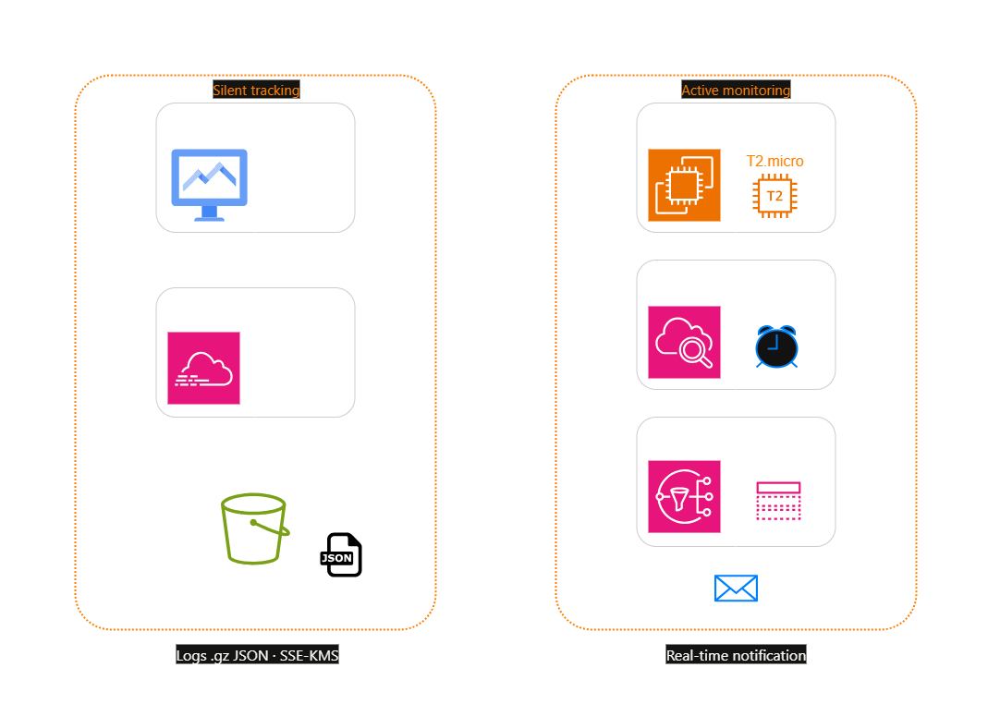

---

## 🖥️ Etapas do Laboratório

### 1. ⚙️ Deploy do Monitoramento EC2
- **Ação:** Provisionei uma instância Linux e criei um alarme no CloudWatch.
- **Configuração:** Defini que, se a CPU ficar acima de 70% por 5 minutos, o estado deve mudar para `In Alarm`. Vinculei um tópico SNS para que eu receba um e-mail imediatamente após o disparo.

### 2. 🛡️ Teste de Estresse (CPU Spike)
- **Ação:** Acessei a instância via SSH e instalei o pacote `stress`.
- **Comando:** Executei o comando `stress --cpu 8 --timeout 600` para forçar o processamento ao máximo.
- **Validação:** Acompanhei o gráfico no CloudWatch subir até os 100% e validei o recebimento do e-mail de alerta em poucos minutos.

### 3. 🔍 Ativação da Trilha de Auditoria (CloudTrail)
- **Ação:** Ativei o CloudTrail em todas as regiões da conta.
- **Configuração:** Criei uma "Trail" focada em eventos de gerenciamento para gravar todas as ações feitas via console ou CLI. Direcionei a saída para um bucket S3 exclusivo, garantindo que os registros sejam imutáveis e persistentes.

---

## 📸 Evidências de Execução

### 1. Criação do alarme no CloudWatch
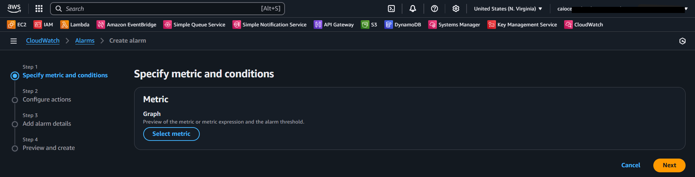

### 2. Seleção de métricas de CPU para o alarme
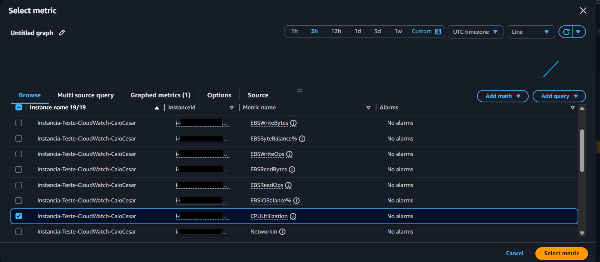

### 3. Gráfico de métricas selecionadas
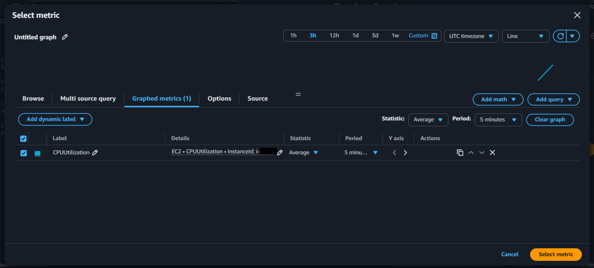

### 4. Especificação da métrica alvo (CPUUtilization)
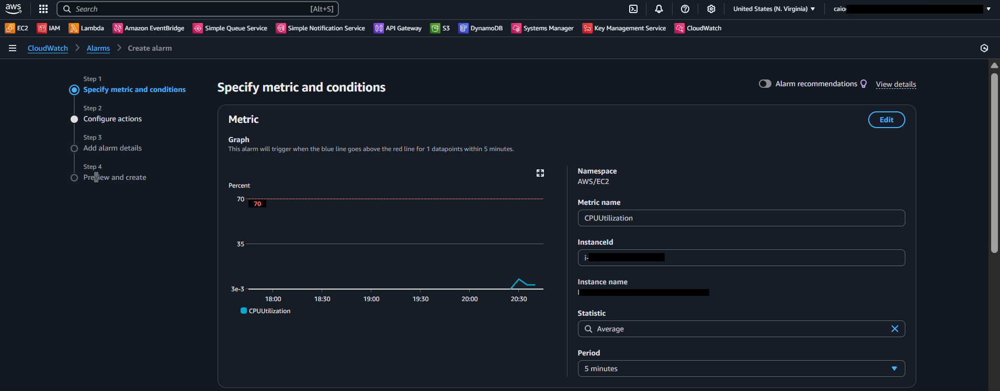

### 5. Definição de condições e threshold (>70%)
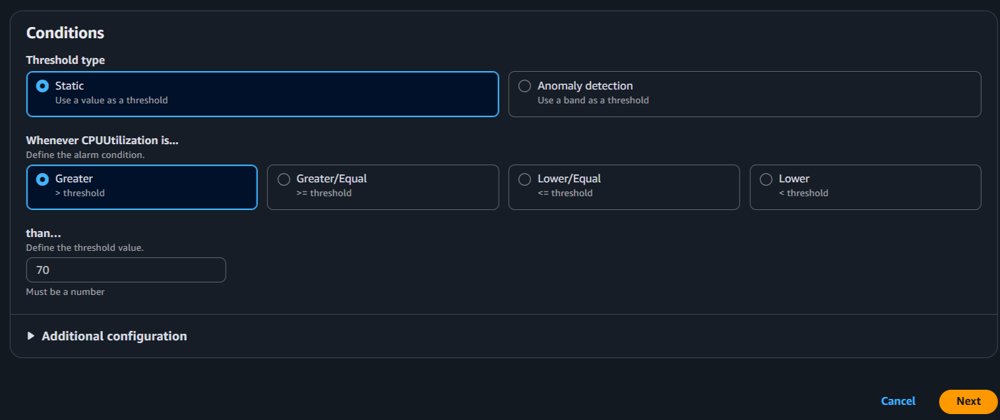

### 6. Configuração das ações de notificação (SNS)
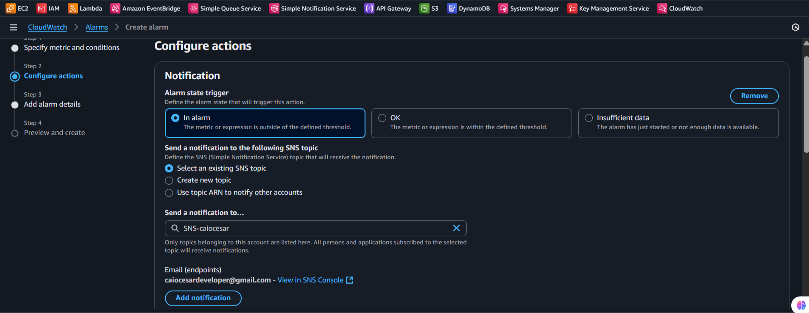

### 7. Detalhes e nome do alarme
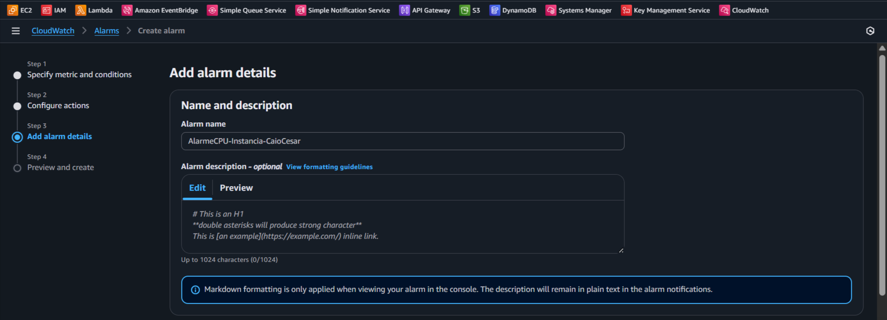

### 8. Preview e criação final do alarme
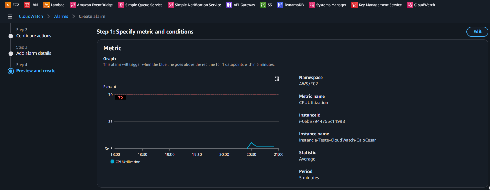

### 9. Criação da trilha de auditoria no CloudTrail
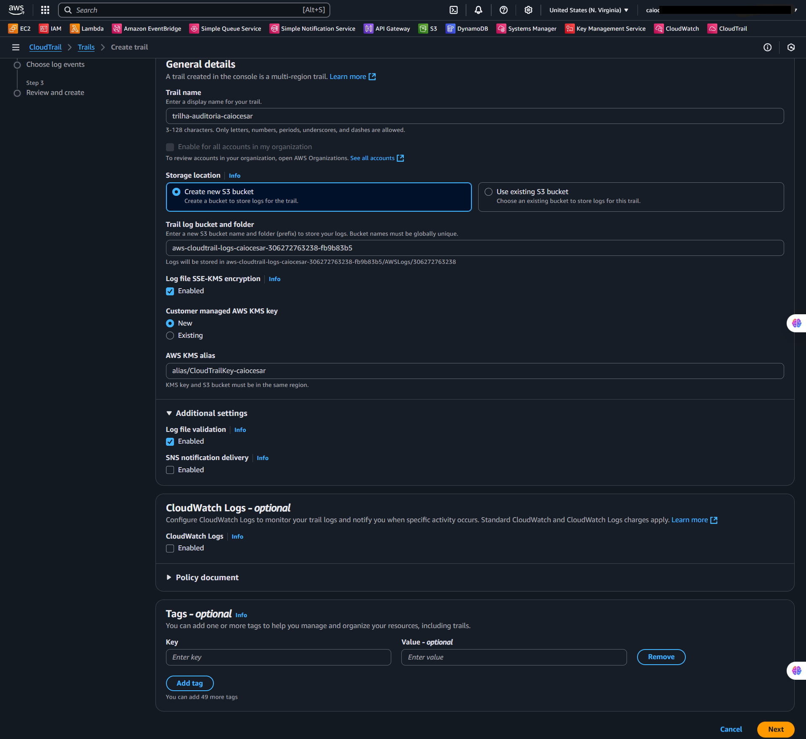

### 10. Seleção de tipos de eventos de log
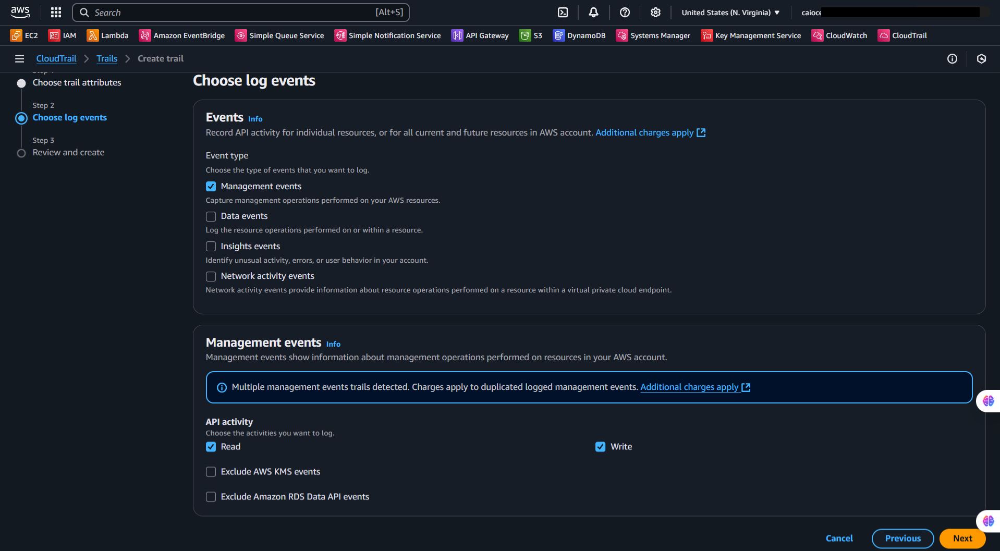

### 11. Revisão e criação da trilha
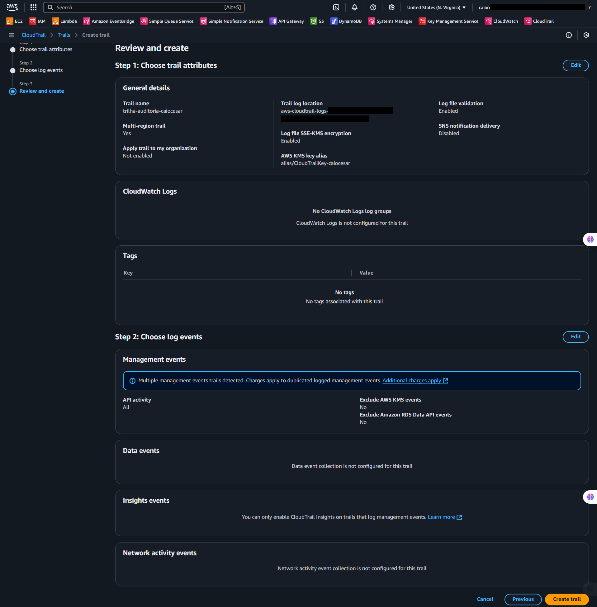

### 12. Painel de trilhas ativas no CloudTrail
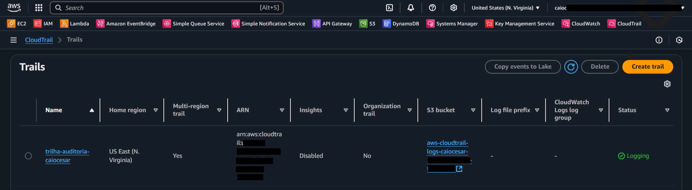

### 13. Confirmação de assinatura do tópico SNS
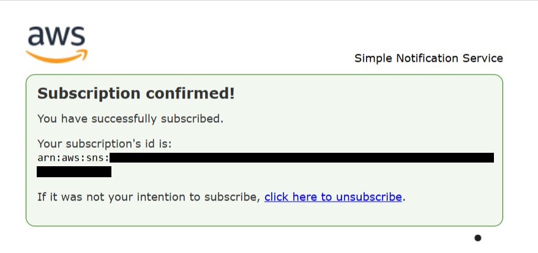

### 14. Estado "In Alarm" ativado no CloudWatch
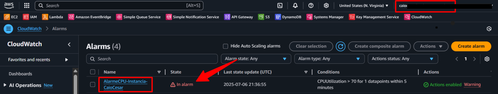

### 15. Notificação SNS disparada com sucesso
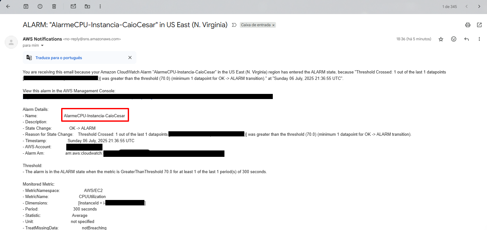

### 16. E-mail de alerta recebido confirmando o disparo
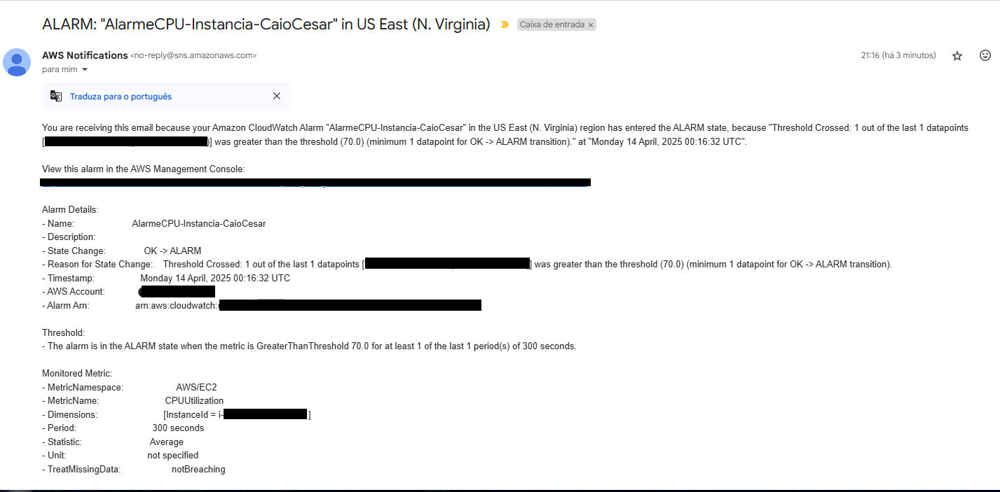

---

## 💡 Principais Aprendizados

- **Métricas de Host vs Sistema:** O CloudWatch vê o que a AWS vê (CPU, rede, status). Para monitorar o que acontece *dentro* do Linux (como uso de memória RAM), aprendi que é necessário instalar o `CloudWatch Agent`.
- **Automatização de Resposta:** Alarmes não servem apenas para avisar humanos. Eles podem disparar funções Lambda para, por exemplo, desligar automaticamente uma instância que esteja sendo atacada ou consumindo recursos demais.
- **Auditoria Permanente:** Enquanto o CloudTrail retém 90 dias de histórico por padrão, exportar esses logs para o S3 permite manter um arquivo histórico de anos, essencial para conformidade e investigações forenses.

---

## 💰 Consciência de Custos

| Recurso | Free Tier? | Custo Estimado |
|---------|-----------|----------------|
| AWS CloudWatch | ✅ 10 alarmes incluídos no Free Tier | $0,00 |
| AWS CloudTrail | ✅ A primeira trilha (Trail) é gratuita | $0,00 |

---

## 🏷️ Competências Demonstradas

`AWS CloudWatch` `AWS CloudTrail` `Amazon SNS` `Métricas de CPU` `Auditoria de Logs` `Stress Testing` `Governança Cloud` `🟡 Intermediário`

---

[← Voltar ao índice](../../../README.md)
