

  <a href="./README-en.md">🇺🇸 English</a> |
  <a href="./README.md">🇧🇷 Português</a>

# Lab 06 — AWS SSM Parameter Store and KMS: Secure Secrets Management

## 🚀 Summary
Securing Application Secrets and Configurations. In this lab, I isolated sensitive application configurations using the **AWS SSM Parameter Store** paired with the **AWS Key Management Service (KMS)**. I centralized the management of basic variables (like URLs) and established encrypted `SecureString` parameters for sensitive data (like passwords), ensuring that no secrets are exposed within the application's source code.

---

## 💼 Real-World Use Case
- **Industry:** Software Development and Data Engineering
- **Problem:** In a previous project, developers left database credentials hardcoded directly in the source. During a push to GitHub, these keys were leaked to a public repository, resulting in an unauthorized entry into the database.
- **Solution:** I wiped all passwords from the code. Now, I use the **SSM Parameter Store** as a central vault. The database password is stored as a `SecureString`, protected by AES-256 encryption via **AWS KMS**. When the application starts (on EC2 or Lambda), it calls the SSM API to retrieve the secret. If the code leaks on GitHub, an attacker sees only a path (e.g., `/app/prod/db_password`), but cannot access the actual value, which is protected by AWS identity layers.

---

## 🎯 Learning Objectives

- Create organized parameter hierarchies (e.g., `/app/dev` vs `/app/prod`).
- Store sensitive variables using **SecureString** types with KMS encryption.
- Differentiate between standard strings (free) and SecureStrings (secure).
- Manage parameter versions and use labels for change control.
- Administer **KMS Key Policies** to control who can decrypt sensitive data.
- Validate secret retrieval via **AWS CLI (CloudShell)** by testing decryption flags.

---

## 🛠️ AWS Services Used

| Service | Task Role |
|---------|-----------|
| **AWS SSM Parameter Store** | Central vault for application configurations and secrets. |
| **AWS KMS** | Cryptographic engine responsible for protecting SecureStrings. |
| **AWS CloudShell** | Command-line interface used to validate parameter access. |

---

## 🏗️ Architectural Solution Flow

  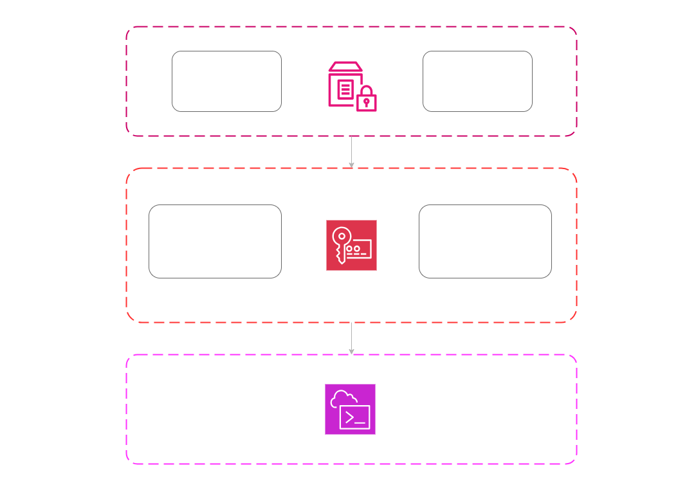

---

## 🖥️ Lab Steps

### 1. ⚙️ Environment Configuration (Standard Strings)
- **Action:** I created parameters for database endpoints in different environments: `/my-app/dev/db_url` and `/my-app/prod/db_url`.
- **Results:** These are open strings in the console, ideal for non-sensitive URLs and metadata that still require centralization.

### 2. 🛡️ The Password Vault (KMS + SecureString)
- **Action:** I stored the actual password in the `/my-app/prod/db_password` parameter.
- **Implementation:** I selected the `SecureString` type and the default KMS key (`aws/ssm`). The password value became visually illegible in the AWS console, appearing only as asterisks or encrypted keys.

### 3. 🔍 CLI Validation (AWS CloudShell)
- **Action:** I executed terminal commands to simulate application behavior.
- **Test 1:** I attempted to read the parameter without the decryption flag. The result was an encrypted hash, proving the data is protected at rest.
- **Test 2:** I used the command `aws ssm get-parameter --name ... --with-decryption`. Since my user has KMS permissions, the system revealed the plaintext password, successfully validating the secure integration workflow.

---

## 📸 Execution Evidences

### 1. Parameter Configuration: Defining environment variables for Dev and Prod
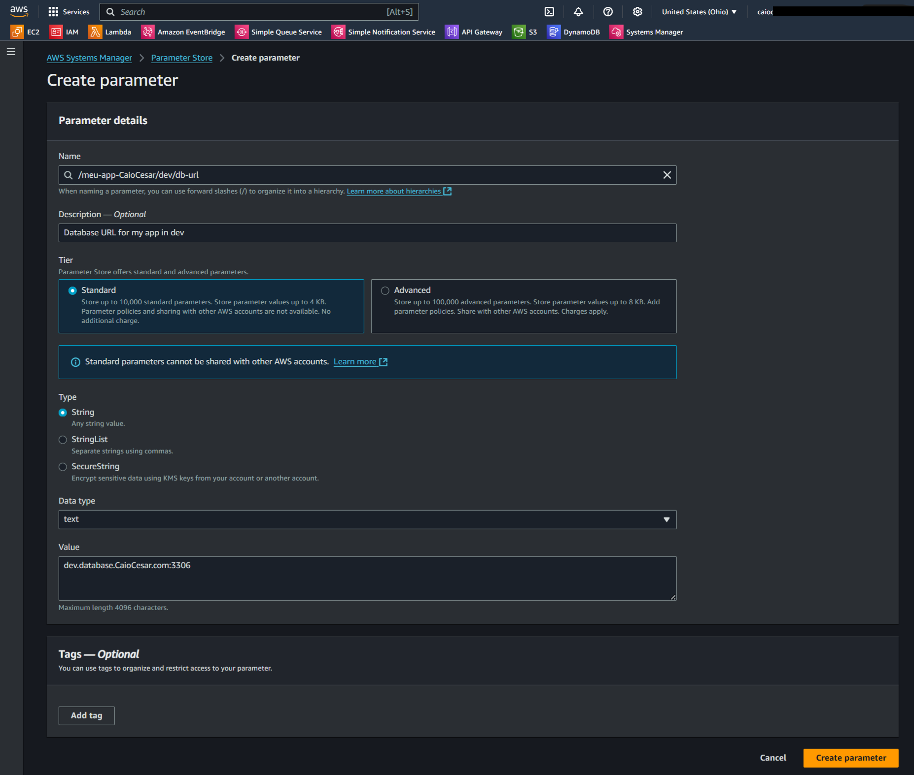
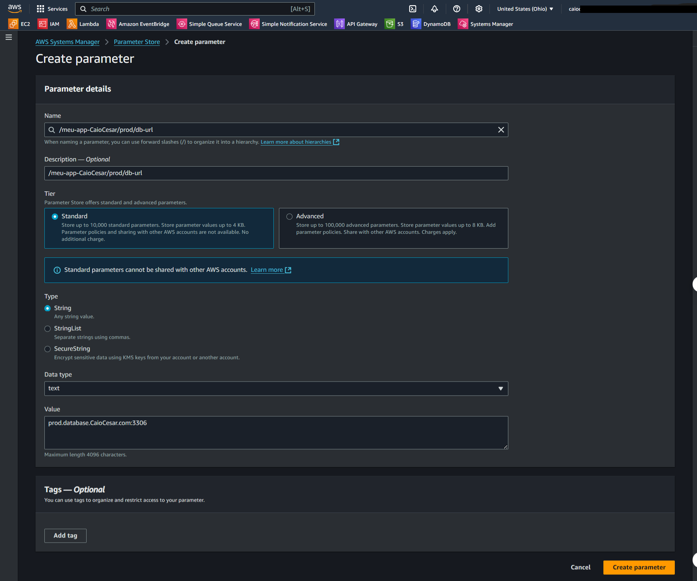
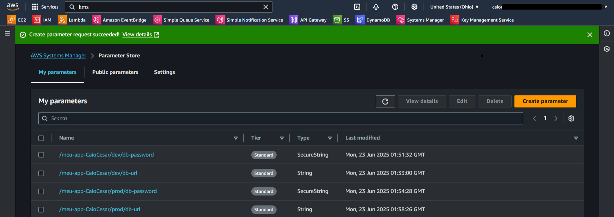

---

### 2. Security and Organization: KMS setup and parameter labeling
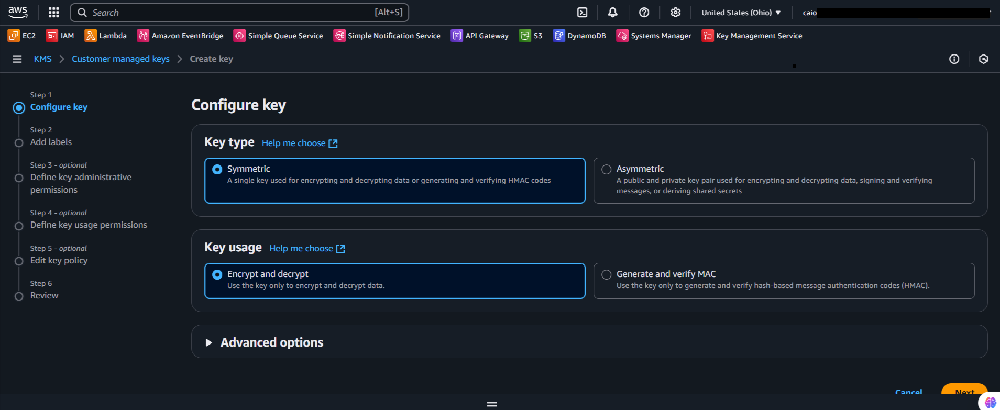
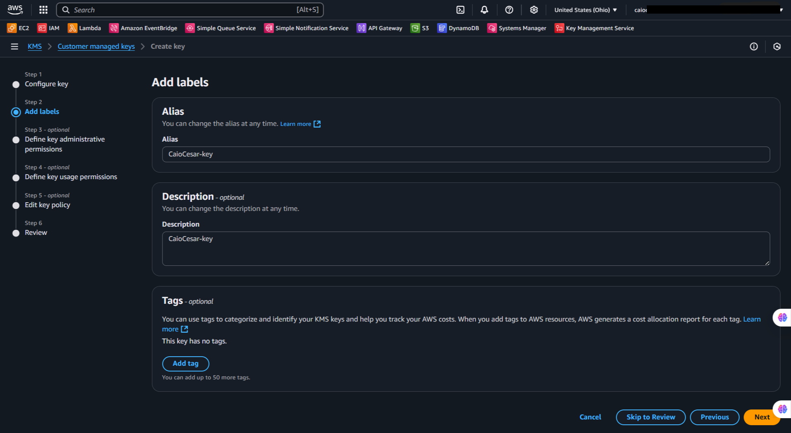
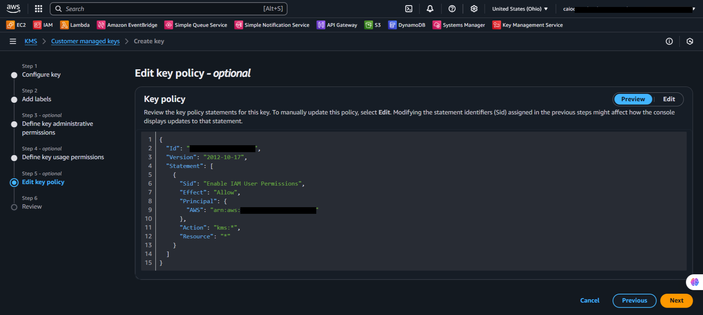
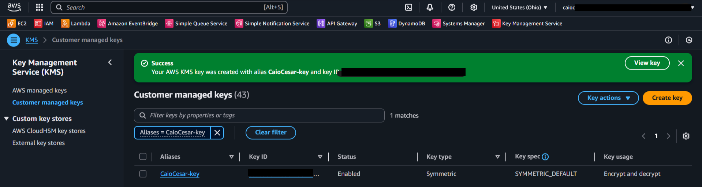

---

### 3. Secrets Management: Storing passwords securely as SecureString
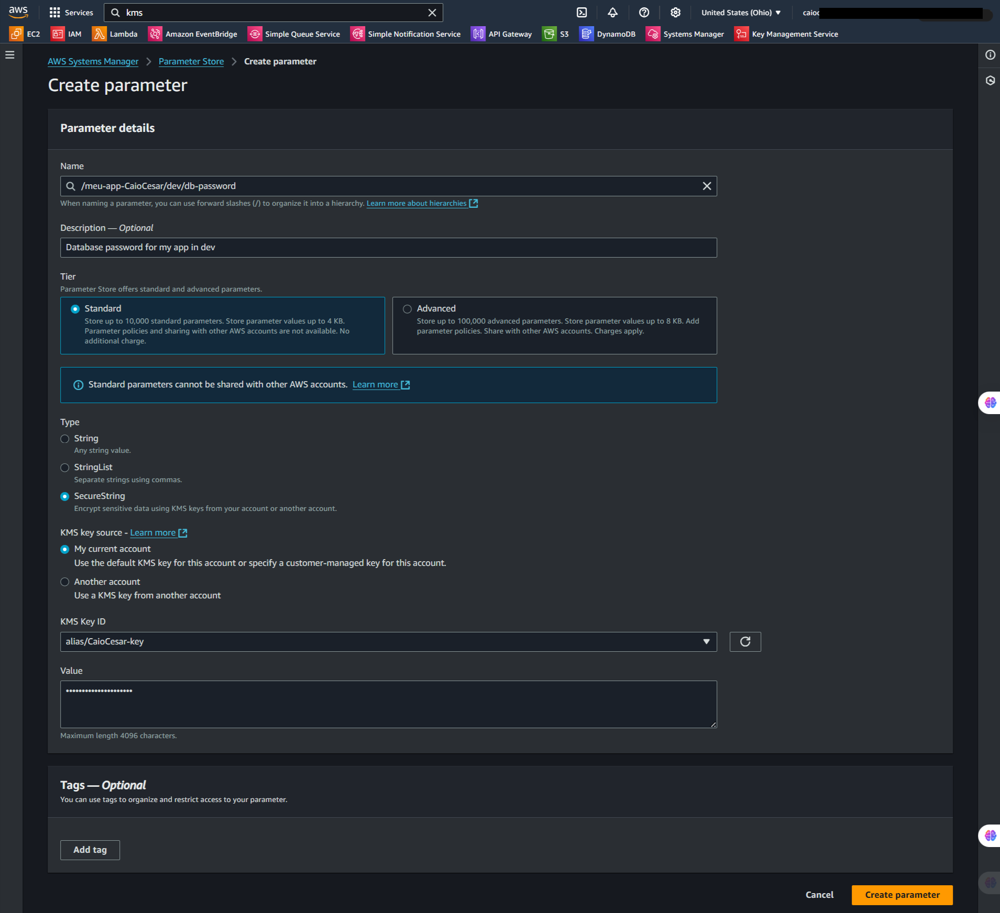
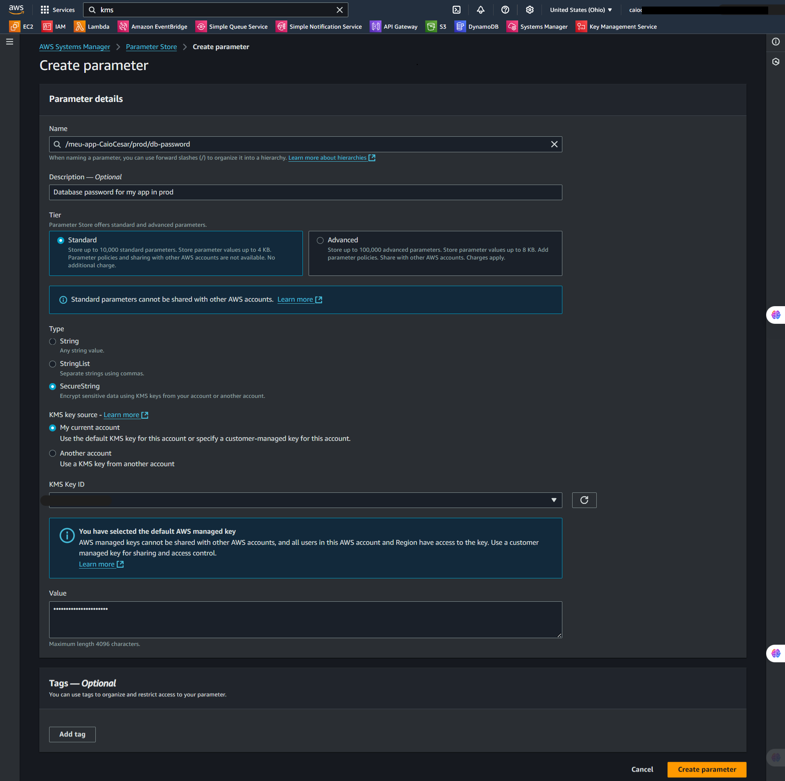

---

### 4. CLI Validation: Retrieving parameters via AWS CloudShell
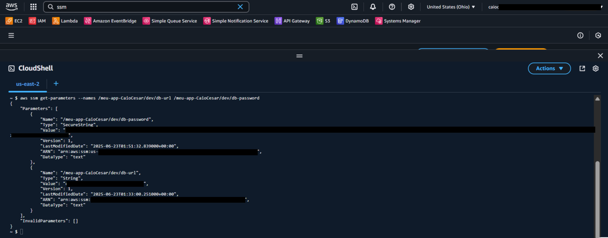
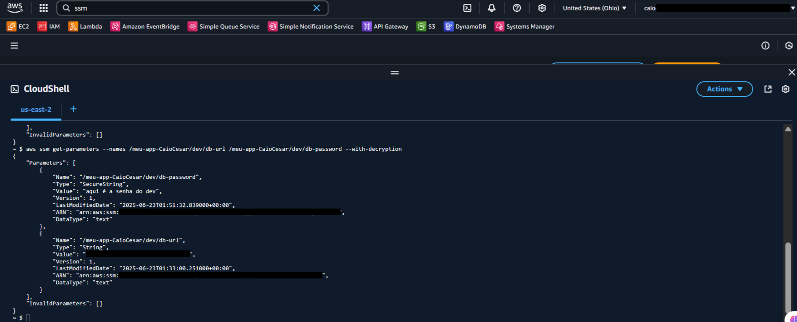

---

## 💡 Key Learnings

- **Cost-Efficiency:** SSM Parameter Store (Standard tier) is free for up to 10,000 variables. It's a highly economical alternative to AWS Secrets Manager when automatic rotation features aren't required.
- **Multi-Layered Security:** I learned that even if someone has access to the SSM console, they cannot see the real password value without specific permissions in the KMS "Key Policy." This creates a double barrier of protection.
- **Goodbye Hardcoding:** Centralizing configurations allows me to update a password or URL once, and every EC2 instance or Lambda function receives the update on its next execution without redeploying code.

---

## 💰 Cost Awareness

| Resource | Free Tier? | Estimated Cost |
|----------|-----------|----------------|
| SSM Parameter Store | ✅ Free for Standard parameters | $0.00 |
| AWS KMS | ✅ AWS Managed keys for SSM are free | $0.00 |

---

## 🏷️ Competencies Demonstrated

`AWS SSM Parameter Store` `KMS` `SecureString` `Secrets Management` `Application Security` `AWS CLI` `🟡 Intermediate`

---

[← Return to Index](../../../README-en.md)
