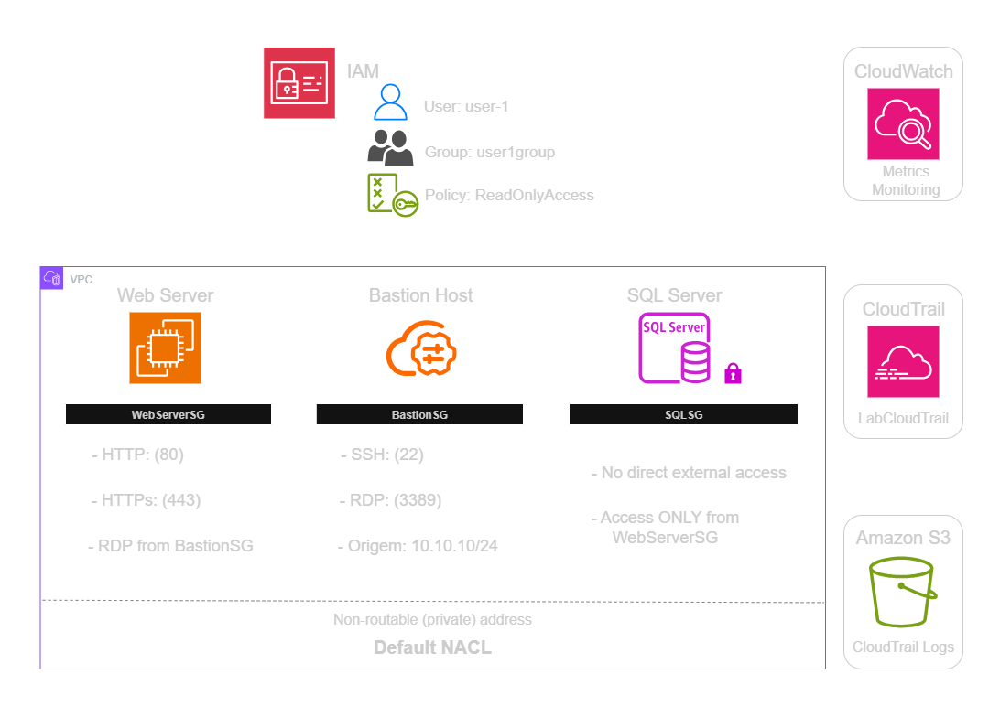
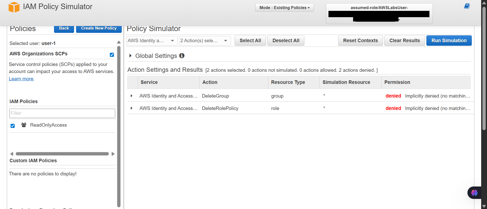
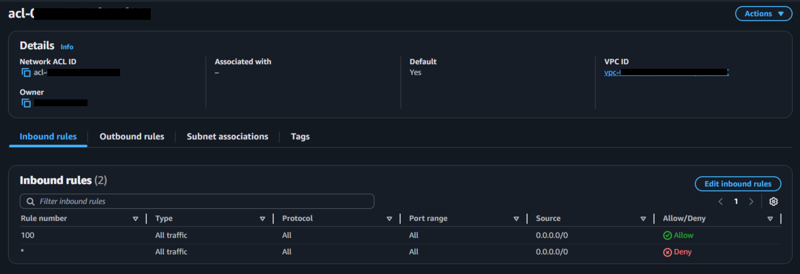
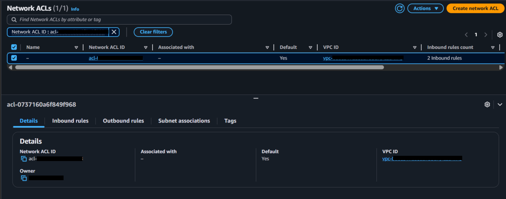
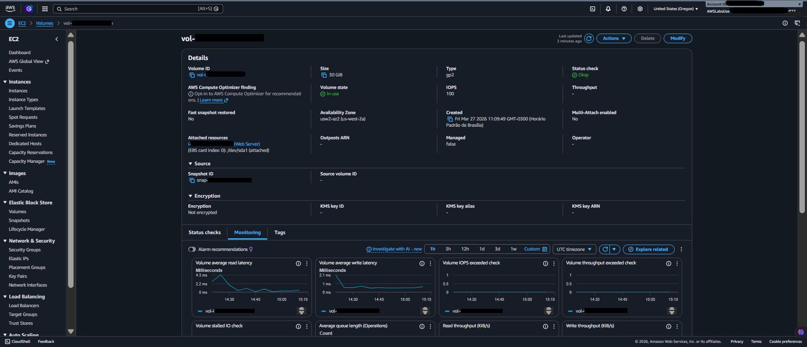
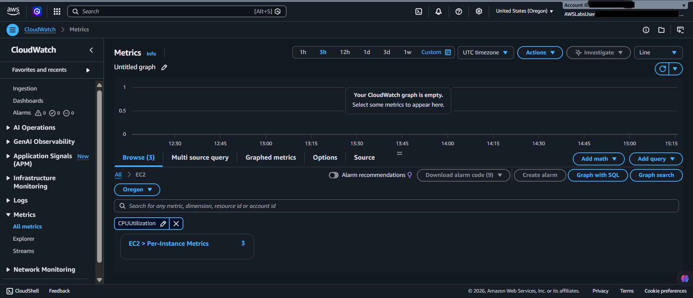
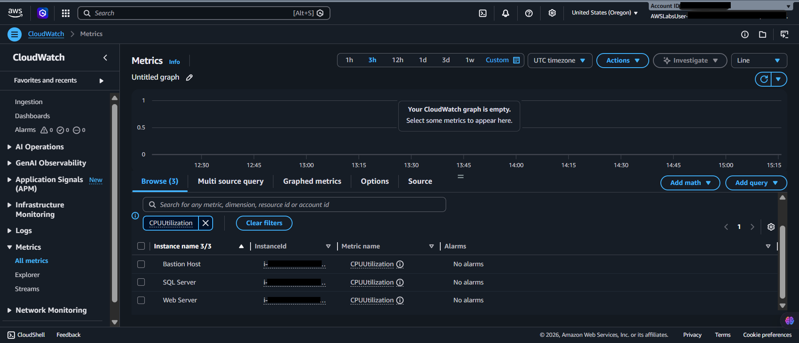
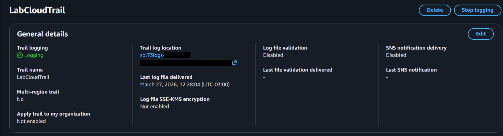
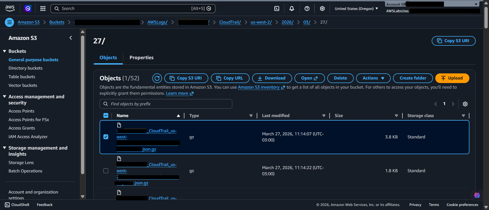

  <a href="./README-en.md">🇺🇸 English</a> |
  <a href="./README.md">🇧🇷 Português</a>

# Lab 07 — Performing a Basic Audit of your AWS Environment

## 🚀 Summary
Security Posture Validation and Compliance Auditing. In this lab, I conducted a deep dive into extracting security evidence and network controls. I simulated the actions of a security analyst, covering identity verification via the IAM Simulator, evaluation of firewall rules (Security Groups), checking network ACLs (VPC NACLs), and forensic analysis through CloudTrail logs stored in S3.

---

## 💼 Real-World Use Case
- **Industry:** Governance, Risk, and Compliance (GRC)
- **Problem:** A fintech investment fund initiated a technical audit (Due Diligence) of a startup before an acquisition. They needed proof that critical databases were not exposed to the public internet and that developers lacked the permissions to delete production resources on their own.
- **Solution:** As the cloud architect, I led the technical audit by providing formal evidence. I used the **IAM Policy Simulator** to prove that the `User-1` account is restricted from deleting groups or databases. I mapped the **Security Groups** and **VPC NACLs** to witness that only specific management ports are open. Finally, I extracted raw **AWS CloudTrail** logs directly from S3 to show the complete history of account actions, ensuring the transparency and security required by the buyers.

---

## 🎯 Learning Objectives

- Consolidate evidence extraction by analyzing user permissions in **AWS IAM**.
- Validate security blockages in real-time using the **IAM Policy Simulator**.
- Inspect host-level firewalls via **Amazon EC2 Security Groups**.
- Map subnet barriers using **VPC NACLs (Network Access Control Lists)**.
- Track and analyze API calls by extracting raw JSON files from **AWS CloudTrail**.
- Ensure the integrity of audit logs stored in **Amazon S3**.

---

## 🛠️ AWS Services Used

| Service | Task Role |
|---------|-----------|
| **AWS IAM** | Identity policy validation and simulation (Policy Simulator). |
| **Amazon EC2** | Target of firewall inspections and access rule analysis. |
| **Amazon VPC** | Logic network isolation and NACL rule analysis. |
| **AWS CloudTrail** | Recording and tracking all account management events. |
| **Amazon S3** | Long-term storage for compressed audit log files. |

---

## 🏗️ Architectural Audit Validation Scope

  

---

## 🖥️ Lab Steps

### 1. ⚙️ Identity Audit (IAM)
- **Action:** I evaluated the restrictions of the `user-1` profile. Instead of manually reviewing hundreds of lines of JSON, I processed a simulator test to confirm the user receives a "Denied" status when attempting to delete resources, proving the policies' effectiveness.

### 2. 🛡️ Firewall and Network Audit (VPC/EC2)
- **Action:** I inspected Security Groups to ensure sensitive protocols (like SSH) were restricted to authorized company IPs.
- **Validation:** I verified the VPC NACLs to witness a second, stateless defense layer that prevents unauthorized outbound traffic, reinforcing database isolation.

### 3. 🔍 Forensic Log Extraction (S3/CloudTrail)
- **Action:** I manually recovered the `.json.gz` files stored in the S3 audit bucket.
- **Analysis:** I opened the raw files to validate the origin (IP, user, and timestamp) of API calls, generating the final report that proves full traceability of the environment.

---

## 📸 Execution Evidences

### 1. Identity Audit: Restriction validation via IAM Policy Simulator

### 2. Network Audit: Inbound rule inspection in the Security Group

### 3. Access Control: NACL configuration acting at the subnet level

### 4. Resource Inventory: EBS volume details associated with the instance

### 5. Monitoring: Performance and health metrics in CloudWatch

---

### 6. Traceability: CloudTrail audit trail details

### 7. Forensic Storage: Raw and compressed logs saved in S3

## 💡 Key Learnings

- **Defense in Depth:** I learned that a strong Security Group does not replace the need for a solid NACL. If a human error opens the server firewall, the network rule (VPC) still provides a safety net.
- **Traceability is Crucial:** Without immutable logs in S3, investigations into "who deleted what" are built on assumptions. CloudTrail provides the irrefutable proof required for legal compliance.
- **Policy Simulation:** The IAM Simulator saves hours of "trial and error." It allows us to predict the behavior of complex permissions before granting access to users.

---

## 💰 Cost Awareness

| Resource | Free Tier? | Estimated Cost |
|----------|-----------|----------------|
| IAM Policy Simulator | ✅ Free | $0.00 |
| AWS CloudTrail | ✅ First trail is free | $0.00 |
| Amazon VPC | ✅ Network configuration is free | $0.00 |

---

## 🏷️ Competencies Demonstrated

`IAM Policy Simulator` `VPC NACL` `Security Groups` `AWS CloudTrail` `Security Auditing` `S3 Log Analytics` `🟡 Intermediate`

---

[← Return to Index](../../../README-en.md)
