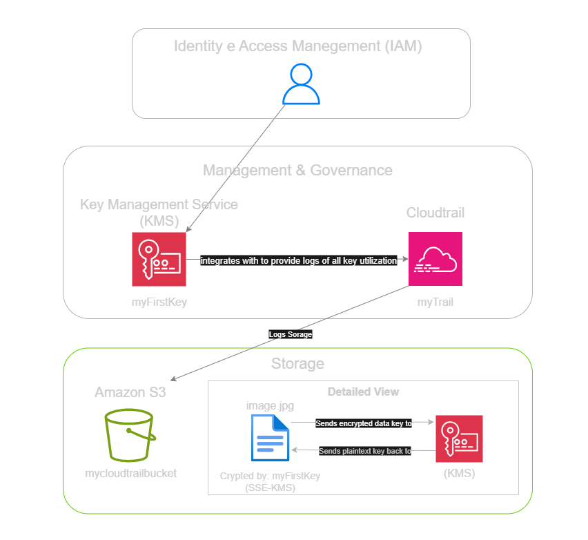
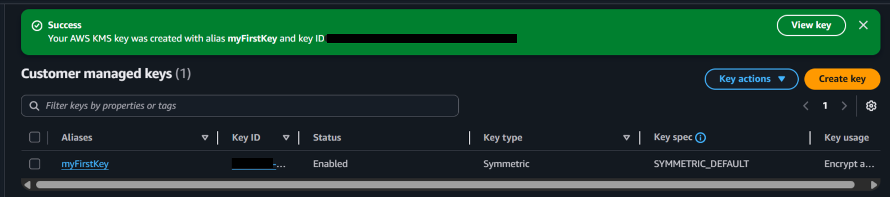
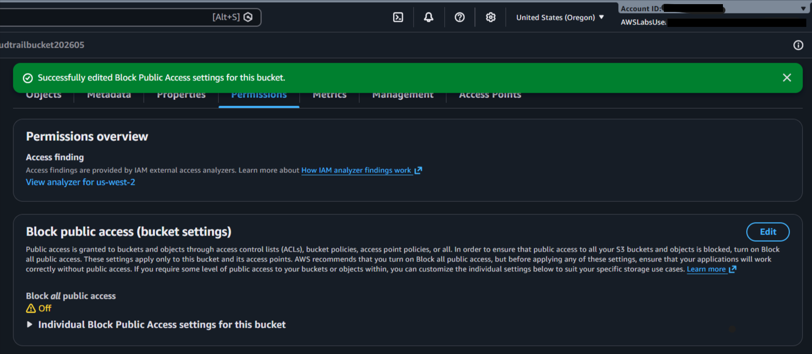
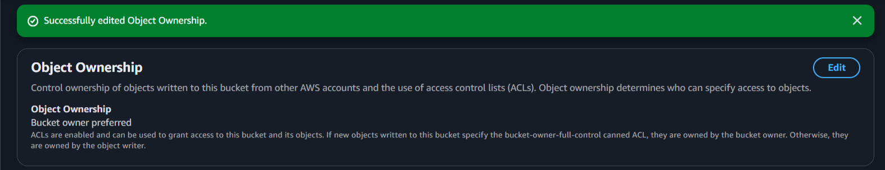
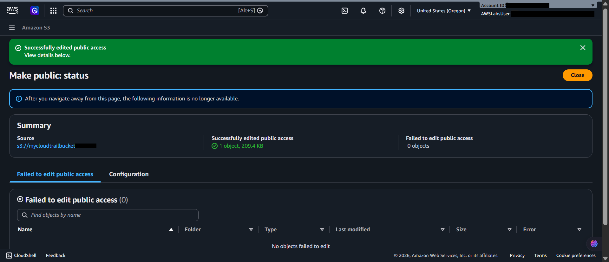
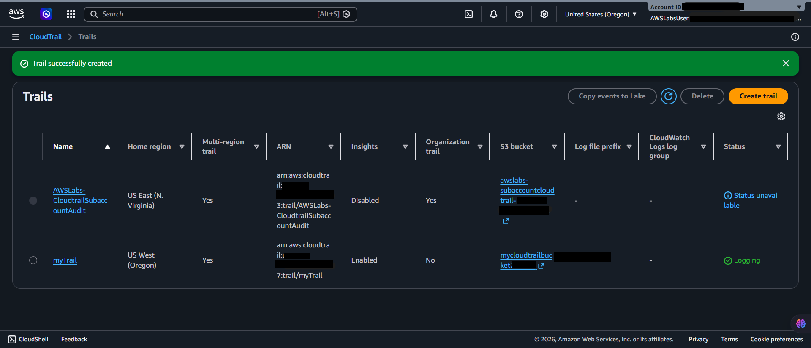
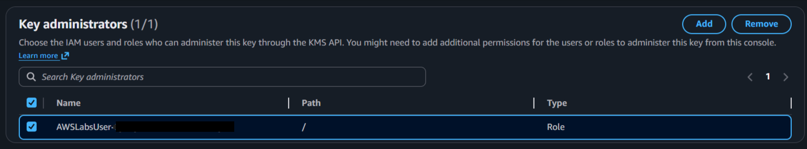

  <a href="./README-en.md">🇺🇸 English</a> |
  <a href="./README.md">🇧🇷 Português</a>

# Lab 08 — Introdução ao AWS Key Management Service (KMS)

## 🚀 Resumo
Criptografia Controlada e Compliance Rastreável: Neste laboratório, explorei as fundações do **AWS KMS** para proteger dados em descanso. Configurei o ciclo de vida completo de uma chave simétrica (Customer Managed Key), desde o provisionamento até o monitoramento de uso através do CloudTrail. Implementei a criptografia SSE-KMS em buckets S3, garantindo que apenas usuários autenticados e com permissões específicas pudessem decifrar os arquivos armazenados.

---

## 💼 Caso de Uso Real
- **Indústria:** Saúde (Hospitais e Seguradoras)
- **Problema:** Um sistema de prontuários médicos armazenava exames confidenciais no S3 usando a criptografia básica da AWS. A auditoria de conformidade (HIPAA/LGPD) reprovou o sistema porque a empresa não tinha controle sobre quem possuía as chaves e nem um registro de auditoria detalhado sobre quem visualizou cada exame individualmente.
- **Solução:** Implementei uma chave personalizada gerenciada pelo cliente (**CMK**). Agora, todos os uploads de exames usam SSE-KMS vinculado a essa chave. Isso significa que, além de ter permissão no S3, o médico precisa ter permissão explícita na política da chave KMS. Cada vez que um exame é baixado e decifrado, o **AWS CloudTrail** registra o evento `Decrypt`, fornecendo a prova forense exata de quem acessou os dados sensíveis dos pacientes, garantindo conformidade total com as leis de privacidade.

---

## 🎯 Objetivos de Aprendizado

- Criar e gerenciar **Customer Managed Keys (CMKs)** com algoritmos simétricos.
- Configurar **Key Policies** para separar as funções de Administrador e Usuário da chave.
- Aplicar criptografia **SSE-KMS** em objetos do Amazon S3.
- Validar a eficácia da proteção tentando acessar arquivos via links públicos (assinatura Signature V4).
- Analisar logs do **AWS CloudTrail** para auditar operações de descriptografia (`Decrypt`).
- Compreender o processo de exclusão programada de chaves para evitar custos desnecessários.

---

## 🛠️ Serviços AWS Utilizados

| Serviço | Papel no Lab |
|---------|-------------|
| **AWS KMS** | Gerenciamento de chaves mestras e políticas de criptografia. |
| **Amazon S3** | Armazenamento seguro de objetos com criptografia em repouso. |
| **AWS CloudTrail** | Auditoria e rastreio de uso das chaves criptográficas na conta. |

---

## 🏗️ Arquitetura do Fluxo Criptográfico

  

---

## 🖥️ Etapas do Laboratório

### 1. ⚙️ Criação da Chave Simétrica (CMK)
- **Ação:** Criei a chave `myFirstKey` no painel do KMS.
- **Configuração:** Defini meu usuário como Administrador (pode gerenciar a chave) e também como Usuário (pode usar a chave para criptografar/descriptografar). Esta separação é vital em empresas reais para evitar que o time de TI "bisbilhote" dados protegidos.

### 2. 🛡️ Upload Seguro no S3
- **Ação:** Realizei o upload de uma imagem para um bucket S3.
- **Configuração:** Durante o upload, alterei a criptografia padrão para **SSE-KMS** e selecionei a chave `myFirstKey`. O arquivo foi salvo em repouso já criptografado com o meu crivo de segurança personalizado.

### 3. 🔍 Teste de Falha e Auditoria
- **Ação:** Tentei acessar o arquivo através de um link público ajustando a ACL do objeto.
- **Resultado:** O link falhou com erro de assinatura ("Signature Version 4 required"). Isso prova que, mesmo com acesso público no S3, o KMS barra o acesso de qualquer um que não tenha a chave de descriptografia.
- **Auditoria:** Acessei o CloudTrail e localizei o evento `Decrypt`. O log mostrava meu usuário, o horário exato e a chave utilizada, fechando o ciclo de auditoria.

---

## 📸 Evidências de Execução

### 1. Configuração de Chave: Chave customizada (Customer Managed Key) ativa e configurada no console

### 2. Armazenamento Seguro: Arquivo no S3 utilizando a criptografia SSE-KMS vinculada à minha chave

### 3. Controle de Acesso S3: Ajuste de permissões e ACL do bucket para testar bloqueios

### 4. Teste de Acesso: Negação de acesso via link público devido à proteção criptográfica do KMS

### 5. Auditoria Forense: Logs do CloudTrail registrando o uso da chave e eventos de criptografia/descriptografia

### 6. Permissões de Chave: Painel de controle de permissões (Users/Admins) da chave KMS

## 💡 Principais Aprendizados

- **Key Policies vs IAM Policies:** Aprendi que ter permissão "AdministratorAccess" no IAM não garante acesso automático à chave KMS se ela tiver uma política restritiva. O KMS tem seu próprio "muro" de permissões.
- **Obrigatoriedade de Assinatura:** Arquivos protegidos por KMS exigem que a aplicação use tokens temporários válidos (SigV4). Isso mata ataques de links vazados na internet.
- **Custo de Chaves Customizadas:** Diferente da chave padrão da AWS (`aws/s3`), as chaves customizadas custam $1/mês. Por isso, é fundamental deletá-las após o uso em testes de laboratório.

---

## 💰 Consciência de Custos

| Recurso | Free Tier? | Custo Estimado |
|---------|-----------|----------------|
| AWS KMS (Chave Customizada) | ❌ Taxa mensal por chave ativa | ~$1,00/mês |
| Amazon S3 (Armazenamento) | ✅ Incluído no Free Tier | $0,00 |

> ⚠️ **Aviso Importante:** Agendei a exclusão da chave KMS imediatamente após o término do lab. A AWS impõe um período de espera mínimo de 7 dias antes de deletar a chave permanentemente para evitar perdas acidentais de dados.

---

## 🏷️ Competências Demonstradas

`AWS KMS` `Customer Managed Keys` `SSE-KMS` `S3 Encryption` `AWS CloudTrail` `Cloud Compliance` `Signature V4` `🟡 Intermediário`

---

[← Voltar ao índice](../../../README.md)
