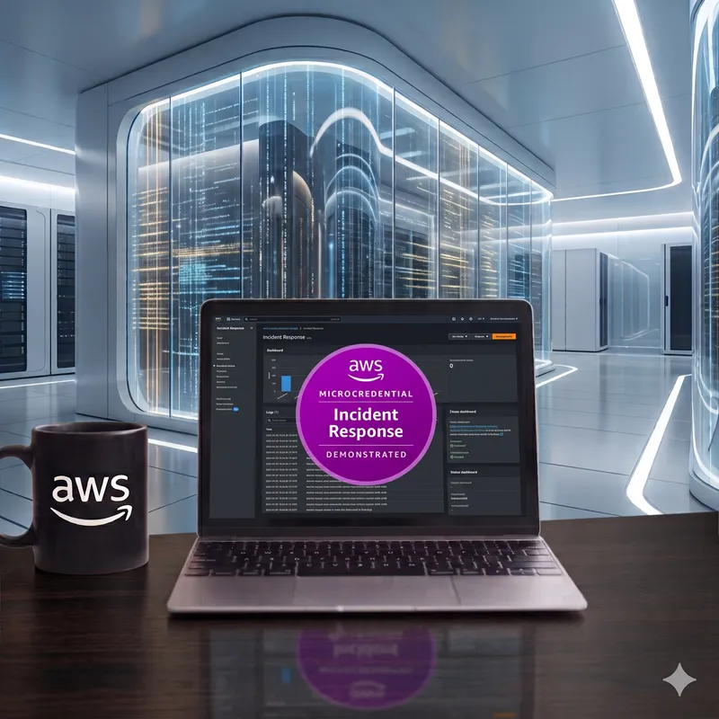
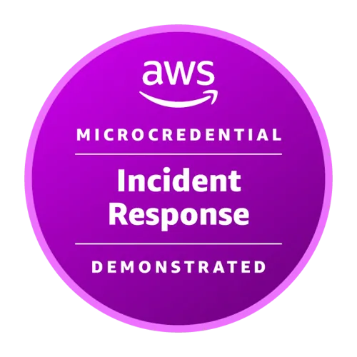

  <a href="./README-en.md">🇺🇸 English</a> |
  <a href="./README.md">🇧🇷 Português</a>

# Lab 09 — AWS Incident Response Demonstrated — Practical Exam Lab

  

## 🚀 Executive Summary
This lab is a **hands-on Exam Lab** focused on incident response. I acted as a SecOps engineer investigating, containing, and eradicating a live threat within a compromised AWS environment. The mission required completing **6 interdependent challenges** involving digital forensics, damage containment, and infrastructure hardening directly in the AWS console.

---

## 💼 Real-World Use Case
- **Industry:** Information Security / SecOps
- **Problem:** An AWS GuardDuty alert indicated communication with known malicious IPs. An investigation revealed that AWS credentials were leaked, EC2 instances were hijacked for cryptocurrency mining, and confidential databases were exposed and potentially exfiltrated.
- **Solution:** Immediate environment isolation using Security Groups and NACLs. Forensic analysis was conducted by querying CloudTrail logs via Amazon Athena. Backdoors were eradicated in IAM and EC2, remote access was transitioned to AWS Systems Manager (SSM) instead of SSH, and AWS Config was enabled to enforce continuous compliance.

---

## 🎯 Learning Objectives
*   **Investigate** security incidents using Amazon Athena to query structured AWS CloudTrail logs.
*   **Contain** active threats by manipulating route tables, Security Groups, and Network ACLs.
*   **Preserve forensic evidence** securely, ensuring data integrity within S3 and RDS.
*   **Eradicate backdoors** by revoking unauthorized IAM access and remediating compromised EC2 instances (e.g., enforcing IMDSv2).
*   **Prevent** recurrence by utilizing AWS Config for continuous auditing.

---

## 🛠️ AWS Services Used

| Service                       | Role in the Lab                                                   |
| ----------------------------- | ----------------------------------------------------------------- |
| **Amazon EC2**                | Compromised web servers and attacker mining instances.            |
| **Amazon RDS (MySQL)**        | Targeted database within the private subnet.                      |
| **AWS IAM**                   | Persistence vector: users, roles, and access policies.            |
| **AWS CloudTrail**            | Audit trail and primary source of forensic evidence.              |
| **Amazon Athena**             | Complex SQL queries on CloudTrail logs stored in S3.              |
| **Amazon S3**                 | Central repository for logs, evidence, and exfiltrated data.      |
| **AWS Config**                | Compliance monitoring and drift detection across the account.     |
| **Amazon VPC**                | Subnets, Security Groups, and Network ACLs for network isolation. |
| **Application Load Balancer** | Protected web traffic entry point.                                |
| **AWS Systems Manager**       | Secure access via Session Manager, replacing Bastion hosts.       |

---

## 🖥️ Lab Steps

### Challenge A: Database Security and Evidence Preservation
- Modified access policies to block ongoing exfiltration from Amazon RDS.
- Securely preserved forensic evidence gathered in Amazon S3 by utilizing immutability locks.

### Challenge B: Resource Identification and Eradication
- Discovered and terminated rogue EC2 instances (cryptocurrency mining).
- Hardened EC2 metadata security by enforcing Instance Metadata Service Version 2 (IMDSv2) to mitigate SSRF attacks.

### Challenge C: Audit and Compliance Controls
- Restored AWS CloudTrail audit trails that had been disabled by the attacker.
- Implemented AWS Config rules to continuously monitor the compliance state of resources.

### Challenge D: Backdoor Eradication and Least Privilege
- Investigated logs using Amazon Athena to map the attacker's lateral movement.
- Deleted compromised access keys and overly permissive policies (backdoors) in AWS IAM.

### Challenge E: Network Hardening and SSM
- Refactored Security Groups to strictly adhere to the principle of least privilege.
- Removed the need for public SSH by implementing AWS Systems Manager (SSM) Session Manager.

### Challenge F: Attacker Blocking (NACLs)
- Identified the attacker's Command and Control (C2) IP addresses via Athena.
- Created explicit Network ACLs (NACLs) to block malicious traffic at the subnet level.

---

## 📸 Execution Evidence

### Microcredential Earned

  

> [!IMPORTANT]
> This credential certifies the successful completion of the official AWS Skills Builder practical exam.

---

## 💡 Key Learnings
*   **CloudTrail + Athena = Total Visibility:** Analyzing raw JSON CloudTrail files is unfeasible during an incident. Mapping the S3 bucket as an Athena table with partitions allows you to answer questions like *"who assumed this role yesterday?"* in seconds.
*   **IMDSv2 is critical:** Many EC2 compromises occur via Server-Side Request Forgery (SSRF) accessing the `169.254.169.254` endpoint. Enforcing IMDSv2 tokens blocks the vast majority of these attacks.
*   **Session Manager replaces the Bastion:** Using SSM Session Manager eliminates the need to expose port 22 (SSH) to the internet while maintaining an auditable log of all sessions.

---

## 🔗 Additional Resources
- [AWS Skill Builder — Microcredentials](https://explore.skillbuilder.aws/learn/public/learning_plan/view/2070/microcredentials)
- [Querying AWS CloudTrail Logs with Amazon Athena](https://docs.aws.amazon.com/athena/latest/ug/cloudtrail-logs.html)
- [AWS Security Incident Response Guide](https://docs.aws.amazon.com/whitepapers/latest/aws-security-incident-response-guide/welcome.html)

---

## 💰 Cost Awareness

| Resource | Free Tier? | Estimated Cost |
|----------|-----------|----------------|
| AWS CloudTrail | ✅ 1st trail is free | $0.00 |
| Amazon Athena | ❌ $5.00 per TB scanned | ~$0.05 |
| Amazon EC2 / RDS | ✅ Depends on instance type | Variable |
| AWS Config | ❌ $0.003 per configuration item | ~$1.00/mo |
| AWS Systems Manager | ✅ Standard tier is free | $0.00 |
| **Estimated Total** | | **~$1.05** |

---

## 🏷️ Competencies Demonstrated

`Amazon EC2` `Amazon RDS` `AWS IAM` `AWS CloudTrail` `Amazon Athena` `Amazon S3` `AWS Config` `Amazon VPC` `NACLs` `AWS Systems Manager` `Incident Response` `Forensics` `🔴 Advanced`

---

## 📎 Reference

> This lab generated an in-depth technical walkthrough article:
> **👉 [Article: AWS Incident Response Demonstrated — Exam Lab na Prática](https://labs.caiocesar.tec.br/2026/06/28/aws-incident-response-demonstrated-exam-lab/)**
> 
> *Note: This repository is for study purposes and does not contain proprietary code from the AWS lab.*

---

[← Back to Index](../../../README-en.md)
