

  <a href="./README-en.md">🇺🇸 English</a> |
  <a href="./README.md">🇧🇷 Português</a>

# Lab 01 — Introduction to AWS Lambda: Serverless Image Processing

## 🚀 Summary
Event-Driven Data Processing: In this lab, I explored the *Serverless* compute capabilities of AWS using **AWS Lambda**. I designed an autonomous architecture where uploading an image to an **Amazon S3** bucket automatically triggers a **Python 3.12** function. Using the **Pillow** library, the function resizes the image to create a thumbnail and stores it in a second destination bucket, all without the need to manage any servers.

---

## 💼 Real-World Use Case
- **Industry:** E-commerce and Media Portals
- **Problem:** On a shopping site, users uploaded product photos that reached up to 10 MB. The site needed to display small thumbnails for the catalog, but the main application server slowed down when processing these images synchronously, affecting the browsing experience for all customers.
- **Solution:** I decoupled image processing using **AWS Lambda** by integrating an S3 bucket to act as an event trigger. Now, as soon as a photo is saved, the Lambda wakes up, generates the thumbnail in milliseconds, and saves it in an output bucket. The main application server is free to focus only on sales, while image processing scalability becomes infinite and extremely cheap, as I pay only for the exact execution time of each resize.

---

## 🎯 Learning Objectives

- Create **AWS Lambda** functions using the Python 3.12 runtime.
- Configure automatic triggers based on **Amazon S3** events.
- Handle files in real-time using the **Pillow** library within the Serverless environment.
- Manage granular access permissions via **IAM Roles** (Read from source S3 and Write to destination S3).
- Utilize Lambda's ephemeral `/tmp/` storage for temporary file processing.
- Monitor executions and debug errors via **Amazon CloudWatch Logs**.

---

## 🛠️ AWS Services Used

| Service | Task Role |
|---------|-----------|
| **AWS Lambda** | Python code execution for image resizing. |
| **Amazon S3** | Storage for source buckets (raw photos) and destination (thumbnails). |
| **Amazon CloudWatch** | Metric monitoring and execution log retention. |
| **AWS IAM** | Execution role definition with least privilege permissions. |

---

## 📐 Project Architecture

  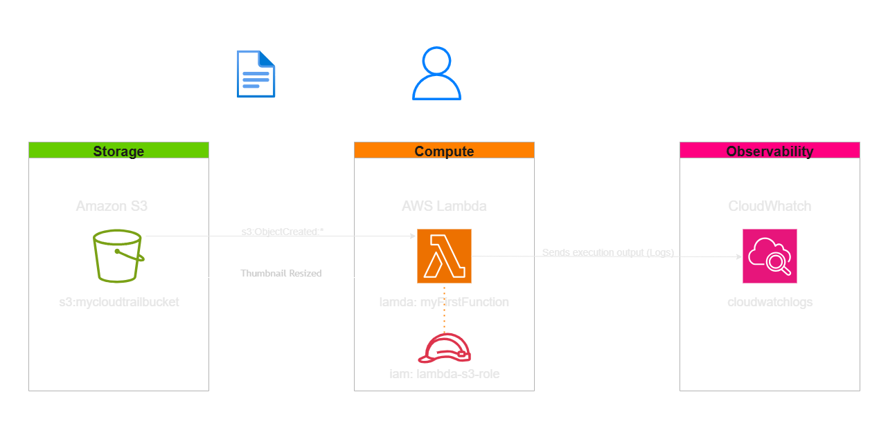

---

## ⚙️ Implementation Phases

### Phase 1 — Storage Preparation (S3)
- **Action:** I created two buckets: `images-original-66f` and `images-resized-66f`.
- **Purpose:** To isolate the input environment from the output, preventing an infinite loop where the Lambda would resize its own thumbnail.

### Phase 2 — Function Development (Lambda)
- **Action:** I created the `CreateThumbnail` function and configured the IAM Role.
- **Implementation:** I developed the script in Python using the `boto3` SDK. Since the `Pillow` library is not native to Lambda, I prepared a deployment package (.zip) containing the necessary dependencies for image processing.

### Phase 3 — Trigger Configuration
- **Action:** I added an "S3 Event Notification" trigger to the Lambda.
- **Filter:** I configured it to fire only on `s3:ObjectCreated:*` events and optionally for specific extensions, ensuring the function is not invoked by unnecessary files.

### Phase 4 — Testing and Validation
- **Action:** I uploaded a high-resolution image and monitored the CloudWatch Logs.
- **Result:** I validated that the destination bucket received the reduced version of the image instantly, with the log confirming the successful processing.

---

## 📸 Execution Evidences

### 1. Preparation (S3): Creation of source and destination buckets
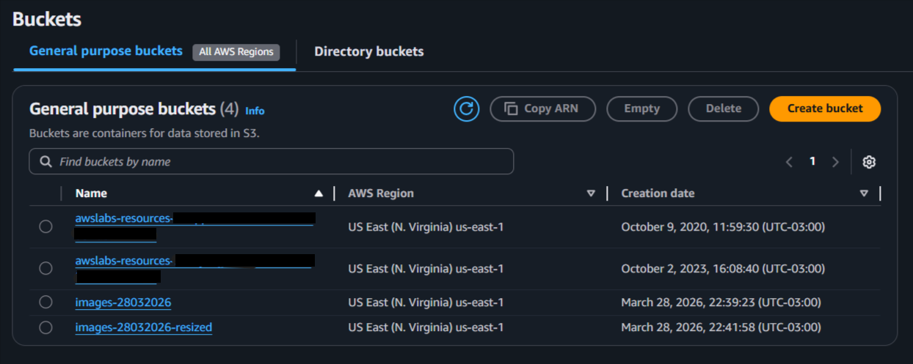

### 2. Function Creation: Initialization of the `CreateThumbnail` Lambda
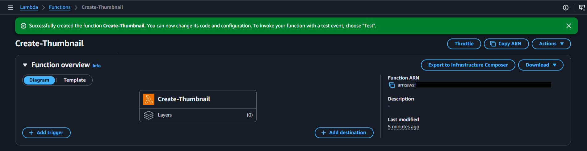

### 3. Creation Success: Confirmation of Lambda creation and dashboard visibility
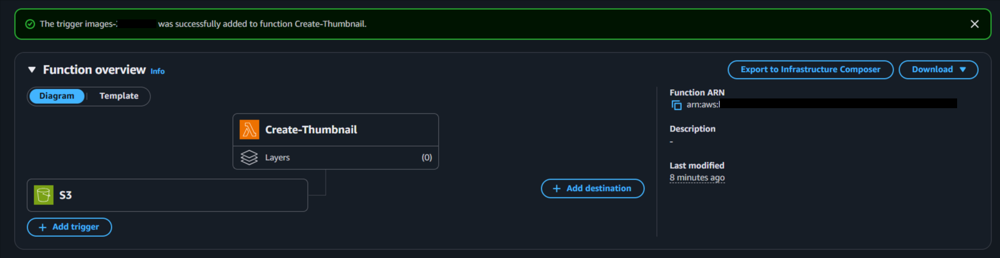

### 4. Basic Settings Edit: Configuration of execution timeout and memory limits
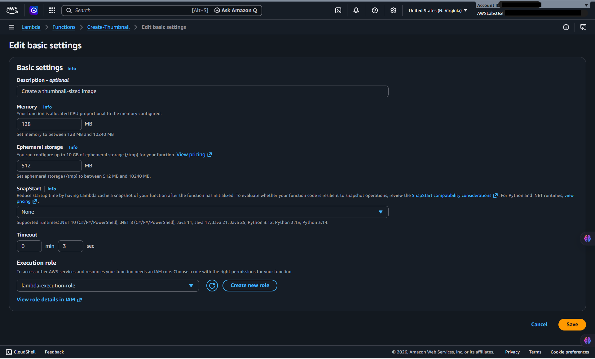

### 5. Runtime and Role: Defining S3-compatible IAM execution permissions
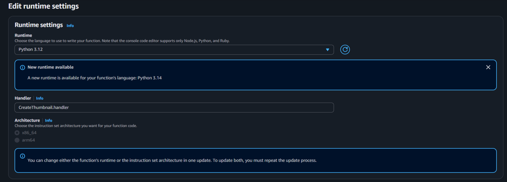

### 6. Package Deployment: Uploading the code .zip hosted on S3 with external libraries (Pillow)
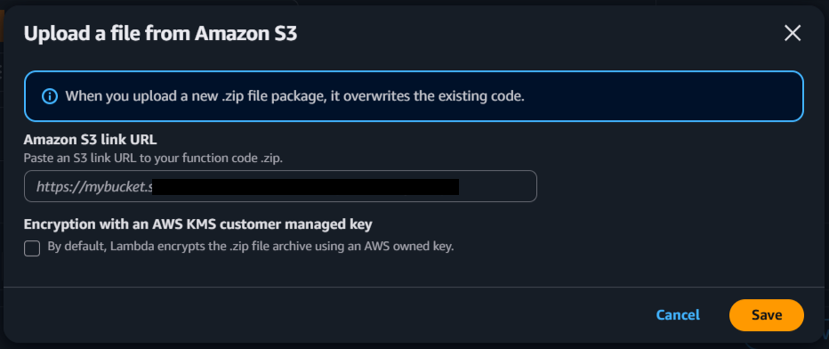

### 7. Trigger Configuration: Event associated with image PUT on the source bucket
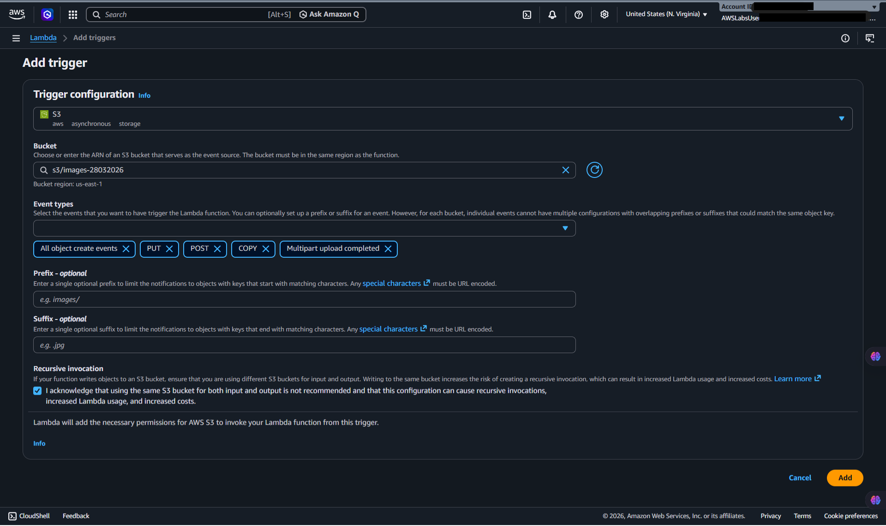

### 8. Test Execution: JSON Event Payload simulating an S3 PUT
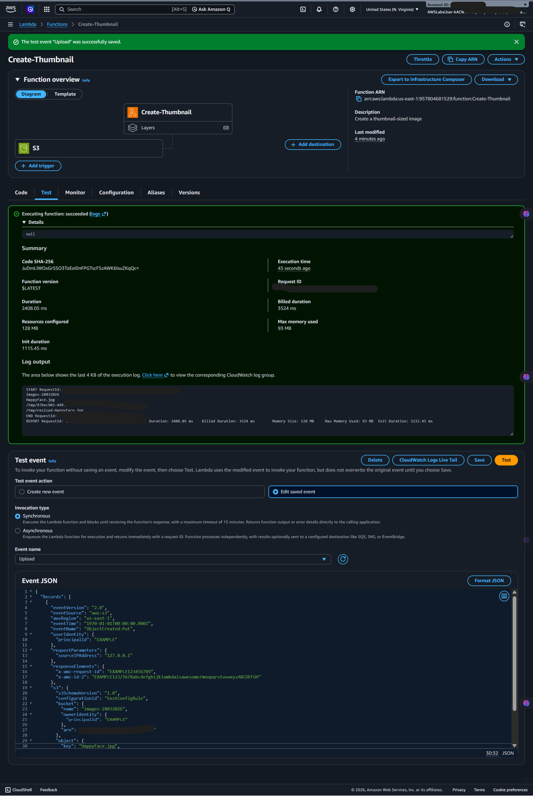

### 9. Invocation Monitoring: Real-time graphs covering Lambda invocations and errors
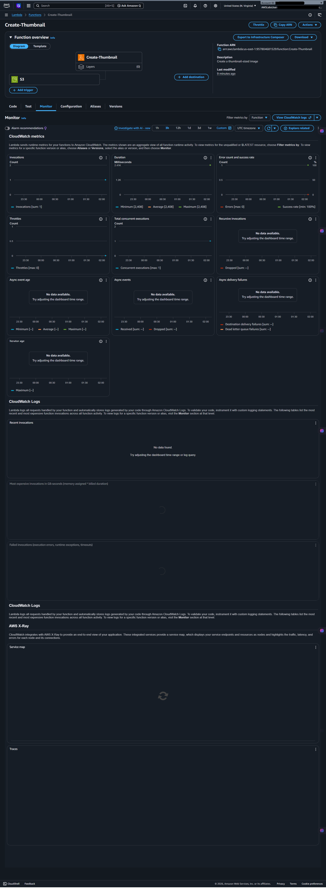

### 10. Success/Output: Thumbnail successfully generated and saved by the code
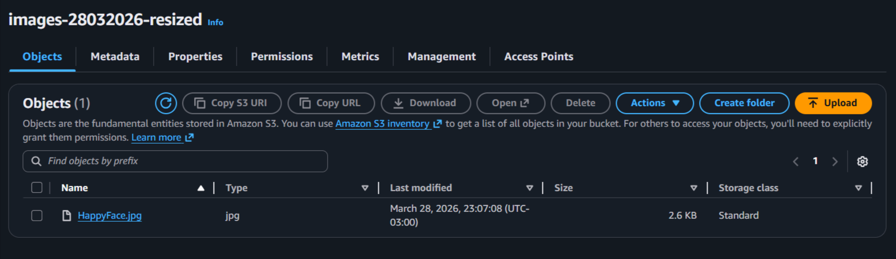

### 11. Visual Comparison: Original Image vs. Generated Thumbnail

**Original Image:**

**Processed Upload (Thumbnail):**

---

### 12. Log Traceability: Stream history of environments triggered by the Lambda
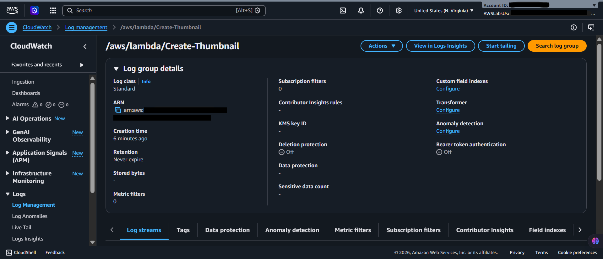

### 13. Performance Analysis: Confirmation of execution time and billed memory duration
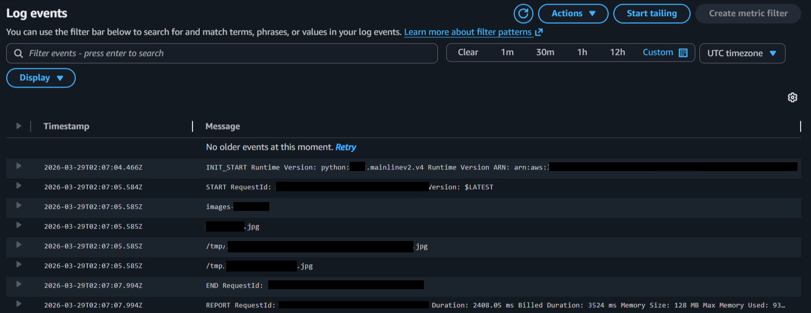

## 💡 Key Learnings

- **Event-Driven vs. Polling:** Instead of having a server checking for new files (polling), the Event-Driven architecture reacts only when the event occurs. This eliminates wasted resources and costs for idle servers.
- **Using /tmp/:** I learned that Lambda offers a temporary file system. It is essential to download the image to this directory, process it, and then send it to the destination, as we cannot manipulate the image "in the air" directly in memory in some file processing cases.
- **JSON Event Structure:** Lambda receives the file coordinates (bucket and key), not the file itself. Understanding how to navigate the JSON object sent by S3 is fundamental to the function's success.

---

## 💰 Cost Awareness

| Resource | Free Tier? | Estimated Cost |
|----------|-----------|----------------|
| AWS Lambda | ✅ 1 Million free requests/month | $0.00 |
| Amazon S3 | ✅ Up to 5GB in Standard storage | $0.00 |
| **Estimated Total** | | **$0.00** |

---

## 🏷️ Competencies Demonstrated

`AWS Lambda` `Amazon S3` `Event-Driven Automation` `Serverless Computing` `Python Boto3` `CloudWatch` `🔴 Advanced`

---

## 📜 Certification Alignment

- **CLF-C02:** Domain 3 — Technology (Serverless Cloud Computing)
- **DVA-C02:** Domain 1 — Development with AWS Services

---

[← Return to Index](../../../README-en.md)