

  <a href="./README-en.md">🇺🇸 English</a> |
  <a href="./README.md">🇧🇷 Português</a>

# Lab 02 — API Gateway Stages & Lambda Aliases

## 🚀 Summary
Serverless DevOps and Blue/Green Deployment: In this lab, I implemented secure code update strategies using **AWS Lambda** and **Amazon API Gateway**. I configured the use of immutable **Versions** and **Aliases** (PROD/DEV) to control the application lifecycle. Additionally, I used **Stage Variables** in API Gateway to route traffic dynamically, allowing a single API to point to different Lambda versions depending on the URL accessed, ensuring zero-downtime deployments and safe testing in development environments.

---

## 💼 Real-World Use Case
- **Industry:** Software Engineering and Microservices
- **Problem:** In a banking system project, developers were updating the same Lambda function used by live production customers. A poorly tested change crashed the payment service for hours because there was no separation between development work and stable production code.
- **Solution:** I restructured the deployment flow. Now, the Lambda has a frozen version ("version 1") associated with a **PROD Alias**. The API Gateway has two Stages: `/production` and `/development`. I configured a Stage Variable called `lambdaAlias`. When a customer accesses `/production`, the API uses this variable to call the `PROD` (stable) Alias. When a developer accesses `/development`, the API calls the `DEV` Alias (pointing to the latest `$LATEST` code). This completely isolates development errors from the critical production environment.

---

## 🎯 Learning Objectives

- Develop **AWS Lambda** functions with response logic integrated for API Gateway.
- Create and manage immutable **Versions** of Lambda functions.
- Implement **Aliases** (like `PROD` and `DEV`) to point to specific versions.
- Configure **Amazon API Gateway** to expose REST endpoints.
- Utilize **Stage Variables** in API Gateway (`${stageVariables.lambdaAlias}`) for dynamic routing.
- Validate the concept of Blue/Green Deployment by testing parallel production and development links.

---

## 🛠️ AWS Services Used

| Service | Task Role |
|---------|-----------|
| **AWS Lambda** | Backend processing with support for versioning and aliases. |
| **Amazon API Gateway** | Endpoint exposure and stage management (Stages). |
| **AWS IAM** | Permissions for API Gateway to invoke Lambda (Resource-based policy). |

---

## 🏗️ Deployment Architecture (Dev/Prod)

  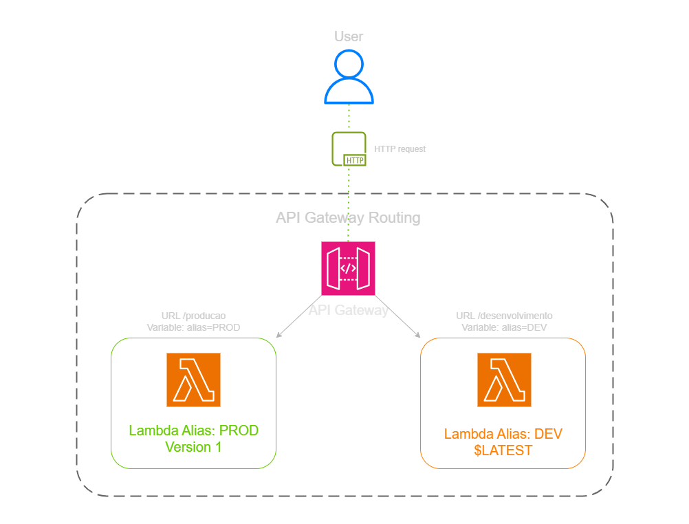

---

## 🖥️ Lab Steps

### 1. ⚙️ Backend Preparation (Lambda)
- **Action:** I created a basic Python Lambda function.
- **Versioning:** I published "Version 1" (immutable) and created `PROD` (pointing to V1) and `DEV` (pointing to the `$LATEST` draft) Aliases.

### 2. 🛡️ Dynamic API Configuration
- **Action:** In API Gateway, I created a `/hello` resource and a GET method.
- **Routing:** Instead of selecting a fixed Lambda function name, I used the variable syntax: `MyFunction:${stageVariables.lambdaAlias}`. This lets the API decide which version to call at runtime.

### 3. 🔍 Stage Creation
- **Action:** I created two Stages: `production` and `development`.
- **Variables:** In the `production` stage, I defined `lambdaAlias` as `PROD`. In the `development` stage, I set it to `DEV`.

### 4. 🧰 Validation Testing
- **DEV Result:** When accessing the development link, I saw the draft messages I was editing in real-time.
- **PROD Result:** When accessing the production link, the system returned only the frozen message from Version 1, proving my recent edits did not affect the stable environment.

---

## 📸 Execution Evidences

### 1. Creating the Lambda Function
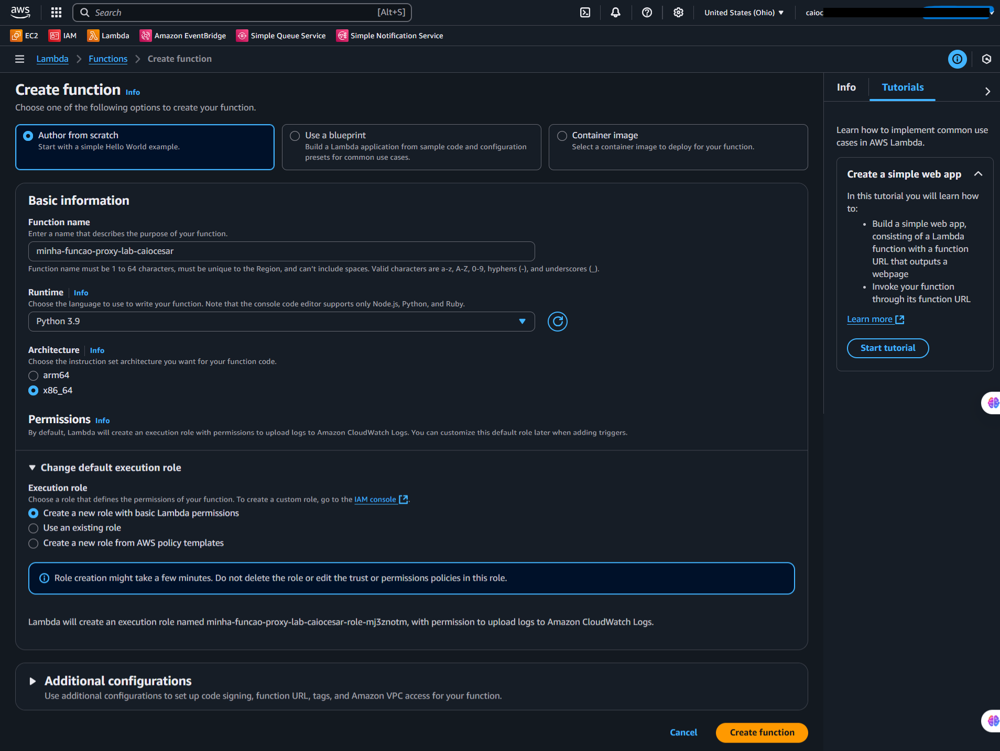

### 2. Lambda Function Created
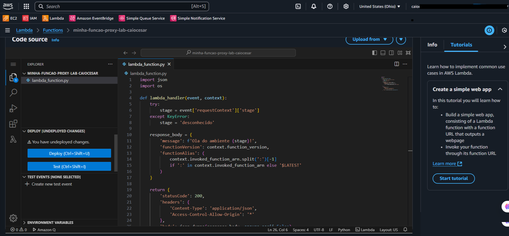

### 3. Configuring Test Event
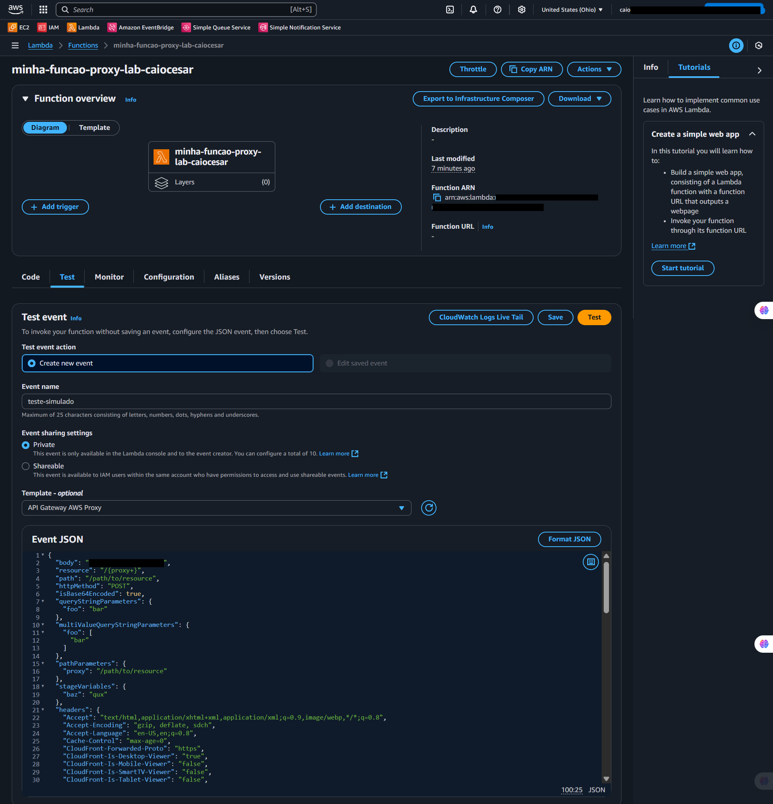

### 4. Lambda Test Execution Result
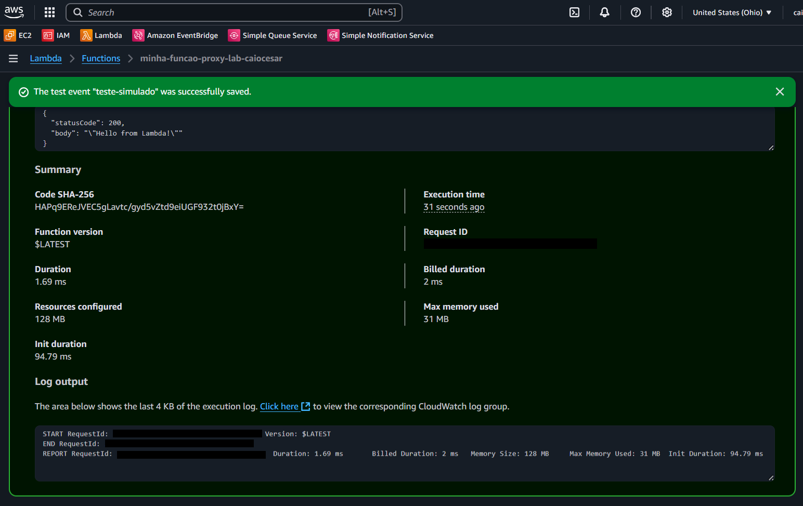

### 5. Creating the DEV Alias
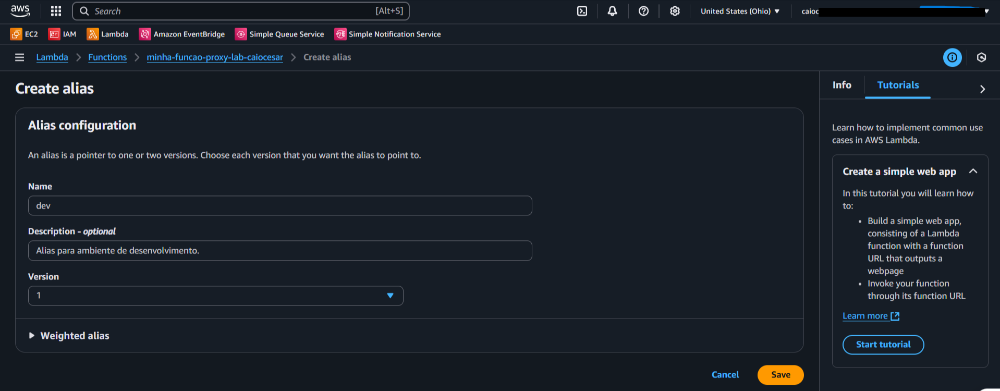

### 6. Lambda Function Overview
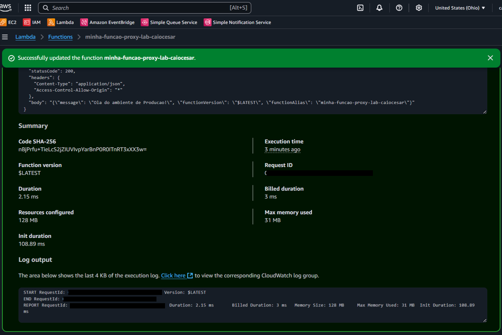

### 7. Published Versions (Immutability)
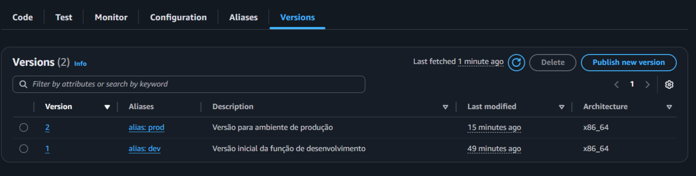

### 8. Creating the PROD Alias
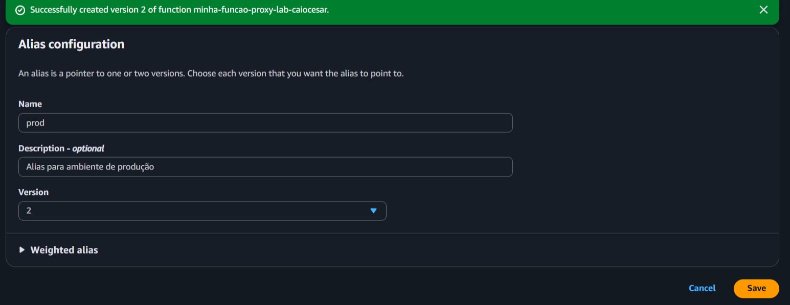

### 9. Aliases Index (PROD and DEV)
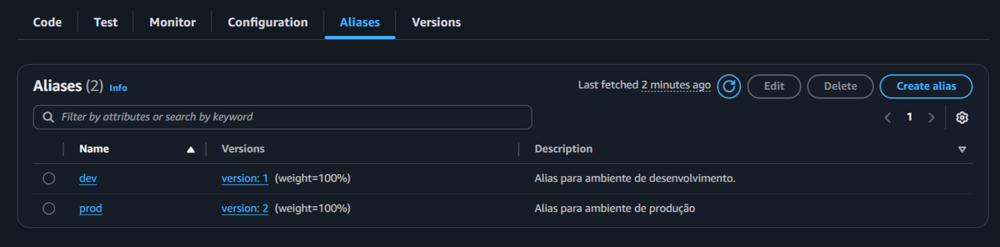

### 10. API Gateway Creation
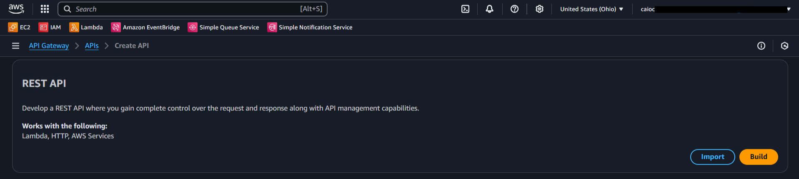

### 11. Selecting REST API Type
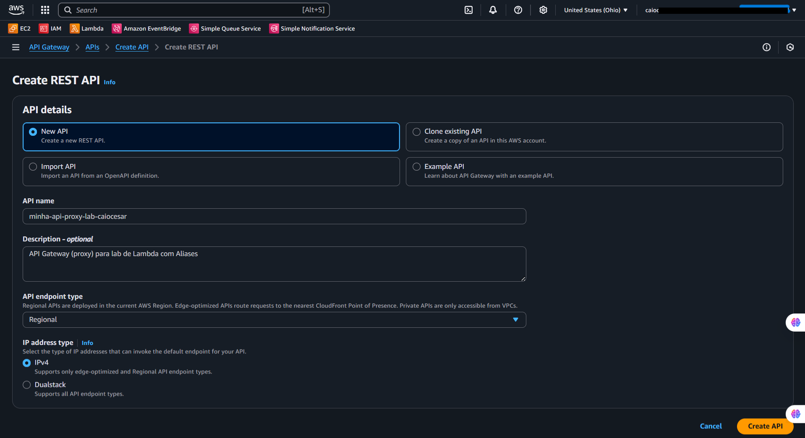

### 12. Creating the /hello Resource
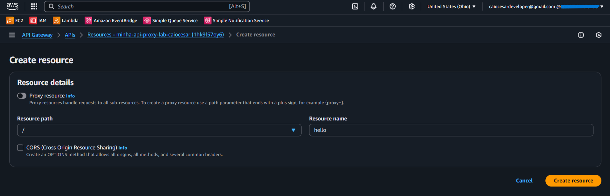

### 13. GET Method Configuration with Lambda Integration (Stage Variable)
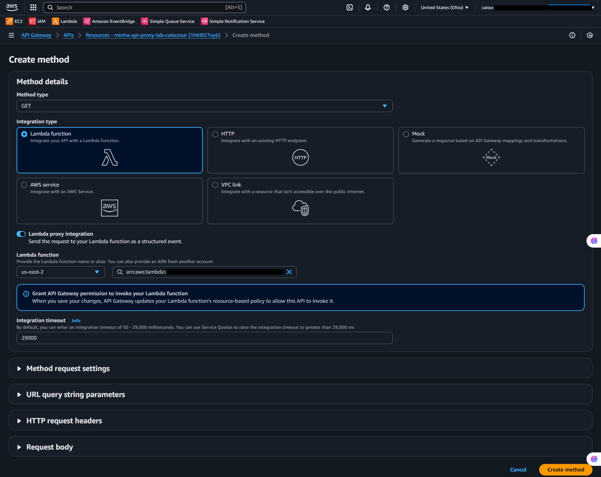

### 14. Deployment to Development Stage
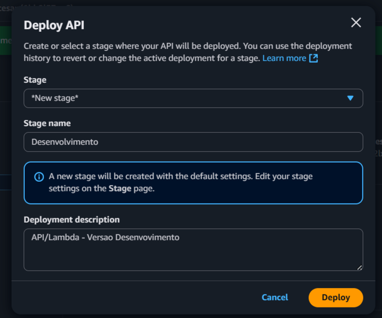

### 15. Integration Editing (Adding Permissions)
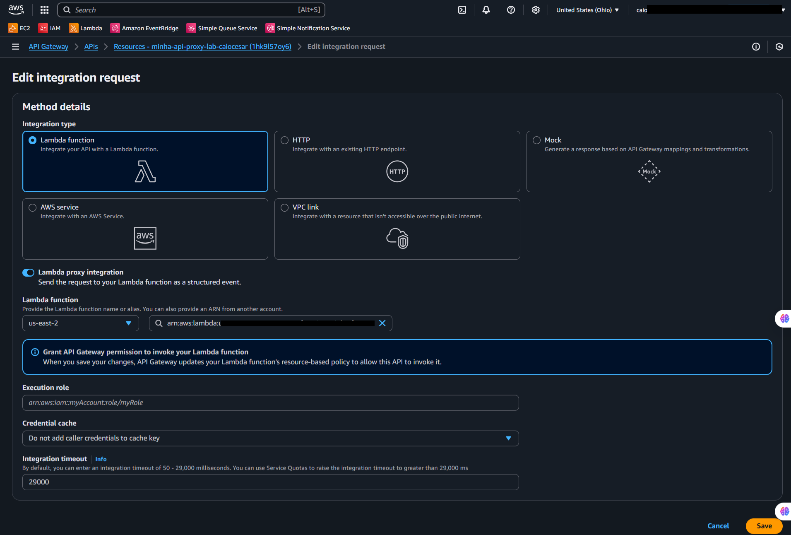

### 16. Deployment to Production Stage
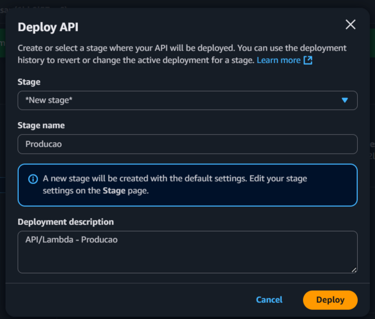

### 17. Stages Overview
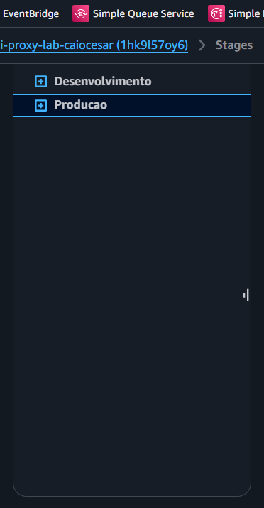

### 18. Expanded Routes within Stages
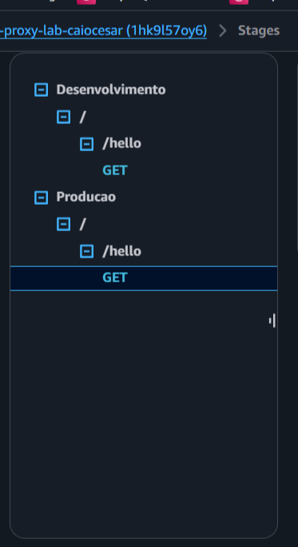

### 19. Dynamic Routing Test: Development Endpoint
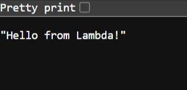

### 20. Dynamic Routing Test: Production Endpoint
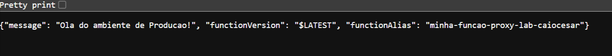

## 💡 Key Learnings

- **Versioning = Safety:** A published version never changes. This gives me the security that if something breaks in new code, I can revert the PROD Alias back to a known-good version in seconds.
- **Power of Stage Variables:** They prevent me from having to duplicate my entire API for testing environments. Routing is handled cleanly and programmatically.
- **Blue/Green Deployment:** This lab is the foundation of safe deployments. I can deploy Version 2, test it in the dev stage, and when ready, simply switch the PROD Alias from version 1 to 2.

---

## 💰 Cost Awareness

| Resource | Free Tier? | Estimated Cost |
|----------|-----------|----------------|
| AWS Lambda | ✅ 1 Million free requests/month | $0.00 |
| Amazon API Gateway | ✅ 1 Million calls/month (12 months) | $0.00 |
| **Estimated Total** | | **$0.00** |

---

## 🏷️ Competencies Demonstrated

`AWS Lambda Aliases` `API Gateway Stages` `Stage Variables` `CI/CD Concepts` `Blue-Green Deployment` `Serverless` `🟡 Intermediate`

---

## 📜 Certification Alignment

- **DVA-C02:** Domain 1 — Development with AWS Services (Lambda/API GW)
- **DVA-C02:** Domain 3 — Deployment and Lifecycle Management

---

[← Return to Index](../../../README-en.md)