

  <a href="./README-en.md">🇺🇸 English</a> |
  <a href="./README.md">🇧🇷 Português</a>

# Lab 03 — Automation with Lambda and EventBridge (EC2 Terminator)

## 🚀 Summary
Cloud Cost Governance and Automation (FinOps): In this lab, I implemented a fully automated infrastructure orchestration solution. I developed a **Python (Boto3)** script running on **AWS Lambda** to identify and terminate running EC2 instances. I configured **Amazon EventBridge** to act as a scheduler (Cron-job), triggering this routine periodically to ensure test environments do not stay on outside of business hours, eliminating unnecessary costs from idle resources.

---

## 💼 Real-World Use Case
- **Industry:** Cloud Governance and Corporate FinOps
- **Problem:** In a QA department, developers launch dozens of EC2 instances every day for quick testing. A recurring problem was that at the end of the day or before weekends, many would forget to turn off the servers. This generated heavy charges for servers running 100% idle for days on end.
- **Solution:** I created a "Cost Cleaner Script." I configured a Lambda with specific permissions to list and terminate instances. I used **Amazon EventBridge** to create a scheduling rule that fires every night at 8:00 PM (or every 1 minute for testing). The automation scans the region, finds running instances, and shuts them down automatically. The result was a drastic reduction in the company's monthly AWS bill, without relying on the engineers' memory.

---

## 🎯 Learning Objectives

- Apply the **Least Privilege** principle by creating an IAM policy that only allows `Describe` and `Terminate` for EC2 instances.
- Develop automation scripts using the **Boto3 library (AWS SDK for Python)**.
- Handle lists of resources returned in JSON format to filter instances by status.
- Configure automatic schedules using Cron expressions in **Amazon EventBridge**.
- Adjust Lambda performance settings (like `Timeout`) to handle loops for multiple resources.
- Validate automation by monitoring the EC2 state transition from "Running" to "Shutting-down" without manual intervention.

---

## 🛠️ AWS Services Used

| Service | Task Role |
|---------|-----------|
| **AWS Lambda** | Execution of automation logic in Python. |
| **Amazon EventBridge** | Scheduling trigger (Schedule) to fire the function. |
| **AWS IAM** | Execution role with restricted permissions to manage EC2. |
| **Amazon EC2** | Target resources of the shutdown automation. |

---

## 🏗️ Cost Automation Pipeline Architecture

  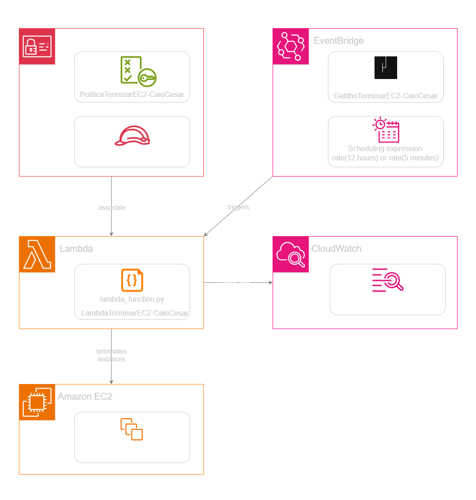

---

## 🖥️ Lab Steps

### 1. ⚙️ Execution Role Creation (IAM)
- **Action:** I created a custom Policy with `ec2:DescribeInstances` and `ec2:TerminateInstances` permissions.
- **Purpose:** To ensure the Lambda has the power only to shut down machines, without permission to create new resources or access other sensitive services.

### 2. 🛡️ Script Development (Lambda)
- **Action:** I developed the code in Python 3.12 using the standard Lambda handler.
- **Logic:** The script filters all instances with the `State` equal to `running` and extracts their `InstanceIds`. It then sends the termination command for all found IDs at once.
- **Adjustment:** I increased the function's `Timeout` to ensure it has time to process the list if many instances exist.
> 📄 **See source code:** [src/lambda_function.py](./src/lambda_function.py).

### 3. 🔍 Schedule Configuration (EventBridge)
- **Action:** I created a "Schedule" type rule in EventBridge.
- **Expression:** I used a cron expression for a daily shutdown or a "1 minute" rate to validate the laboratory operation in real-time.

### 4. 🧰 Practical Validation
- **Test:** I manually launched a "t2.micro" EC2 instance.
- **Result:** I waited for the EventBridge trigger and watched via the EC2 console as the instance automatically shifted to the termination state, validating the automation's success.

---

## 📸 Execution Evidences

### 1. IAM Policies List
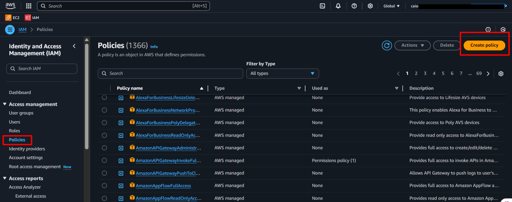

### 2. Policy JSON Editor
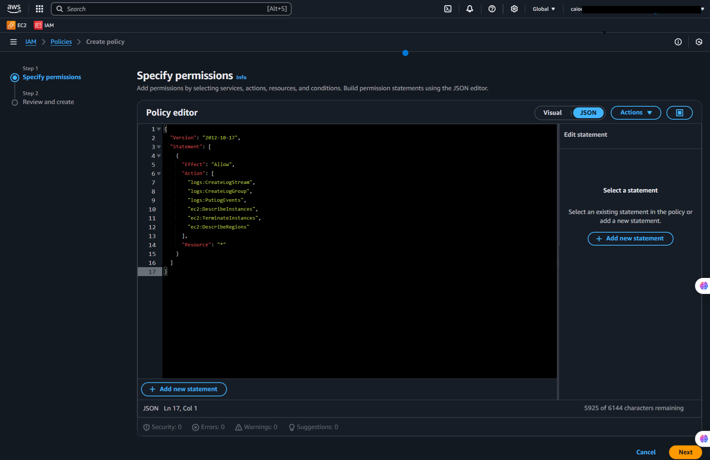

### 3. Policy Created Successfully
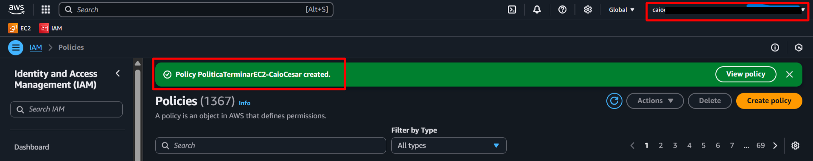

### 4. IAM Policy Details
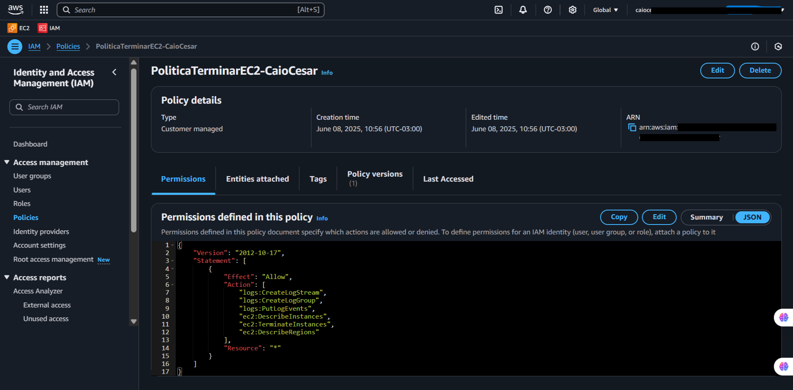

### 5. IAM Roles List
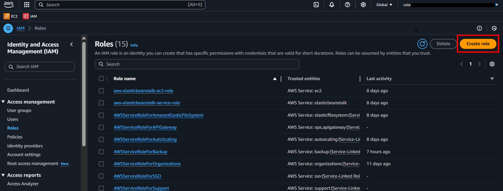

### 6. Create Role: Trusted Entity
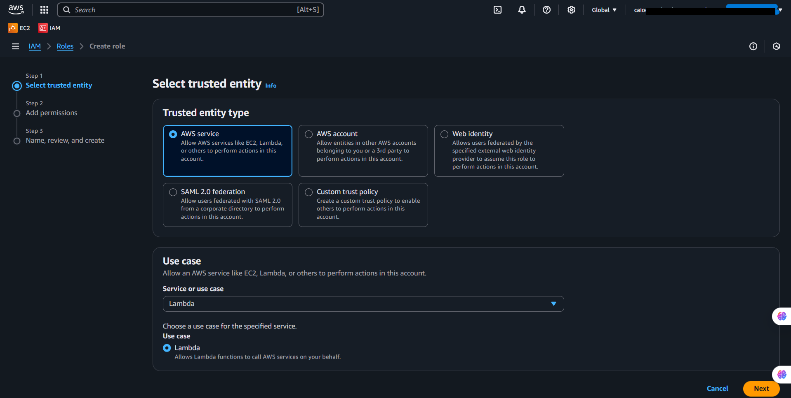

### 7. Create Role: Adding Permissions
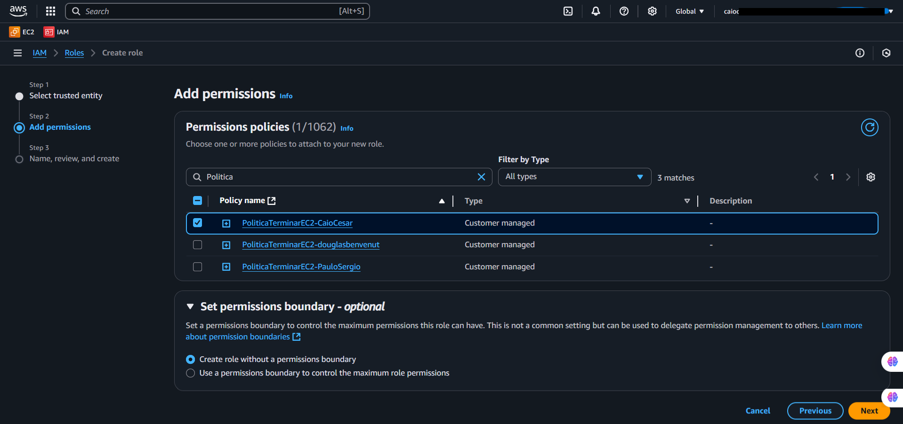

### 8. Create Role: Review
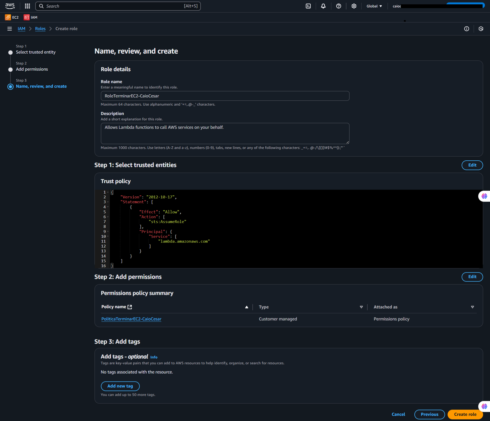

### 9. Created Role Details
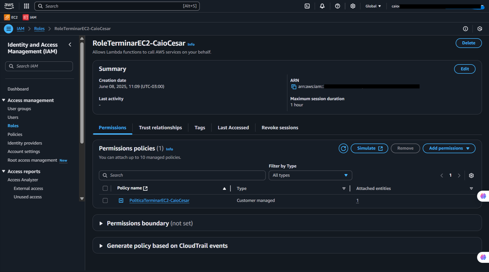

### 10. Creating Lambda Function
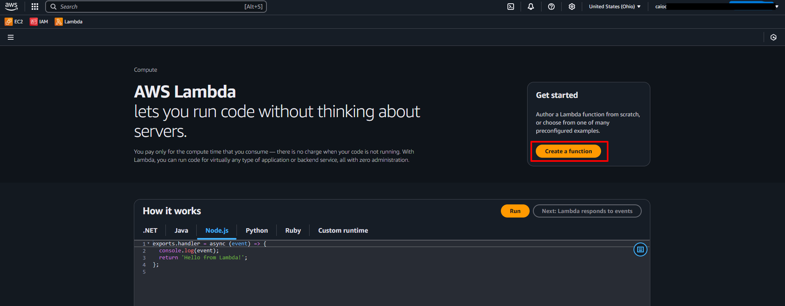

### 11. Lambda Function Configuration
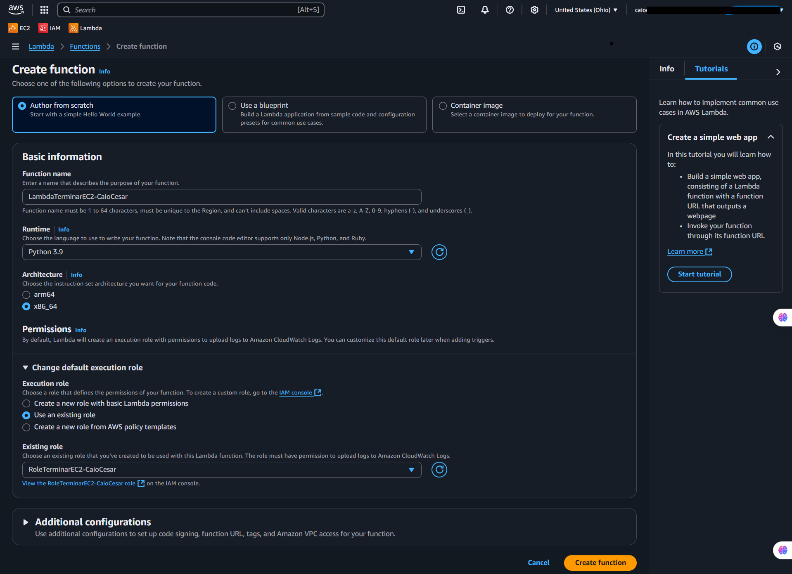

### 12. Lambda Function Created
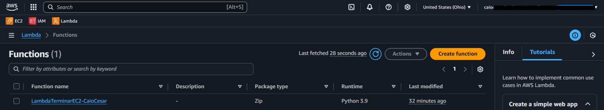

### 13. Editing Lambda Timeout
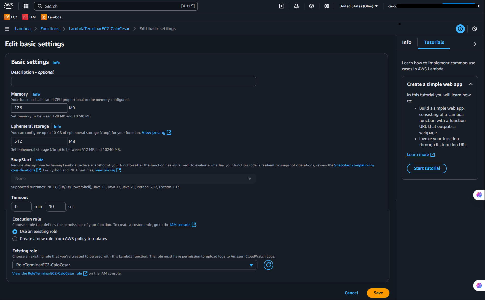

### 14. Editing Lambda Handler
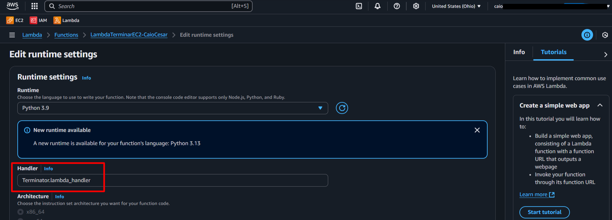

### 15. EventBridge: Adding Trigger
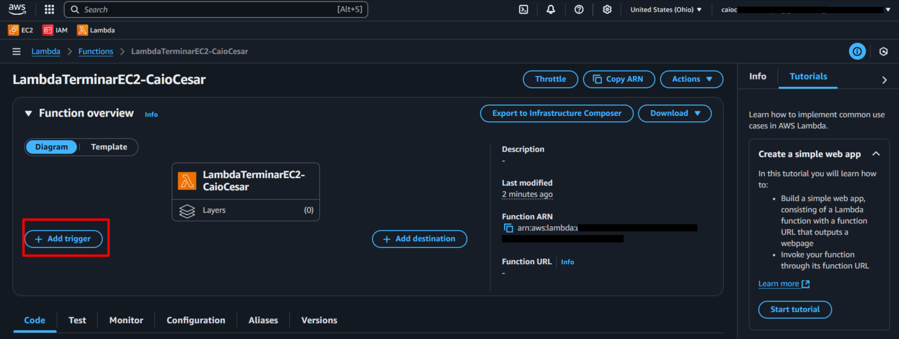

### 16. EventBridge Rule Configuration
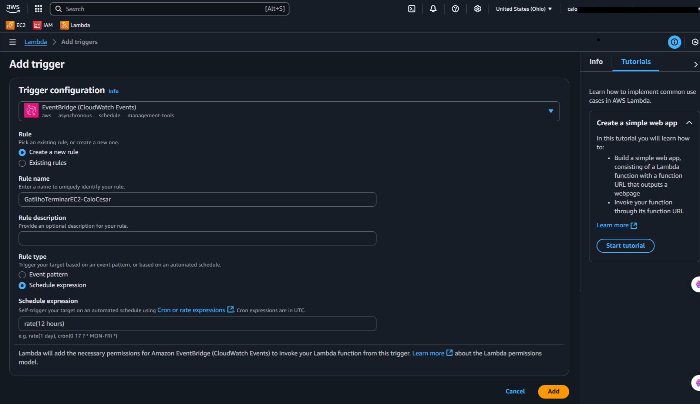

### 17. Lambda Overview: Trigger Active
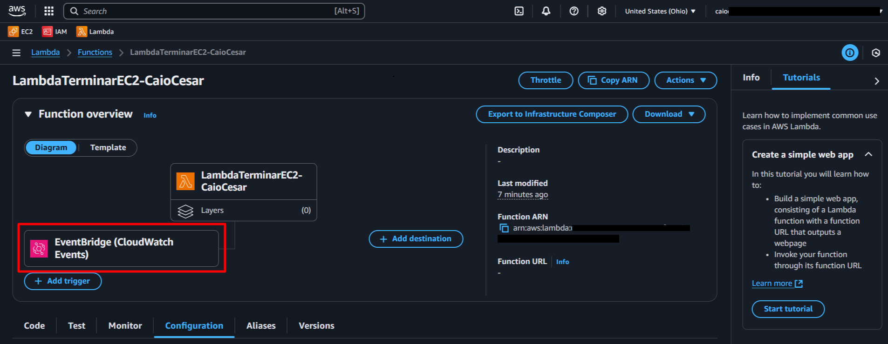

### 18. Lambda Trigger Details
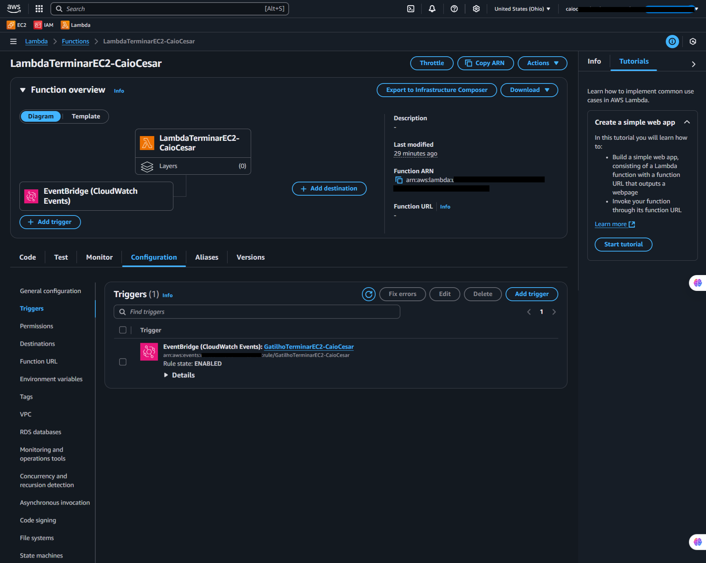

## 💡 Key Learnings

- **IAM Granularity:** I learned that giving `AdministratorAccess` to a Lambda is a huge security risk. Through granular permissions, I limited the "blast radius" of any code errors.
- **Automation vs. Manual Maintenance:** EventBridge eliminates the need to maintain dedicated script servers (such as a Jenkins server or Bastion with Crontab). It is a native, cheap, and serverless solution.
- **Handling Collections with Boto3:** I learned to iterate over complex JSON dictionary lists returned by the AWS API, extracting only the data needed for the final action.

---

## 💰 Cost Awareness

| Resource | Free Tier? | Estimated Cost |
|----------|-----------|----------------|
| AWS Lambda | ✅ 1 Million free requests/month | $0.00 |
| Amazon EventBridge | ✅ 1 Million scheduling events/month | $0.00 |
| **Estimated Total** | | **$0.00** |

---

## 🏷️ Competencies Demonstrated

`AWS Lambda` `Amazon EventBridge` `Cron Jobs` `FinOps (Cost Optimization)` `Boto3 Scripting` `EC2 Automation` `🔴 Advanced`

---

[← Return to Index](../../../README-en.md)
