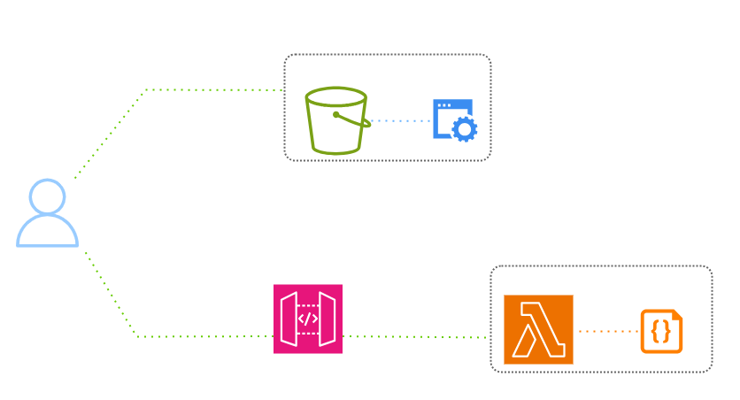
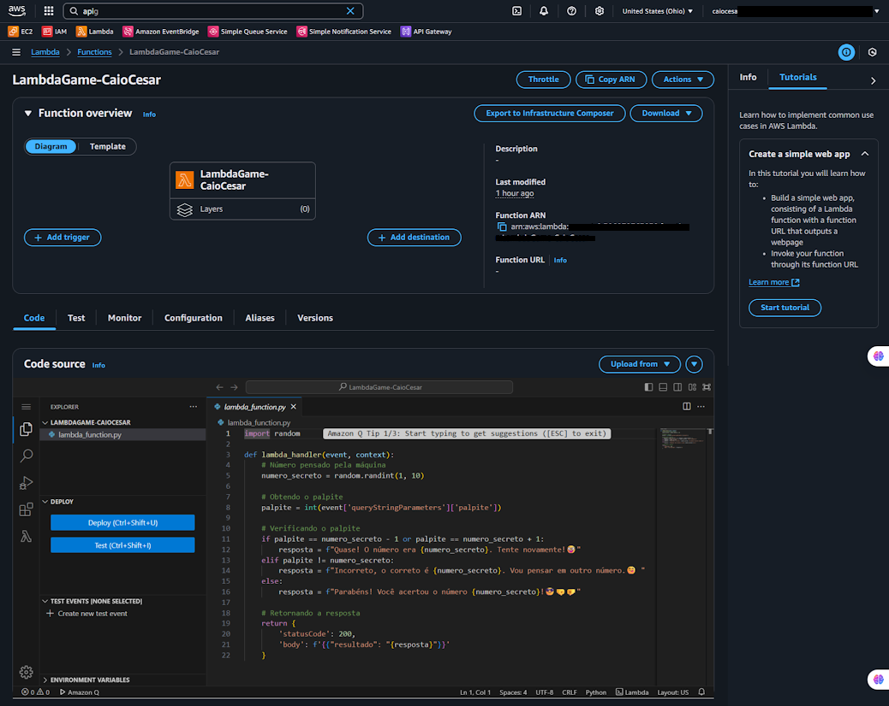
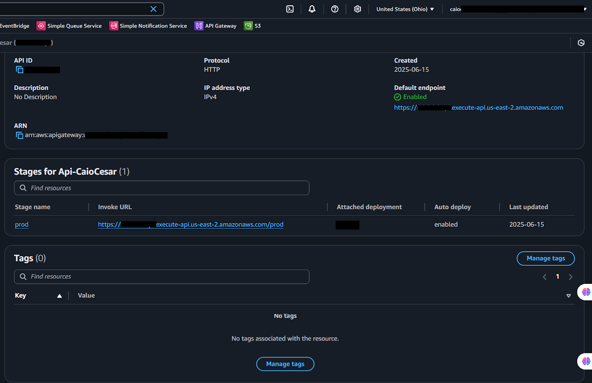
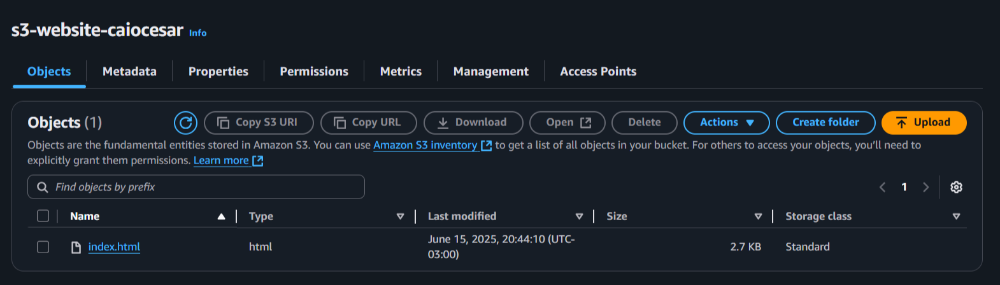

  <a href="./README-en.md">🇺🇸 English</a> |
  <a href="./README.md">🇧🇷 Português</a>

# Lab 04 — Full-Stack Serverless (S3, API Gateway, and Lambda)

## 🚀 Summary
Modern Full-Stack Serverless Architecture: In this lab, I built a complete "Guessing Game" application using only managed services. I hosted the static front-end (HTML/JS) on **Amazon S3**, utilized **Amazon API Gateway** to expose a REST interface, and developed the backend processing logic with **AWS Lambda (Node.js)**. This architecture demonstrates how to create scalable applications that cost zero when not in use, eliminate the need to manage servers or virtual machines.

---

## 💼 Real-World Use Case
- **Industry:** Digital Marketing and Promotional Hotsites
- **Problem:** An agency needed to launch a site for a one-week promotional campaign. They expected massive traffic spikes right after TV commercials, but the site would be nearly empty at other times. Running servers 24/7 to handle the peaks would be extremely expensive and inefficient.
- **Solution:** I implemented a Full-Stack Serverless solution. I placed the static site on S3 (Static Website Hosting), which handles massive traffic at a very low cost. For the interactive part of the promotion, I used Lambda + API Gateway. The result was a site that scales instantly for thousands of simultaneous users during commercials and costs absolutely nothing during idle periods, saving 90% of the original infrastructure budget.

---

## 🎯 Learning Objectives

- Host static websites with high availability via **Amazon S3 Static Website Hosting**.
- Develop backend logic in **Node.js** running on **AWS Lambda**.
- Create and publish RESTful endpoints using **Amazon API Gateway**.
- Configure and understand **CORS (Cross-Origin Resource Sharing)** to allow the front-end on S3 to communicate with the API.
- Integrate the front-end with the backend using native JavaScript `fetch()` calls.
- Validate synchronous communication between decoupled AWS services.

---

## 🛠️ AWS Services Used

| Service | Task Role |
|---------|-----------|
| **Amazon S3** | Front-end static hosting (HTML and JavaScript). |
| **AWS Lambda** | Game logic processing and response generation. |
| **Amazon API Gateway** | Entry point for browser requests via REST. |

---

## 🏗️ Serverless Architecture

  

---

## 🖥️ Lab Steps

### 1. ⚙️ Backend and Logic (Lambda)
- **Action:** I created a Lambda function in Node.js 20.x.
- **Logic:** I developed a handler that receives a number via JSON, compares it with a secret number, and returns whether the guess was high, low, or correct, including the necessary headers for the browser to accept the response.

### 2. 🛡️ Communication Interface (API Gateway)
- **Action:** I configured a REST API with a POST method.
- **CORS:** I enabled CORS support in the API Gateway to allow the S3 domain (a different origin) to make requests to the API without being blocked by browser security.

### 3. 🔍 Hosting and Connection (S3)
- **Action:** I created a bucket, disabled public access blocking, and enabled "Static Website Hosting."
- **Integration:** In the `index.html` file, I inserted the URL of the endpoint generated by the API Gateway. I uploaded the file to the bucket and obtained the public URL for the site.

### 4. 🧰 Final Validation
- **Test:** I accessed the site through the browser, entered guesses, and received instant responses from the Lambda via the API Gateway, confirming that the entire service chain was communicating perfectly.

---

## 📸 Execution Evidences

### 1. Lambda Code and Configuration

### 2. API Gateway Routes and CORS Mock

### 3. S3 Static Website Hosting

### 4. Game Interface and Final Validation

## 💡 Key Learnings

- **Total Decoupling:** Front-end and Backend can (and should) live in different places. This allows each part to scale independently.
- **The CORS Challenge:** I learned that browsers are strict with calls between different domains. Configuring the `Access-Control-Allow-Origin` headers correctly in the API Gateway is what allows this architecture to work.
- **Invisible Servers:** The biggest advantage is peace of mind. There is no operating system to update, no server to monitor. AWS manages all the infrastructure beneath the application.

---

## 💰 Cost Awareness

| Resource | Free Tier? | Estimated Cost |
|----------|-----------|----------------|
| AWS Lambda | ✅ 1 Million free requests/month | $0.00 |
| Amazon API Gateway | ✅ 1 Million free calls/month | $0.00 |
| Amazon S3 | ✅ Free hosting up to 5GB | $0.00 |
| **Estimated Total** | | **$0.00** |

---

## 🏷️ Competencies Demonstrated

`AWS Lambda` `Amazon API Gateway` `Amazon S3 Static Hosting` `CORS` `Full-Stack Serverless` `Node.js` `🟡 Intermediate`

---

## 📜 Certification Alignment

- **DVA-C02:** Domain 1 — Development with AWS Services
- **SAA-C03:** Domain 3 — Design Resilient and Scalable Architectures

---

[← Return to Index](../../../README-en.md)