

  <a href="./README-en.md">🇺🇸 English</a> |
  <a href="./README.md">🇧🇷 Português</a>

# Lab 05 — SNS Topic, SQS Queues, and Dead-Letter Queue (DLQ)

## 🚀 Summary
Asynchronous Messaging and Distributed Resilience: In this lab, I implemented a highly resilient messaging architecture using **Amazon SNS** and **Amazon SQS**. I configured a Pub/Sub model to decouple communication between services and implemented a **Dead-Letter Queue (DLQ)** to handle processing failures. I ensured error tolerance through a **Redrive Policy**, allowing messages that fail processing to be isolated for analysis without interrupting the system's main workflow.

---

## 💼 Real-World Use Case
- **Industry:** Fintech and Microservices
- **Problem:** A legacy billing system tried to process thousands of invoices in batches. If a single invoice had corrupt data, the PDF script would crash, halting the entire processing queue. This delayed the delivery of all other valid invoices and caused operational losses.
- **Solution:** I decoupled the system using SQS and SNS. Now, each invoice request is an individual message. If an invoice fails (for example, 3 consecutive times), the Main Queue automatically removes it and sends it to a **Dead-Letter Queue (DLQ)**. This allows the system to continue processing subsequent invoices normally, while I can analyze only the failed messages in the DLQ to fix the specific data error.

---

## 🎯 Learning Objectives

- Create and configure **SNS Topics** for message distribution (Fan-out).
- Provision standard **SQS Queues** for asynchronous task storage.
- Implement **Dead-Letter Queues (DLQ)** to isolate problematic messages (Poison Messages).
- Configure **Redrive Policies** with the `maxReceiveCount` parameter to control reprocessing attempts.
- Apply **Resource-Based Policies** on SQS to allow SNS to securely send messages to the queue.
- Simulate processing failures and validate the automatic migration of messages to the DLQ.

---

## 🛠️ AWS Services Used

| Service | Task Role |
|---------|-----------|
| **Amazon SNS** | Notification bus that distributes messages to subscribers. |
| **Amazon SQS** | Processing (Main) and contingency (DLQ) queues. |
| **AWS IAM** | Access policies to enable secure integration between SNS and SQS. |

---

## 🏗️ Pub/Sub + DLQ Architecture

  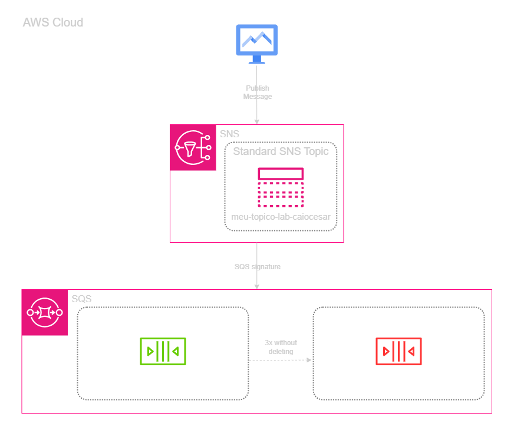

---

## 🖥️ Lab Steps

### 1. ⚙️ Queue Structure (SQS)
- **Action:** I created two queues: `Orders_Queue` and `Orders_DLQ`.
- **Configuration:** In the main queue (`Orders_Queue`), I enabled the Dead-Letter Queue by selecting `Orders_DLQ` and set the `Maximum receives` to 3.

### 2. 🛡️ Distribution Channel (SNS)
- **Action:** I created an SNS topic named `Order_Events`.
- **Subscription:** I added `Orders_Queue` as a subscriber to this topic.
- **Permission:** I updated the SQS Access Policy to allow my SNS topic's ARN to perform the `sqs:SendMessage` action.

### 3. 🔍 "Poison Message" Simulation
- **Action:** I sent a test message via the SNS console.
- **Controlled Failure:** In the SQS console, I viewed the message but did not delete it (simulating a worker error that fails to complete processing). I repeated this "read" process 3 times.

### 4. 🧰 DLQ Verification
- **Result:** After the third failed attempt, the message disappeared from the main queue and instantly appeared in `Orders_DLQ`, proving that the Redrive mechanism worked and the message was successfully isolated.

---

## 📸 Execution Evidences

### 1. Creating SQS Queues
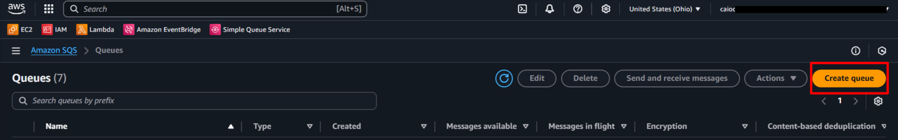

### 2. DLQ Configuration
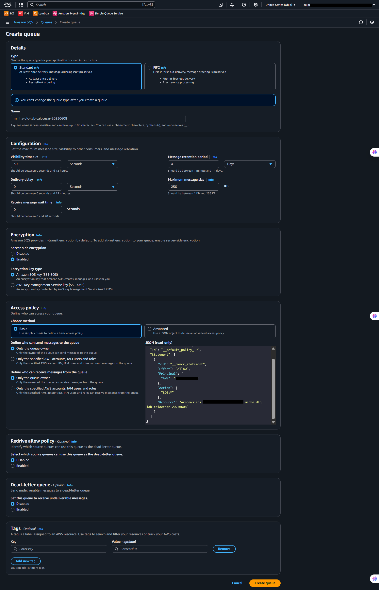

### 3. Main Queue Configuration and Redrive Policy
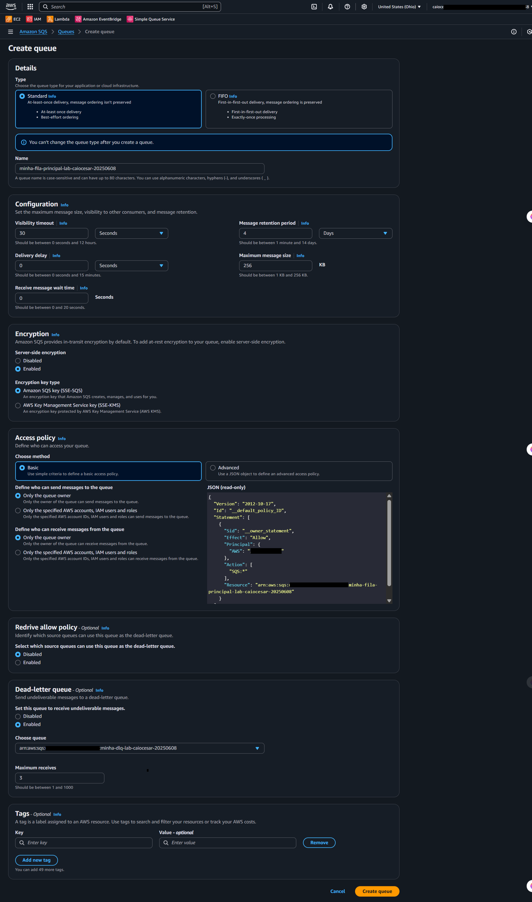

### 4. Creating SNS Topic
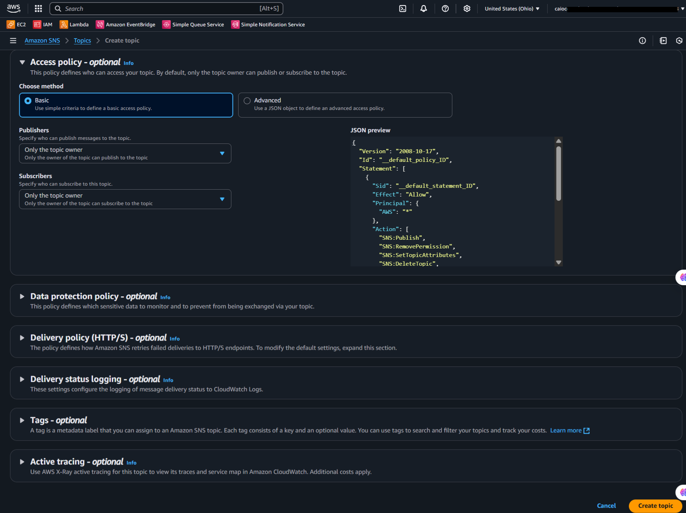

### 5. Queue Subscription to Topic
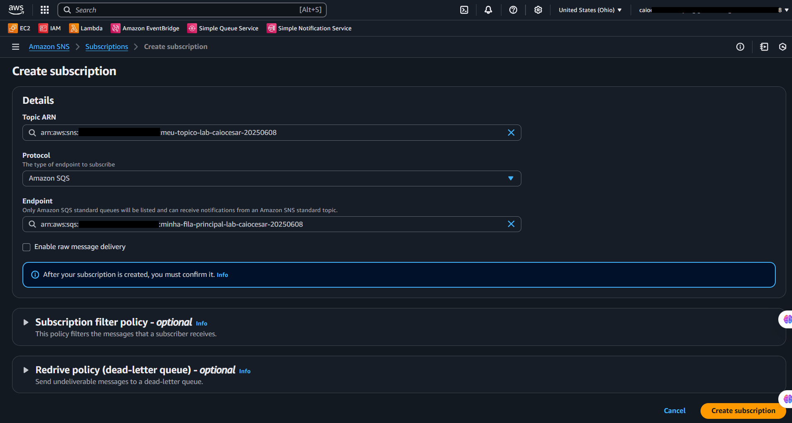

### 6. Editing Queue Access Policy
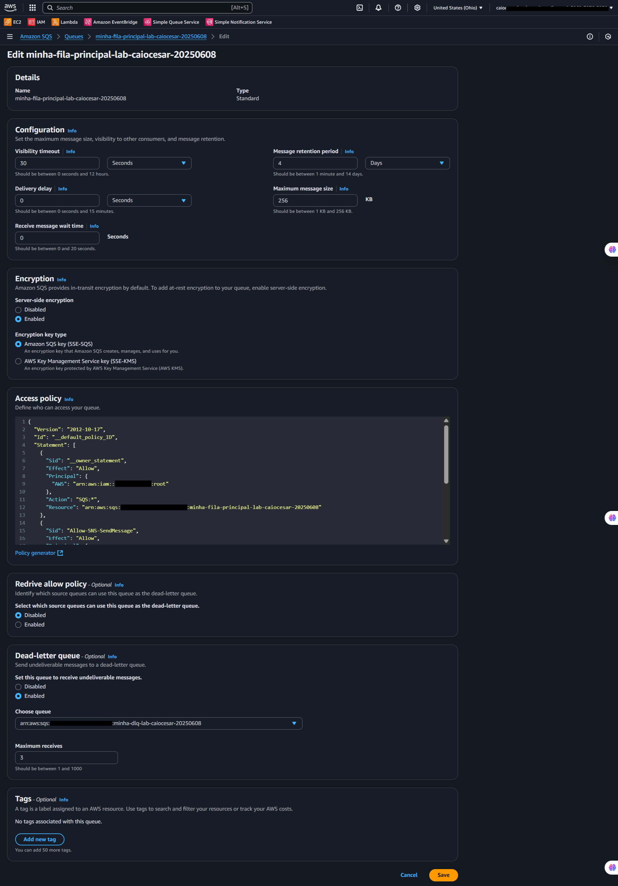

### 7. SNS Message Publishing Test
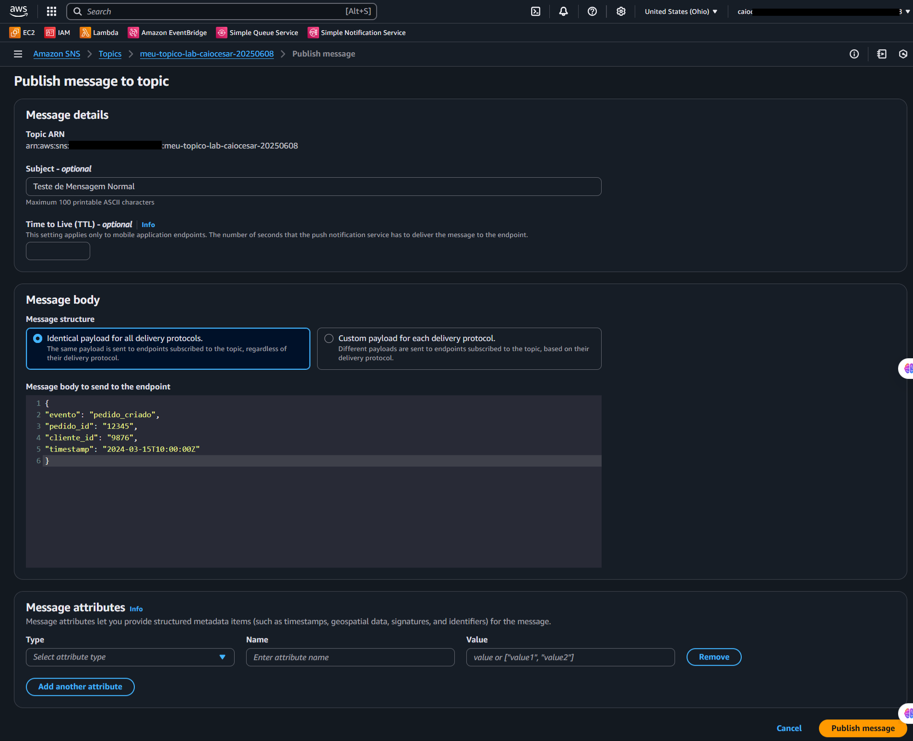

### 8. Message Sent and Available in Queue
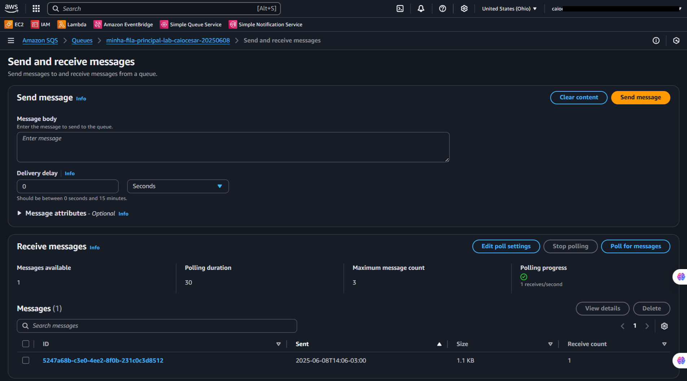

### 9. Message Isolated in DLQ After Failures
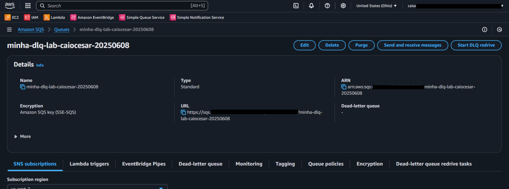

### 10. Main Queue Overview
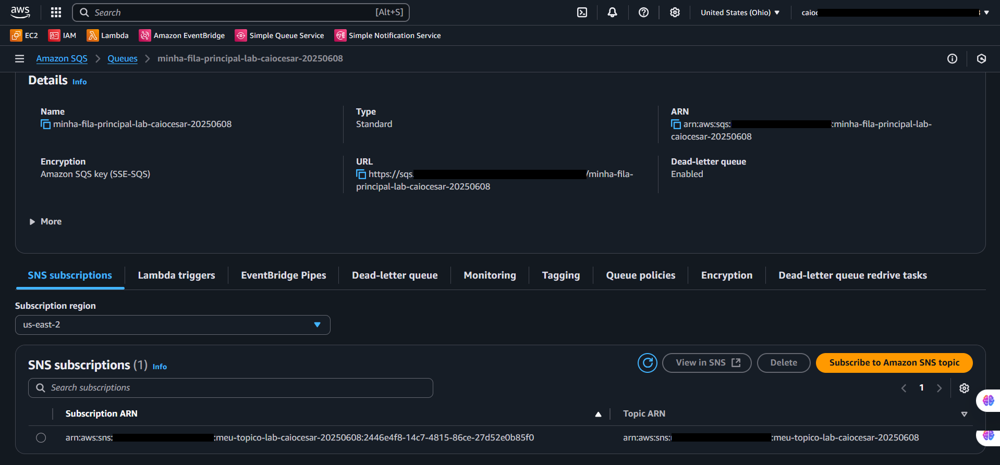

### 11. SNS Topic Overview
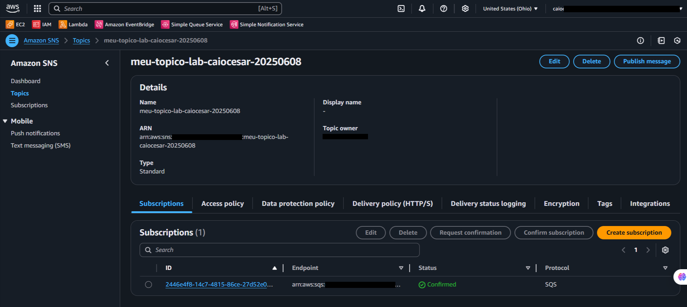

---

## 💡 Key Learnings

- **Systemic Resilience:** Using a DLQ prevents worker blockage. If a message is "poisonous" and breaks code, it should not block healthy messages forever.
- **Decoupling Principle:** SNS does not need to know if the queue is full or offline. It delivers the message, and SQS ensures retention until processing is possible.
- **Access Policies (IAM):** I learned that for SNS to talk to SQS, "subscribing" is not enough; the Queue must give explicit authorization for the Topic to write to it.

---

## 💰 Cost Awareness

| Resource | Free Tier? | Estimated Cost |
|----------|-----------|----------------|
| Amazon SNS | ✅ 1 Million free publications/month | $0.00 |
| Amazon SQS | ✅ 1 Million free requests/month | $0.00 |
| **Estimated Total** | | **$0.00** |

---

## 🏷️ Competencies Demonstrated

`Amazon SNS` `Amazon SQS` `Dead-Letter Queue (DLQ)` `Asynchronous Messaging` `Microservices` `Data Resilience` `🟡 Intermediate`

---

## 📜 Certification Alignment

- **DVA-C02:** Domain 1 — Development with AWS Services (Messaging)
- **SAA-C03:** Domain 2 — Design Resilient Architectures

---

[← Return to Index](../../../README-en.md)
