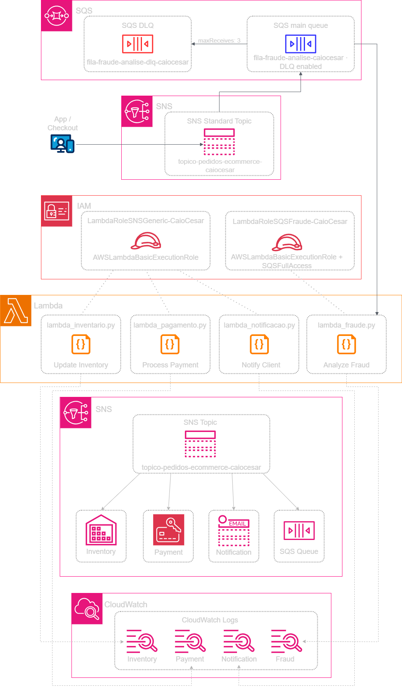
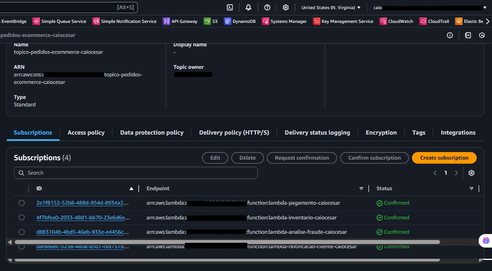
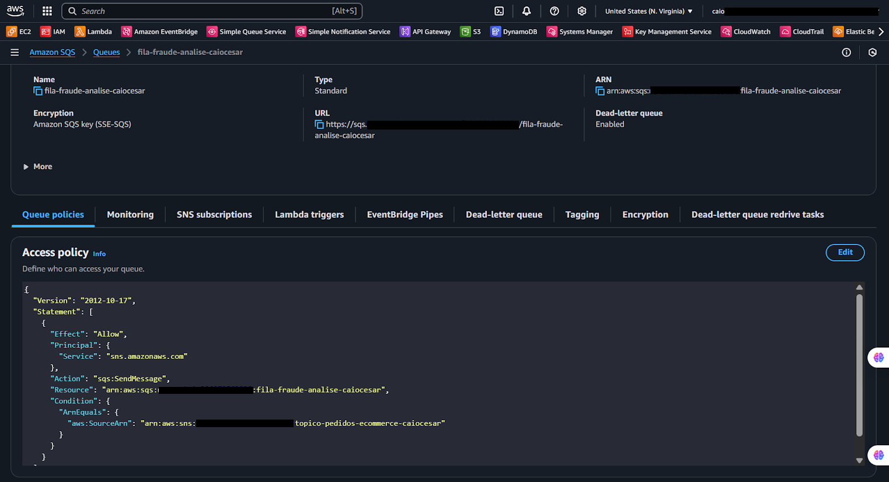
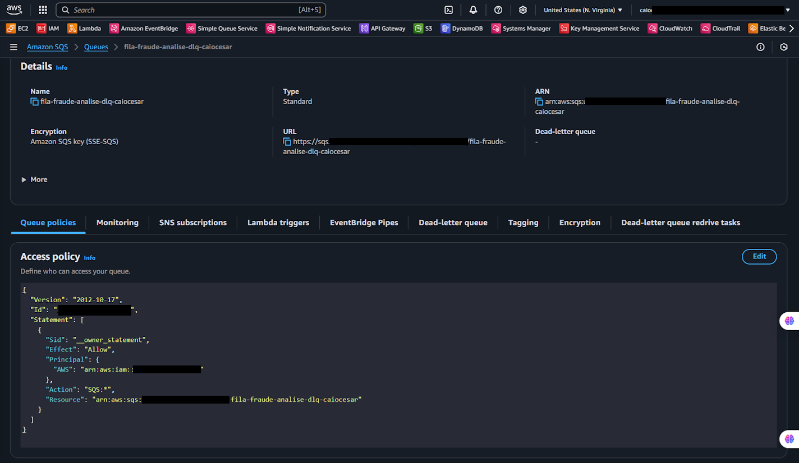
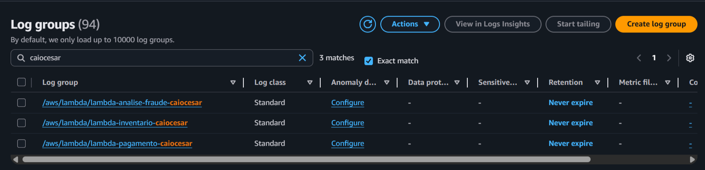

  <a href="./README-en.md">🇺🇸 English</a> |
  <a href="./README.md">🇧🇷 Português</a>

# Lab 06 — Arquitetura Fan-Out com SNS, SQS e Lambda

## 🚀 Resumo
Roteamento Avançado de Event-Driven Architecture (EDA): Neste laboratório, implementei o padrão **Fan-Out**, uma das arquiteturas mais poderosas para sistemas distribuídos. Configurei um **Amazon SNS Topic** como um hub central que recebe um único evento e o distribui simultaneamente para múltiplos assinantes. Utilizei **Subscription Filter Policies** para garantir que cada serviço receba apenas as mensagens relevantes, otimizando o processamento e reduzindo custos ao evitar invocações desnecessárias de funções **AWS Lambda** e filas **Amazon SQS**.

---

## 💼 Caso de Uso Real
- **Indústria:** E-commerce escalável e Sistemas Logísticos
- **Problema:** Em um sistema monolítico, quando um cliente finaliza uma compra, o código precisa disparar sequencialmente a nota fiscal, atualizar o estoque, avisar a transportadora e checar fraude. Se a API da transportadora estiver lenta ou fora do ar, todo o processo de checkout trava para o cliente. É um sistema frágil e impossível de escalar individualmente.
- **Solução:** Implementei uma arquitetura Fan-Out. Agora, o checkout apenas publica um evento "Pedido Criado" no SNS. Quatro serviços diferentes "assinam" esse tópico: o serviço de Inventário (Lambda) atualiza o estoque na hora; o serviço de Pagamento processa a cobrança; e o serviço de Fraude (que é mais lento) recebe a mensagem através de uma fila SQS para processar sem pressa. Se o serviço de fraude falhar, a mensagem vai para uma DLQ, mas o cliente já recebeu sua confirmação de compra sem atrasos.

---

## 🎯 Objetivos de Aprendizado

- Projetar uma topologia **Fan-Out** para replicação de mensagens em paralelo.
- Aplicar **Subscription Filter Policies** (filtros de string e numéricos) para roteamento seletivo de mensagens no SNS.
- Integrar o SNS com filas **Amazon SQS** para garantir a persistência de mensagens em processos longos.
- Utilizar **AWS Lambda** para processamento reativo de eventos vindos do SNS e SQS.
- Configurar **Dead-Letter Queues (DLQ)** dentro de uma cadeia de serviços para aumentar a resiliência.
- Monitorar a execução de múltiplos serviços simultâneos através do **Amazon CloudWatch Logs**.

---

## 🛠️ Serviços AWS Utilizados

| Serviço | Papel no Lab |
|---------|-------------|
| **Amazon SNS** | Hub central que distribui mensagens para múltiplos assinantes simultaneamente. |
| **Amazon SQS** | Fila de mensagens para garantir que processos lentos (como análise de fraude) não percam dados. |
| **AWS Lambda** | Workers que executam as lógicas de negócio de forma independente. |
| **Amazon CloudWatch** | Monitoramento e centralização de logs de todos os microserviços. |

---

## 🏗️ Arquitetura Fan-Out Desacoplada

  

---

## 🖥️ Etapas do Laboratório

### 1. ⚙️ Camada de Resiliência (SQS + DLQ)
- **Ação:** Criei a fila de análise de fraude e sua respectiva DLQ.
- **Configuração:** Defini a Redrive Policy para 3 tentativas antes de mover a mensagem para a DLQ, garantindo que picos de carga ou falhas temporárias não resultem em perda de pedidos.

### 2. 🛡️ Hub de Distribuição (SNS)
- **Ação:** Criei o tópico SNS e configurei as "Subscriptions" para as Lambdas e para a fila SQS.
- **Filtros:** Configurei Filter Policies no JSON da assinatura. Por exemplo, a fila de fraude só recebe mensagens onde o atributo `amount` é maior que 500.

### 3. 🔍 Implementação dos Workers (Lambda)
- **Ação:** Desenvolvi 4 funções Lambda em Python (Inventário, Pagamento, Notificação, Fraude).
- **Integração:** Configurei os gatilhos para que as funções fossem invocadas automaticamente assim que o SNS disparasse o evento.
> *Códigos disponíveis na pasta [/src](./src/).*

### 4. 🧰 Teste de Carga e Filtros
- **Teste:** Publiquei mensagens no SNS com diferentes atributos.
- **Validação:** Verifiquei no CloudWatch que pedidos de baixo valor não acionaram a Lambda de fraude, enquanto pedidos caros seguiram todo o fluxo, provando a eficiência dos filtros de assinatura.

---

## 📸 Evidências de Execução

### 1. Visão Geral do Tópico SNS

### 2. Visão Geral da Fila SQS (Fraude)

### 3. Visão Geral da DLQ

### 4. Subscription Filters (Filtros de Assinatura)

---

## 💡 Principais Aprendizados

- **Custo-Eficiência com Filtros:** Enviar todas as mensagens para todos os assinantes é caro e gera processamento inútil. O uso de Filter Policies diretamente no SNS economiza muito recurso computacional.
- **Escalabilidade em Paralelo:** O Fan-out permite que eu adicione novos serviços (como um serviço de Log Analytics) apenas criando uma nova assinatura, sem precisar alterar uma única linha de código do sistema de checkout.
- **Segurança e Isolamento:** Ao colocar uma fila SQS na frente de serviços lentos ou instáveis (como APIs de terceiros), protejo a saúde do resto da aplicação.

---

## 💰 Consciência de Custos

| Recurso | Free Tier? | Custo Estimado |
|---------|-----------|----------------|
| Amazon SNS | ✅ 1 Milhão de publicações/mês | $0,00 |
| Amazon SQS | ✅ 1 Milhão de requisições/mês | $0,00 |
| AWS Lambda | ✅ 1 Milhão de invocações/mês | $0,00 |
| **Total Estimado** | | **$0,00** |

---

## 🏷️ Competências Demonstradas

`Amazon SNS` `Amazon SQS` `AWS Lambda` `Fan-Out Pattern` `EDA` `Filter Policies` `Processamento Paralelo` `🔴 Avançado`

---

[← Voltar ao índice](../../../README.md)
