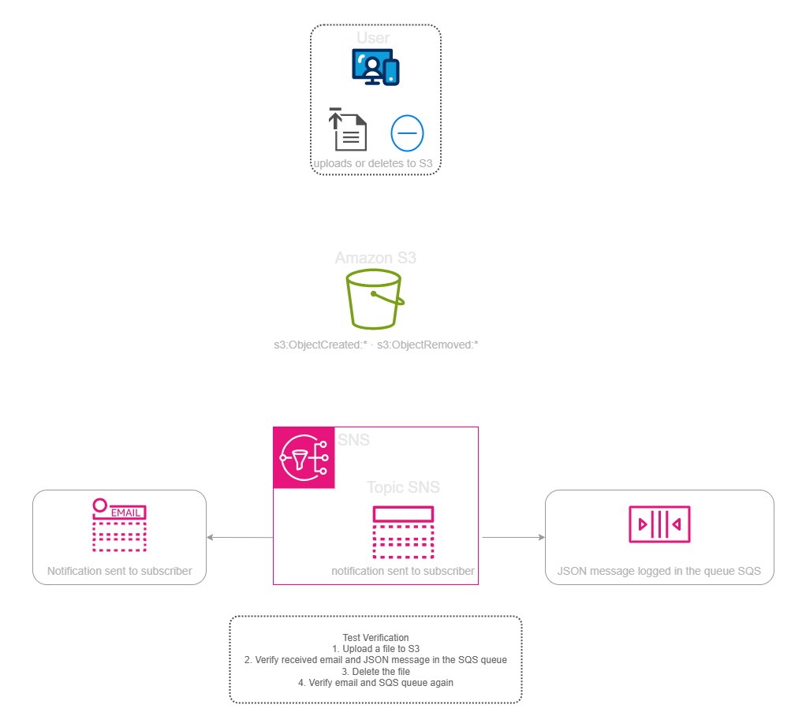
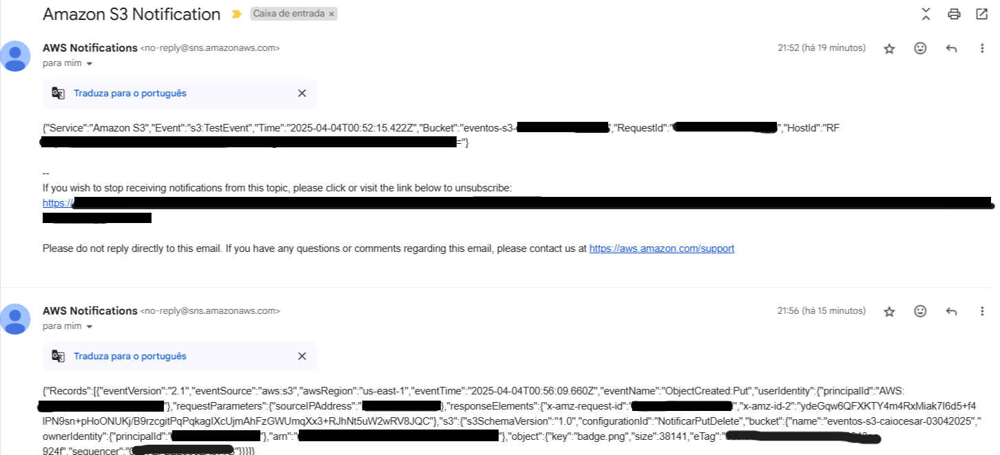
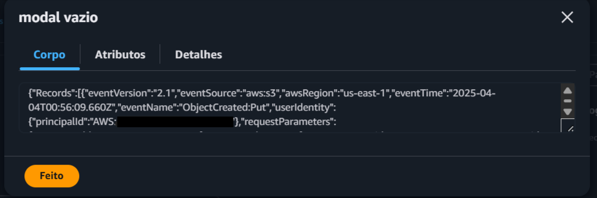

  <a href="./README-en.md">🇺🇸 English</a> |
  <a href="./README.md">🇧🇷 Português</a>

# Lab 07 — S3 Event Notifications com Amazon SNS e SQS

## 🚀 Resumo
Automação e Auditoria Através de Eventos: Neste laboratório, implementei uma arquitetura reativa para monitorar e auditar alterações em um bucket **Amazon S3**. Configurei o S3 para disparar **Event Notifications** sempre que um objeto fosse criado ou deletado, enviando esses sinais para um tópico **Amazon SNS**. O hub de notificações distribuiu os dados simultaneamente para um alerta por e-mail e para uma fila **Amazon SQS**, que serviu de buffer persistente para auditoria futura. Foquei especialmente na configuração de **Resource-Based Policies** para permitir a comunicação segura e o fluxo de dados em formato bruto (**Raw Message Delivery**) entre os serviços.

---

## 💼 Caso de Uso Real
- **Indústria:** Governança de Dados e Segurança da Informação
- **Problema:** Uma empresa de entretenimento armazena ativos valiosos (vídeos, áudios) em buckets S3. Recentemente, arquivos foram deletados acidentalmente e ninguém sabia por quem ou quando. O time de segurança precisava de uma forma de receber alertas imediatos em casos críticos e, ao mesmo tempo, manter um log persistente de todas as operações para análise forense, sem ter que pagar por soluções caras de monitoramento de terceiros ou realizar polling manual via API.
- **Solução:** Implementei gatilhos nativos no S3. Agora, no milissegundo em que um arquivo é enviado ou deletado, a infraestrutura reage. O CISO recebe um e-mail de alerta instantâneo via SNS e todos os metadados da operação são injetados em uma fila SQS "imutável", onde um sistema de auditoria pode processar os logs com calma, garantindo que nenhum evento de modificação de arquivo passe despercebido.

---

## 🎯 Objetivos de Aprendizado

- Configurar **S3 Event Notifications** para reagir a gatilhos de `s3:ObjectCreated` e `s3:ObjectRemoved`.
- Provisionar e integrar um tópico **Amazon SNS** para distribuição paralela (Fan-out) de eventos.
- Implementar uma fila **Amazon SQS** como destino durável para auditoria de eventos.
- Dominar a escrita de **Resource-Based Policies (JSON)** para autorizar serviços (S3 e SNS) a interagirem entre si.
- Ativar o **Raw Message Delivery** no SNS para garantir que o payload chegue à fila SQS sem cabeçalhos de metadados desnecessários.
- Validar a rastreabilidade total de um arquivo desde o upload até o alerta final no e-mail e no log da fila.

---

## 🛠️ Serviços AWS Utilizados

| Serviço | Papel no Lab |
|---------|-------------|
| **Amazon S3** | Fonte dos eventos que monitora a criação e deleção de objetos. |
| **Amazon SNS** | Barramento de mensagens que notifica múltiplos destinos (E-mail e SQS). |
| **Amazon SQS** | Repositório durável e assíncrono para retenção de logs de auditoria. |
| **AWS IAM** | Políticas de acesso baseadas em recurso para garantir a segurança da integração. |

---

## 🏗️ Fluxo de Arquitetura Disparado por Eventos

  

---

## 🖥️ Etapas do Laboratório

### 1. ⚙️ Infraestrutura de Mensageria
- **Ação:** Provisionei o tópico SNS `notificacoes-s3` e a fila SQS `fila-eventos-s3`.
- **Configuração:** Assinei a fila e meu e-mail pessoal no tópico SNS para recebermos os mesmos dados simultaneamente.

### 2. 🛡️ Segurança e Permissões (Políticas JSON)
- **Ação:** Atualizei as Access Policies do SNS e do SQS.
- **JSON:** Inseri declarações que permitem explicitamente que o bucket S3 publique mensagens no tópico SNS e que o SNS envie mensagens para a fila SQS, seguindo o princípio de menor privilégio através do ARN.

### 3. 🔍 Configuração do Gatilho no S3
- **Ação:** Acessei as propriedades do bucket e ativei o "Event Notifications".
- **Filtro:** Escolhi os tipos de evento `All object create events` e `All object removal events`, apontando o destino para o tópico SNS criado anteriormente.

### 4. 🧰 Teste de Validação Operacional
- **Simulação:** Efetuei o upload de uma imagem de teste no bucket.
- **Resultado:** Recebi o e-mail de alerta em segundos e utilizei o recurso "Send and receive messages" do SQS para visualizar o payload JSON que continha o nome do arquivo, tamanho e o IP de origem.

---

## 📸 Evidências de Execução

### 1. Alerta Recebido por E-mail (SNS)

### 2. Payload Recebido na Fila (SQS)

---

## 💡 Principais Aprendizados

- **O S3 como Agente Ativo:** Aprendi que o storage não precisa ser passivo; ele pode ser o motor de automações complexas sem precisar de servidores rodando scripts de checagem.
- **Importância do Raw Message Delivery:** Entendi que, ao enviar mensagens para o SQS, formatar o payload como "Bruto" facilita muito o processamento por outros sistemas que não precisam lidar com o envelope XML do SNS.
- **Segurança com Resource-Based Policies:** Reforcei a prática de que na AWS, o acesso não é garantido apenas pela conexão, mas sim por políticas explícitas que autorizam o serviço A a "escrever" no serviço B através de seus ARNs.

---

## 💰 Consciência de Custos

| Recurso | Free Tier? | Custo Estimado |
|---------|-----------|----------------|
| Amazon S3 | ✅ Limite operacional padrão (5GB) | $0,00 |
| Amazon SNS | ✅ 1 Milhão de notificações gratuitas/mês | $0.00 |
| Amazon SQS | ✅ 1 Milhão de requisições gratuitas/mês | $0.00 |
| **Total Estimado** | | **$0,00** |

---

## 🏷️ Competências Demonstradas

`S3 Events` `Amazon SNS` `Amazon SQS` `JSON Policies` `Auditoria de Dados` `🔴 Avançado`

---

## 📜 Alinhamento com Certificações

- **DVA-C02:** Domínio 1 — Desenvolvimento com Serviços AWS (Gatilhos de Eventos)
- **SAA-C03:** Domínio 2 — Projeto de Arquiteturas Resilientes (Desacoplamento e Notificação)

---

[← Voltar ao índice](../../../README.md)
