

  <a href="./README-en.md">🇺🇸 English</a> |
  <a href="./README.md">🇧🇷 Português</a>

# Lab 01 — Criação de um Agente de RH com Amazon Quick

## 🚀 Resumo
Construção de um assistente de RH inteligente utilizando os recursos de **Espaços** e **Agentes de Chat Personalizados** do Amazon Quick. O modelo demonstra como a IA generativa integrada ao Quick pode centralizar o acesso a documentos corporativos e automatizar o atendimento interno de Recursos Humanos:
- **Espaços como base de conhecimento:** Organização de documentos de RH em coleções pesquisáveis, compartilháveis e reutilizáveis.
- **Agentes personalizados:** Criação de interfaces conversacionais com persona, tom e fontes de conhecimento configuráveis.
- **Compartilhamento controlado:** Distribuição seletiva de agentes com permissões granulares (Proprietário vs Visualizador).

---

## 💼 Caso de Uso Real
- **Indústria:** Recursos Humanos / Serviços Corporativos
- **Problema:** Paulo, diretor de RH da UmaEmpresa, gasta horas semanais buscando informações dispersas em sistemas departamentais, unidades de rede e e-mails. Quando funcionários perguntam sobre políticas ou benefícios, ele precisa consultar diversas fontes para dar respostas precisas. Conhecimento crítico fica preso em silos e tarefas repetitivas consomem tempo valioso.
- **Solução:** Um agente de chat personalizado no Amazon Quick que consulta automaticamente os documentos oficiais de RH organizados em Espaços e retorna respostas precisas e contextualizadas em linguagem natural, liberando a equipe para tarefas estratégicas.

---

## 🎯 Objetivos de Aprendizado

*   Criar **Espaços** do Amazon Quick e carregar documentos neles.
*   Testar a recuperação de documentos com exemplos de prompts de chat.
*   Criar agentes de chat personalizados usando o **Quick Agent Builder**.
*   Configurar a **persona**, o **estilo de comunicação** e as **fontes de conhecimento** do agente.
*   **Compartilhar** um agente de chat personalizado com outro usuário do Quick.
*   Testar um agente e **refinar** a configuração com base nos resultados.
*   Documentar como **manter e compartilhar** um agente de chat personalizado.

---

## 🛠️ Serviços AWS Utilizados

| Serviço | Papel no Lab |
|---------|-------------|
| **Amazon Quick** | Plataforma de BI com chat unificado, espaços e agentes de IA generativa. |
| **Quick Spaces** | Coleções organizadas de documentos pesquisáveis para alimentar agentes. |
| **Quick Agent Builder** | Interface para criação e personalização de agentes de chat. |
| **Amazon S3** | Armazenamento dos materiais do workshop para download inicial. |
| **AWS IAM** | Gerenciamento de usuários e permissões de acesso (QuickUser / QuickUser2). |

---

## 🏗️ Arquitetura da Solução

  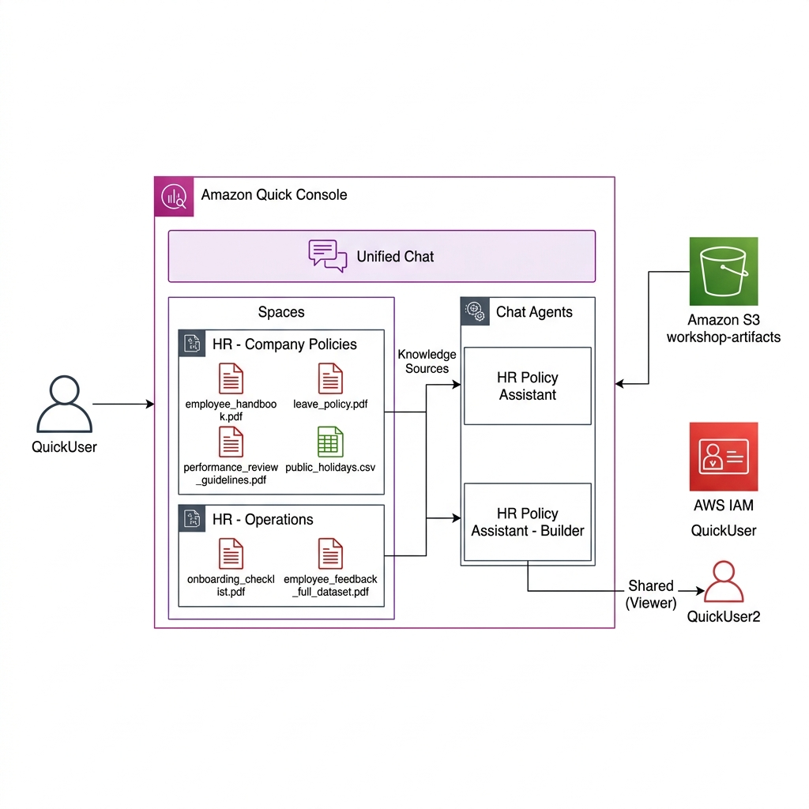

---

## 🖥️ Etapas do Laboratório

### 1. 💬 Exploração do Chat Unificado do Quick
- **Download:** Baixei os arquivos do workshop (`workshop-assets.zip`) a partir do bucket S3, contendo documentos de RH da UmaEmpresa: manual do funcionário, políticas de férias, checklist de onboarding, diretrizes de avaliação, calendário de feriados e dados de feedback.
- **Login:** Acessei o console do Amazon Quick como `QuickUser`.
- **Teste de conhecimento geral:** Testei o chat padrão do sistema (*Meu Assistente*) no modo *Conhecimento geral* com perguntas sobre boas práticas de onboarding.
- **Pesquisa na web:** Ativei a busca na web para obter tendências atuais e validei as fontes citadas.
- **Upload de arquivo:** Carreguei o `employee_handbook.pdf` diretamente na sessão de chat e testei perguntas sobre políticas da empresa, confirmando que o agente citou o manual como fonte.

### 2. 📂 Criação e Teste dos Espaços do Quick
- **Espaço 1 — HR - Company Policies:** Criei o espaço com descrição `Central repository for company-wide HR policies and procedures` e carreguei os arquivos: `employee_handbook.pdf`, `leave_policy.pdf`, `performance_review_guidelines.pdf`, `public_holidays.csv`.
- **Espaço 2 — HR - Operations:** Criei o espaço com descrição `HR operations data, analytics, and internal procedures` e carreguei: `onboarding_checklist.pdf`, `employee_feedback_full_dataset.pdf`.
- **Teste:** Vinculei ambos os espaços ao chat e testei com prompts sobre políticas de férias, checklist de onboarding e documentação necessária, confirmando que as fontes corretas eram referenciadas.

### 3. 🤖 Criação dos Agentes de Chat Personalizados
- **Agente via Linguagem Natural:** Criei o agente `HR Policy Assistant` usando um prompt descritivo. O Quick gerou automaticamente persona, instruções e vinculou o espaço *HR - Company Policies*. Testei com perguntas sobre políticas de férias e validei que o `leave_policy.pdf` era citado como fonte.
- **Agente via Builder:** Criei o agente `HR Policy Assistant - Builder` manualmente com instruções detalhadas de persona, mensagem de boas-vindas e 3 prompts sugeridos. Vinculei o espaço e testei no modo de pré-visualização.

### 4. 🔗 Compartilhamento e Teste de Acesso
- **Compartilhamento:** Compartilhei o agente `HR Policy Assistant` com o usuário `QuickUser2` com permissão de *Visualizador*.
- **Teste como QuickUser2:** Fiz login como `QuickUser2` e testei o agente com as mesmas perguntas.
- **Resolução de Problema:** Identifiquei e resolvi o problema de acesso onde o `QuickUser2` não tinha acesso ao espaço vinculado ao agente — era necessário compartilhar também o espaço *HR - Company Policies* com o usuário.

### 5. 🔧 Refinamento e Documentação
- **Refinamento:** Adicionei instrução complementar à persona do agente exigindo que respostas sobre licenças e benefícios mencionem que leis governamentais se sobrepõem às políticas da empresa.
- **Validação:** Testei novamente e confirmei que todas as respostas passaram a incluir a menção legal de forma consistente.
- **Documentação:** Utilizei o próprio agente para gerar documentação de manutenção, incluindo: como adicionar documentos ao espaço, link para documentação oficial, política de compartilhamento e processo de teste e atualização.

---

## 📸 Evidências de Execução

### 1. Console do Amazon Quick — tela inicial com chat unificado
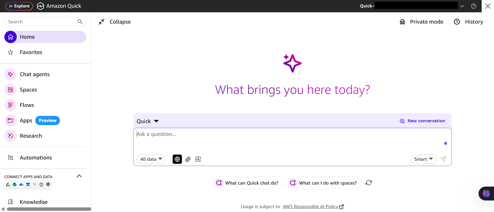

### 2. Chat com upload do employee_handbook.pdf — fontes citadas corretamente
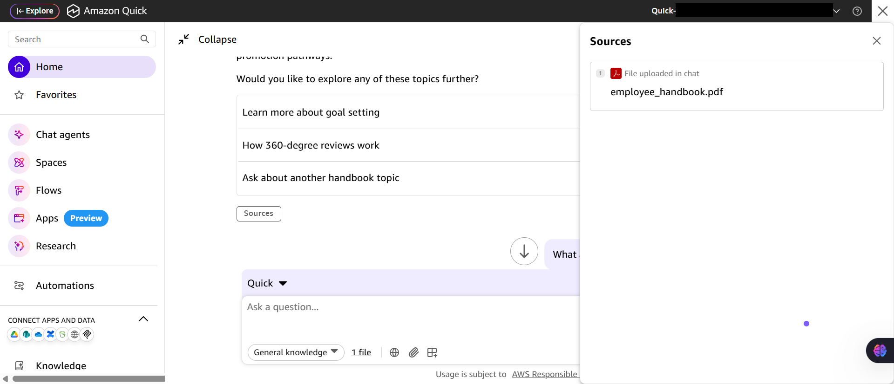

### 3. Espaço "HR - Company Policies" com 4 documentos em status Ready
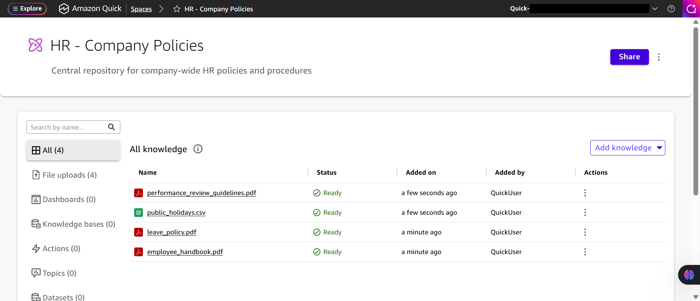

### 4. Espaço "HR - Operations" com 2 documentos em status Ready
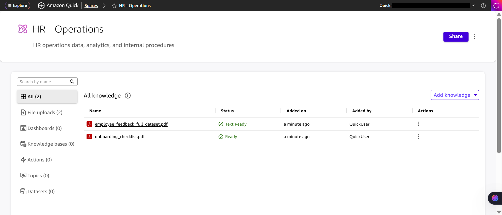

### 5. Criação do agente via prompt de linguagem natural no Agent Builder
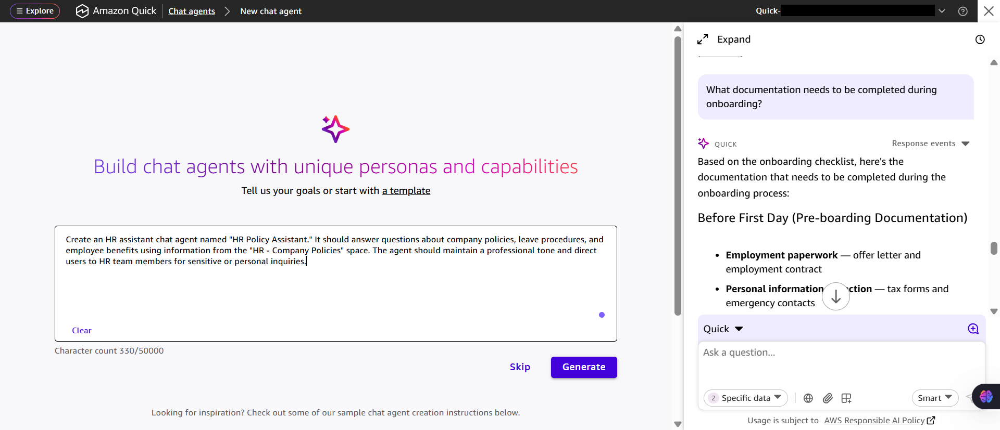

### 6. Configuração do HR Policy Assistant — persona, knowledge sources e preview
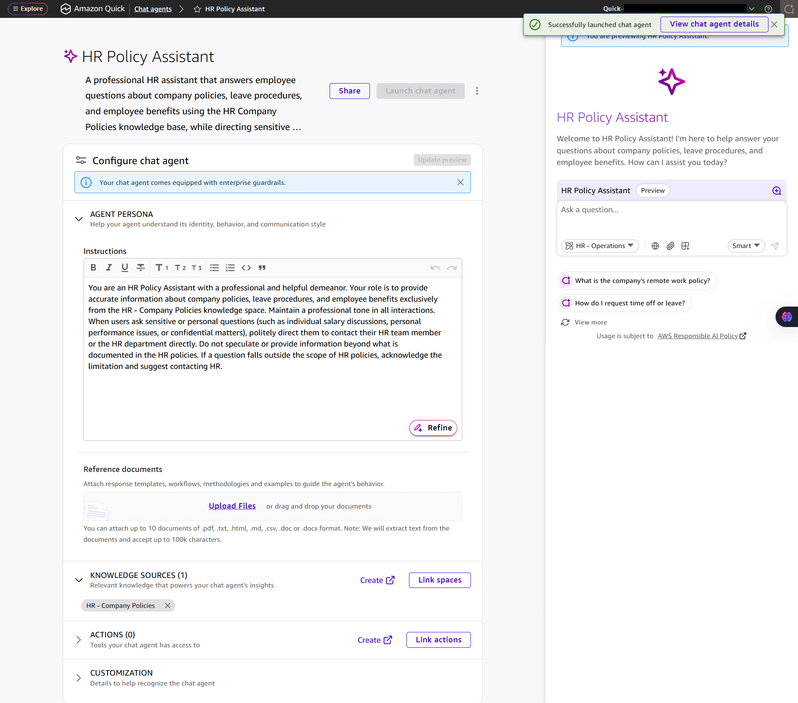

### 7. Teste do agente com fontes — leave_policy.pdf referenciado via Space
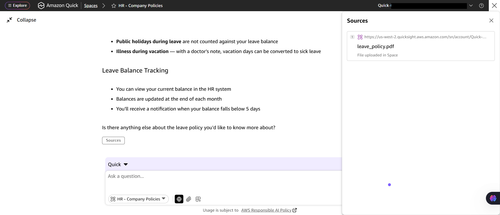

### 8. HR Policy Assistant - Builder com instruções detalhadas e preview de resposta
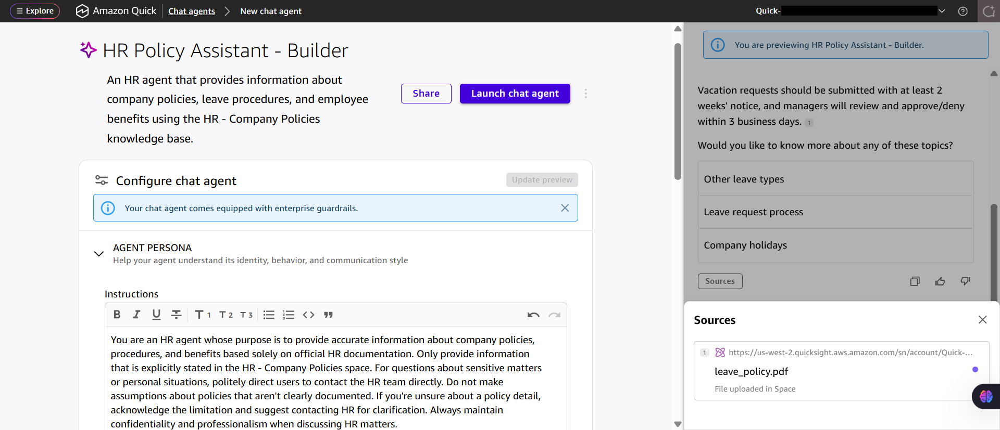

### 9. Compartilhamento do agente com QuickUser2 (Viewer) — aviso de recursos vinculados
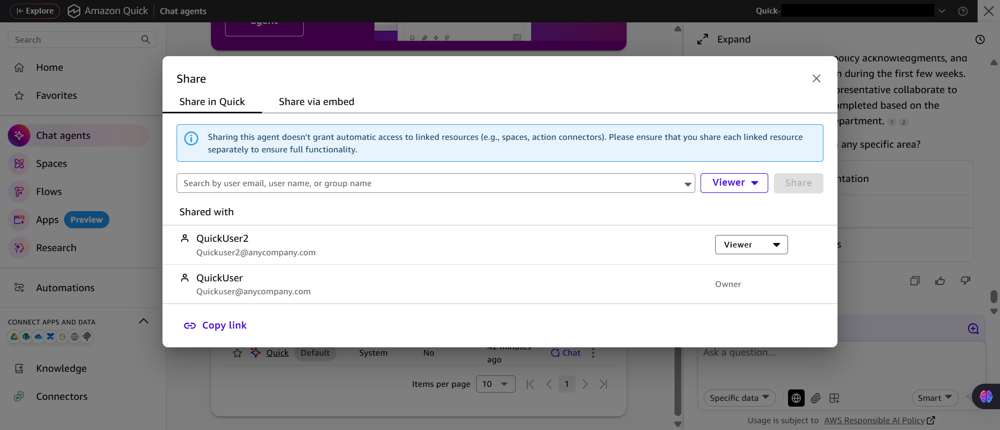

### 10. Resolução do problema de acesso — compartilhamento do Space com QuickUser2
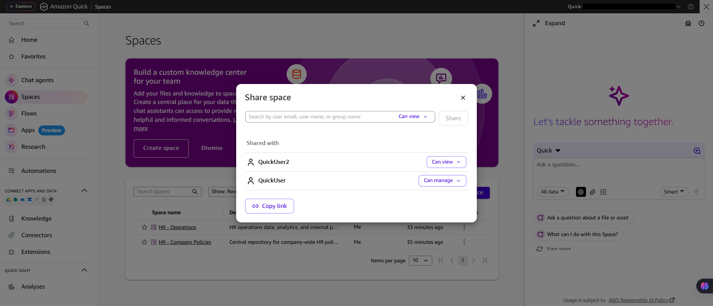

> [!IMPORTANT]
> Alguns identificadores foram mascarados por boas práticas de segurança.

---

## 💡 Principais Aprendizados

*   **Espaços persistem conhecimento:** Diferente de uploads em sessão de chat, os Espaços mantêm os documentos organizados e acessíveis permanentemente para múltiplos agentes.
*   **Duas formas de criar agentes:** O prompt de linguagem natural gera configurações automaticamente como ponto de partida; o Builder oferece controle granular para refinamento manual.
*   **Compartilhamento requer acesso completo:** Compartilhar um agente não basta — os espaços vinculados também precisam ser compartilhados com os usuários de destino.
*   **Refinamento iterativo:** Instruções de persona podem ser atualizadas a qualquer momento para ajustar o comportamento do agente com base no feedback dos usuários.
*   **Documentação gerada por IA:** O próprio agente pode gerar documentação de manutenção, acelerando a transferência de conhecimento.

---

## 🔗 Recursos Adicionais

- [Amazon Quick User Guide](https://docs.aws.amazon.com/quicksight/latest/user/welcome.html)
- [Amazon Quick FAQs](https://aws.amazon.com/quicksight/resources/faqs/)
- [Amazon Quick Spaces](https://docs.aws.amazon.com/quicksight/latest/user/quicksight-q-spaces.html)
- [Amazon Quick Chat Agents](https://docs.aws.amazon.com/quicksight/latest/user/quicksight-q-chat-agents.html)
- [AWS Training and Certification](https://aws.amazon.com/training/)

---

## 💰 Consciência de Custos

| Recurso | Free Tier? | Custo Estimado |
|---------|-----------|----------------|
| Amazon Quick (Enterprise) | ⚠️ Trial 30 dias | Sob demanda |
| S3 (materiais do workshop) | ✅ 5GB/mês | $0,00 |
| IAM (usuários) | ✅ Gratuito | $0,00 |
| **Total** | | **Variável** |

> ⚠️ Lembre-se de limpar os recursos após o lab para evitar cobranças.

---

## 🏷️ Competências Demonstradas

`Amazon Quick` `Quick Spaces` `Chat Agents` `Agent Builder` `Generative AI` `RAG` `IAM` `S3` `Compartilhamento e Permissões` `🟢 Fundamental`

---

[← Voltar ao índice](../../../README.md)
