

  <a href="./README-en.md">🇺🇸 English</a> |
  <a href="./README.md">🇧🇷 Português</a>

# Lab 02 — Researching and Creating Flows with Amazon Quick

## 🚀 Executive Summary
Exploration of Amazon Quick's **AI-powered Research** and **Automated Flows** capabilities to automate HR tasks with multi-agent workflows, API integrations, conditional logic, and in-depth research with citations:
- **Quick Research:** Generation of comprehensive research reports using web sources and internal company data.
- **Quick Flows:** Creation of automated flows from natural language conversations, with conditional steps and API calls.
- **Action Connectors (OpenAPI):** Integration of Quick with external APIs for employee management, time-off, calendar, and job postings.
- **Employee Onboarding Flow:** Full onboarding automation — record creation, welcome email, and IT ticket in a single flow.

---

## 💼 Real-World Use Case
- **Industry:** Human Resources / Corporate Services
- **Problem:** Paulo, HR Director at AnyCompany, spends hours weekly researching information across internal and external sources. Employees struggle with existing tools for tasks like time-off management, calendar event creation, and job posting management. The HR team manually creates employee records, sends welcome emails, and requests badges for new hires multiple times per week.
- **Solution:** Using Amazon Quick Research for AI-guided research, Quick Flows for multi-step process automation, and OpenAPI connectors for integration with internal HR systems — all orchestrated via natural language.

---

## 🎯 Learning Objectives

*   Create **comprehensive research reports** using Amazon Quick Research.
*   Create a **simple flow** from a chat conversation.
*   **Integrate** Amazon Quick with external systems via OpenAPI connectors.
*   Design **multi-step workflows** combining API calls, web searches, and content generation.

---

## 🛠️ AWS Services Used

| Service | Role in the Lab |
|---------|--------------|
| **Amazon Quick** | BI platform with chat, research, flows, and generative AI agents. |
| **Quick Research** | AI-powered research engine for comprehensive citation-based reports. |
| **Quick Flows** | Multi-step workflow automation with conditional logic. |
| **Quick Spaces** | Organized collections of searchable documents. |
| **Quick Connectors (OpenAPI)** | External API integration via OpenAPI specification. |
| **Amazon S3** | Storage for workshop materials initial download. |
| **Amazon Cognito** | OAuth2 authentication for the integrated HR API. |
| **Amazon API Gateway** | HR REST API consumed by Quick via connector. |
| **AWS IAM** | User management and access permissions. |

---

## 🏗️ Solution Architecture

  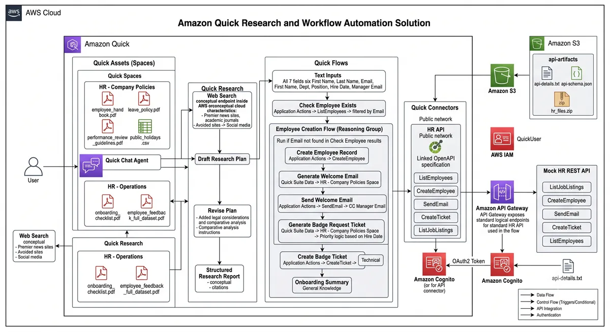

---

## 🖥️ Lab Steps

### 1. 📂 Spaces and Materials Preparation
- **Materials download:** I downloaded the workshop files — `api-details.txt` and `api-schema.json` from the `api-artifacts` S3 bucket, and `hr_files.zip` containing HR documents via direct link.
- **Spaces creation:**
  - **HR - Company Policies:** Space with description `Central repository for company-wide HR policies and procedures`, containing: `employee_handbook.pdf`, `leave_policy.pdf`, `performance_review_guidelines.pdf`, `public_holidays.csv`.
  - **HR - Operations:** Space with description `HR operations data, analytics, and internal procedures`, containing: `onboarding_checklist.pdf`, `employee_feedback_full_dataset.pdf`.

### 2. 🔍 AI-Guided Research with Quick Research
- **Research objective:** "What are the current best practices for remote work policies in mid-size technology companies, including productivity measurement, collaboration tools, and work-life balance considerations?"
- **Source configuration:** I enabled web search with preference for major news sites and academic journals, excluding social media and blogs. I connected the *HR - Company Policies* space as a Quick resource.
- **Plan refinement:** I added instructions to include a section on legal considerations and comparative analysis between different industry approaches.
- **Execution:** I initiated the research which generated a structured report with verifiable citations, navigable topics, and PDF/Word export capabilities.

### 3. 🔄 Creating a Flow from a Chat
- **Initial query:** I asked questions about the onboarding process at AnyCompany with prompts linked to the HR Spaces.
- **Flow generation:** From the conversation, I created a Quick Flow with the prompt: *"Generate a flow that takes specific onboarding questions and provides detailed answers about employee onboarding processes, using the HR documentation available in Quick Spaces."*
- **Component exploration:** I identified the components: text input, Quick Data output (linked to Spaces), General Knowledge output, and available step types (Chat Agent, Research, Web Search, UI Agent, Image, Reasoning Group, App Actions, Files).
- **Execution:** I tested the flow with the question *"What is the responsibility of new hires and their managers on the first day of work?"* and validated the step-by-step outputs.

### 4. 🔌 API Integration via Action Connector
- **Connector setup:** I created the `HR API` integration using the OpenAPI specification (`api-schema.json`) with OAuth2 authentication (Client ID, Client Secret, Token URL, Authorization URL from `api-details.txt`).
- **Authentication:** I logged in via Amazon Cognito with credentials from `api-details.txt` and confirmed "Connected" status.
- **API testing:** I executed the `ListJobPostings` action and confirmed the response with 3 job postings (Sales Manager, Senior Software Engineer, Marketing Manager) with HTTP 200 status.
- **Natural language interaction:**
  - *"What job openings are currently available?"* — listed openings via integration.
  - *"I need to request time off for next week, Tuesday through Wednesday"* — generated a `CreateTimeOffRequest` form.
  - *"Who is John Stiles' manager?"* — queried the API to find the manager.

### 5. 🏗️ Building the Employee Onboarding Flow
- **Flow inputs:** I created 7 text input fields — First Name, Last Name, Email, Department, Position, Hire Date, and Manager Email.
- **Duplicate check:** `Check if employee exists` step via `ListEmployees` HR API action with email filtering.
- **Reasoning Group:** I configured conditional logic `Employee Creation Flow` to execute subsequent steps only if the email is not found.
- **Record creation:** `Create employee record` step via `CreateEmployee` action with input field data.
- **Welcome email:** Personalized generation using the *HR - Company Policies* space as a source + delivery via `SendEmail` action with manager CC.
- **IT ticket:** Badge request ticket generation with conditional priority (High if hire date is within 7 days) + creation via `CreateTicket` action.
- **Summary:** Final general knowledge step consolidating all actions performed.

### 6. ✅ Full Flow Testing
- **Test data:** I executed the flow for Martha Rivera — Software Engineer, Engineering Department, hire date 2025-12-01, manager `akua_mansa@anycompany.com`.
- **Validation:** I confirmed all steps completed successfully:
  - Existence verification in the system.
  - Employee record creation.
  - Personalized welcome email generation and delivery.
  - IT ticket creation for badge setup.
  - Complete onboarding summary.

### 7. 📊 Research Review
- **Report review:** I analyzed the complete report generated by Quick Research with navigable topics in the sidebar and numbered citations linking to sources.
- **Export:** I validated sharing options (PDF, Word, sharing with other Quick users).
- **Executive summary:** I generated an automated executive summary from the report.
- **Iteration:** I tested the text commenting feature to request improvements in subsequent research iterations.

---

## 📸 Execution Evidence

### 1. Quick Research — research objective and source configuration
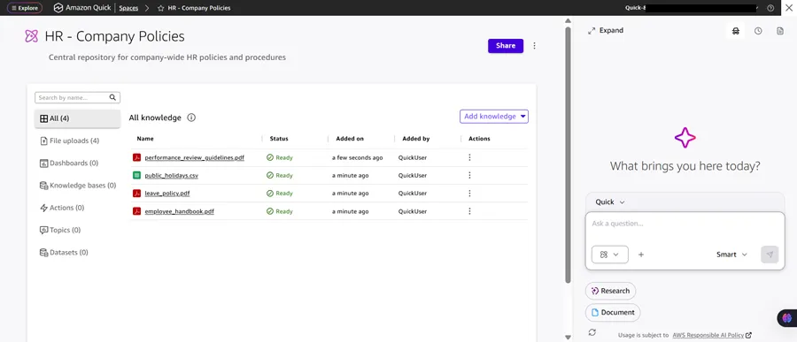

### 2. Quick Research — complete report with topics and citations
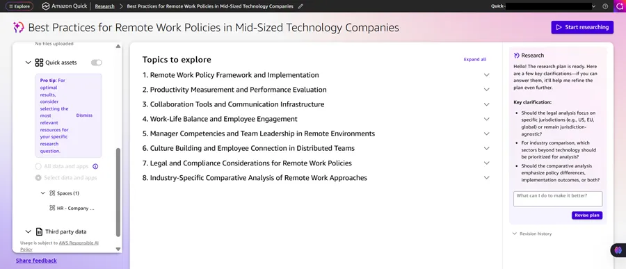

### 3. Flow generated from chat — components and steps
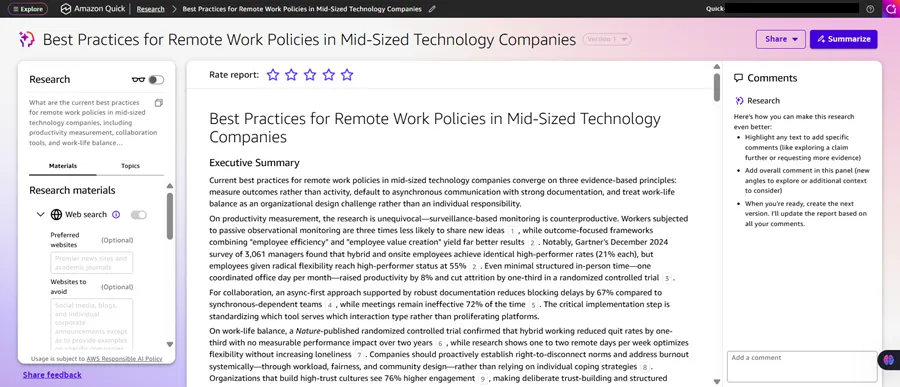

### 4. Chat flow execution — output with referenced sources
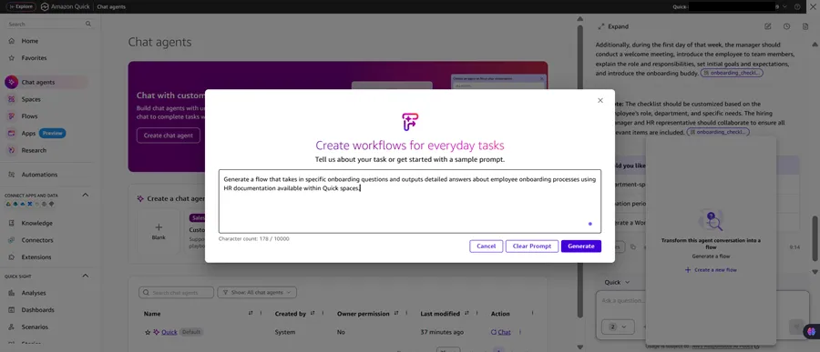

### 5. Action Connector — OpenAPI integration configuration
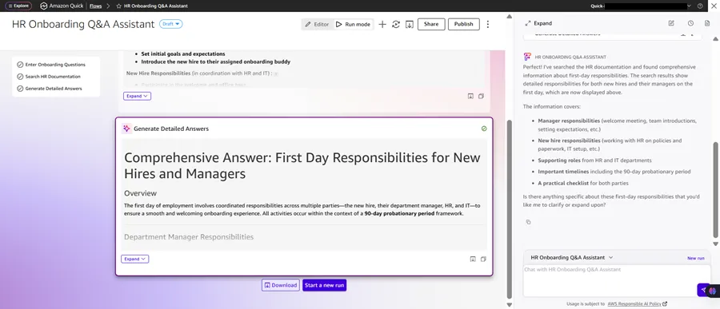

### 6. API test — ListJobPostings with HTTP 200 response
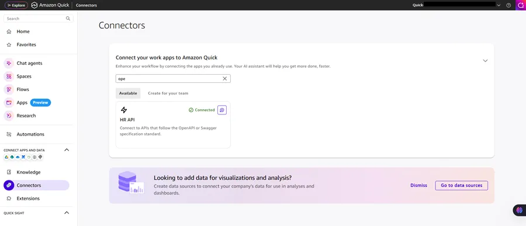

### 7. Chat with integration — job listing query via natural language
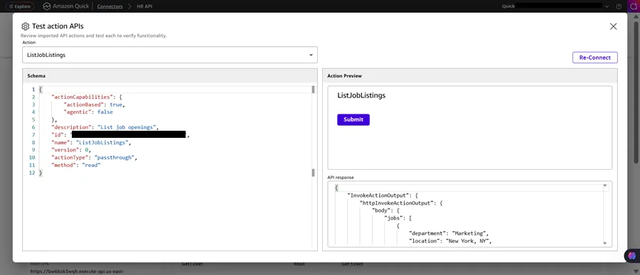

### 8. Onboarding Flow — full view with all steps
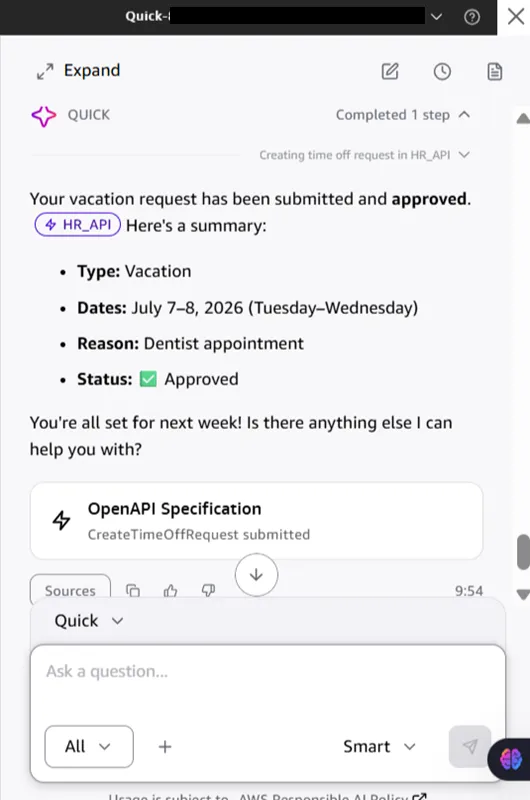

### 9. Reasoning Group — conditional logic for employee creation
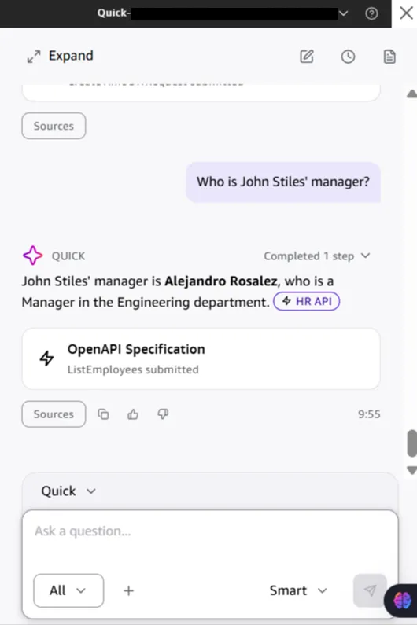

### 10. Onboarding flow execution — final summary
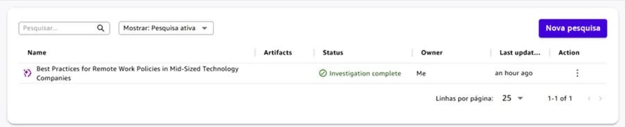

> [!IMPORTANT]
> Some identifiers have been masked following security best practices.

---

## 💡 Key Learnings

*   **Quick Research automates complex research:** The AI-powered research engine generates structured reports with verifiable citations, combining web sources with internal data organized in Spaces.
*   **Flows from natural language:** Chat conversations can be transformed into automated flows, decomposed into individual steps with specialized types (Data, General Knowledge, Actions, Reasoning).
*   **OpenAPI connectors extend reach:** Integration via OpenAPI specification allows Quick to interact with any authenticated REST API, executing CRUD operations through natural language.
*   **Reasoning Groups add logic:** They enable conditional branching within flows, preventing duplications and ensuring idempotent workflows.
*   **End-to-end orchestration:** A single flow can combine verifications, record creation, AI content generation, email delivery, and ticket creation — replacing manual processes that would take days.

---

## 🔗 Additional Resources

- [Amazon Quick User Guide](https://docs.aws.amazon.com/quicksight/latest/user/welcome.html)
- [Amazon Quick Flows](https://docs.aws.amazon.com/quicksight/latest/user/quicksight-q-flows.html)
- [Amazon Quick Research](https://docs.aws.amazon.com/quicksight/latest/user/quicksight-q-research.html)
- [Amazon Quick Connectors](https://docs.aws.amazon.com/quicksight/latest/user/quicksight-q-connectors.html)
- [OpenAPI Specification](https://swagger.io/specification/)
- [AWS Training and Certification](https://aws.amazon.com/training/)

---

## 💰 Cost Awareness

| Resource | Free Tier? | Estimated Cost |
|----------|-----------|----------------|
| Amazon Quick (Enterprise) | ⚠️ 30-day trial | On-demand |
| API Gateway (HR API) | ✅ 1M req/mo | $0.00 |
| Amazon Cognito (authentication) | ✅ 50K MAUs | $0.00 |
| S3 (workshop materials) | ✅ 5GB/mo | $0.00 |
| IAM (users) | ✅ Free | $0.00 |
| **Total** | | **Variable** |

> ⚠️ Remember to clean up resources after the lab to avoid charges.

---

## 🏷️ Competencies Demonstrated

`Amazon Quick` `Quick Research` `Quick Flows` `Quick Connectors` `OpenAPI` `Generative AI` `RAG` `Multi-Agent Workflows` `API Integration` `Amazon Cognito` `API Gateway` `IAM` `S3` `🟡 Intermediate`

---

## 📎 Lab Reference

> This lab was completed on the [AWS Skill Builder](https://skillbuilder.aws/learn) platform.
> **Code:** SPL-TF-100-MLFLQU-1 — Version 1.0.3

---

[← Back to Index](../../../README-en.md)
