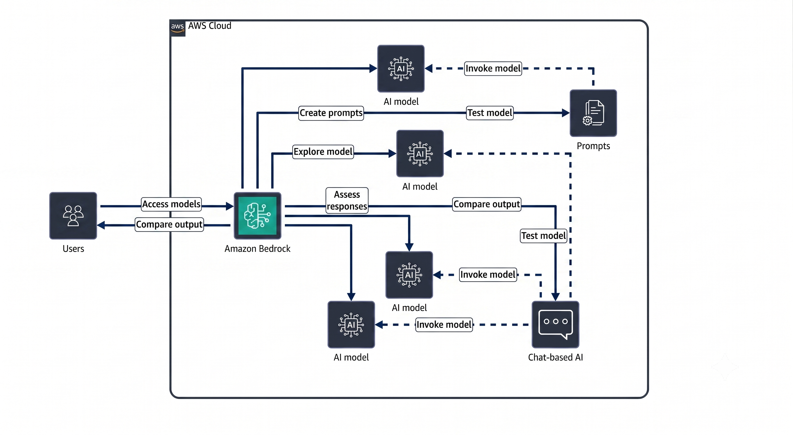
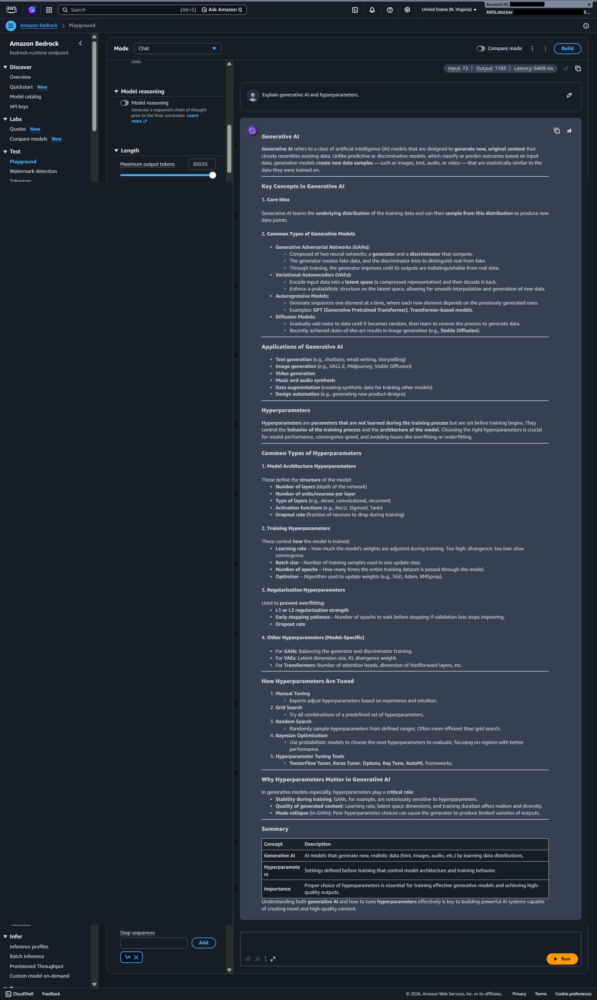
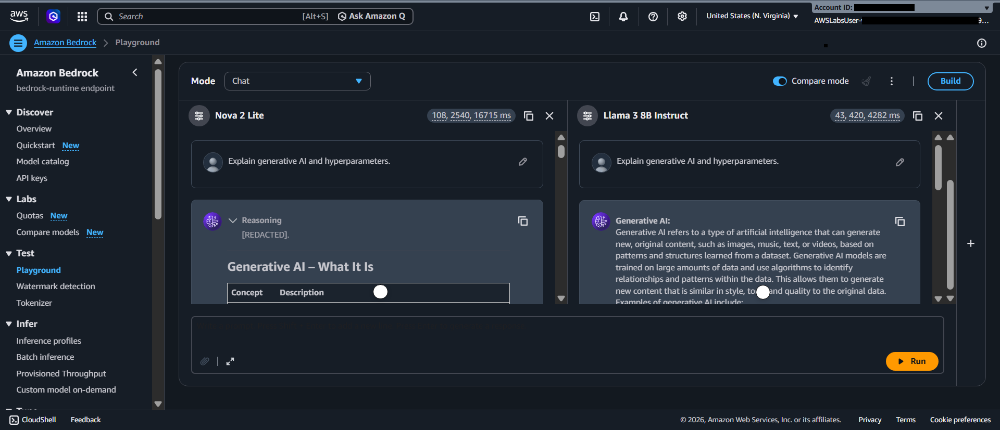
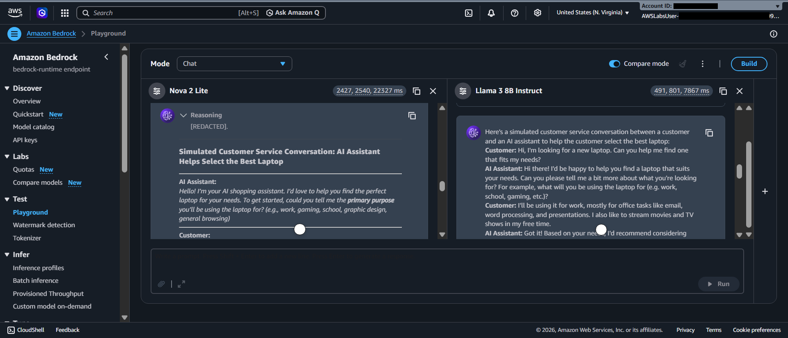
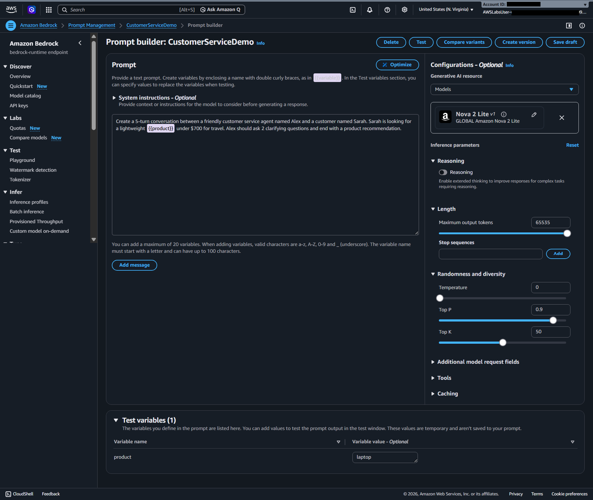
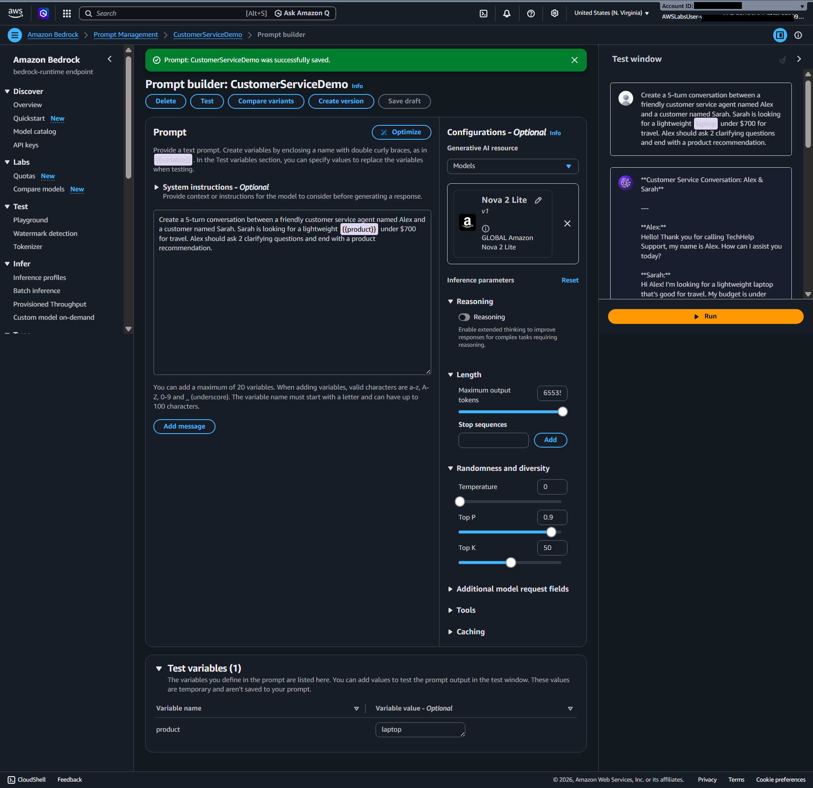
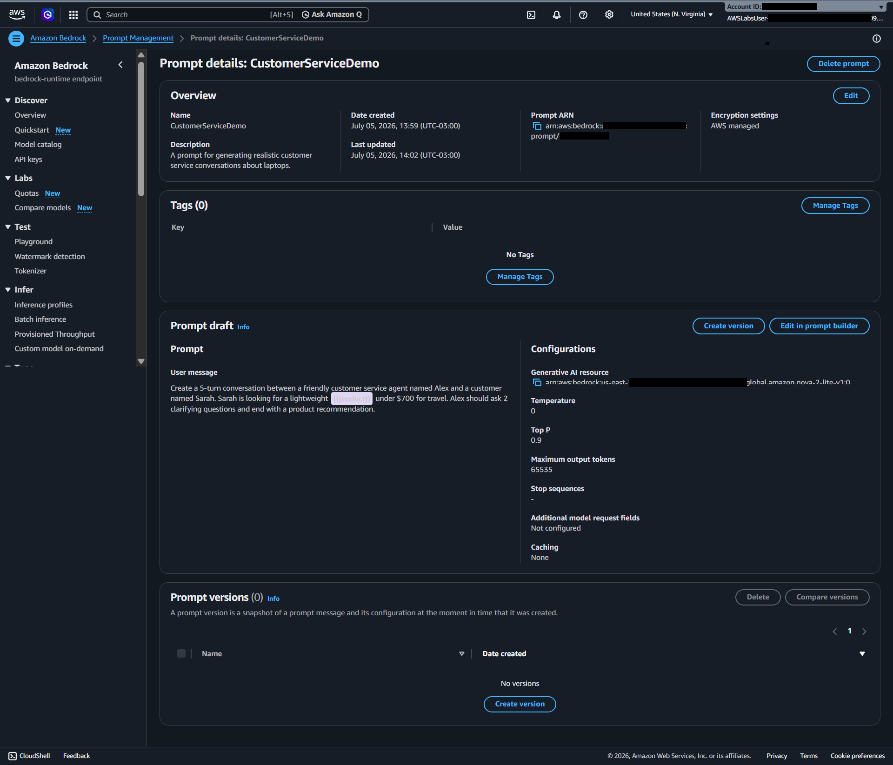
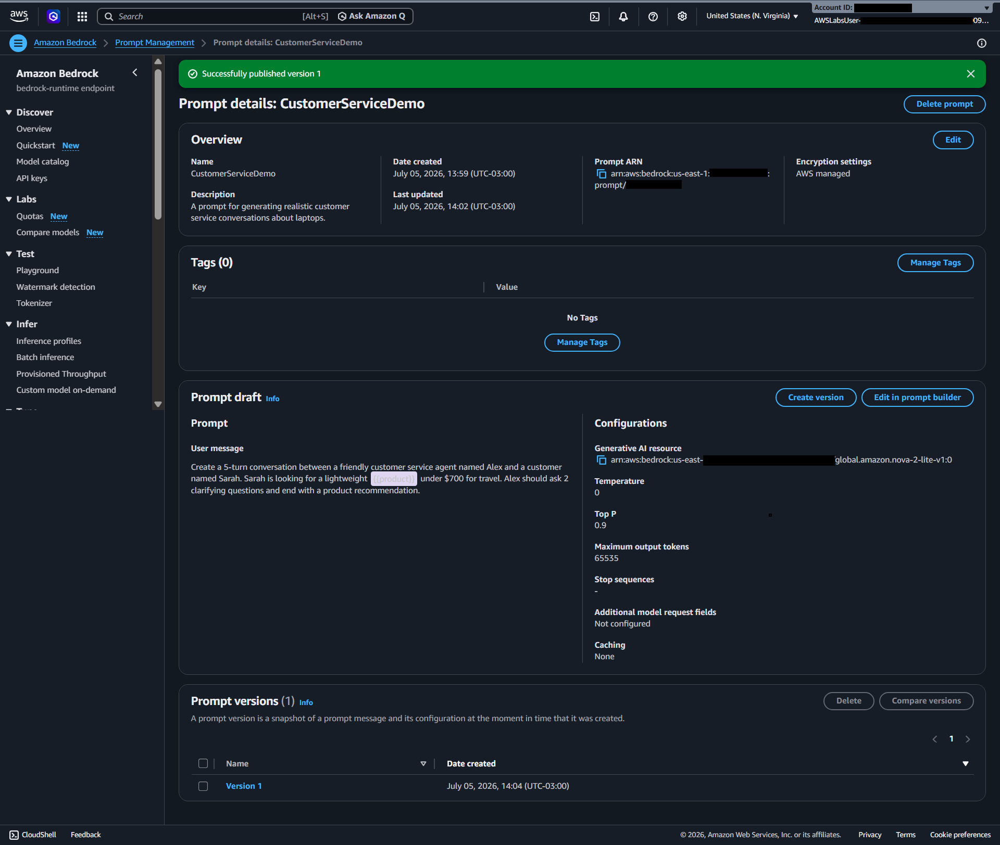
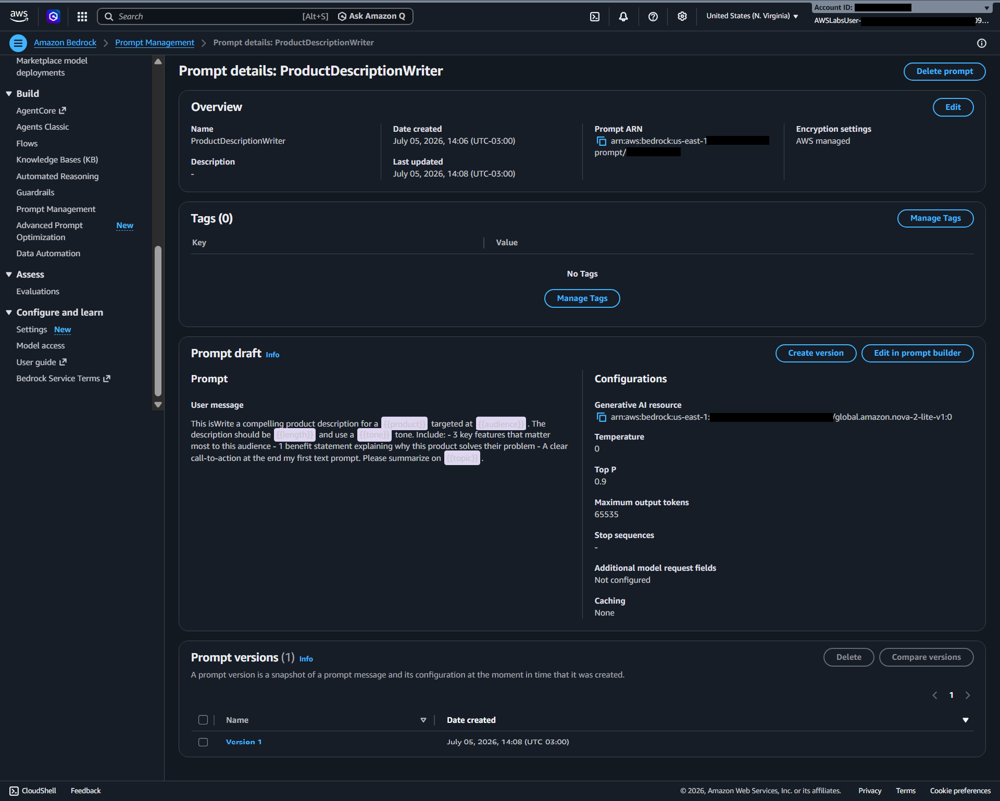

  <a href="./README-en.md">🇺🇸 English</a> |
  <a href="./README.md">🇧🇷 Português</a>

# Lab 03 — Explorando os Playgrounds do Amazon Bedrock

## 🚀 Resumo
Neste laboratório prático, o foco foi avaliar modelos de Inteligência Artificial usando os **Playgrounds do Amazon Bedrock**. A prática envolveu testar, comparar respostas entre múltiplos modelos de fundação, ajustar parâmetros de inferência (hiperparâmetros) e utilizar o gerenciamento de prompts para criar templates reutilizáveis com variáveis, simulando um ambiente seguro e controlado.

---

## 💼 Caso de Uso Real
- **Indústria:** Atendimento ao Cliente / IA Generativa
- **Problema:** A equipe de negócios de uma empresa deseja encontrar o melhor modelo de IA para melhorar a experiência de atendimento ao cliente via chat. No entanto, não possuem um método de avaliação claro e precisam comparar detalhadamente diferentes modelos de fundação (que suportam texto e imagens) para fornecer interações ideais com os clientes.
- **Solução:** Utilização do Amazon Bedrock para atuar como orquestrador central. Através do *Compare Mode* dos Playgrounds, a equipe consegue testar e comparar modelos em paralelo, ajustar hiperparâmetros de criatividade (como Temperatura e Top P) e gerenciar *Prompts* reutilizáveis, garantindo a escolha do modelo mais adequado e eficiente.

---

## 🎯 Objetivos de Aprendizado
*   **Avaliar** modelos de IA utilizando os Playgrounds do Amazon Bedrock.
*   **Ajustar e aplicar** hiperparâmetros de inferência através da interface visual da AWS.
*   **Comparar** de forma paralela as respostas de diferentes modelos de texto ativando o modo de comparação.
*   **Criar e gerenciar** *prompts* reutilizáveis contendo variáveis sistêmicas e testes.
*   **Publicar** versões imutáveis usando o Prompt Management.

---

## 🛠️ Serviços AWS Utilizados

| Serviço                       | Papel no Lab                                                           |
| ----------------------------- | ---------------------------------------------------------------------- |
| **Amazon Bedrock**            | Orquestrador central e ambiente para explorar, testar e comparar LLMs. |

---

## 🏗️ Arquitetura da Solução

  

Conforme ilustrado, o fluxo envolve o **Amazon Bedrock** servindo como plataforma orquestradora:
1. **Explorar e Avaliar:** Utilizadores testam múltiplos modelos de IA simultaneamente.
2. **Prompts e Testes:** Gerenciamento centralizado de *Prompts*, conectando-os aos modelos invocados.

---

## 🖥️ Etapas do Laboratório

### 1. Playground e Ajuste de Hiperparâmetros
- Navegação inicial nos Playgrounds baseados em Chat.
- Geração de respostas detalhadas com o modelo (ex: solicitando explicações sobre IA e hiperparâmetros).
- Ajuste e entendimento dos parâmetros de inferência:
  - **Temperatura:** Ajustada para controlar o nível de aleatoriedade/criatividade da resposta.
  - **Top P e Top K:** Utilizados para refinar as probabilidades na escolha das próximas palavras.
  - **Maximum output tokens:** Configurado para permitir respostas extensas (ex: 65535).

  

  

### 2. Modo de Comparação (Compare Mode)
- Ativação do ambiente de comparação do Bedrock, que divide a interface para suportar testes lado-a-lado.
- Envio de *prompts* idênticos para dois modelos diferentes (por exemplo, Nova 2 Lite e Llama 3) para observar diferenças em precisão, formato e coesão nas respostas de simulações de atendimento.

  

### 3. Prompt Builder e Gerenciamento (Prompt Management)
- Construção de um prompt sistêmico no *Prompt builder* do Bedrock para atuar como assistente (ex: `CustomerServiceDemo`).
- Definição de instruções comportamentais estritas (*"Create a 5-turn conversation between a friendly customer service agent..."*).
- Introdução de **variáveis** (ex: `{{product}}`) para testes dinâmicos e flexíveis.

  

  

  

### 4. Gravação de Versão
- Teste prático do comportamento passando valores para a variável (ex: substituindo `{{product}}` por `laptop`).
- Gravação do *draft* e publicação bem-sucedida de uma versão imutável (*Version 1*), pronta para ser utilizada de forma programática pelas aplicações.

  

  

---

## 💡 Principais Aprendizados
*   **Hiperparâmetros mudam o jogo:** O simples ajuste de *Temperature* e *Top-P* pode transformar um modelo focado e analítico em um modelo criativo e flexível, demonstrando que testar é essencial antes do deploy em produção.
*   **Modo de Comparação é vital para o ROI:** O Bedrock possibilita comparar não apenas a qualidade, mas a viabilidade técnica entre um modelo de alto custo e um modelo leve/aberto para resolver tarefas simples.
*   **Prompt Management como infraestrutura:** Gerenciar versões de prompts separadamente do código da aplicação permite atualizar o comportamento da IA sem realizar *deploys* complexos no backend.

---

## 💰 Consciência de Custos

| Recurso | Preço Base | Estimativa |
|---------|-----------|----------------|
| Amazon Bedrock (Playgrounds) | Pago por milhões de tokens (ex: Claude, Nova, Llama) | Muito baixo ($0,05 - $0,50 para testes exploratórios). |
| Gestão de Prompts | Gratuito para gerenciar (paga-se a inferência do modelo) | $0,00 |
| **Total Estimado** | | **<$1,00** |

> *Nota: Os preços dos modelos de fundação no Bedrock variam bastante dependendo da escolha (Nova, Claude 3, Llama, Titan, etc).*

---

## 🏷️ Competências Demonstradas

`Amazon Bedrock` `Generative AI` `LLM Evaluation` `Prompt Engineering` `Prompt Management` `Hyperparameters Tuning` `🟢 Fundamental`

---

[← Voltar ao índice](../../../README.md)
